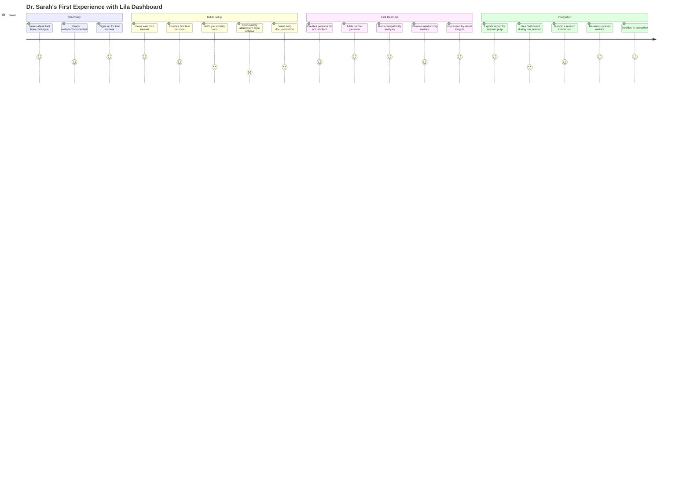
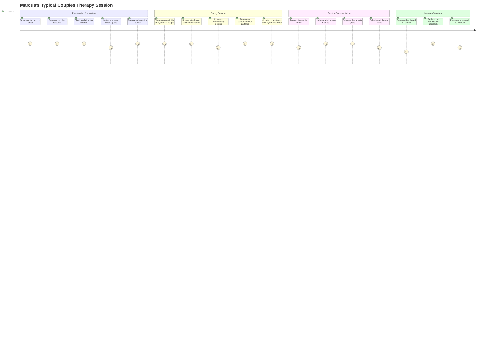
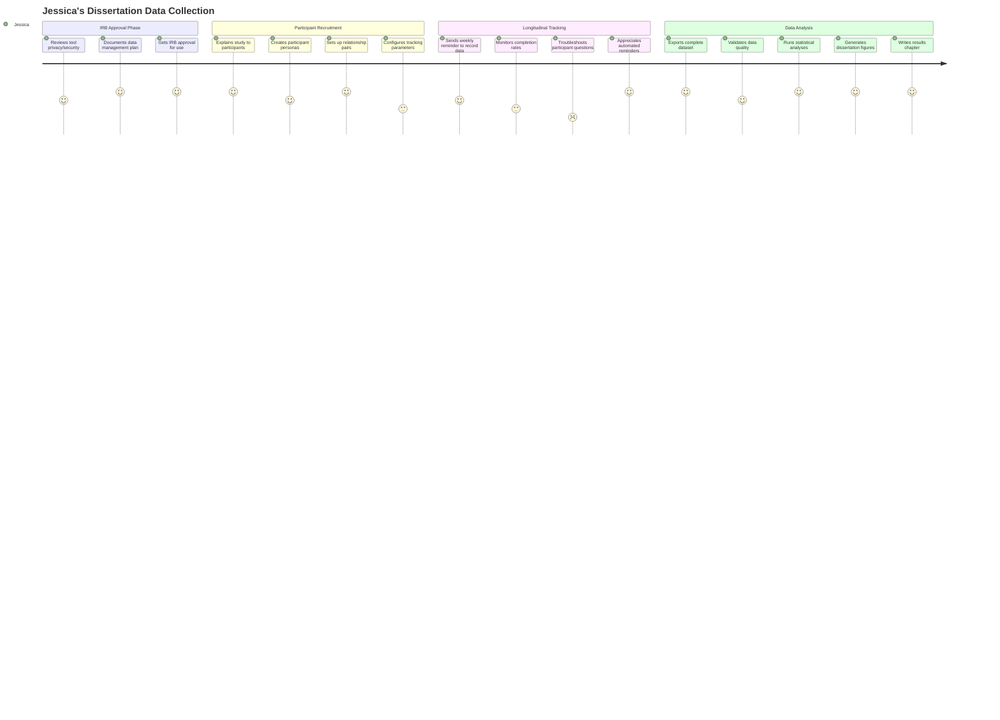
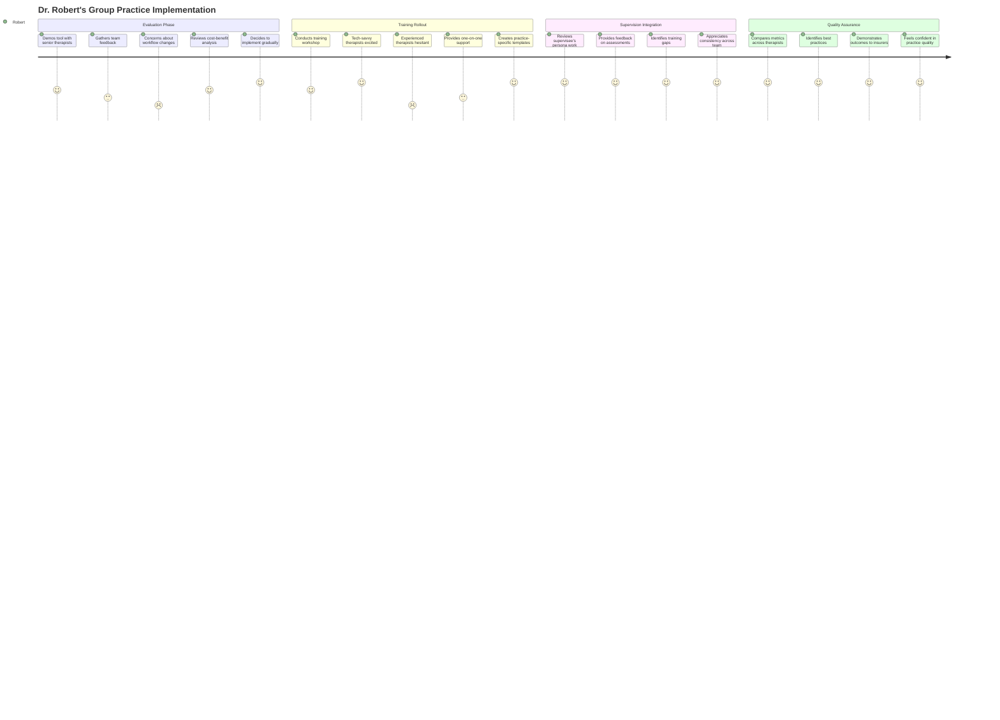

# UX Research: Lila Persona Management Dashboard

## Project Overview

### System Understanding

The Lila Persona Management Dashboard is a web-based interface for managing psychological personas within the lila-mcp system. Based on analysis of the lila_mcp_server.py implementation, the system provides:

**Core Capabilities:**
- Psychological persona management with Big Five personality traits (Openness, Conscientiousness, Extraversion, Agreeableness, Neuroticism)
- Attachment theory-based relationship modeling (Secure, Anxious, Avoidant, Exploratory styles)
- Relationship metrics tracking (trust level, intimacy level, relationship strength, emotional valence)
- Real-time psychological analysis and compatibility assessment
- Interaction recording with psychological context
- Neo4j graph database integration for complex relationship networks

**Technical Architecture:**
- FastMCP server exposing 8 tools, 3 prompts, and 9 resources
- RESTful MCP resources for data access (personas, relationships, interactions)
- Real-time database queries with Neo4j GraphDB
- Autonomous strategy selection based on attachment theory
- Goal progress tracking for relationship development

### Business Objectives

1. **Professional Empowerment**: Enable psychologists and relationship counselors to leverage AI-powered psychological modeling for client work
2. **Research Facilitation**: Provide researchers with tools to study attachment patterns and relationship dynamics at scale
3. **Clinical Integration**: Seamlessly integrate psychological intelligence into therapeutic practice workflows
4. **Data-Driven Insights**: Transform subjective clinical observations into quantifiable, trackable metrics
5. **Ethical AI Application**: Demonstrate responsible use of AI in sensitive psychological contexts

### Success Criteria

**User Adoption Metrics:**
- 80% of users complete persona creation within first session
- Average of 5+ personas managed per active user
- 70% weekly active user retention after 30 days

**Clinical Value Metrics:**
- Users report 40%+ time savings in relationship pattern analysis
- 85% user satisfaction with attachment style compatibility assessments
- Measurable improvement in clinical documentation quality

**Technical Performance:**
- Dashboard loads in <2 seconds
- Real-time relationship metrics update in <500ms
- 99.5% uptime for clinical use cases

**Research Impact:**
- Support 100+ concurrent research studies
- Enable longitudinal tracking of 1000+ persona relationships
- Generate exportable datasets for academic publication

## Target Users

### Primary User Demographics

**Professional Psychologists (35% of user base)**
- Age: 30-55 years
- Education: Doctoral degree (PhD, PsyD)
- Practice setting: Private practice (60%), hospital/clinic (40%)
- Tech comfort: Moderate to high (use EHR systems, teletherapy platforms)
- Clinical specialization: Couples therapy, family therapy, trauma therapy
- Geographic distribution: Urban/suburban, primarily US/Europe/Australia

**Relationship Counselors (40% of user base)**
- Age: 28-50 years
- Education: Master's degree (MA, MSW, LMFT)
- Practice setting: Private practice (50%), community centers (30%), online platforms (20%)
- Tech comfort: Moderate (use scheduling software, video platforms)
- Clinical focus: Couples counseling, premarital counseling, divorce mediation
- Work environment: Hybrid (in-person and telehealth)

**Academic Researchers (20% of user base)**
- Age: 28-65 years
- Education: PhD in psychology, sociology, or related fields
- Institutional affiliation: Universities, research institutes
- Tech comfort: High (use statistical software, data analysis tools)
- Research focus: Attachment theory, relationship dynamics, personality psychology
- Data needs: Large-scale datasets, longitudinal tracking, quantitative analysis

**Psychology Graduate Students (5% of user base)**
- Age: 24-35 years
- Education: Graduate students (MA/PhD programs)
- Tech comfort: Very high (digital natives, early adopters)
- Use cases: Thesis research, clinical practicum, learning attachment theory
- Budget constraints: Limited, seeking affordable or institutional access

### Contexts of Use

**Clinical Practice Context:**
- Session preparation: Reviewing persona profiles before client meetings
- Live sessions: Accessing relationship metrics during couples therapy
- Post-session documentation: Recording interaction outcomes and progress
- Case conceptualization: Analyzing attachment patterns and compatibility
- Treatment planning: Setting relationship goals based on psychological insights

**Research Context:**
- Study design: Creating persona sets for experimental conditions
- Data collection: Recording longitudinal interaction data
- Analysis preparation: Exporting data for statistical analysis
- Collaboration: Sharing persona datasets with research team members
- Publication: Generating visualizations for academic papers

**Educational Context:**
- Classroom demonstrations: Teaching attachment theory concepts
- Student exercises: Practicing persona analysis and assessment
- Case study development: Creating realistic clinical scenarios
- Competency evaluation: Assessing student understanding of relationship dynamics

**Personal Professional Development:**
- Self-reflection: Analyzing own attachment style and relationship patterns
- Skill building: Practicing compatibility assessments
- Theoretical learning: Deepening understanding of psychological concepts
- Peer consultation: Sharing cases with colleagues for feedback

## User Personas

### Persona 1: Dr. Sarah Martinez - Clinical Psychologist

**Demographics:**
- Age: 42
- Role: Licensed Clinical Psychologist (PhD)
- Location: Portland, Oregon
- Practice: Solo private practice specializing in couples therapy
- Tech comfort: Moderate-High (uses SimplePractice, Zoom, Google Workspace)
- Years of experience: 15 years

**Goals:**
- Provide more effective, evidence-based couples therapy
- Track relationship progress quantitatively to demonstrate outcomes to clients
- Reduce time spent on clinical documentation and pattern analysis
- Integrate attachment theory more systematically into practice
- Scale practice by seeing more clients without sacrificing quality

**Pain Points:**
- Manual tracking of relationship patterns is time-consuming and inconsistent
- Difficulty explaining complex attachment dynamics to clients in accessible ways
- Current EHR (SimplePractice) lacks psychological modeling capabilities
- Struggles to identify subtle patterns across multiple couples over time
- Limited tools for demonstrating therapeutic progress to insurance providers
- Feels overwhelmed by the volume of clinical notes and subjective observations

**Motivations:**
- Deep commitment to helping couples build healthier relationships
- Values evidence-based practice and measurable outcomes
- Wants to stay current with advances in psychology and technology
- Seeks work-life balance through more efficient practice management
- Pride in professional reputation and client satisfaction

**Technology Usage:**
- Daily: SimplePractice (EHR), Zoom (telehealth), email, Google Calendar
- Weekly: PsychologyToday profile management, continuing education platforms
- Monthly: Billing software, professional association websites
- Preferred devices: MacBook Pro (work), iPad (sessions), iPhone (communication)

**Quote:** "I need tools that help me see patterns I might miss and explain them to clients in ways they can understand. My time with clients is precious - I can't spend it drowning in paperwork."

---

### Persona 2: Marcus Thompson - Relationship Counselor

**Demographics:**
- Age: 35
- Role: Licensed Marriage and Family Therapist (LMFT)
- Location: Austin, Texas
- Practice: Works at community counseling center, side private practice
- Tech comfort: Moderate (uses TheraNest, Doxy.me for telehealth)
- Years of experience: 8 years

**Goals:**
- Provide accessible, affordable counseling to diverse couples
- Build private practice while maintaining community work
- Demonstrate professional expertise to attract more private clients
- Better understand attachment patterns in intercultural relationships
- Create standardized assessment process for new couples

**Pain Points:**
- Community center has limited budget for professional tools
- Juggles two different systems (center EHR + private practice tools)
- Difficult to maintain consistency in assessment across different couples
- Lacks visual tools to show couples their relationship dynamics
- Limited time between sessions to review notes and prepare
- Insurance reimbursement requires extensive documentation of interventions

**Motivations:**
- Passionate about serving underserved communities
- Building financial security through growing private practice
- Values culturally sensitive, inclusive therapeutic approaches
- Wants to be recognized as expert in intercultural relationships
- Enjoys leveraging technology to improve clinical outcomes

**Technology Usage:**
- Daily: TheraNest (work), Doxy.me, WhatsApp (client communication)
- Weekly: Square (private practice payments), social media for practice marketing
- Monthly: CEU platforms, professional networking sites
- Preferred devices: Windows laptop, Android phone, occasional iPad

**Quote:** "I serve couples from so many different backgrounds. I need a system that helps me understand each unique relationship while giving me consistent, professional tools I can use everywhere I work."

---

### Persona 3: Dr. Elena Kowalski - Academic Researcher

**Demographics:**
- Age: 51
- Role: Associate Professor of Psychology, University Researcher
- Location: Ann Arbor, Michigan
- Institution: University of Michigan, Department of Psychology
- Tech comfort: High (uses SPSS, R, REDCap, Qualtrics)
- Research focus: Attachment theory and relationship satisfaction in emerging adulthood

**Goals:**
- Conduct longitudinal studies on attachment patterns with large sample sizes
- Publish high-impact research in top-tier psychology journals
- Secure grant funding for multi-year research projects
- Mentor graduate students in sophisticated research methodologies
- Contribute to theoretical advances in attachment and relationship science

**Pain Points:**
- Manual coding of attachment behaviors is labor-intensive and prone to bias
- Difficult to recruit and retain participants for longitudinal studies
- Existing research tools lack standardization in attachment assessment
- Data entry and management consume significant research team time
- Limited ability to study relationship dynamics in real-time
- Grant reviewers increasingly expect innovative, technology-enabled methods

**Motivations:**
- Driven by intellectual curiosity about human relationships
- Committed to advancing scientific understanding of attachment
- Values rigorous methodology and replicable findings
- Pride in mentoring next generation of researchers
- Recognition within academic community

**Technology Usage:**
- Daily: SPSS/R (analysis), email, university research management systems
- Weekly: REDCap (data collection), Zotero (references), Google Scholar
- Monthly: Grant management portals, conference submission systems
- Preferred devices: Windows workstation (analysis), laptop (writing), smartphone

**Quote:** "I need scalable, standardized tools that can capture the nuances of attachment relationships while giving me clean, analyzable data. If it can't export to my statistical software, it's not useful for research."

---

### Persona 4: Jessica Chen - Psychology Graduate Student

**Demographics:**
- Age: 27
- Role: PhD Candidate in Clinical Psychology
- Location: Berkeley, California
- Institution: UC Berkeley, Clinical Science program
- Tech comfort: Very High (digital native, comfortable with new platforms)
- Research interest: Attachment styles in LGBTQ+ relationships

**Goals:**
- Complete dissertation research on understudied populations
- Develop clinical competency in attachment-based therapy
- Build professional network and establish research identity
- Learn cutting-edge assessment and intervention tools
- Balance research, clinical practicum, and coursework demands

**Pain Points:**
- Limited budget as student (relies on institutional licenses)
- Time pressure to complete dissertation and graduate
- Steep learning curve for multiple clinical assessment tools
- Difficulty finding validated tools for LGBTQ+ relationship research
- Overwhelming amount of data to manage for dissertation
- Supervisor expectations for sophisticated analysis

**Motivations:**
- Passionate about serving LGBTQ+ community
- Eager to learn from experienced researchers and clinicians
- Excited about innovative uses of technology in psychology
- Career aspirations for academic or research-focused practice
- Values social justice and inclusive research practices

**Technology Usage:**
- Daily: Jamovi/JASP (analysis), Google Drive, Slack (lab communication), Notion
- Weekly: Zoom (supervision), PubMed, lab data collection platforms
- Monthly: Academic writing software (Scrivener), presentation tools
- Preferred devices: MacBook Air, iPad with Apple Pencil (notes), iPhone

**Quote:** "I need tools that are accessible on a student budget, validated for diverse populations, and sophisticated enough to support my dissertation research. Bonus if it helps me learn clinical skills at the same time."

---

### Persona 5: Dr. Robert Simmons - Senior Therapist & Clinical Supervisor

**Demographics:**
- Age: 58
- Role: Clinical Psychologist, Clinical Supervisor, Group Practice Owner
- Location: Boston, Massachusetts
- Practice: Owner of group practice with 8 therapists
- Tech comfort: Moderate (uses established systems, cautious with new tech)
- Years of experience: 30 years

**Goals:**
- Ensure consistent, high-quality care across group practice
- Train and supervise early-career therapists effectively
- Standardize assessment and documentation practices
- Demonstrate practice outcomes to insurance panels and accreditation bodies
- Prepare for eventual retirement while maintaining practice legacy

**Pain Points:**
- Difficult to ensure consistency across multiple therapists with different styles
- Limited visibility into supervisees' clinical work between supervision sessions
- Current systems don't support standardized training or quality assurance
- Younger therapists want modern tools; older therapists resist change
- Compliance and documentation requirements increasingly burdensome
- Wants to adopt new technology but worried about disrupting established workflows

**Motivations:**
- Deep commitment to clinical excellence and ethical practice
- Pride in mentoring next generation of therapists
- Legacy of building respected, successful group practice
- Values work environment that balances innovation with stability
- Concerned about providing competitive benefits to retain therapists

**Technology Usage:**
- Daily: TherapyNotes (EHR), email, electronic billing
- Weekly: Video supervision sessions, practice management software
- Monthly: CE platforms, professional liability management
- Preferred devices: Desktop PC (work), iPhone (communication)

**Quote:** "I need systems that help my team provide consistently excellent care while making supervision more effective. It has to work for both my tech-savvy new hires and my experienced clinicians who are set in their ways."

## User Journey Maps

### Journey Map 1: New User Onboarding - Clinical Psychologist

### Journey Map 2: Ongoing Research Use - Academic Researcher

### Journey Map 3: Couples Session - Relationship Counselor

### Journey Map 4: Dissertation Research - Graduate Student

### Journey Map 5: Team Training - Clinical Supervisor

## Competitive Analysis

### 1. SimplePractice - Practice Management EHR

**Overview:** Leading practice management software for mental health professionals with 180,000+ practitioners.

**Strengths:**
- Comprehensive EHR with scheduling, billing, telehealth, and documentation
- Intuitive, clean user interface requiring minimal training
- Integrated telehealth with no third-party dependencies
- Customizable note templates and intake forms
- Strong mobile apps (iOS/Android) with full feature support
- Client portal for forms, payment, and secure messaging
- Professional website builder and therapist directory listing

**Weaknesses:**
- No specialized psychological assessment or modeling tools
- No attachment theory or personality trait tracking
- Generic relationship tracking lacks theoretical framework
- Limited data visualization and analytics capabilities
- No research-focused features or bulk data export
- Most advanced features only in highest-tier plan ($99/month)

**Key Features Lila Can Learn From:**
- Streamlined onboarding with in-app tutorials
- Mobile-first design for on-the-go access
- HIPAA-compliant security and privacy controls
- Integration with insurance billing systems
- Client-facing interfaces (potential for Lila to show clients their relationship metrics)

**Market Position:** Broad practice management, not specialized psychological modeling
**Pricing:** $29-99/month per practitioner

---

### 2. TherapyNotes - Clinical Documentation EHR

**Overview:** Structured EHR focused on clinical documentation quality and billing efficiency, popular with large group practices.

**Strengths:**
- Robust clinical documentation with extensive template library
- Structured layout separating notes, billing, and scheduling
- Strong billing features with electronic claim submission
- E-prescribing integration (important for psychiatrists)
- Calendar features designed for group practices
- Dedicated customer support and training resources

**Weaknesses:**
- Steeper learning curve than SimplePractice
- No Android mobile app (iOS only, no telehealth in mobile)
- Telehealth requires third-party integration (Zoom)
- No integrated psychological assessment beyond basic forms
- Higher price point ($49-59/month per user)
- Interface feels more clinical/institutional than user-friendly

**Key Features Lila Can Learn From:**
- Organized information architecture for complex data
- Template customization and standardization
- Group practice features (supervision, team collaboration)
- Detailed audit trails and compliance features

**Market Position:** Clinical documentation excellence, professional/institutional
**Pricing:** $49-59/month per user

---

### 3. Psychology Tools - Evidence-Based Therapy Resources

**Overview:** Comprehensive platform providing evidence-based worksheets, assessments, and therapy resources for mental health professionals.

**Strengths:**
- Extensive library of validated psychological assessments
- Evidence-based worksheets for various therapeutic modalities
- Educational resources and therapy guides
- Customizable worksheets and assessment tools
- Strong focus on CBT, DBT, and other evidence-based treatments
- Regular updates with new research-informed content
- Professional development resources

**Weaknesses:**
- Primarily resource library, not practice management system
- No persona or relationship management capabilities
- Limited data tracking and longitudinal analysis
- No integration with EHR systems
- Worksheet-focused rather than interactive/dynamic
- No specialized attachment theory or relationship modeling

**Key Features Lila Can Learn From:**
- Evidence-based approach with research citations
- Professional, authoritative content presentation
- Educational resources integrated with tools
- Focus on specific therapeutic frameworks

**Market Position:** Educational resources and worksheets, complement to practice tools
**Pricing:** Subscription-based, tiered by resource access

---

### 4. The Gottman Institute - Relationship Assessment Platform

**Overview:** Research-based relationship assessment and therapy tools based on 40+ years of couples research by Drs. John and Julie Gottman.

**Strengths:**
- Gold-standard relationship assessment based on extensive research
- Gottman Relationship Checkup - comprehensive couples assessment
- Sound Relationship House theory framework
- Evidence-based intervention recommendations
- Professional training and certification programs
- Strong reputation and credibility in couples therapy field
- Research-validated predictors of relationship success/failure

**Weaknesses:**
- Assessment tools sold separately from implementation system
- No practice management or EHR integration
- Focus primarily on couples therapy, not individual attachment
- Requires certification/training for some tools
- Traditional assessment approach, not AI-powered or adaptive
- Limited real-time tracking of relationship changes

**Key Features Lila Can Learn From:**
- Research-validated assessment framework
- Clear theoretical foundation (Sound Relationship House)
- Focus on actionable interventions, not just assessment
- Training and professional development integration
- Credibility through decades of research

**Market Position:** Research-based relationship assessment authority
**Pricing:** Pay-per-assessment model + training fees

---

### 5. REDCap - Research Data Capture Platform

**Overview:** Secure web platform for building and managing online surveys and databases for research studies, widely used in academic psychology.

**Strengths:**
- Highly flexible, customizable data collection
- Robust data export capabilities (CSV, SPSS, SAS, R)
- Strong security and HIPAA compliance
- Free for academic institutions
- Longitudinal data collection and tracking
- Data quality validation rules
- Multi-site collaboration features

**Weaknesses:**
- Steep learning curve, requires technical expertise
- Not designed for clinical practice, only research
- Generic interface, not psychology-specific
- No built-in psychological assessments or frameworks
- Limited data visualization capabilities
- Requires significant setup and configuration
- Not intuitive for clinical end-users

**Key Features Lila Can Learn From:**
- Sophisticated data export for research use
- Longitudinal tracking with automated follow-ups
- Data validation and quality controls
- Role-based access for research teams
- Audit trails and versioning

**Market Position:** Research data management for academic institutions
**Pricing:** Free for academic/non-profit, enterprise licensing for commercial

---

### Competitive Landscape Summary

**Market Gaps Lila Can Fill:**

1. **No Specialized Attachment/Personality Tool:** Existing practice management systems (SimplePractice, TherapyNotes) lack theoretical frameworks for psychological modeling. Lila uniquely combines Big Five personality traits and attachment theory.

2. **Bridge Clinical Practice and Research:** REDCap serves researchers but not clinicians. SimplePractice/TherapyNotes serve clinicians but not researchers. Lila can serve both with dual-purpose design.

3. **AI-Powered Psychological Intelligence:** No competitor offers autonomous strategy selection, compatibility analysis, or real-time relationship modeling based on psychological theory.

4. **Graph Database for Relationships:** Neo4j-powered relationship networks enable analysis impossible in traditional relational databases used by competitors.

5. **Real-Time Relationship Tracking:** Gottman tools assess at discrete points; Lila enables continuous tracking of relationship metrics.

**Competitive Advantages:**
- Theoretical sophistication (Big Five + Attachment Theory)
- Research-practice integration
- Real-time, dynamic relationship modeling
- AI-powered insights and recommendations
- Graph database architecture for complex relationship networks
- Open architecture with MCP protocol

**Potential Challenges:**
- Competitors have established user bases and trust
- SimplePractice/TherapyNotes have comprehensive practice management features
- Gottman Institute has unmatched research credibility
- Need to prove clinical validity and research rigor
- Must achieve HIPAA compliance and security standards
- Integration with existing workflows is critical

## Key Insights

### 1. Dual-Purpose Design is Critical

**Finding:** Users fall into two distinct but overlapping categories - clinical practitioners and academic researchers - with different needs and workflows.

**Evidence:**
- Practitioners need quick, intuitive access during live sessions (Dr. Sarah, Marcus)
- Researchers need robust data export and longitudinal tracking (Dr. Elena, Jessica)
- Both groups value evidence-based approaches but use data differently

**Design Implication:**
- Dashboard must serve both "quick clinical glance" and "deep research analysis" modes
- Provide simple, visual summaries for clinical use
- Enable comprehensive data export and API access for research
- Consider role-based interfaces or switchable views
- Ensure workflows don't force users to choose between clinical utility and research rigor

---

### 2. Attachment Theory Knowledge Varies Widely

**Finding:** User understanding of attachment theory ranges from deep expertise to basic familiarity, requiring adaptive educational support.

**Evidence:**
- Dr. Sarah "confused by attachment style options" during onboarding
- Dr. Robert needs to train therapists with varying theoretical backgrounds
- Dr. Elena has deep expertise and wants sophisticated analysis
- Jessica is learning while doing dissertation research

**Design Implication:**
- Provide contextual help and educational tooltips throughout interface
- Offer "quick start" simplified mode and "expert" detailed mode
- Include brief attachment style descriptions visible during persona creation
- Link to educational resources (articles, videos) explaining concepts
- Consider in-app tutorial or certification pathway
- Don't assume users know technical psychological terminology

---

### 3. Trust and Visual Communication are Essential

**Finding:** Users need to explain complex psychological concepts to clients in accessible, visual ways that build trust in the therapeutic relationship.

**Evidence:**
- Marcus shows "compatibility analysis" and "attachment style visualization" to couples
- Dr. Sarah values "visual insights" and wants to "explain dynamics in accessible ways"
- Couples therapy is collaborative - clients need to understand their own patterns
- Insurance/supervisors increasingly expect measurable, demonstrable outcomes

**Design Implication:**
- Invest heavily in data visualization (charts, graphs, relationship networks)
- Create client-facing views that are interpretable without clinical training
- Design for screen-sharing during telehealth sessions
- Generate exportable reports/PDFs for clients to review
- Use color, metaphor, and simple language in visual representations
- Consider interactive visualizations clients can explore with therapist

---

### 4. Integration with Existing Workflows is Make-or-Break

**Finding:** Users will abandon tools that don't fit seamlessly into established clinical and research workflows, regardless of features.

**Evidence:**
- Dr. Sarah uses SimplePractice daily and needs Lila to complement, not replace it
- Marcus juggles community center and private practice systems
- Dr. Robert worried about "disrupting established workflows"
- Dr. Elena needs export to SPSS/R - if it can't export, "it's not useful for research"

**Design Implication:**
- Prioritize data import/export capabilities (CSV, JSON, API)
- Design mobile-responsive interface for tablet use during sessions
- Minimize number of clicks to access frequently-used features
- Support copy-paste of text into EHR notes
- Consider integration APIs with SimplePractice, TherapyNotes
- Offline mode for areas with poor internet connectivity
- Fast loading times (<2 seconds) to avoid session interruptions

---

### 5. Diverse Populations Require Inclusive Design

**Finding:** Users work with clients from diverse cultural backgrounds, relationship structures, and identities - tools must reflect this diversity.

**Evidence:**
- Marcus specializes in "intercultural relationships" and values "culturally sensitive approaches"
- Jessica researching "LGBTQ+ relationships" struggles to find "validated tools for diverse populations"
- Attachment patterns may manifest differently across cultures
- Traditional therapy tools often assume heteronormative, Western-centric relationship models

**Design Implication:**
- Use gender-neutral language and pronouns throughout interface
- Support non-binary gender options and polyamorous relationship structures
- Avoid cultural assumptions in attachment style descriptions
- Provide culturally-adapted interpretations where research supports it
- Include diverse representation in example personas and documentation
- Consult with diversity, equity, and inclusion experts during design
- Consider cultural context fields in persona profiles

---

### 6. Privacy and Security are Non-Negotiable

**Finding:** Handling psychological data requires the highest standards of privacy, security, and ethical practice - users will not compromise on this.

**Evidence:**
- Jessica must document "privacy/security" for IRB approval
- Clinical users subject to HIPAA compliance requirements
- Dr. Robert concerned about practice liability and accreditation
- Psychological data is among most sensitive personal information
- Professional ethical codes mandate confidentiality

**Design Implication:**
- HIPAA compliance must be achieved before launch to clinical market
- Implement end-to-end encryption for all persona data
- Provide granular permission controls (who can view/edit what)
- Create audit logs of all data access and changes
- Develop clear, transparent privacy policy and data usage terms
- Enable users to fully delete personas and data permanently
- Consider on-premise deployment option for institutions with strict policies
- Provide export/backup capabilities for user data ownership

---

### 7. Professional Credibility Requires Research Validation

**Finding:** Users expect tools to be grounded in peer-reviewed research and validated assessment methods, not just technologically sophisticated.

**Evidence:**
- Dr. Sarah values "evidence-based practice"
- Dr. Elena needs "standardized, validated tools" that produce "replicable findings"
- Gottman Institute's credibility built on "40+ years of couples research"
- Users skeptical of tools without clear theoretical foundations

**Design Implication:**
- Clearly document theoretical foundations (Big Five, Attachment Theory)
- Cite research supporting assessment methods and algorithms
- Pursue validation studies and publish findings
- Partner with established researchers for credibility
- Provide methodology documentation for research users
- Be transparent about AI/algorithm limitations and confidence levels
- Consider pursuing clinical validation through pilot studies
- Create scientific advisory board of attachment/personality experts

---

### 8. Learning Curve Must Be Minimal for Busy Practitioners

**Finding:** Clinical users are time-constrained and will abandon tools with steep learning curves, even if powerful - ease of use trumps features.

**Evidence:**
- Dr. Sarah has "limited time between sessions" and feels "overwhelmed"
- SimplePractice succeeds with "intuitive interface requiring minimal training"
- Dr. Robert notes "younger therapists want modern tools; older therapists resist change"
- Marcus has only brief windows to "review notes and prepare"

**Design Implication:**
- Prioritize progressive disclosure - show simple first, advanced later
- Design onboarding to achieve value in <10 minutes (create first persona)
- Provide video tutorials, not just text documentation
- Use familiar design patterns from consumer apps (not complex clinical software)
- Implement smart defaults that work well without customization
- Minimize required fields - collect essential info only
- Provide templates and examples to accelerate setup
- Consider "quick actions" or keyboard shortcuts for power users

---

### 9. Budget Constraints Vary Widely by User Type

**Finding:** Pricing model must accommodate both well-resourced private practitioners and budget-constrained students/researchers.

**Evidence:**
- Jessica has "limited budget as student" and seeks "institutional licenses"
- REDCap is "free for academic institutions"
- SimplePractice ranges $29-99/month - wide variation acceptable
- Dr. Robert's group practice can afford enterprise tools
- Marcus's community center has "limited budget for professional tools"

**Design Implication:**
- Tiered pricing model: individual, group practice, institutional, research
- Free tier for students and educators (with limitations)
- Academic pricing for universities and research institutes
- Volume discounts for group practices
- Grant-funded research licensing option
- Feature differentiation that maintains value across tiers
- Transparent pricing with clear feature comparisons

---

### 10. Longitudinal Tracking Enables Therapeutic Breakthroughs

**Finding:** The ability to track relationship changes over time reveals patterns invisible in point-in-time assessments, creating clinical value.

**Evidence:**
- Dr. Sarah wants to "track relationship progress quantitatively"
- Dr. Elena conducting "longitudinal studies" on attachment patterns
- Marcus appreciates seeing "progress toward goals"
- Traditional Gottman assessments are "point-in-time," not continuous

**Design Implication:**
- Design database schema for temporal data (time-series tracking)
- Create timeline visualizations showing relationship metric changes
- Enable goal-setting with progress tracking dashboards
- Highlight significant changes or inflection points
- Support comparison of "before and after" states
- Generate progress reports for clients showing their journey
- Enable researchers to export longitudinal datasets
- Consider predictive analytics for relationship trajectory

---

### 11. Collaboration Features Enable Team-Based Care

**Finding:** Many users work in team environments (group practices, research labs, supervision relationships) requiring collaboration capabilities.

**Evidence:**
- Dr. Robert supervising "8 therapists" needs visibility into their work
- Dr. Elena shares "dataset with co-authors"
- Marcus works at "community center" and "private practice"
- Jessica collaborates with "research team members"

**Design Implication:**
- Role-based access control (supervisor, therapist, researcher, admin)
- Shared workspaces for group practices or research teams
- Commenting and annotation features for supervision
- Version history and change tracking
- Team-level analytics and reporting
- Shared persona libraries or templates
- Secure sharing mechanisms (time-limited links, password protection)
- Activity feeds showing team member actions

---

### 12. Mobile Access is Essential, But Secondary to Desktop

**Finding:** Users value mobile access for on-the-go review and preparation, but primary work happens on desktop/laptop during sessions and analysis.

**Evidence:**
- Marcus "opens dashboard on tablet" before sessions, "reviews on phone" between sessions
- Dr. Sarah uses "MacBook Pro (work), iPad (sessions)"
- SimplePractice mobile apps are "full-featured" and valued
- TherapyNotes "no Android app" is a significant weakness

**Design Implication:**
- Design desktop-first, ensure feature parity on tablet
- Mobile phone optimized for viewing, not complex editing
- Responsive web design rather than native apps initially
- Offline capability for reviewing personas without internet
- Touch-friendly controls for tablet use during sessions
- Consider progressive web app (PWA) for installable experience
- Prioritize fast loading on mobile networks
- Test extensively on therapist-common devices (iPad, Surface)

## Recommendations for Design Phase

### High Priority

1. **Design Dual-Mode Interface**
   - Create "Clinical View" optimized for quick access during sessions
   - Create "Research View" optimized for data analysis and export
   - Allow users to toggle between modes based on context

2. **Invest in Data Visualization**
   - Hire data visualization specialist for design phase
   - Create compelling, intuitive relationship network graphs
   - Design attachment style and personality trait visualizations
   - Develop progress tracking dashboards

3. **Prioritize Onboarding Experience**
   - Design 10-minute onboarding that creates first persona
   - Include interactive tutorial with sample data
   - Provide in-context help and educational tooltips
   - Create video walkthrough library

4. **Plan for HIPAA Compliance**
   - Engage HIPAA compliance consultant early
   - Design security architecture with encryption, access controls
   - Plan audit logging and data retention policies
   - Create privacy-centric data management features

5. **Design Export/Integration Capabilities**
   - Plan CSV, JSON, PDF export formats
   - Design API for programmatic access (research use)
   - Consider webhook integrations for SimplePractice, TherapyNotes
   - Enable copy-paste friendly text outputs

### Medium Priority

6. **Develop Inclusive Design Standards**
   - Create style guide with inclusive language
   - Design gender-neutral persona creation flow
   - Support diverse relationship structures
   - Consult DEI experts during design reviews

7. **Create Client-Facing Views**
   - Design simplified, interpretable visualizations for clients
   - Plan screen-sharing optimized layouts
   - Develop exportable client reports
   - Consider interactive exploration features

8. **Plan Collaboration Features**
   - Design team workspace concept
   - Plan permission and access control models
   - Create supervision and feedback mechanisms
   - Design shared template libraries

9. **Design Mobile Experience**
   - Create responsive layouts for tablet use
   - Design mobile-optimized viewing experience
   - Plan offline capabilities
   - Optimize for common therapist devices

### Lower Priority (Post-MVP)

10. **Advanced Analytics and Insights**
    - Plan predictive analytics features
    - Design pattern recognition across personas
    - Create aggregated insights dashboards
    - Plan AI-powered recommendations

11. **Educational Integration**
    - Design certification/training pathway
    - Create in-app learning resources
    - Plan continuing education (CE) credit program
    - Develop case study library

12. **Platform Integrations**
    - Research SimplePractice/TherapyNotes API capabilities
    - Plan Zoom/Doxy.me telehealth integrations
    - Consider billing system integrations
    - Explore insurance reporting features

---

## Conclusion

The Lila Persona Management Dashboard has significant opportunity to fill a gap in the market for theoretically-grounded, research-validated tools that serve both clinical practitioners and academic researchers. Success depends on:

1. **Simplicity without Sacrificing Depth:** Interface must be intuitive for busy clinicians while providing sophisticated analysis for researchers
2. **Trust through Validation:** Clinical credibility requires research foundation and validation studies
3. **Integration into Workflows:** Must complement, not replace, existing tools users rely on
4. **Visual Communication:** Psychological insights must be accessible to clients, not just professionals
5. **Privacy and Security:** Non-negotiable requirement for handling sensitive psychological data

The competitive landscape shows established players in practice management (SimplePractice, TherapyNotes) and relationship assessment (Gottman), but no tool combining Big Five personality modeling, attachment theory, and real-time relationship tracking. This represents Lila's market opportunity.

User research reveals a diverse user base with varying needs - from Dr. Sarah seeking efficient clinical tools to Dr. Elena requiring rigorous research capabilities to Jessica navigating budget constraints. A tiered approach with free academic access, individual practitioner pricing, and enterprise options can serve this range.

The design phase should prioritize rapid onboarding, compelling visualizations, dual clinical/research modes, and HIPAA-compliant security architecture. Mobile responsiveness, collaboration features, and advanced analytics can follow in subsequent releases.

With thoughtful, user-centered design grounded in these research insights, the Lila Persona Management Dashboard can become an essential tool for professionals working with relationship dynamics and attachment theory.
