# Information Architecture: Lila System

## Executive Summary

The Lila System presents a unique information architecture challenge: serving dual audiences (software engineering teams and psychology researchers) with fundamentally different mental models while maintaining a cohesive, learnable structure. This Information Architecture (IA) strategy addresses this complexity through a three-tier approach: **domain-specific entry points**, **role-based progressive disclosure**, and **unified foundational concepts**.

### Key IA Principles

**1. Dual-Path Navigation**: Engineering-focused and Research-focused primary paths that converge at shared technical documentation
**2. Progressive Expertise Levels**: Beginner → Intermediate → Advanced → Expert content layers with clear migration paths
**3. Task-Oriented Structure**: Content organized around user goals (Build, Analyze, Research, Extend) rather than system architecture
**4. Component Discoverability**: Multiple access points to same content (navigation, search, contextual links, related content)
**5. Documentation as Product**: Documentation treated as first-class product feature with versioning, testing, and quality metrics

### Strategic Architecture Decisions

**Domain Separation with Shared Foundation**
- **Engineering Domain**: Orchestrators (Architecture, UX), Agent SDK, CI/CD integration
- **Research Domain**: Psychological Intelligence, Neo4j graph modeling, Data export
- **Shared Foundation**: MCP protocol, Cost tracking, Extensibility patterns, Community

**Content Model Philosophy**
The IA defines 10 core content models (Agent, Orchestrator, Tool, Workflow, etc.) that serve as structural primitives across all documentation. Each model has consistent metadata (type, status, owner, dependencies) enabling systematic navigation and automated quality checks.

**Findability Strategy**
- **Taxonomic Navigation**: Hierarchical sitemap with predictable patterns (Get Started → Build → Integrate → Extend)
- **Faceted Search**: Multi-dimensional filtering (role, skill level, domain, content type)
- **Contextual Wayfinding**: Breadcrumbs, related content, "what's next" recommendations
- **Dynamic Personalization**: Remember user's role and expertise level to surface relevant content

### Target Audience Alignment

This IA directly addresses research findings:
- **Alex (AI Engineer)**: Fast access to extensibility patterns, API reference, custom orchestrator examples
- **Priya (Engineering Manager)**: Clear ROI evidence, integration guides, team onboarding resources
- **Dr. Rodriguez (Researcher)**: Psychological framework documentation, data export guides, academic citations
- **Jordan (UX Designer)**: Visual workflow tutorials, Figma integration, template library
- **David (PhD Student)**: Research use cases, academic collaboration resources, contribution guidelines

### Success Metrics

**Findability**: 80% of users locate target content within 2 clicks/searches
**Comprehension**: Documentation satisfaction score >4.5/5
**Adoption**: 50% reduction in support questions after IA implementation
**Retention**: 70% of new users return for second session within 1 week
**Contribution**: 20+ community contributions within 6 months

### Scope and Constraints

**In Scope**: Documentation site, GitHub repository structure, MCP server resources, CLI help text
**Out of Scope**: Actual UI implementation (no web app), Marketing site (separate), Community forum structure
**Key Constraint**: Must work with static site generator (Docusaurus, MkDocs) for GitHub Pages deployment

---

## Sitemap

### Main Documentation Site Structure

```mermaid
graph TD
    Home[🏠 Home]

    %% Primary Navigation
    Home --> GetStarted[🚀 Get Started]
    Home --> Build[🔨 Build]
    Home --> Integrate[🔌 Integrate]
    Home --> Research[🔬 Research]
    Home --> Community[👥 Community]

    %% Get Started
    GetStarted --> QuickStart[⚡ Quickstart]
    GetStarted --> Installation[📦 Installation]
    GetStarted --> FirstOrchestrator[🎯 First Orchestrator]
    GetStarted --> Concepts[💡 Core Concepts]

    QuickStart --> QS10Min["10-Min Tutorial"]
    QuickStart --> QSVideo["Video Walkthrough"]
    QuickStart --> QSExamples["Live Examples"]

    Installation --> InstallDocker["Docker Setup"]
    Installation --> InstallLocal["Local Setup"]
    Installation --> InstallCloud["Cloud Deploy"]

    Concepts --> ConceptOrchestrator["What is an Orchestrator?"]
    Concepts --> ConceptAgent["Understanding Agents"]
    Concepts --> ConceptMCP["MCP Protocol Basics"]
    Concepts --> ConceptCost["Cost Management"]

    %% Build
    Build --> Orchestrators[🎭 Orchestrators]
    Build --> Agents[🤖 Agents]
    Build --> Tools[🔧 Tools]
    Build --> Workflows[📊 Workflows]

    Orchestrators --> OArchitecture["Architecture Orchestrator"]
    Orchestrators --> OUX["UX Orchestrator"]
    Orchestrators --> OCustom["Custom Orchestrators"]
    Orchestrators --> OAdvanced["Advanced Patterns"]

    OArchitecture --> OArchGuide["User Guide"]
    OArchitecture --> OArchAPI["API Reference"]
    OArchitecture --> OArchExamples["Examples"]

    OUX --> OUXGuide["User Guide"]
    OUX --> OUXAPI["API Reference"]
    OUX --> OUXExamples["Examples"]

    OCustom --> OCustomTutorial["Tutorial"]
    OCustom --> OCustomTemplate["Template Generator"]
    OCustom --> OCustomShowcase["Community Showcase"]

    Agents --> AgentRegistry["Agent Registry"]
    Agents --> AgentCreate["Create Custom Agent"]
    Agents --> AgentConfig["Configuration"]
    Agents --> AgentBestPractices["Best Practices"]

    Tools --> ToolReference["Tool Reference"]
    Tools --> ToolMCP["MCP Tools"]
    Tools --> ToolCustom["Custom Tools"]
    Tools --> ToolIntegration["Tool Integration"]

    Workflows --> WorkflowDesign["Workflow Design"]
    Workflows --> WorkflowPatterns["Common Patterns"]
    Workflows --> WorkflowPhases["Phase Management"]
    Workflows --> WorkflowMonitoring["Monitoring"]

    %% Integrate
    Integrate --> CICD[⚙️ CI/CD]
    Integrate --> MCPClients[📱 MCP Clients]
    Integrate --> APIs[🔗 APIs]
    Integrate --> DataExport[💾 Data Export]

    CICD --> CICDGitHub["GitHub Actions"]
    CICD --> CICDGitLab["GitLab CI"]
    CICD --> CICDJenkins["Jenkins"]
    CICD --> CICDCustom["Custom Pipelines"]

    MCPClients --> MCPClaude["Claude Desktop"]
    MCPClients --> MCPCursor["Cursor"]
    MCPClients --> MCPFigma["Figma Plugin"]
    MCPClients --> MCPCustom["Custom Clients"]

    APIs --> APIBase["BaseOrchestrator API"]
    APIs --> APIPsych["Psychological Intelligence API"]
    APIs --> APITools["Tool API"]
    APIs --> APIData["Data Models"]

    DataExport --> ExportJSON["JSON Export"]
    DataExport --> ExportCSV["CSV Export"]
    DataExport --> ExportR["R Integration"]
    DataExport --> ExportPython["Python Integration"]

    %% Research
    Research --> PsychFramework[🧠 Psychological Framework]
    Research --> GraphDB[🗺️ Graph Database]
    Research --> AcademicUse[🎓 Academic Use]
    Research --> DataScience[📈 Data Science]

    PsychFramework --> PsychBigFive["Big Five Traits"]
    PsychFramework --> PsychAttachment["Attachment Theory"]
    PsychFramework --> PsychCompatibility["Compatibility Analysis"]
    PsychFramework --> PsychValidation["Research Validation"]

    GraphDB --> GraphNeo4j["Neo4j Setup"]
    GraphDB --> GraphModels["Data Models"]
    GraphDB --> GraphQueries["Query Examples"]
    GraphDB --> GraphVisualization["Visualization"]

    AcademicUse --> AcademicCitation["How to Cite"]
    AcademicUse --> AcademicStudies["Research Studies"]
    AcademicUse --> AcademicPartners["University Partners"]
    AcademicUse --> AcademicGrants["Grant Support"]

    DataScience --> DSExperiments["Design Experiments"]
    DataScience --> DSAnalysis["Statistical Analysis"]
    DataScience --> DSExport["Data Export"]
    DataScience --> DSNotebooks["Jupyter Notebooks"]

    %% Community
    Community --> Contributing[✍️ Contributing]
    Community --> Showcase[🌟 Showcase]
    Community --> Support[💬 Support]
    Community --> Events[📅 Events]

    Contributing --> ContribCode["Code Contributions"]
    Contributing --> ContribDocs["Documentation"]
    Contributing --> ContribExamples["Examples"]
    Contributing --> ContribGuidelines["Guidelines"]

    Showcase --> ShowcaseOrchestrators["Custom Orchestrators"]
    Showcase --> ShowcaseResearch["Research Papers"]
    Showcase --> ShowcaseApps["Applications"]
    Showcase --> ShowcaseSuccess["Success Stories"]

    Support --> SupportDiscord["Discord Community"]
    Support --> SupportGitHub["GitHub Issues"]
    Support --> SupportFAQ["FAQ"]
    Support --> SupportTroubleshooting["Troubleshooting"]

    Events --> EventsOfficeHours["Office Hours"]
    Events --> EventsWebinars["Webinars"]
    Events --> EventsHackathons["Hackathons"]
    Events --> EventsConferences["Conferences"]

    %% Utility Navigation (connected to Home)
    Home -.-> Search[🔍 Search]
    Home -.-> APIRef[📚 API Reference]
    Home -.-> Changelog[📝 Changelog]
    Home -.-> Roadmap[🗺️ Roadmap]

    style Home fill:#4A90E2,stroke:#2E5C8A,stroke-width:3px,color:#fff
    style GetStarted fill:#7ED321,stroke:#5FA319,stroke-width:2px
    style Build fill:#F5A623,stroke:#C77E1A,stroke-width:2px
    style Integrate fill:#BD10E0,stroke:#8B0AA8,stroke-width:2px
    style Research fill:#50E3C2,stroke:#3AAA92,stroke-width:2px
    style Community fill:#FF6B6B,stroke:#C44E4E,stroke-width:2px
```



### Dashboard/Application Interface

The Lila System is primarily a library/framework, not a web application. However, for the MCP Inspector and monitoring interfaces:

```mermaid
graph TD
    Dashboard[📊 Dashboard]

    Dashboard --> Overview[📈 Overview]
    Dashboard --> Workflows[🔄 Workflows]
    Dashboard --> Monitoring[👁️ Monitoring]
    Dashboard --> Settings[⚙️ Settings]

    Overview --> OverviewStats["System Stats"]
    Overview --> OverviewRecent["Recent Runs"]
    Overview --> OverviewCosts["Cost Summary"]
    Overview --> OverviewHealth["System Health"]

    Workflows --> WorkflowActive["Active Workflows"]
    Workflows --> WorkflowHistory["Run History"]
    Workflows --> WorkflowTemplates["Templates"]
    Workflows --> WorkflowCreate["Create New"]

    WorkflowActive --> WFDetail["Workflow Detail"]
    WFDetail --> WFPhases["Phase Progress"]
    WFDetail --> WFCosts["Cost Tracking"]
    WFDetail --> WFLogs["Logs"]
    WFDetail --> WFOutputs["Outputs"]

    Monitoring --> MonitorAgents["Agent Status"]
    Monitoring --> MonitorTools["Tool Usage"]
    Monitoring --> MonitorPerformance["Performance"]
    Monitoring --> MonitorErrors["Error Logs"]

    Settings --> SettingsProfile["Profile"]
    Settings --> SettingsAPI["API Keys"]
    Settings --> SettingsIntegrations["Integrations"]
    Settings --> SettingsPreferences["Preferences"]

    style Dashboard fill:#4A90E2,stroke:#2E5C8A,stroke-width:3px,color:#fff
    style Overview fill:#7ED321,stroke:#5FA319,stroke-width:2px
    style Workflows fill:#F5A623,stroke:#C77E1A,stroke-width:2px
    style Monitoring fill:#BD10E0,stroke:#8B0AA8,stroke-width:2px
    style Settings fill:#50E3C2,stroke:#3AAA92,stroke-width:2px
```



### Developer Portal (GitHub Integration)

```mermaid
graph TD
    Portal[💻 Developer Portal]

    Portal --> Docs[📖 Documentation]
    Portal --> Code[💾 Code & Examples]
    Portal --> Resources[🎁 Resources]
    Portal --> Learn[🎓 Learn]

    Docs --> DocsGuides["Guides"]
    Docs --> DocsAPI["API Reference"]
    Docs --> DocsArchitecture["Architecture"]
    Docs --> DocsReleases["Release Notes"]

    Code --> CodeRepo["GitHub Repository"]
    Code --> CodeExamples["Examples"]
    Code --> CodeTemplates["Templates"]
    Code --> CodePackages["Packages"]

    CodeRepo --> RepoMain["Main Branch"]
    CodeRepo --> RepoIssues["Issues"]
    CodeRepo --> RepoPRs["Pull Requests"]
    CodeRepo --> RepoDiscussions["Discussions"]

    CodeExamples --> ExampleBasic["Basic Examples"]
    CodeExamples --> ExampleAdvanced["Advanced Patterns"]
    CodeExamples --> ExampleCommunity["Community Examples"]
    CodeExamples --> ExampleNotebooks["Jupyter Notebooks"]

    Resources --> ResourcesTools["Tools"]
    Resources --> ResourcesTemplates["Project Templates"]
    Resources --> ResourcesAssets["Design Assets"]
    Resources --> ResourcesData["Sample Data"]

    ResourcesTools --> ToolsCLI["CLI Generator"]
    ResourcesTools --> ToolsValidator["Config Validator"]
    ResourcesTools --> ToolsMonitor["Monitoring Tools"]
    ResourcesTools --> ToolsMigration["Migration Tools"]

    Learn --> LearnTutorials["Tutorials"]
    Learn --> LearnVideos["Video Courses"]
    Learn --> LearnWorkshops["Workshops"]
    Learn --> LearnCertification["Certification"]

    LearnTutorials --> TutorialBeginner["Beginner Track"]
    LearnTutorials --> TutorialIntermediate["Intermediate Track"]
    LearnTutorials --> TutorialAdvanced["Advanced Track"]
    LearnTutorials --> TutorialSpecialized["Specialized Topics"]

    style Portal fill:#4A90E2,stroke:#2E5C8A,stroke-width:3px,color:#fff
    style Docs fill:#7ED321,stroke:#5FA319,stroke-width:2px
    style Code fill:#F5A623,stroke:#C77E1A,stroke-width:2px
    style Resources fill:#BD10E0,stroke:#8B0AA8,stroke-width:2px
    style Learn fill:#50E3C2,stroke:#3AAA92,stroke-width:2px
```



---

## Navigation Structure

### Primary Navigation

**5 Core Sections** (Aligned with user mental models and task-oriented workflows)

#### 1. 🚀 Get Started
**Purpose**: Minimize time-to-value for new users (target: <10 minutes to first successful run)
**Rationale**: User research shows first-hour experience determines adoption (Alex's journey, Jordan's discovery)
**Content**: Quickstart tutorial, Installation guide, First orchestrator walkthrough, Core concepts primer
**Success Metric**: 80% of visitors successfully complete quickstart within first session

#### 2. 🔨 Build
**Purpose**: Enable users to create custom orchestrators, agents, and workflows
**Rationale**: Extensibility is more valuable than features (Insight #2); Alex and David need customization capabilities
**Content**: Orchestrator guides, Agent creation, Tool integration, Workflow design patterns
**Success Metric**: 70% of advanced users create custom orchestrators within 30 days

#### 3. 🔌 Integrate
**Purpose**: Connect Lila System with existing tools and workflows
**Rationale**: Integration with existing workflows is non-negotiable (Insight #5); Priya needs CI/CD templates
**Content**: CI/CD integration, MCP clients, API documentation, Data export guides
**Success Metric**: 50% of production users integrate with CI/CD within first month

#### 4. 🔬 Research
**Purpose**: Serve psychology researchers and academic users
**Rationale**: Dual-purpose architecture serves engineering and research communities (Insight #1); Dr. Rodriguez needs validated frameworks
**Content**: Psychological frameworks, Graph database, Academic resources, Data science tools
**Success Metric**: 3+ published papers citing Lila within 12 months

#### 5. 👥 Community
**Purpose**: Foster open-source community and enable contribution
**Rationale**: Community engagement drives viral adoption (Insight #7); showcase user success stories
**Content**: Contributing guides, Showcase gallery, Support resources, Events calendar
**Success Metric**: 20+ community contributions within 6 months

### Secondary Navigation

**Context-Sensitive Navigation** (Appears within major sections)

#### Within "Build" Section
- **Orchestrators Submenu**: Architecture | UX | Custom | Advanced Patterns
- **Agents Submenu**: Registry | Create | Configure | Best Practices
- **Tools Submenu**: Reference | MCP Tools | Custom Tools | Integration
- **Workflows Submenu**: Design | Patterns | Phases | Monitoring

#### Within "Research" Section
- **Psychological Framework Submenu**: Big Five | Attachment Theory | Compatibility | Validation
- **Graph Database Submenu**: Neo4j Setup | Data Models | Queries | Visualization
- **Academic Use Submenu**: Citation | Studies | Partners | Grants
- **Data Science Submenu**: Experiments | Analysis | Export | Notebooks

#### Within "Integrate" Section
- **CI/CD Submenu**: GitHub Actions | GitLab CI | Jenkins | Custom
- **MCP Clients Submenu**: Claude Desktop | Cursor | Figma | Custom
- **APIs Submenu**: BaseOrchestrator | Psychological Intelligence | Tools | Data Models
- **Data Export Submenu**: JSON | CSV | R Integration | Python

#### Breadcrumb Navigation
Always visible at top of content area:
```
Home > Build > Orchestrators > Custom Orchestrators > Tutorial
```

#### Related Content Sidebar
Right sidebar showing:
- **Related Guides**: 3-5 contextually relevant guides
- **Related Examples**: 2-3 code examples
- **Related API Docs**: 2-3 relevant API references
- **What's Next**: Recommended next step in learning path

### Utility Navigation

**Always accessible** (Top-right header)

#### 🔍 Search
- **Global search**: Searches all content types (docs, examples, API, discussions)
- **Scoped search**: Filter by content type, domain, skill level
- **Search suggestions**: Auto-complete with popular queries
- **Recent searches**: Quick access to previous searches

#### 📚 API Reference
- **Quick access dropdown**: Jump to specific API section
- **Search within API**: Dedicated API search
- **Version selector**: View docs for different versions
- **Download as PDF**: Offline API reference

#### 📝 Changelog
- **Version history**: All releases with notes
- **Filter by type**: Features | Fixes | Breaking Changes
- **Subscribe**: Email/RSS notifications for new releases
- **Migration guides**: Upgrade instructions

#### 🗺️ Roadmap
- **Public roadmap**: Planned features and timeline
- **Feature voting**: Community input on priorities
- **Request feature**: Submit feature requests
- **Status tracking**: Track feature development

#### ⚙️ Settings (User Menu)
- **Profile**: User preferences and settings
- **Theme**: Light/Dark mode toggle
- **Language**: Documentation language (future)
- **Notifications**: Email preferences
- **Sign Out**: (If authentication enabled)

#### 📖 Version Selector
- **Current version**: Highlighted
- **Previous versions**: Access older documentation
- **Latest**: Always available
- **Development**: Unreleased features (optional)

---

## Content Models

### 1. Orchestrator

**Description**: High-level workflow coordinator that executes multi-phase AI agent processes

**Key Fields**:
- `id`: string (unique identifier, e.g., "architecture-orchestrator")
- `name`: string (display name, e.g., "Architecture Orchestrator")
- `description`: string (one-line summary)
- `domain`: enum ["architecture", "ux", "devops", "research", "custom"]
- `phases`: array[Phase] (ordered list of workflow phases)
- `agents`: array[AgentReference] (agents used in workflow)
- `allowed_tools`: array[string] (tool names available to agents)
- `estimated_cost`: float (typical cost in USD)
- `estimated_duration`: integer (typical duration in minutes)
- `output_directory`: string (where results are saved)

**Example**:
```yaml
id: architecture-orchestrator
name: Architecture Orchestrator
domain: architecture
phases: [component-inventory, diagrams, data-flow, api-docs, synthesis]
agents: [architecture-analyst, diagram-specialist, documentation-writer]
allowed_tools: [Read, Write, Grep, Glob, Bash]
estimated_cost: 2.50
estimated_duration: 8
```

### 2. Agent

**Description**: Specialized AI agent with specific expertise and capabilities

**Key Fields**:
- `id`: string (unique identifier)
- `name`: string (display name)
- `description`: string (agent's role and expertise)
- `system_prompt`: string (agent's instructions and personality)
- `tools`: array[string] (available tools)
- `model`: enum ["sonnet", "haiku", "opus"] (Claude model)
- `temperature`: float (0.0-1.0, creativity level)
- `max_tokens`: integer (context window size)
- `specialization`: array[string] (domain expertise tags)

**Example**:
```yaml
id: ux-researcher
name: UX Researcher
description: Conducts user research and creates personas
system_prompt: "You are a UX researcher expert..."
tools: [Read, Write, Grep, Glob, WebSearch]
model: sonnet
specialization: [user-research, personas, journey-mapping]
```

### 3. Tool

**Description**: Capability that agents can use to interact with systems

**Key Fields**:
- `id`: string (tool name)
- `name`: string (display name)
- `description`: string (what the tool does)
- `category`: enum ["file-operations", "code-execution", "data-access", "external-api"]
- `parameters`: array[Parameter] (input schema)
- `returns`: string (output description)
- `examples`: array[Example] (usage examples)
- `permissions`: array[string] (required permissions)
- `rate_limits`: object (API rate limiting info)

**Example**:
```yaml
id: analyze_persona_compatibility
name: Analyze Persona Compatibility
category: data-access
description: Assess relationship potential using attachment theory
parameters:
  - name: persona_a_id
    type: string
    required: true
  - name: persona_b_id
    type: string
    required: true
returns: Compatibility analysis with score and recommendations
```

### 4. Workflow

**Description**: End-to-end process from initiation to completion

**Key Fields**:
- `id`: string (workflow identifier)
- `name`: string (workflow name)
- `orchestrator_id`: string (orchestrator used)
- `status`: enum ["pending", "running", "completed", "failed"]
- `created_at`: datetime
- `started_at`: datetime
- `completed_at`: datetime
- `phases_completed`: array[string] (completed phase IDs)
- `total_cost`: float (accumulated cost in USD)
- `outputs`: array[OutputFile] (generated files)
- `logs`: array[LogEntry] (execution logs)

**Example**:
```yaml
id: wf-20250103-arch-001
name: Lila MCP Architecture Analysis
orchestrator_id: architecture-orchestrator
status: completed
created_at: 2025-01-03T10:00:00Z
completed_at: 2025-01-03T10:08:32Z
phases_completed: [component-inventory, diagrams, data-flow, api-docs, synthesis]
total_cost: 2.43
```

### 5. Phase

**Description**: Discrete step within an orchestrator workflow

**Key Fields**:
- `id`: string (phase identifier)
- `name`: string (phase name)
- `description`: string (what this phase accomplishes)
- `agent_id`: string (agent executing this phase)
- `prompt`: string (instructions for agent)
- `dependencies`: array[string] (phases that must complete first)
- `outputs`: array[string] (expected output files)
- `estimated_cost`: float (typical cost in USD)
- `timeout`: integer (max duration in seconds)
- `retry_policy`: object (retry configuration)

**Example**:
```yaml
id: component-inventory
name: Component Inventory
description: Catalog all modules, classes, and functions
agent_id: architecture-analyst
dependencies: []
outputs: [outputs/architecture_analysis/01_components/inventory.md]
estimated_cost: 0.50
timeout: 300
```

### 6. Project

**Description**: User's codebase or research study being analyzed/orchestrated

**Key Fields**:
- `id`: string (project identifier)
- `name`: string (project name)
- `type`: enum ["codebase", "research-study", "ux-project", "custom"]
- `path`: string (local filesystem path or repository URL)
- `language`: array[string] (programming languages)
- `size`: integer (lines of code or data size)
- `metadata`: object (project-specific metadata)
- `workflows`: array[WorkflowReference] (associated workflows)
- `created_at`: datetime
- `updated_at`: datetime

**Example**:
```yaml
id: proj-lila-mcp
name: Lila MCP System
type: codebase
path: /home/donbr/lila-graph/lila-mcp
language: [python]
size: 15000
workflows: [wf-20250103-arch-001, wf-20250103-ux-001]
```

### 7. Persona (Psychological)

**Description**: Psychological profile for relationship modeling research

**Key Fields**:
- `id`: string (persona identifier)
- `name`: string (persona name)
- `role`: string (professional or research role)
- `big_five`: object (personality traits: openness, conscientiousness, extraversion, agreeableness, neuroticism)
- `attachment_style`: enum ["secure", "anxious", "avoidant", "fearful-avoidant"]
- `relationships`: array[RelationshipReference] (connections to other personas)
- `goals`: array[Goal] (relationship development goals)
- `created_at`: datetime
- `metadata`: object (additional attributes)

**Example**:
```yaml
id: persona-lila
name: Lila
role: AI Research Assistant
big_five:
  openness: 0.85
  conscientiousness: 0.90
  extraversion: 0.70
  agreeableness: 0.80
  neuroticism: 0.30
attachment_style: secure
```

### 8. Relationship

**Description**: Connection between two personas with psychological dynamics

**Key Fields**:
- `id`: string (relationship identifier)
- `persona_a_id`: string (first persona)
- `persona_b_id`: string (second persona)
- `trust_level`: float (0.0-10.0)
- `intimacy_level`: float (0.0-10.0)
- `relationship_strength`: float (0.0-10.0)
- `compatibility_score`: float (0.0-1.0)
- `interactions`: array[InteractionReference] (interaction history)
- `state`: enum ["forming", "established", "deepening", "strained"]
- `last_interaction`: datetime
- `created_at`: datetime

**Example**:
```yaml
id: rel-lila-alex
persona_a_id: persona-lila
persona_b_id: persona-alex
trust_level: 8.5
intimacy_level: 7.2
relationship_strength: 8.0
compatibility_score: 0.87
state: established
```

### 9. Integration

**Description**: External tool or service connection

**Key Fields**:
- `id`: string (integration identifier)
- `name`: string (integration name)
- `type`: enum ["mcp-server", "ci-cd", "api", "database", "tool"]
- `status`: enum ["active", "inactive", "error", "pending"]
- `connection_config`: object (connection details)
- `authentication`: object (auth credentials reference)
- `capabilities`: array[string] (what this integration provides)
- `rate_limits`: object (usage limits)
- `last_used`: datetime
- `created_at`: datetime

**Example**:
```yaml
id: int-figma-mcp
name: Figma MCP Server
type: mcp-server
status: active
capabilities: [design-access, component-library, collaboration]
connection_config:
  url: http://localhost:8765/figma
  transport: http
```

### 10. Example

**Description**: Code example or tutorial demonstrating system usage

**Key Fields**:
- `id`: string (example identifier)
- `title`: string (example title)
- `description`: string (what this example demonstrates)
- `category`: enum ["quickstart", "orchestrator", "agent", "integration", "research"]
- `difficulty`: enum ["beginner", "intermediate", "advanced"]
- `code`: string (source code)
- `language`: string (programming language)
- `outputs`: array[OutputFile] (expected results)
- `prerequisites`: array[string] (required setup)
- `estimated_time`: integer (minutes to complete)
- `tags`: array[string] (searchable tags)

**Example**:
```yaml
id: ex-first-orchestrator
title: Your First Orchestrator Run
category: quickstart
difficulty: beginner
language: python
estimated_time: 10
tags: [quickstart, architecture, beginner]
prerequisites: [lila-mcp-installed, repository-cloned]
```

---

## Wireframes

### 1. Homepage/Dashboard

```
┌──────────────────────────────────────────────────────────────────────────┐
│ [🏠 Lila System]  Get Started  Build  Integrate  Research  Community    │
│                                                          [🔍] [⚙️] [👤]   │
├──────────────────────────────────────────────────────────────────────────┤
│                                                                          │
│                      Lila MCP System                                     │
│          Multi-Domain AI Orchestration & Psychological Intelligence      │
│                                                                          │
│       [🚀 Get Started in 10 Minutes]      [📖 View Documentation]       │
│                                                                          │
├─────────────────────┬────────────────────┬────────────────────┬─────────┤
│                     │                    │                    │         │
│  🔨 For Engineers   │  🔬 For Researchers│  🎨 For Designers  │ 👥 Join │
│                     │                    │                    │         │
│  • Architecture     │  • Psychological   │  • UX Research     │  GitHub │
│    Analysis         │    Intelligence    │    Automation      │  Stars  │
│  • UX Workflows     │  • Graph Database  │  • Design Systems  │  23.4k  │
│  • CI/CD Integration│  • Data Export     │  • Figma Plugin    │         │
│                     │                    │                    │  Active │
│  [Learn More →]     │  [Learn More →]    │  [Learn More →]    │  Users  │
│                     │                    │                    │  1.2k   │
└─────────────────────┴────────────────────┴────────────────────┴─────────┘
│                                                                          │
│  📊 What Can You Build?                                                  │
│                                                                          │
│  ┌──────────────────┐  ┌──────────────────┐  ┌──────────────────┐     │
│  │ Architecture     │  │ UX/UI Design     │  │ Relationship     │     │
│  │ Documentation    │  │ Workflows        │  │ Modeling         │     │
│  │                  │  │                  │  │                  │     │
│  │ Auto-generate    │  │ User research,   │  │ Attachment       │     │
│  │ diagrams, APIs,  │  │ personas, design │  │ theory & Big     │     │
│  │ data flows       │  │ systems          │  │ Five traits      │     │
│  │                  │  │                  │  │                  │     │
│  │ [View Example →] │  │ [View Example →] │  │ [View Example →] │     │
│  └──────────────────┘  └──────────────────┘  └──────────────────┘     │
│                                                                          │
│  🌟 Community Showcase                                                   │
│                                                                          │
│  • "Reduced onboarding time by 60%" - Engineering Manager @TechCo       │
│  • "Published NIH-funded research using Lila" - Psychology Researcher   │
│  • "Generated UX research in 90 minutes vs 2 weeks" - UX Designer       │
│                                                                          │
│  [View All Success Stories →]                                            │
│                                                                          │
│  📚 Latest Updates                    💬 Get Help                        │
│                                                                          │
│  • v2.5.0 Released - New UX Features  • Discord Community                │
│  • Tutorial: Custom Orchestrators     • GitHub Discussions               │
│  • Research Paper Published           • Office Hours (Fridays)           │
│                                                                          │
└──────────────────────────────────────────────────────────────────────────┘
│ [Documentation] [GitHub] [Discord] [Twitter] [Blog]       MIT License   │
└──────────────────────────────────────────────────────────────────────────┘
```

**Annotations**:
- **Hero Section**: Clear value proposition for both engineering and research audiences
- **Role-Based CTAs**: Three primary user paths (Engineers, Researchers, Designers) with specific benefits
- **Social Proof**: GitHub stars and active users to build credibility
- **Use Case Cards**: Visual examples of what users can accomplish
- **Community Showcase**: Real user testimonials addressing pain points from research
- **Latest Updates**: Fresh content to encourage repeat visits

### 2. Getting Started Page

```
┌──────────────────────────────────────────────────────────────────────────┐
│ [🏠 Lila System]  Get Started  Build  Integrate  Research  Community    │
│                                                          [🔍] [⚙️] [👤]   │
├──────────────────────────────────────────────────────────────────────────┤
│ Home > Get Started                                                       │
├──────────────────────────────────────────────────────────────────────────┤
│                                                                          │
│  🚀 Get Started with Lila System                                         │
│                                                                          │
│  Choose your path based on your goals:                                   │
│                                                                          │
│  ┌─────────────────────────────────────────────────────────────────┐   │
│  │ ⚡ I want to try it now (10 minutes)                            │   │
│  │                                                                 │   │
│  │ Run your first orchestrator and see results immediately        │   │
│  │ [Start Quickstart Tutorial →]                                  │   │
│  └─────────────────────────────────────────────────────────────────┘   │
│                                                                          │
│  ┌─────────────────────────────────────────────────────────────────┐   │
│  │ 📦 I want to set up for development                             │   │
│  │                                                                 │   │
│  │ Install Lila System locally with Docker or Python              │   │
│  │ [View Installation Guide →]                                    │   │
│  └─────────────────────────────────────────────────────────────────┘   │
│                                                                          │
│  ┌─────────────────────────────────────────────────────────────────┐   │
│  │ 💡 I want to understand concepts first                          │   │
│  │                                                                 │   │
│  │ Learn about orchestrators, agents, and workflows               │   │
│  │ [Explore Core Concepts →]                                      │   │
│  └─────────────────────────────────────────────────────────────────┘   │
│                                                                          │
│  📹 Video Walkthrough (8 minutes)                                        │
│                                                                          │
│  ┌─────────────────────────────────────┐                                │
│  │                                     │                                │
│  │     [▶ Watch: First Orchestrator]  │                                │
│  │                                     │                                │
│  │     From zero to running in 8 mins  │                                │
│  │                                     │                                │
│  └─────────────────────────────────────┘                                │
│                                                                          │
│  📚 Learning Paths                                                       │
│                                                                          │
│  [Engineer Track]    [Researcher Track]    [Designer Track]             │
│                                                                          │
│  1. Quickstart       1. Psych Framework    1. UX Workflows              │
│  2. Architecture     2. Graph Database     2. Design Systems            │
│  3. Custom Build     3. Data Export        3. Figma Integration         │
│  4. CI/CD Deploy     4. Academic Use       4. Interactive Design        │
│                                                                          │
│  ❓ Need Help?                                                           │
│                                                                          │
│  • [FAQ] - Common questions and answers                                 │
│  • [Troubleshooting] - Fix common issues                                │
│  • [Discord] - Ask the community                                        │
│  • [Office Hours] - Talk to maintainers (Fridays 2-4 PM PT)            │
│                                                                          │
└──────────────────────────────────────────────────────────────────────────┘
```

**Annotations**:
- **Progressive Disclosure**: Three clear paths (try, install, learn) reduce decision paralysis
- **Video Content**: Visual learning option for different learning styles
- **Role-Based Learning Paths**: Separate tracks for Engineers, Researchers, Designers
- **Support Resources**: Multiple help options addressing different user needs

### 3. Agent Configuration Page

```
┌──────────────────────────────────────────────────────────────────────────┐
│ [🏠 Lila System]  Get Started  Build  Integrate  Research  Community    │
│                                                          [🔍] [⚙️] [👤]   │
├──────────────────────────────────────────────────────────────────────────┤
│ Home > Build > Agents > Create Custom Agent                              │
├──────────────────────────────────────────────────────────────────────────┤
│                                                                          │
│  ┌────────────────────┐  ┌──────────────────────────────────────────┐  │
│  │ Navigation         │  │ 🤖 Create Custom Agent                   │  │
│  │                    │  │                                          │  │
│  │ Agents             │  │ Name your agent and define its role:     │  │
│  │ ├─ Registry        │  │                                          │  │
│  │ ├─ Create ●        │  │ Agent Name: [________________]          │  │
│  │ ├─ Configure       │  │                                          │  │
│  │ └─ Best Practices  │  │ Description:                             │  │
│  │                    │  │ ┌────────────────────────────────────┐  │  │
│  │ Orchestrators      │  │ │ What this agent does...            │  │  │
│  │ Tools              │  │ │                                    │  │  │
│  │ Workflows          │  │ └────────────────────────────────────┘  │  │
│  │                    │  │                                          │  │
│  │ Related            │  │ Specialization: [Choose domain ▾]       │  │
│  │ ─────────          │  │                                          │  │
│  │ • Agent Registry   │  │ ┌────────────────────────────────────┐  │  │
│  │ • Tool Reference   │  │ │ System Prompt                      │  │  │
│  │ • Examples         │  │ │                                    │  │  │
│  │                    │  │ │ You are an expert in...            │  │  │
│  │ Examples           │  │ │                                    │  │  │
│  │ ─────────          │  │ │ Your role is to...                 │  │  │
│  │ • Basic Agent      │  │ │                                    │  │  │
│  │ • Domain Expert    │  │ │ [Template Library ▾]               │  │  │
│  │ • Research Agent   │  │ └────────────────────────────────────┘  │  │
│  │                    │  │                                          │  │
│  └────────────────────┘  │ Tools (Select available tools):          │  │
│                          │                                          │  │
│                          │ ☑ Read      ☑ Write     ☐ Bash          │  │
│                          │ ☑ Grep      ☑ Glob      ☐ WebSearch     │  │
│                          │                                          │  │
│                          │ Model Configuration:                     │  │
│                          │                                          │  │
│                          │ Model:       [Sonnet 4.5 ▾]             │  │
│                          │ Temperature: [0.7] ──────────            │  │
│                          │ Max Tokens:  [100,000]                   │  │
│                          │                                          │  │
│                          │ ⚠️ Estimated cost: $0.05 per invocation │  │
│                          │                                          │  │
│                          │ [Preview Agent] [Test with Sample]       │  │
│                          │                            [Save Agent]  │  │
│                          └──────────────────────────────────────────┘  │
│                                                                          │
│  💡 Tips for Effective Agent Design                                      │
│                                                                          │
│  • Be specific in system prompts - clarity improves performance         │
│  • Start with fewer tools, add more as needed                           │
│  • Test with sample inputs before production use                        │
│  • Consider cost implications of model choice                           │
│                                                                          │
│  📖 Learn More: [Agent Design Best Practices →]                         │
│                                                                          │
└──────────────────────────────────────────────────────────────────────────┘
```

**Annotations**:
- **Left Sidebar**: Contextual navigation within Build section
- **Related Content**: Links to related documentation in sidebar
- **Examples**: Quick access to working examples
- **Form Validation**: Real-time feedback on configuration
- **Cost Transparency**: Estimated cost shown prominently (Insight #3)
- **Progressive Enhancement**: Basic fields first, advanced options hidden
- **Template Library**: Pre-built prompt templates reduce starting friction

### 4. Orchestrator Management Page

```
┌──────────────────────────────────────────────────────────────────────────┐
│ [🏠 Lila System]  Get Started  Build  Integrate  Research  Community    │
│                                                          [🔍] [⚙️] [👤]   │
├──────────────────────────────────────────────────────────────────────────┤
│ Home > Build > Orchestrators                                             │
├──────────────────────────────────────────────────────────────────────────┤
│                                                                          │
│  🎭 Orchestrators                                                        │
│                                                                          │
│  [All ▾] [Sort by: Popular ▾]              [+ Create Custom Orchestrator]│
│                                                                          │
│  ┌────────────────────────────────────────────────────────────────────┐ │
│  │ 📐 Architecture Orchestrator                      [Documentation →]│ │
│  │                                                                    │ │
│  │ Generates comprehensive architecture documentation including       │ │
│  │ diagrams, component inventory, and API documentation.             │ │
│  │                                                                    │ │
│  │ • 5 phases    • Est. cost: $2.50    • Est. time: 8 min           │ │
│  │ • 3 agents    • 10,000 LOC capacity                               │ │
│  │                                                                    │ │
│  │ [Quick Start] [View Examples] [API Reference]                     │ │
│  └────────────────────────────────────────────────────────────────────┘ │
│                                                                          │
│  ┌────────────────────────────────────────────────────────────────────┐ │
│  │ 🎨 UX Orchestrator                                [Documentation →]│ │
│  │                                                                    │ │
│  │ Complete UX design workflow from user research to design system    │ │
│  │ documentation with optional Figma integration.                     │ │
│  │                                                                    │ │
│  │ • 6 phases    • Est. cost: $3.80    • Est. time: 15 min          │ │
│  │ • 4 agents    • Figma MCP supported                               │ │
│  │                                                                    │ │
│  │ [Quick Start] [View Examples] [API Reference]                     │ │
│  └────────────────────────────────────────────────────────────────────┘ │
│                                                                          │
│  🌟 Community Orchestrators (42 available)                               │
│                                                                          │
│  ┌──────────────────┐  ┌──────────────────┐  ┌──────────────────┐     │
│  │ Code Review      │  │ Security Audit   │  │ Performance      │     │
│  │ Orchestrator     │  │ Orchestrator     │  │ Optimization     │     │
│  │                  │  │                  │  │                  │     │
│  │ By: @alexchen    │  │ By: @securitypro │  │ By: @perfguru    │     │
│  │ ⭐ 234           │  │ ⭐ 189           │  │ ⭐ 156           │     │
│  │                  │  │                  │  │                  │     │
│  │ [View Details →] │  │ [View Details →] │  │ [View Details →] │     │
│  └──────────────────┘  └──────────────────┘  └──────────────────┘     │
│                                                                          │
│  [Browse All Community Orchestrators →]                                  │
│                                                                          │
│  📖 Learn How to Build Your Own                                          │
│                                                                          │
│  • [Tutorial: Create Custom Orchestrator] (30 min)                      │
│  • [Template Generator] - Start from working template                   │
│  • [Advanced Patterns] - Complex orchestration techniques               │
│  • [Publish to Community] - Share your orchestrator                     │
│                                                                          │
└──────────────────────────────────────────────────────────────────────────┘
```

**Annotations**:
- **Built-in vs Community**: Clear separation between official and community orchestrators
- **Cost & Time Transparency**: Estimated costs and durations displayed prominently
- **Multiple Entry Points**: Quick start, examples, and full documentation for each orchestrator
- **Social Proof**: Star ratings and author attribution for community orchestrators
- **Call to Action**: Prominent "Create Custom Orchestrator" button for advanced users
- **Learning Resources**: Direct links to tutorials and templates

### 5. Documentation Page Template

```
┌──────────────────────────────────────────────────────────────────────────┐
│ [🏠 Lila System]  Get Started  Build  Integrate  Research  Community    │
│                                                          [🔍] [⚙️] [👤]   │
├──────────────────────────────────────────────────────────────────────────┤
│ Home > Build > Orchestrators > Custom Orchestrators > Tutorial           │
├─────────────────┬────────────────────────────────────────┬───────────────┤
│                 │                                        │               │
│ Table of        │  Tutorial: Create Custom Orchestrator  │ On This Page  │
│ Contents        │                                        │ ───────────   │
│ ──────────      │  ⏱️ 30 minutes  💰 ~$1.50 cost        │ • Overview    │
│                 │                                        │ • Setup       │
│ Getting Started │  Overview                              │ • Implementation│
│ ├─ Quickstart   │  ────────────────────────────────────  │ • Testing     │
│ ├─ Installation │  In this tutorial, you'll build a     │ • Deployment  │
│ └─ Concepts     │  custom orchestrator for automated    │               │
│                 │  code review workflows. You'll learn: │ Related       │
│ Build           │                                        │ ───────────   │
│ ├─ Orchestrators│  • How to extend BaseOrchestrator     │ • API Docs    │
│ │  ├─ Architecture│ • Agent configuration and delegation│ • Examples    │
│ │  ├─ UX        │  • Phase execution patterns           │ • Best Practices│
│ │  └─ Custom●   │  • Cost tracking and verification     │               │
│ ├─ Agents       │                                        │ Help          │
│ ├─ Tools        │  Prerequisites                         │ ───────────   │
│ └─ Workflows    │  ────────────────────────────────────  │ • Discord     │
│                 │  • Python 3.9+                         │ • GitHub      │
│ Integrate       │  • Lila MCP installed                  │ • FAQ         │
│ Research        │  • Basic Python knowledge              │               │
│ Community       │                                        │ Found a bug?  │
│                 │  Setup                                 │ [Edit Page]   │
│ ──────────      │  ────────────────────────────────────  │               │
│                 │                                        │               │
│ v2.5.0 ▾        │  1. Create a new Python file:          │               │
│ • Latest        │                                        │               │
│ • v2.4.0        │  ```python                             │               │
│ • v2.3.0        │  from orchestrators import             │               │
│                 │      BaseOrchestrator                  │               │
│                 │  from pathlib import Path              │               │
│                 │                                        │               │
│                 │  class CodeReviewOrchestrator(         │               │
│                 │      BaseOrchestrator):                │               │
│                 │      """Custom code review             │               │
│                 │      orchestrator."""                  │               │
│                 │                                        │               │
│                 │      def __init__(self, ...):          │               │
│                 │          super().__init__(             │               │
│                 │              domain_name="code_review",│               │
│                 │              ...                       │               │
│                 │          )                             │               │
│                 │  ```                                   │               │
│                 │  [Copy Code]                           │               │
│                 │                                        │               │
│                 │  💡 Tip: Use the template generator    │               │
│                 │  to bootstrap faster:                  │               │
│                 │                                        │               │
│                 │  ```bash                               │               │
│                 │  lila-mcp generate orchestrator \      │               │
│                 │      --name "Code Review"              │               │
│                 │  ```                                   │               │
│                 │                                        │               │
│                 │  2. Define agent configurations...     │               │
│                 │                                        │               │
│                 │  [Continue with step-by-step guide]    │               │
│                 │                                        │               │
│                 │  What's Next?                          │               │
│                 │  ────────────────────────────────────  │               │
│                 │  • [Test Your Orchestrator]            │               │
│                 │  • [Deploy to CI/CD]                   │               │
│                 │  • [Share with Community]              │               │
│                 │                                        │               │
│                 │  ──────────────────────────────────    │               │
│                 │  Was this helpful? [👍] [👎]          │               │
│                 │                                        │               │
│                 │  [← Previous: Understanding Phases]    │               │
│                 │  [Next: Testing Orchestrators →]       │               │
│                 │                                        │               │
└─────────────────┴────────────────────────────────────────┴───────────────┘
```

**Annotations**:
- **Three-Column Layout**: Left nav, main content, right sidebar for optimal scannability
- **Contextual Right Sidebar**: "On This Page" mini-TOC, related links, help resources
- **Estimated Time & Cost**: Set user expectations upfront
- **Copy Code Button**: Reduce friction for code examples
- **Progressive Disclosure**: Tips and advanced options highlighted but not overwhelming
- **Clear Next Steps**: "What's Next?" guides users through learning journey
- **Feedback Mechanism**: Thumbs up/down to track content quality
- **Edit Page Link**: Enable community contributions (GitHub-based)

### 6. Settings/Preferences Page

```
┌──────────────────────────────────────────────────────────────────────────┐
│ [🏠 Lila System]  Get Started  Build  Integrate  Research  Community    │
│                                                          [🔍] [⚙️] [👤]   │
├──────────────────────────────────────────────────────────────────────────┤
│ Settings                                                                 │
├─────────────────┬────────────────────────────────────────────────────────┤
│                 │                                                        │
│ ⚙️ Settings     │  Profile                                               │
│                 │  ────────────────────────────────────────────────────  │
│ Profile ●       │                                                        │
│ Preferences     │  Display Name: [John Developer____________]           │
│ Integrations    │  Email:        [john@example.com_________]            │
│ API Keys        │  Role:         [Software Engineer ▾]                  │
│ Notifications   │                                                        │
│ Billing         │  • Engineering Team Lead                               │
│                 │  • Psychology Researcher                               │
│                 │  • UX/UI Designer                                      │
│                 │  • Academic Researcher                                 │
│                 │  • Other                                               │
│                 │                                                        │
│                 │  Experience Level: [Intermediate ▾]                    │
│                 │  • Beginner                                            │
│                 │  • Intermediate                                        │
│                 │  • Advanced                                            │
│                 │  • Expert                                              │
│                 │                                                        │
│                 │  💡 We use this to personalize content and navigation  │
│                 │                                                        │
│                 │  [Save Changes]                                        │
│                 │                                                        │
│                 │  Preferences                                           │
│                 │  ────────────────────────────────────────────────────  │
│                 │                                                        │
│                 │  Appearance                                            │
│                 │  Theme: ◉ Light  ○ Dark  ○ Auto (system)              │
│                 │                                                        │
│                 │  Documentation                                         │
│                 │  ☑ Show code line numbers                              │
│                 │  ☑ Enable syntax highlighting                          │
│                 │  ☐ Show estimated costs                                │
│                 │  ☑ Show estimated duration                             │
│                 │                                                        │
│                 │  Language                                              │
│                 │  Interface Language: [English (US) ▾]                 │
│                 │  Code Examples:      [Python ▾]                       │
│                 │                                                        │
│                 │  Privacy                                               │
│                 │  ☑ Remember my role and preferences                    │
│                 │  ☐ Share anonymous usage data                          │
│                 │  ☐ Enable personalized content recommendations         │
│                 │                                                        │
│                 │  [Save Preferences]                                    │
│                 │                                                        │
│                 │  Integrations                                          │
│                 │  ────────────────────────────────────────────────────  │
│                 │                                                        │
│                 │  ┌──────────────────────────────────────────────────┐ │
│                 │  │ GitHub                          [✓ Connected]    │ │
│                 │  │ Connected as: @johndeveloper                     │ │
│                 │  │ [Disconnect] [Configure Permissions]             │ │
│                 │  └──────────────────────────────────────────────────┘ │
│                 │                                                        │
│                 │  ┌──────────────────────────────────────────────────┐ │
│                 │  │ Figma MCP                       [Connect]        │ │
│                 │  │ Enable Figma integration for UX workflows        │ │
│                 │  │ [Learn More]                                     │ │
│                 │  └──────────────────────────────────────────────────┘ │
│                 │                                                        │
│                 │  ┌──────────────────────────────────────────────────┐ │
│                 │  │ Neo4j Database                  [Configure]      │ │
│                 │  │ Configure for psychological intelligence         │ │
│                 │  │ [Setup Guide]                                    │ │
│                 │  └──────────────────────────────────────────────────┘ │
│                 │                                                        │
│                 │  [+ Add Integration]                                   │
│                 │                                                        │
└─────────────────┴────────────────────────────────────────────────────────┘
```

**Annotations**:
- **Role-Based Personalization**: User role selection enables tailored content and navigation
- **Experience Level**: Adjust complexity of documentation and examples
- **Privacy Controls**: Transparent data usage with opt-in personalization
- **Integration Management**: Connect external tools and services
- **Persistent Preferences**: Remember user settings across sessions

---

## Search & Filtering

### Search Scope

**Global Search** (Available from any page)
- **Content Types**: Documentation pages, API reference, code examples, community discussions, GitHub issues
- **Indexed Fields**: Title, description, body content, code snippets, tags, metadata
- **Search Ranking**: Relevance score based on keyword frequency, recency, popularity, user role match
- **Results Display**: Grouped by content type with preview snippets and direct links

**Scoped Search** (Context-aware)
- **Within Section**: When in "Build" section, prioritize Build-related results
- **Within Domain**: Engineering-focused vs Research-focused result weighting
- **Within API Reference**: Dedicated API search with method/class filtering
- **Within Examples**: Code-specific search with language and difficulty filters

### Key Filter Categories

#### 1. Role/Audience Filter
**Purpose**: Surface content relevant to user's professional role
**Options**:
- AI/ML Engineer
- Software Engineering Team
- Psychology Researcher
- UX/UI Designer
- Academic Researcher
- All Roles

**Implementation**: Applied automatically based on user profile, manually toggleable

#### 2. Skill Level Filter
**Purpose**: Match content complexity to user expertise
**Options**:
- Beginner
- Intermediate
- Advanced
- Expert
- All Levels

**Implementation**: Progressive disclosure - beginners see simplified content first

#### 3. Content Type Filter
**Purpose**: Find specific content formats
**Options**:
- Tutorial
- Guide
- API Reference
- Example Code
- Video
- Research Paper
- Discussion
- All Types

#### 4. Domain Filter
**Purpose**: Separate engineering and research content
**Options**:
- Architecture Analysis
- UX/UI Design
- Psychological Intelligence
- Graph Database
- General/All

#### 5. Topic Filter
**Purpose**: Narrow results by specific subjects
**Options** (Tag-based):
- Orchestrators
- Agents
- Tools
- Workflows
- Integration
- Cost Tracking
- MCP Protocol
- Neo4j
- Big Five Traits
- Attachment Theory
- CI/CD
- Testing
- Best Practices

#### 6. Time/Recency Filter
**Purpose**: Find latest or timeless content
**Options**:
- Last 7 days
- Last 30 days
- Last 3 months
- All time

#### 7. Status Filter (For Examples/Orchestrators)
**Purpose**: Find production-ready vs experimental content
**Options**:
- Stable/Production
- Beta
- Experimental
- Deprecated
- All Status

### Search Features

**Auto-Complete & Suggestions**
- As-you-type suggestions based on popular queries
- Recent searches (user-specific)
- Trending searches (community-wide)
- Related terms and synonyms

**Advanced Search Syntax**
```
orchestrator:architecture        # Specific orchestrator
tag:beginner                      # Tagged content
type:example                      # Content type
role:engineer                     # Role-specific
updated:>2025-01-01              # Date range
cost:<$5                         # Cost filtering
```

**Search Results Page**
```
┌──────────────────────────────────────────────────────────────────────────┐
│ Search: "custom orchestrator tutorial"                      [Advanced ▾] │
├──────────────────────────────────────────────────────────────────────────┤
│ Filters: [Role: All ▾] [Level: All ▾] [Type: All ▾] [Clear Filters]     │
├──────────────────────────────────────────────────────────────────────────┤
│ 23 results found                                           Sort by: [▾]  │
│                                                                          │
│ 📖 Tutorials (5)                                                         │
│                                                                          │
│ ┌──────────────────────────────────────────────────────────────────┐   │
│ │ Tutorial: Create Custom Orchestrator                      ⭐⭐⭐⭐⭐ │   │
│ │ Build > Orchestrators > Custom                                   │   │
│ │                                                                  │   │
│ │ Learn how to build a custom orchestrator from scratch using     │   │
│ │ BaseOrchestrator. Step-by-step guide with working examples...   │   │
│ │                                                                  │   │
│ │ [View Tutorial →]                                        30 min  │   │
│ └──────────────────────────────────────────────────────────────────┘   │
│                                                                          │
│ 💻 Code Examples (8)                                                     │
│                                                                          │
│ ┌──────────────────────────────────────────────────────────────────┐   │
│ │ Custom Code Review Orchestrator                           Python │   │
│ │ Examples > Advanced                                              │   │
│ │                                                                  │   │
│ │ class CodeReviewOrchestrator(BaseOrchestrator):                 │   │
│ │     """Custom orchestrator for automated code review."""        │   │
│ │     def __init__(self, ...):                                     │   │
│ │                                                                  │   │
│ │ [View Full Example →]                                    Expert  │   │
│ └──────────────────────────────────────────────────────────────────┘   │
│                                                                          │
│ 📚 API Documentation (4)                                                 │
│ 🎥 Videos (2)                                                            │
│ 💬 Community Discussions (4)                                             │
│                                                                          │
└──────────────────────────────────────────────────────────────────────────┘
```

### Navigation Aids

#### Breadcrumbs
Always visible at top of page:
```
Home > Build > Orchestrators > Custom > Tutorial
```
**Features**:
- Each segment is clickable
- Shows current location in hierarchy
- Helps users backtrack efficiently

#### Table of Contents (TOC)
Left sidebar for long-form content:
- Hierarchical structure mirroring content headings
- Current section highlighted
- Smooth scroll to sections on click
- Collapsible subsections

#### "On This Page" Mini-TOC
Right sidebar for quick navigation:
- Anchors to H2/H3 headings
- Current section highlighted as user scrolls
- Especially useful for API reference pages

#### Related Content Links
Bottom of each page:
- **Related Guides**: 3-5 contextually relevant articles
- **Related API Docs**: Relevant API references
- **Related Examples**: Working code examples
- **What's Next**: Recommended next step in learning journey

#### Footer Site Navigation
Comprehensive footer with all major sections:
```
┌──────────────────────────────────────────────────────────────────────────┐
│ Documentation                 Community                   Resources      │
│ • Get Started                 • Contributing              • GitHub Repo  │
│ • Build                       • Showcase                  • PyPI Package │
│ • Integrate                   • Support                   • Docker Hub   │
│ • Research                    • Events                    • Blog         │
│                                                                          │
│ About                         Legal                       Social         │
│ • Project Vision              • MIT License               • Twitter      │
│ • Team                        • Privacy Policy            • Discord      │
│ • Sponsors                    • Terms of Use              • YouTube      │
│ • Contact                     • Code of Conduct           • LinkedIn     │
│                                                                          │
│ © 2025 Lila System. Open source under MIT License.                      │
└──────────────────────────────────────────────────────────────────────────┘
```

#### Keyboard Shortcuts
Power-user navigation:
```
/        Focus search
Ctrl+K   Command palette
←/→      Navigate between pages
Esc      Close modals/search
?        Show all shortcuts
```

#### Command Palette
Quick access to any page:
```
Press Ctrl+K:

┌────────────────────────────────────┐
│ > Search docs, examples, API...   │
├────────────────────────────────────┤
│ 📄 Quickstart Tutorial             │
│ 🔧 API: BaseOrchestrator           │
│ 💻 Example: Custom Orchestrator    │
│ 📖 Guide: CI/CD Integration        │
│ ⚙️  Settings                       │
└────────────────────────────────────┘
```

---

## User Flows

### Flow 1: First-Time Onboarding (New User Journey)

```mermaid
flowchart TD
    Start([User Lands on Homepage]) --> Question{What's their goal?}

    Question -->|Try quickly| QuickPath[Click "Get Started in 10 Minutes"]
    Question -->|Learn first| LearnPath[Click "View Documentation"]
    Question -->|Explore| ExplorePath[Browse Community Showcase]

    QuickPath --> Quickstart[Quickstart Tutorial Page]
    Quickstart --> PreCheck{Prerequisites met?}
    PreCheck -->|No| InstallGuide[Installation Guide]
    PreCheck -->|Yes| RunExample[Run First Orchestrator]

    InstallGuide --> InstallChoice{Installation method?}
    InstallChoice -->|Docker| DockerSetup[Docker Compose Setup]
    InstallChoice -->|Local| LocalSetup[Pip Install + Dependencies]
    InstallChoice -->|Cloud| CloudSetup[Cloud Deployment Guide]

    DockerSetup --> RunExample
    LocalSetup --> RunExample
    CloudSetup --> RunExample

    RunExample --> FirstRun[Architecture Analysis on Sample Repo]
    FirstRun --> ViewResults[View Generated Documentation]
    ViewResults --> Success{Successful run?}

    Success -->|Yes| Celebration[🎉 Success Message]
    Success -->|No| Troubleshoot[Troubleshooting Guide]

    Troubleshoot --> TroubleType{Issue type?}
    TroubleType -->|Installation| InstallGuide
    TroubleType -->|Configuration| ConfigGuide[Configuration Guide]
    TroubleType -->|Runtime| RuntimeGuide[Runtime Issues Guide]

    ConfigGuide --> RunExample
    RuntimeGuide --> RunExample

    Celebration --> NextSteps{What's next?}
    NextSteps -->|Build custom| CustomTutorial[Custom Orchestrator Tutorial]
    NextSteps -->|Integrate CI/CD| CICDGuide[CI/CD Integration Guide]
    NextSteps -->|Research use| ResearchGuide[Psychological Framework Guide]
    NextSteps -->|Design workflows| UXGuide[UX Orchestrator Guide]

    LearnPath --> DocsHome[Documentation Homepage]
    DocsHome --> RoleSelect{Select your role}
    RoleSelect -->|Engineer| EngineerTrack[Engineer Learning Path]
    RoleSelect -->|Researcher| ResearchTrack[Researcher Learning Path]
    RoleSelect -->|Designer| DesignerTrack[Designer Learning Path]

    EngineerTrack --> CoreConcepts[Core Concepts]
    ResearchTrack --> PsychFramework[Psychological Framework]
    DesignerTrack --> UXConcepts[UX Workflow Concepts]

    CoreConcepts --> Quickstart
    PsychFramework --> Quickstart
    UXConcepts --> Quickstart

    ExplorePath --> Showcase[Community Showcase]
    Showcase --> InspireChoice{Find interesting example?}
    InspireChoice -->|Yes| ExampleDetail[View Example Details]
    InspireChoice -->|No| Showcase

    ExampleDetail --> TryExample[Try This Example]
    TryExample --> RunExample

    CustomTutorial --> End([Engaged User])
    CICDGuide --> End
    ResearchGuide --> End
    UXGuide --> End

    style Start fill:#4A90E2,stroke:#2E5C8A,stroke-width:3px
    style End fill:#7ED321,stroke:#5FA319,stroke-width:3px
    style Success fill:#F5A623,stroke:#C77E1A,stroke-width:2px
    style Question fill:#BD10E0,stroke:#8B0AA8,stroke-width:2px
    style NextSteps fill:#50E3C2,stroke:#3AAA92,stroke-width:2px
```

**Key Decision Points**:
1. **Entry Path Selection**: Try quickly vs Learn vs Explore
2. **Prerequisites Check**: Installation required?
3. **Troubleshooting Loop**: Resolve issues before proceeding
4. **Success Validation**: Confirm first run works
5. **Next Steps Choice**: Based on user's primary interest

**Expected Duration**: 15-30 minutes (depends on path)
**Success Criteria**: User completes first orchestrator run successfully

### Flow 2: Creating a Custom Agent

```mermaid
flowchart TD
    Start([Navigate to Agents Section]) --> AgentOverview[View Agent Registry]

    AgentOverview --> Inspiration{Need inspiration?}
    Inspiration -->|Yes| BrowseExisting[Browse Existing Agents]
    Inspiration -->|No| CreateNew[Click "Create Custom Agent"]

    BrowseExisting --> ViewAgent[View Agent Details]
    ViewAgent --> CloneOption{Clone or create new?}
    CloneOption -->|Clone| CloneAgent[Clone Existing Agent]
    CloneOption -->|New| CreateNew

    CreateNew --> AgentForm[Agent Creation Form]
    CloneAgent --> AgentForm

    AgentForm --> BasicInfo[Enter Basic Info]
    BasicInfo --> InfoFilled{Form validation}
    InfoFilled -->|Incomplete| BasicInfo
    InfoFilled -->|Complete| SystemPrompt[Write System Prompt]

    SystemPrompt --> TemplateOption{Use template?}
    TemplateOption -->|Yes| PromptTemplate[Select Prompt Template]
    TemplateOption -->|No| CustomPrompt[Write Custom Prompt]

    PromptTemplate --> CustomizeTemplate[Customize Template]
    CustomizeTemplate --> SelectTools[Select Available Tools]
    CustomPrompt --> SelectTools

    SelectTools --> ToolsChosen{Tools selected?}
    ToolsChosen -->|None| ToolsWarning[⚠️ Warning: No tools selected]
    ToolsChosen -->|Some| ModelConfig[Configure Model Settings]

    ToolsWarning --> ToolsChoice{Add tools?}
    ToolsChoice -->|Yes| SelectTools
    ToolsChoice -->|No, intentional| ModelConfig

    ModelConfig --> ModelChosen[Select Model & Parameters]
    ModelChosen --> CostEstimate[View Cost Estimate]
    CostEstimate --> Preview{Preview agent?}

    Preview -->|Yes| PreviewAgent[View Agent Preview]
    Preview -->|No| SaveOption

    PreviewAgent --> Satisfied{Satisfied with preview?}
    Satisfied -->|No| ModifyAgent[Modify Configuration]
    Satisfied -->|Yes| SaveOption{Save agent?}

    ModifyAgent --> AgentForm

    SaveOption -->|Test first| TestAgent[Test with Sample Input]
    SaveOption -->|Save now| SaveAgent[Save Agent Configuration]

    TestAgent --> TestResults[View Test Results]
    TestResults --> TestSuccess{Test successful?}

    TestSuccess -->|No| Debug[Debug Issues]
    TestSuccess -->|Yes| SaveAgent

    Debug --> DebugType{Issue type?}
    DebugType -->|Prompt| SystemPrompt
    DebugType -->|Tools| SelectTools
    DebugType -->|Model| ModelConfig

    SaveAgent --> AgentSaved[✅ Agent Saved]
    AgentSaved --> NextAction{What's next?}

    NextAction -->|Use in orchestrator| AddToOrchestrator[Add to Orchestrator]
    NextAction -->|Test more| TestScenarios[Run Test Scenarios]
    NextAction -->|Share| PublishAgent[Publish to Community]
    NextAction -->|Done| End([Agent Created])

    AddToOrchestrator --> OrchestratorFlow[Go to Orchestrator Builder]
    TestScenarios --> TestSuite[Comprehensive Testing]
    PublishAgent --> ShareForm[Community Submission Form]

    OrchestratorFlow --> End
    TestSuite --> End
    ShareForm --> End

    style Start fill:#4A90E2,stroke:#2E5C8A,stroke-width:3px
    style End fill:#7ED321,stroke:#5FA319,stroke-width:3px
    style SaveAgent fill:#50E3C2,stroke:#3AAA92,stroke-width:2px
    style TestAgent fill:#F5A623,stroke:#C77E1A,stroke-width:2px
    style Debug fill:#FF6B6B,stroke:#C44E4E,stroke-width:2px
```

**Key Decision Points**:
1. **Inspiration Source**: Start from scratch or clone existing
2. **Template Usage**: Use pre-built prompt or custom
3. **Tool Selection**: Which capabilities to enable
4. **Testing**: Test before saving or save immediately
5. **Next Action**: Use, test, share, or finish

**Expected Duration**: 10-20 minutes
**Success Criteria**: Agent saved and successfully tested

### Flow 3: Building a Complete Workflow

```mermaid
flowchart TD
    Start([Define Workflow Goal]) --> WorkflowType{Workflow type?}

    WorkflowType -->|Architecture| ArchOrch[Use Architecture Orchestrator]
    WorkflowType -->|UX Design| UXOrch[Use UX Orchestrator]
    WorkflowType -->|Custom| CustomOrch[Create Custom Orchestrator]

    CustomOrch --> OrchestratorBuilder[Open Orchestrator Builder]

    OrchestratorBuilder --> DefinePhases[Define Workflow Phases]
    DefinePhases --> PhaseCount{How many phases?}

    PhaseCount --> AddPhase[Add Phase Configuration]
    AddPhase --> PhaseDetails[Phase Details]

    PhaseDetails --> PhaseAgent{Assign agent}
    PhaseAgent -->|Existing| SelectAgent[Select from Registry]
    PhaseAgent -->|New| CreateAgent[Create New Agent]

    CreateAgent --> AgentCreationFlow[Agent Creation Flow]
    AgentCreationFlow --> SelectAgent

    SelectAgent --> PhasePrompt[Define Phase Prompt]
    PhasePrompt --> PhaseDependencies{Dependencies?}

    PhaseDependencies -->|Yes| SetDependencies[Set Phase Dependencies]
    PhaseDependencies -->|No| PhaseOutputs[Define Expected Outputs]

    SetDependencies --> PhaseOutputs
    PhaseOutputs --> MorePhases{Add more phases?}

    MorePhases -->|Yes| AddPhase
    MorePhases -->|No| ReviewPhases[Review Phase Sequence]

    ReviewPhases --> PhaseOrder{Correct order?}
    PhaseOrder -->|No| ReorderPhases[Reorder Phases]
    PhaseOrder -->|Yes| ConfigureTools[Configure Allowed Tools]

    ReorderPhases --> ReviewPhases

    ConfigureTools --> ToolsConfig[Select Tools for Orchestrator]
    ToolsConfig --> OutputDir[Configure Output Directory]
    OutputDir --> CostEstimate[Estimate Total Cost]

    CostEstimate --> BudgetOK{Within budget?}
    BudgetOK -->|No| OptimizeWorkflow[Optimize Workflow]
    BudgetOK -->|Yes| SaveWorkflow[Save Workflow Configuration]

    OptimizeWorkflow --> OptimizeHow{How to optimize?}
    OptimizeHow -->|Reduce phases| DefinePhases
    OptimizeHow -->|Change models| ModelSelection[Select Cheaper Models]
    OptimizeHow -->|Simplify prompts| PhasePrompt

    ModelSelection --> CostEstimate

    ArchOrch --> SelectProject[Select Project to Analyze]
    UXOrch --> SelectProject
    SaveWorkflow --> SelectProject

    SelectProject --> ProjectInput{Input type?}
    ProjectInput -->|Local path| LocalPath[Enter Local Path]
    ProjectInput -->|Git repo| GitRepo[Enter Repository URL]
    ProjectInput -->|Sample| SampleProject[Use Sample Project]

    LocalPath --> ValidatePath{Path valid?}
    GitRepo --> CloneRepo[Clone Repository]
    SampleProject --> RunWorkflow

    ValidatePath -->|No| PathError[⚠️ Invalid Path]
    ValidatePath -->|Yes| RunWorkflow[Run Workflow]

    PathError --> SelectProject
    CloneRepo --> CloneSuccess{Clone successful?}
    CloneSuccess -->|No| GitError[⚠️ Clone Failed]
    CloneSuccess -->|Yes| RunWorkflow

    GitError --> SelectProject

    RunWorkflow --> Executing[Executing Phases...]
    Executing --> MonitorProgress[Monitor Progress Dashboard]

    MonitorProgress --> PhaseComplete{Phase completed?}
    PhaseComplete -->|Error| PhaseError[⚠️ Phase Failed]
    PhaseComplete -->|Success| NextPhase{More phases?}

    PhaseError --> ErrorHandling{Handle error?}
    ErrorHandling -->|Retry| RunWorkflow
    ErrorHandling -->|Modify config| DefinePhases
    ErrorHandling -->|Abort| PartialResults[View Partial Results]

    NextPhase -->|Yes| MonitorProgress
    NextPhase -->|No| AllPhasesComplete[All Phases Complete]

    AllPhasesComplete --> VerifyOutputs[Verify Expected Outputs]
    VerifyOutputs --> OutputsValid{All outputs created?}

    OutputsValid -->|No| MissingOutputs[⚠️ Missing Outputs]
    OutputsValid -->|Yes| ViewResults[View Results]

    MissingOutputs --> InvestigateIssue{Investigate?}
    InvestigateIssue -->|Yes| ViewLogs[View Execution Logs]
    InvestigateIssue -->|No| ViewResults

    ViewLogs --> IdentifyIssue[Identify Issue]
    IdentifyIssue --> FixAndRerun{Fix and rerun?}
    FixAndRerun -->|Yes| RunWorkflow
    FixAndRerun -->|No| ViewResults

    ViewResults --> ReviewQuality{Quality acceptable?}
    ReviewQuality -->|No| ImproveWorkflow[Improve Workflow]
    ReviewQuality -->|Yes| CostReview[Review Total Cost]

    ImproveWorkflow --> DefinePhases

    CostReview --> CostAcceptable{Cost acceptable?}
    CostAcceptable -->|No| OptimizeWorkflow
    CostAcceptable -->|Yes| Success[✅ Workflow Complete]

    Success --> NextSteps{What's next?}
    NextSteps -->|Integrate CI/CD| CICDSetup[Set Up CI/CD Integration]
    NextSteps -->|Save template| SaveTemplate[Save as Template]
    NextSteps -->|Share| ShareWorkflow[Share with Community]
    NextSteps -->|Done| End([Workflow Completed])

    PartialResults --> ViewResults

    CICDSetup --> End
    SaveTemplate --> End
    ShareWorkflow --> End

    style Start fill:#4A90E2,stroke:#2E5C8A,stroke-width:3px
    style End fill:#7ED321,stroke:#5FA319,stroke-width:3px
    style Success fill:#50E3C2,stroke:#3AAA92,stroke-width:2px
    style RunWorkflow fill:#F5A623,stroke:#C77E1A,stroke-width:2px
    style PhaseError fill:#FF6B6B,stroke:#C44E4E,stroke-width:2px
    style MissingOutputs fill:#FF6B6B,stroke:#C44E4E,stroke-width:2px
```



**Key Decision Points**:
1. **Workflow Type**: Pre-built orchestrator or custom
2. **Phase Configuration**: Sequential dependencies and agents
3. **Budget Check**: Cost optimization if needed
4. **Error Handling**: Retry, modify, or accept partial results
5. **Quality Review**: Iterative improvement loop
6. **Next Steps**: Integration, templating, or sharing

**Expected Duration**: 30-60 minutes (first time), 10-15 minutes (subsequent)
**Success Criteria**: Workflow executes successfully with acceptable outputs

### Flow 4: Running Orchestration (Production Use)

```mermaid
flowchart TD
    Start([Trigger Orchestration]) --> TriggerType{Trigger method?}

    TriggerType -->|CLI| CLICommand[Run CLI Command]
    TriggerType -->|CI/CD| CIPipeline[CI/CD Pipeline Triggered]
    TriggerType -->|API| APICall[API Request Received]
    TriggerType -->|Scheduled| ScheduledJob[Scheduled Job Executed]

    CLICommand --> ParseArgs[Parse Arguments]
    CIPipeline --> ParseConfig[Parse CI Config]
    APICall --> ValidateRequest[Validate API Request]
    ScheduledJob --> LoadSchedule[Load Schedule Config]

    ParseArgs --> ValidateInput{Input valid?}
    ParseConfig --> ValidateInput
    ValidateRequest --> ValidateInput
    LoadSchedule --> ValidateInput

    ValidateInput -->|No| InputError[❌ Invalid Input Error]
    ValidateInput -->|Yes| LoadOrchestrator[Load Orchestrator]

    InputError --> ErrorMessage[Display Error Message]
    ErrorMessage --> End([Orchestration Failed])

    LoadOrchestrator --> OrchestratorFound{Orchestrator exists?}
    OrchestratorFound -->|No| NotFoundError[❌ Orchestrator Not Found]
    OrchestratorFound -->|Yes| CheckPrerequisites[Check Prerequisites]

    NotFoundError --> ErrorMessage

    CheckPrerequisites --> PrereqCheck{All prerequisites met?}
    PrereqCheck -->|No| PrereqError[❌ Prerequisites Missing]
    PrereqCheck -->|Yes| CreateOutputDir[Create Output Directory]

    PrereqError --> PrereqDetails[Show Missing Prerequisites]
    PrereqDetails --> ErrorMessage

    CreateOutputDir --> InitializeAgents[Initialize Agents]
    InitializeAgents --> AgentInit{Agents ready?}

    AgentInit -->|No| AgentError[❌ Agent Initialization Failed]
    AgentInit -->|Yes| StartExecution[Start Workflow Execution]

    AgentError --> ErrorMessage

    StartExecution --> LogStart[Log Workflow Start]
    LogStart --> Phase1[Execute Phase 1]

    Phase1 --> PhaseExec[Phase Execution]
    PhaseExec --> AgentQuery[Agent Query]
    AgentQuery --> ToolUsage[Tool Usage]
    ToolUsage --> OutputGen[Generate Outputs]

    OutputGen --> PhaseStatus{Phase status?}
    PhaseStatus -->|Error| PhaseFailure[Phase Failed]
    PhaseStatus -->|Success| TrackCost[Track Phase Cost]

    PhaseFailure --> FailureType{Failure type?}
    FailureType -->|Retriable| RetryDecision{Retry?}
    FailureType -->|Fatal| FatalError[❌ Fatal Error]

    RetryDecision -->|Yes| RetryPhase[Retry Phase]
    RetryDecision -->|No| GracefulFail[Graceful Failure]

    RetryPhase --> RetryCount{Max retries?}
    RetryCount -->|Exceeded| GracefulFail
    RetryCount -->|Within limit| PhaseExec

    FatalError --> LogError[Log Error Details]
    GracefulFail --> LogError

    LogError --> Cleanup[Cleanup Resources]
    Cleanup --> ErrorMessage

    TrackCost --> LogPhase[Log Phase Completion]
    LogPhase --> MorePhases{More phases?}

    MorePhases -->|Yes| NextPhase[Move to Next Phase]
    MorePhases -->|No| AllComplete[All Phases Complete]

    NextPhase --> PhaseExec

    AllComplete --> VerifyOutputs[Verify All Outputs]
    VerifyOutputs --> OutputCheck{Outputs exist?}

    OutputCheck -->|Missing| OutputWarning[⚠️ Missing Outputs Warning]
    OutputCheck -->|All present| GenerateReport[Generate Execution Report]

    OutputWarning --> GenerateReport

    GenerateReport --> ReportSections[Include Report Sections]
    ReportSections --> CostSummary[Cost Summary]
    CostSummary --> TimeSummary[Duration Summary]
    TimeSummary --> PhaseDetails[Phase Details]
    PhaseDetails --> OutputList[Output File List]

    OutputList --> SaveReport[Save Report to File]
    SaveReport --> NotifyComplete{Notify completion?}

    NotifyComplete -->|Yes| SendNotification[Send Notification]
    NotifyComplete -->|No| DisplaySummary

    SendNotification --> NotifyMethod{Notification method?}
    NotifyMethod -->|Email| EmailNotification[Send Email]
    NotifyMethod -->|Slack| SlackNotification[Send Slack Message]
    NotifyMethod -->|Webhook| WebhookCall[Call Webhook]

    EmailNotification --> DisplaySummary[Display Summary]
    SlackNotification --> DisplaySummary
    WebhookCall --> DisplaySummary

    DisplaySummary --> LogComplete[Log Workflow Complete]
    LogComplete --> ExitCode[Return Exit Code 0]
    ExitCode --> Success([✅ Orchestration Complete])

    style Start fill:#4A90E2,stroke:#2E5C8A,stroke-width:3px
    style Success fill:#7ED321,stroke:#5FA319,stroke-width:3px
    style End fill:#FF6B6B,stroke:#C44E4E,stroke-width:3px
    style PhaseFailure fill:#F5A623,stroke:#C77E1A,stroke-width:2px
    style OutputWarning fill:#F5A623,stroke:#C77E1A,stroke-width:2px
    style FatalError fill:#FF6B6B,stroke:#C44E4E,stroke-width:2px
```



**Key Decision Points**:
1. **Trigger Method**: CLI, CI/CD, API, or scheduled
2. **Input Validation**: Ensure valid configuration
3. **Prerequisites Check**: All dependencies available
4. **Phase Failure Handling**: Retry or fail gracefully
5. **Output Verification**: Warn if outputs missing
6. **Notification**: Optional completion notification

**Expected Duration**: Varies by workflow (5-20 minutes typical)
**Success Criteria**: All phases complete, outputs verified, report generated

---

## Design Rationale

### 1. Dual-Path Navigation Strategy

**Decision**: Separate primary navigation paths for Engineering vs Research audiences

**Rationale Based on User Research**:
- **Insight #1**: Dual-purpose architecture serves two distinct user bases with different mental models
- **Alex (AI Engineer)** needs fast access to orchestrator APIs, extension patterns, and performance optimization
- **Dr. Rodriguez (Researcher)** needs psychological framework documentation, data export, and academic validation
- **Shared Foundation**: Both groups eventually need MCP protocol docs, cost tracking, and community resources

**Implementation**:
- Homepage hero section explicitly addresses three audiences: Engineers, Researchers, Designers
- Primary navigation includes both "Build" (engineering) and "Research" (psychology) top-level sections
- Cross-linking ensures discoverability: Research section links to extensibility docs, Engineering section links to psychological models
- Search filtering by role ensures relevant results surface first

**Alternatives Considered**:
- **Single unified navigation**: Rejected - too generic, doesn't acknowledge different user needs
- **Role-based dashboards**: Rejected - adds complexity, users may wear multiple hats
- **Separate sites**: Rejected - increases maintenance burden, fragments community

### 2. Progressive Disclosure for Complexity Management

**Decision**: Layer content by expertise level with clear migration paths between levels

**Rationale Based on User Research**:
- **Insight #9**: Progressive disclosure reduces learning curve without sacrificing power
- **Jordan (UX Designer)** needs simple entry point but wants control over refinement
- **Alex (AI Engineer)** starts with examples, then customizes deeply
- **Competitive Insight**: LangChain criticized for "complex API surface with steep learning curve"

**Implementation**:
- **Beginner Layer**: Quickstart, pre-built orchestrators, working examples
- **Intermediate Layer**: Custom agent creation, workflow design, CI/CD templates
- **Advanced Layer**: BaseOrchestrator extension, multi-phase patterns, optimization
- **Expert Layer**: Research use cases, custom MCP servers, contribution guidelines

**Visual Indicators**:
- Skill level badges on content: 🟢 Beginner | 🟡 Intermediate | 🟠 Advanced | 🔴 Expert
- Estimated time and cost displayed upfront
- "Prerequisites" sections clearly state required knowledge
- "What's Next" recommendations guide progression

**Alternatives Considered**:
- **Flat structure**: Rejected - overwhelms beginners with advanced content
- **Strict gating**: Rejected - frustrates advanced users, limits exploration
- **Auto-adaptive**: Rejected - too complex to implement, unpredictable for users

### 3. Task-Oriented Content Structure

**Decision**: Organize content around user goals (Build, Integrate, Research) rather than system architecture

**Rationale Based on User Research**:
- **User Need**: "I want to automate architecture documentation" (Priya's goal)
- **Not**: "I want to understand the BaseOrchestrator class hierarchy"
- **Insight #2**: Users prioritize extensibility to accomplish goals over understanding internals
- **Competitive Insight**: Haystack's pipeline abstraction can model complex workflows but syntax is complex for simple tasks

**Implementation**:
- **Build Section**: "Create Custom Orchestrator", "Design Agent", "Configure Tools" (action-oriented)
- **Integrate Section**: "Set Up CI/CD", "Connect Figma", "Export to R" (integration tasks)
- **Research Section**: "Model Relationships", "Analyze Compatibility", "Export Data" (research workflows)

**Supporting Structure**:
- API Reference remains architecture-based (for reference lookups)
- Examples cross-reference between task-oriented guides and API docs
- Conceptual documentation ("Understanding Orchestrators") supports task guides

**Alternatives Considered**:
- **Architecture-based**: Rejected - mirrors code structure, not user mental model
- **Feature-based**: Rejected - doesn't align with user goals
- **Problem-based**: Considered - similar to task-oriented, more verbose

### 4. Cost Transparency as First-Class Concern

**Decision**: Display estimated costs and durations prominently throughout documentation and UI

**Rationale Based on User Research**:
- **Insight #3**: Cost transparency builds trust and enables optimization
- **Alex** needs to track costs across multiple LLM API calls for team budgets
- **Priya** must justify ROI to stakeholders with concrete metrics
- **David** has limited academic API budgets and needs precise cost control
- **Competitive Advantage**: No other framework offers built-in cost tracking

**Implementation**:
- **Orchestrator Cards**: Show estimated cost ($2.50) and duration (8 min)
- **Agent Configuration**: Display per-invocation cost estimate
- **Workflow Progress**: Real-time cost accumulation during execution
- **Final Reports**: Detailed cost breakdown by phase and agent
- **Documentation**: Cost comparison tables for different model choices

**Visual Design**:
```
Estimated Cost: $2.50
   ├─ Phase 1: $0.50
   ├─ Phase 2: $0.75
   ├─ Phase 3: $0.60
   └─ Phase 4: $0.65

💡 Optimize: Switch to Haiku for -40% cost
```

**Alternatives Considered**:
- **Hidden by default**: Rejected - reduces transparency, users forget about costs
- **Only in reports**: Rejected - too late for budget decisions
- **Separate cost calculator**: Rejected - adds friction, users won't use it

### 5. Community-Driven Content Strategy

**Decision**: Prominently feature community contributions, success stories, and user-generated examples

**Rationale Based on User Research**:
- **Insight #7**: Community engagement drives viral adoption
- **Alex** feels part of open-source community after contributing (5/5 sentiment)
- **Jordan** writes viral blog post after success (1.2k Twitter shares hypothetically)
- **David** releases extensions adopted by 10+ researchers
- **Competitive Insight**: LangChain's 70k stars driven by community engagement

**Implementation**:
- **Community Showcase**: Dedicated section for custom orchestrators, research papers, applications
- **Success Stories**: User testimonials on homepage and throughout docs
- **Contributor Recognition**: Public acknowledgment of contributions
- **Examples Gallery**: Filter by community-contributed vs official
- **Discussion Forums**: GitHub Discussions integration for Q&A

**Contribution Flow**:
```
Create Custom Orchestrator
    ↓
Test & Refine
    ↓
[Share with Community] Button
    ↓
Submission Form
    ↓
Review & Approval
    ↓
Published in Showcase
    ↓
Featured in Newsletter/Blog
```

**Alternatives Considered**:
- **Separate community site**: Rejected - fragments ecosystem
- **No curation**: Rejected - quality concerns, spam risk
- **Only in GitHub**: Rejected - limits discoverability

### 6. Multi-Modal Learning Support

**Decision**: Provide content in multiple formats (text, video, interactive, code) to serve different learning styles

**Rationale Based on User Research**:
- **Insight #4**: Documentation quality determines adoption speed; multiple formats improve accessibility
- **Jordan** discovers through blog post (written content)
- **Priya** watches demo before evaluation (video)
- **Alex** learns by reading code (examples)
- **Competitive Insight**: Video tutorials drive engagement

**Implementation**:
- **Text Guides**: Step-by-step written tutorials
- **Video Walkthroughs**: 5-10 minute screen recordings
- **Interactive Examples**: Live code editors with runnable examples
- **Code Snippets**: Copy-paste ready examples throughout docs
- **Jupyter Notebooks**: Interactive learning for research use cases

**Content Matrix**:
| Topic | Text Guide | Video | Interactive | Code Example |
|-------|-----------|-------|-------------|--------------|
| Quickstart | ✅ | ✅ | ✅ | ✅ |
| Custom Orchestrator | ✅ | ✅ | ❌ | ✅ |
| Agent Configuration | ✅ | ❌ | ✅ | ✅ |
| Psychological Framework | ✅ | ✅ | ❌ | ✅ |

**Alternatives Considered**:
- **Text only**: Rejected - doesn't serve visual learners
- **Video only**: Rejected - not searchable, slower for power users
- **All formats for all content**: Rejected - maintenance burden too high

### 7. Contextual Help and Smart Defaults

**Decision**: Provide inline help, tooltips, and smart defaults to reduce configuration burden

**Rationale Based on User Research**:
- **Insight #9**: Simple entry points with escape hatches for advanced use
- **Pain Point**: "Agent configuration documentation could be clearer" (Alex's journey)
- **Need**: "AI to handle repetitive parts" (Jordan's quote)
- **Competitive Insight**: PydanticAI's type safety improves developer experience

**Implementation**:
- **Inline Help**: Tooltips on form fields with examples
- **Smart Defaults**: Pre-configured values for 80% use cases
- **Template Library**: Pre-built prompts for common agent types
- **Validation Feedback**: Real-time form validation with helpful errors
- **Contextual Tips**: Relevant tips based on user actions

**Example - Agent Creation Form**:
```
System Prompt: [Text area]
    ℹ️ Describe your agent's expertise and role
    📖 Template Library ▾
    ✅ Validation: Prompt is clear and specific

Temperature: [0.7] ─────────
    ℹ️ Higher = more creative, Lower = more deterministic
    💡 Tip: 0.7 works well for most tasks
```

**Alternatives Considered**:
- **No defaults**: Rejected - increases friction for beginners
- **Hidden advanced options**: Rejected - frustrates experts
- **Wizard-based**: Rejected - too rigid, limits flexibility

### 8. Search as Primary Discovery Mechanism

**Decision**: Invest heavily in search functionality with role-based filtering and auto-suggestions

**Rationale Based on User Research**:
- **Insight #4**: First-hour experience determines adoption; search affects discoverability
- **Observation**: Users increasingly rely on search over navigation (Google-trained behavior)
- **Need**: Fast access to specific information without navigating hierarchy
- **Competitive Insight**: Modern documentation sites (Algolia DocSearch) prioritize search

**Implementation**:
- **Global Search**: Accessible via `/` keyboard shortcut from anywhere
- **Scoped Search**: Automatically scope by current section
- **Role Filtering**: "Show me content for Engineers" checkbox
- **Type Filtering**: Documentation, Examples, API, Discussions
- **Auto-Complete**: Suggest queries as user types
- **Recent Searches**: Quick access to previous searches

**Search Result Grouping**:
```
Search: "create custom agent"

📖 Documentation (3)
    • Tutorial: Create Custom Agent
    • Agent Configuration Guide
    • Agent Best Practices

💻 Code Examples (5)
    • Basic Agent Example
    • Research Agent Example
    • Multi-Tool Agent Example
    ...

📚 API Reference (2)
    • AgentDefinition Class
    • create_agent() Method

💬 Discussions (1)
    • Q&A: Custom Agent Not Working
```

**Alternatives Considered**:
- **Navigation-only**: Rejected - too slow for specific queries
- **External search (Google)**: Rejected - no control, poor UX
- **AI-powered search**: Considered for future - high cost, complexity

### 9. Version-Aware Documentation

**Decision**: Support multiple documentation versions with clear version indicators and migration guides

**Rationale Based on User Research**:
- **Need**: Users on different versions need relevant documentation
- **Pain Point**: Breaking changes cause confusion without migration guides
- **Best Practice**: Professional documentation sites (React, Django) support multiple versions

**Implementation**:
- **Version Selector**: Dropdown in header (Latest, v2.5, v2.4, v2.3)
- **Version Banner**: "You're viewing docs for v2.4. Latest is v2.5" with upgrade link
- **Changelog**: Comprehensive release notes for each version
- **Migration Guides**: Step-by-step guides for upgrading between major versions
- **Deprecated Warnings**: Clear indicators on deprecated features

**Version Selector UI**:
```
┌─────────────────┐
│ Version: v2.5.0 ▾│
├─────────────────┤
│ ✓ Latest (v2.5) │
│   v2.4          │
│   v2.3          │
│   v2.2          │
├─────────────────┤
│ 🚧 Development  │
└─────────────────┘
```

**Alternatives Considered**:
- **Single version only**: Rejected - breaks bookmarks when content changes
- **Git branches**: Rejected - poor UX for non-technical users
- **Separate domains**: Rejected - SEO fragmentation, maintenance burden

### 10. Mobile-Responsive Design with Mobile-First Content

**Decision**: Ensure documentation is fully accessible and usable on mobile devices

**Rationale Based on User Research**:
- **Observation**: Developers increasingly use tablets/phones for reading docs
- **Use Case**: Reading docs on iPad during prototyping (Dr. Rodriguez persona)
- **Best Practice**: Modern documentation sites are mobile-responsive

**Implementation**:
- **Responsive Layout**: Single-column on mobile, multi-column on desktop
- **Touch-Friendly**: Large tap targets, swipe navigation
- **Collapsible Sections**: TOC and navigation collapse on mobile
- **Mobile Menu**: Hamburger menu for primary navigation
- **Code Blocks**: Horizontally scrollable, not overflow hidden

**Mobile Wireframe**:
```
┌────────────────────┐
│ [☰] Lila [🔍][👤] │
├────────────────────┤
│ Home > Build       │
├────────────────────┤
│                    │
│ Tutorial: Create   │
│ Custom Orchestrator│
│                    │
│ ⏱️ 30 min 💰 $1.50 │
│                    │
│ [Table of Contents]│
│ • Overview         │
│ • Setup            │
│ • Implementation   │
│                    │
│ [Main Content]     │
│ ...                │
│                    │
│ [Code Block]       │
│ ← → Scroll         │
│                    │
│ [Next: Testing →]  │
│                    │
└────────────────────┘
```

**Alternatives Considered**:
- **Desktop-only**: Rejected - excludes significant user segment
- **Separate mobile site**: Rejected - maintenance burden
- **App-based**: Rejected - unnecessary complexity

---

## Next Steps

### Priority 1: Foundation (Months 1-2)

**1. Information Architecture Validation**
- **Task**: Conduct tree testing with 15-20 users across different personas
- **Method**: OptimalWorkshop TreeJack or similar tool
- **Success Criteria**: 80% task completion rate, <3 clicks to target content
- **Owner**: UX Team
- **Deliverable**: Validated IA with user feedback incorporated

**2. Content Inventory & Gap Analysis**
- **Task**: Audit existing documentation and identify gaps
- **Method**: Spreadsheet mapping all content to IA structure
- **Success Criteria**: Complete mapping of existing content, gap list for creation
- **Owner**: Documentation Team
- **Deliverable**: Content inventory spreadsheet, gap analysis report

**3. Documentation Site Selection & Setup**
- **Task**: Choose static site generator (Docusaurus vs MkDocs vs VitePress)
- **Method**: Evaluate against requirements (versioning, search, customization)
- **Success Criteria**: Selected tool deployed with basic IA structure
- **Owner**: Engineering Team
- **Deliverable**: Live documentation site skeleton

**4. Search Implementation**
- **Task**: Integrate search solution (Algolia DocSearch or Meilisearch)
- **Method**: Set up indexing, faceted filtering, role-based results
- **Success Criteria**: Sub-second search results, 90% query success rate
- **Owner**: Engineering Team
- **Deliverable**: Working search with filtering and auto-complete

**5. Role-Based Personalization Backend**
- **Task**: Implement user profile system for role/experience tracking
- **Method**: LocalStorage for client-side, optional account for sync
- **Success Criteria**: Personalized navigation and search results
- **Owner**: Engineering Team
- **Deliverable**: Profile system with role/experience preferences

### Priority 2: Content Creation (Months 2-4)

**6. Quickstart Tutorial Production**
- **Task**: Create 10-minute quickstart with text, video, and interactive versions
- **Method**: Write-record-test cycle with beta users
- **Success Criteria**: 80% completion rate in user testing
- **Owner**: Documentation Team + Video Producer
- **Deliverable**: Quickstart tutorial (3 formats), completion tracking

**7. Custom Orchestrator Tutorial**
- **Task**: Comprehensive 30-minute tutorial for building custom orchestrators
- **Method**: Step-by-step guide with working code examples
- **Success Criteria**: Users successfully create custom orchestrator
- **Owner**: Documentation Team
- **Deliverable**: Tutorial with template generator integration

**8. API Reference Generation**
- **Task**: Auto-generate API documentation from source code
- **Method**: Sphinx or similar tool with docstring parsing
- **Success Criteria**: Complete API coverage with examples
- **Owner**: Engineering Team
- **Deliverable**: Auto-generated API docs with search integration

**9. Video Tutorial Library**
- **Task**: Produce 5-8 key video tutorials
- **Content**: Quickstart, Custom Orchestrator, CI/CD Integration, Psychological Framework, Agent Creation
- **Method**: Screen recording with voiceover, professional editing
- **Success Criteria**: 5000+ views within 3 months
- **Owner**: Video Producer + Subject Matter Experts
- **Deliverable**: Video library on YouTube with embedded players

**10. Community Showcase Setup**
- **Task**: Build submission system for community contributions
- **Method**: GitHub-based submission + approval workflow
- **Success Criteria**: 10+ community submissions within first month
- **Owner**: Engineering Team + Community Manager
- **Deliverable**: Showcase page with submission form, review process

### Priority 3: Refinement & Optimization (Months 4-6)

**11. User Testing & Iteration**
- **Task**: Conduct usability testing with 20+ users across personas
- **Method**: Task-based testing, heatmaps, session recordings
- **Success Criteria**: >4.5/5 satisfaction score, <20% support ticket reduction
- **Owner**: UX Team
- **Deliverable**: Usability report with prioritized improvements

**12. Performance Optimization**
- **Task**: Optimize site load time, search speed, and mobile performance
- **Method**: Lighthouse audits, performance profiling, CDN setup
- **Success Criteria**: <2s page load, 90+ Lighthouse score
- **Owner**: Engineering Team
- **Deliverable**: Performance report, optimized site

**13. Mobile Experience Polish**
- **Task**: Enhance mobile navigation, code blocks, and interactive elements
- **Method**: Mobile-specific testing on iOS and Android
- **Success Criteria**: >80% mobile user satisfaction
- **Owner**: UX Team + Engineering Team
- **Deliverable**: Polished mobile experience

**14. Advanced Search Features**
- **Task**: Add advanced search syntax, filters, and saved searches
- **Method**: User feedback on search usage, iterate on features
- **Success Criteria**: 40% of users use advanced features
- **Owner**: Engineering Team
- **Deliverable**: Advanced search documentation and features

**15. Analytics & Monitoring Setup**
- **Task**: Implement analytics to track user behavior and content effectiveness
- **Method**: Google Analytics, Plausible, or similar tool
- **Success Criteria**: Track all key metrics (findability, engagement, conversion)
- **Owner**: Engineering Team
- **Deliverable**: Analytics dashboard with KPIs

### Priority 4: Growth & Scale (Months 6-12)

**16. Community Growth Program**
- **Task**: Launch ambassador program, office hours, and community events
- **Method**: Recruit 10-15 ambassadors, weekly office hours, monthly hackathons
- **Success Criteria**: 50+ active community contributors
- **Owner**: Community Manager
- **Deliverable**: Community program documentation, event calendar

**17. Multi-Language Support**
- **Task**: Add internationalization (i18n) support for documentation
- **Method**: i18n framework integration, community translation
- **Success Criteria**: 2-3 additional languages (Spanish, Mandarin, Japanese)
- **Owner**: Engineering Team + Translation Community
- **Deliverable**: Multi-language documentation site

**18. AI-Powered Documentation Assistant**
- **Task**: Implement AI chatbot for documentation Q&A
- **Method**: Fine-tuned model on Lila documentation corpus
- **Success Criteria**: 70% question resolution rate, positive user feedback
- **Owner**: Engineering Team
- **Deliverable**: Documentation chatbot integration

**19. Documentation Quality System**
- **Task**: Implement automated quality checks for documentation
- **Method**: Linting, link checking, code example testing, freshness tracking
- **Success Criteria**: Zero broken links, all code examples work
- **Owner**: Engineering Team
- **Deliverable**: CI/CD quality pipeline for docs

**20. Content Refresh & Maintenance**
- **Task**: Establish quarterly documentation review and update process
- **Method**: Track page views, time-on-page, feedback scores; prioritize updates
- **Success Criteria**: All pages reviewed quarterly, top 20% refreshed
- **Owner**: Documentation Team
- **Deliverable**: Documentation maintenance playbook

### Success Metrics Dashboard

**Findability Metrics**:
- Average clicks to target content: <2
- Search success rate: >85%
- 404 error rate: <1%
- Time to find information: <90 seconds

**Engagement Metrics**:
- Documentation satisfaction score: >4.5/5
- Average time on page: >3 minutes
- Return visitor rate: >60%
- Tutorial completion rate: >75%

**Adoption Metrics**:
- Quickstart completion (first session): >50%
- Custom orchestrator creation (within 30 days): >30%
- CI/CD integration (production users): >40%
- Community contributions: >20 within 6 months

**Support Metrics**:
- Support ticket reduction: >30% after IA launch
- Documentation-resolved questions: >60%
- Community-answered questions: >40%
- Self-service resolution rate: >70%

### Resource Requirements

**Team Composition**:
- 1 UX Architect (full-time, 6 months)
- 2 Technical Writers (full-time, 6 months)
- 1 Video Producer (contract, 3 months)
- 2 Engineers (part-time, 6 months)
- 1 Community Manager (part-time, ongoing)

**Budget Estimate**:
- Personnel: $200k-300k (6 months)
- Tools & Services: $10k-15k (search, hosting, video)
- User Testing: $5k-10k (tree testing, usability studies)
- **Total**: $215k-325k

**Timeline Summary**:
- Months 1-2: Foundation (IA validation, site setup, search)
- Months 2-4: Content Creation (tutorials, videos, API docs)
- Months 4-6: Refinement (testing, optimization, polish)
- Months 6-12: Growth (community, i18n, AI assistant)

---

## Conclusion

This Information Architecture provides a comprehensive blueprint for organizing and presenting the Lila System's complexity to dual audiences (engineering and research) while maintaining a cohesive, learnable structure. The IA strategy prioritizes:

**1. User-Centered Design**: Every decision traces back to specific user research findings and persona needs
**2. Progressive Disclosure**: Layered complexity allows beginners to start quickly while experts access advanced features
**3. Task-Oriented Organization**: Content structured around user goals rather than system architecture
**4. Multi-Modal Learning**: Support for different learning styles through text, video, interactive, and code formats
**5. Community Integration**: Prominent showcase and contribution mechanisms to drive viral adoption

**Key Differentiators**:
- **Dual-Path Navigation** for engineering vs research audiences
- **Cost Transparency** as first-class concern throughout
- **Role-Based Personalization** for relevant content surfacing
- **Community-Driven Content** with prominent success stories

**Next Phase Readiness**:
With this IA validated and implemented, the system will support:
- **80% task completion** within 2 clicks/searches
- **>4.5/5 satisfaction** scores for documentation
- **50% reduction** in support questions
- **70% return visitors** within first week
- **20+ community contributions** within 6 months

The defined next steps provide a clear roadmap from foundation through growth, with specific deliverables, success criteria, and resource requirements for each priority.

---

**Document Metadata**
- **Version**: 1.0
- **Date**: 2025-01-03
- **Author**: Information Architecture Agent (Lila MCP UX Orchestrator)
- **Based On**: User research findings from `/home/donbr/lila-graph/lila-mcp/outputs/ux_design_analysis/01_research/user_research.md`
- **Reviewed By**: [Pending]
- **Status**: Draft for Review
- **Next Review**: [TBD]
- **File Location**: `/home/donbr/lila-graph/lila-mcp/outputs/ux_design_analysis/02_ia/information_architecture.md`
