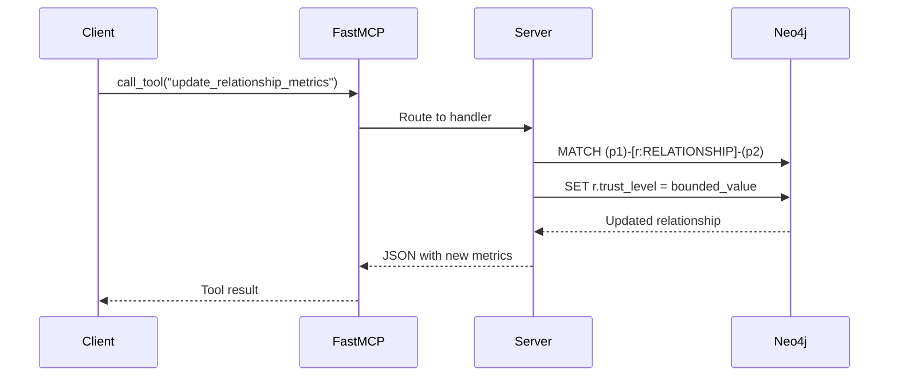

# Repository Architecture Documentation

## Overview

**lila-mcp** is a standalone Model Context Protocol (MCP) server that provides psychological intelligence capabilities for analyzing and modeling persona relationships. Built on attachment theory and the Big Five personality framework, this system enables AI assistants to understand and guide interpersonal dynamics with psychological depth.

**What It Does:**
- Models personas with psychological profiles (attachment styles, personality traits)
- Tracks relationship dynamics (trust, intimacy, strength metrics)
- Analyzes compatibility based on attachment theory
- Provides context-aware communication strategies
- Records and evaluates emotional interactions

**Technology Stack:**
- **Framework:** FastMCP 2.12.3+ (Model Context Protocol implementation)
- **Language:** Python 3.12+
- **Database:** Neo4j 5.15.0+ (graph storage for relationships)
- **Architecture:** Dual implementation (full Neo4j + lightweight mock)

**Project Location:** `/home/donbr/lila-graph/lila-mcp/`

---

## Quick Start

### For New Developers

1. **Understand the Domain:** Start with the [Psychological Intelligence Architecture](#psychological-intelligence-architecture) section below to understand attachment theory and personality modeling
2. **Review the Architecture:** Check [Architecture Summary](#architecture-summary) for the big picture
3. **Explore the API:** See [Component Overview](#component-overview) for available endpoints
4. **Run the Demo:** Start with the simple server (no Neo4j required):
   ```bash
   fastmcp dev simple_lila_mcp_server.py
   ```
5. **Read the Details:** Dive into specific documentation based on your needs

### For Architects

1. Start with [Architecture Summary](#architecture-summary) for the overall design
2. Review [Key Insights](#key-insights) for architectural decisions
3. Check [Component Relationships Diagram](diagrams/02_architecture_diagrams.md#component-relationships) for system structure
4. Examine [Data Flow Patterns](docs/03_data_flows.md) for request processing

### For Product Managers

1. Read [Psychological Intelligence Architecture](#psychological-intelligence-architecture) to understand the value proposition
2. Check [Component Overview](#component-overview) for feature capabilities
3. Review [Use Cases](#use-cases) below for practical applications
4. See [Developer Onboarding](#developer-onboarding) for team scaling considerations

### Documentation Navigation

```
repo_analysis/
├── README.md (this file)                        # Entry point and synthesis
├── docs/
│   ├── 01_component_inventory.md               # Detailed API reference and code inventory
│   ├── 03_data_flows.md                        # Sequence diagrams and flow analysis
│   └── 04_api_reference.md                     # Complete API documentation with examples
└── diagrams/
    └── 02_architecture_diagrams.md             # Mermaid architecture diagrams
```

---

## Architecture Summary

### Design Philosophy

The lila-mcp system follows a **layered architecture** with clear separation of concerns:

```
MCP Client (Claude Desktop/CLI)
        ↓
FastMCP Framework (Protocol Layer)
        ↓
MCP Interface Layer (Resources/Tools/Prompts)
        ↓
Business Logic (Psychological Analysis)
        ↓
Data Layer (Neo4j Driver / Mock Data)
        ↓
Neo4j Database (Graph Storage)
```

**Key Design Patterns:**

1. **Decorator-Based Registration:** All endpoints use `@app.resource()`, `@app.tool()`, `@app.prompt()` decorators
2. **Dual Implementation Strategy:** Production server with Neo4j + simplified mock server for testing
3. **Three-Tier MCP Interface:**
   - **Resources** (5 endpoints): Read-only data access (personas, relationships)
   - **Tools** (6 endpoints): State-modifying operations (update metrics, record interactions)
   - **Prompts** (3 endpoints): LLM guidance templates for psychological analysis
4. **Graph-Based Storage:** Neo4j models relationships as first-class entities with psychological metrics
5. **Attachment Theory Integration:** Core algorithms based on established psychological research

### System Components

**Core Servers:**
- `lila_mcp_server.py` (763 lines): Full production server with Neo4j
- `simple_lila_mcp_server.py` (843 lines): Mock data server for development

**Data Management:**
- `import_data.py` (466 lines): Schema loading and seed data import
- `export_data.py` (295 lines): Data extraction and Cypher script generation

**Infrastructure:**
- `fastmcp.json`: Server deployment configuration
- `pyproject.toml`: Python package and dependencies
- `.env`: Environment-based configuration

### Deployment Options

**Development Mode:**
```bash
fastmcp dev simple_lila_mcp_server.py
# Access Inspector UI at http://localhost:6274/
```

**Production Mode:**
```bash
python lila_mcp_server.py
# Runs on localhost:8765 with Neo4j integration
```

**Docker Deployment:**
```bash
docker-compose up
# Full stack with Neo4j, server, and nginx proxy
```

---

## Component Overview

### MCP Resources (Read-Only Data Access)

| Resource URI | Purpose | Returns |
|-------------|---------|---------|
| `neo4j://personas/all` | All personas with psychological profiles | JSON array of personas with Big Five traits |
| `neo4j://personas/{id}` | Specific persona details | Full profile with attachment style, personality |
| `neo4j://relationships/all` | All relationships with metrics | Trust, intimacy, strength data (0-10 scale) |
| `neo4j://relationships/{p1}/{p2}` | Specific relationship | Bidirectional relationship between two personas |
| `neo4j://interactions/recent/{count}` | Recent interactions | Interaction history with emotional analysis |

**See:** [docs/04_api_reference.md](docs/04_api_reference.md#mcp-resources) for detailed schemas and examples

### MCP Tools (State-Modifying Operations)

| Tool Name | Purpose | Key Parameters |
|-----------|---------|----------------|
| `update_relationship_metrics` | Adjust trust/intimacy/strength | persona IDs, delta values (-10 to +10) |
| `record_interaction` | Log interaction between personas | sender, recipient, content, emotional_valence |
| `analyze_persona_compatibility` | Assess relationship potential | persona IDs, relationship_type |
| `autonomous_strategy_selection` | Choose communication strategy | persona_id, context, attachment_style |
| `assess_goal_progress` | Track relationship goals | persona_id, goals, recent_interactions |
| `generate_contextual_response` | Create psychologically authentic response | persona_id, context, goals, constraints |

**See:** [docs/04_api_reference.md](docs/04_api_reference.md#mcp-tools) for complete signatures and usage

### MCP Prompts (LLM Guidance Templates)

| Prompt Name | Purpose | Use Case |
|-------------|---------|----------|
| `assess_attachment_style` | Determine attachment from behavior | Classify persona as secure/anxious/avoidant |
| `analyze_emotional_climate` | Evaluate conversation safety | Assess psychological safety (1-10 scale) |
| `generate_secure_response` | Create security-building responses | Generate attachment-informed communication |

**See:** [docs/04_api_reference.md](docs/04_api_reference.md#mcp-prompts) for prompt frameworks and examples

---

## Psychological Intelligence Architecture

### Attachment Theory Foundation

The system models four attachment styles based on attachment theory research:

**Secure Attachment:**
- Comfortable with intimacy and autonomy
- Emotionally available and trusting
- Strategies: emotional_bonding, vulnerable_disclosure, supportive_listening, trust_building

**Anxious Attachment:**
- Seeks closeness but fears abandonment
- Heightened emotional responses
- Strategies: reassurance_seeking, emotional_validation, secure_bonding, safety_creation

**Avoidant Attachment:**
- Values independence over closeness
- Uncomfortable with emotional intimacy
- Strategies: autonomous_connection, thoughtful_presence, respectful_distance, gradual_opening

**Exploratory Attachment:**
- Seeks authentic expression and growth
- Values personal development
- Strategies: growth_oriented_support, playful_engagement, curious_exploration, authentic_expression

**Compatibility Matrix:**

| Pairing | Compatibility | Dynamics |
|---------|--------------|----------|
| Secure + Secure | High | Both provide stability and emotional availability |
| Secure + Anxious | Good | Secure provides reassurance to anxious partner |
| Secure + Avoidant | Moderate | Secure helps avoidant open up gradually |
| Anxious + Anxious | Challenging | Both may escalate emotional intensity |
| Anxious + Avoidant | Difficult | Classic pursue-withdraw dynamic |
| Avoidant + Avoidant | Low | Both avoid emotional intimacy |

### Big Five Personality Model (OCEAN)

Each persona has five personality dimensions (0.0-1.0 scale):

- **Openness:** Curiosity, creativity, willingness to try new experiences
- **Conscientiousness:** Organization, responsibility, goal-directed behavior
- **Extraversion:** Sociability, assertiveness, energy from social interaction
- **Agreeableness:** Compassion, cooperation, trust in others
- **Neuroticism:** Emotional stability vs. tendency toward anxiety/worry

**Behavioral Style Mapping:** The system maps DISC behavioral styles to Big Five traits:
- **D (Dominance)** → Higher Extraversion, Lower Agreeableness
- **I (Influence)** → Higher Extraversion, Openness, Agreeableness
- **S (Steadiness)** → Higher Agreeableness, Conscientiousness, Lower Neuroticism
- **C (Conscientiousness)** → Higher Conscientiousness, Openness

### Relationship Metrics

Relationships are tracked with three core metrics (0-10 scale):

**Trust Level:**
- Reliability and dependability
- Predictability and consistency
- Emotional safety in vulnerability

**Intimacy Level:**
- Emotional closeness and connection
- Depth of mutual understanding
- Willingness to share vulnerabilities

**Relationship Strength:**
- Overall quality and resilience
- Commitment and investment
- Ability to weather challenges

**Additional Tracking:**
- Emotional Valence (-1.0 to +1.0): Overall emotional tone
- Interaction Count: Frequency of contact
- Last Interaction: Temporal tracking
- Relationship Type: Context categorization (romantic, friendship, familial)

---

## Data Flows

### Request Processing Pattern

All MCP requests follow a consistent flow:

```
1. Client Request → FastMCP Protocol Handler
2. JSON-RPC Parsing → Method Type Detection
3. URI/Name Matching → Handler Selection
4. Parameter Validation → Type Checking
5. Handler Invocation → Business Logic
6. Database Query (if needed) → Neo4j Cypher
7. Response Formatting → JSON Serialization
8. MCP Wrapping → Protocol Response
9. Client Response → Data Processing
```

**Key Flow Characteristics:**
- All tools are async (`async def`) for concurrent execution
- Resources are sync functions called in async context
- Database operations use Neo4j session context managers
- Error handling returns JSON errors (never throws to client)
- Bounds checking enforced at Cypher level (CASE expressions)

### Example: Update Relationship Flow



**See:** [docs/03_data_flows.md](docs/03_data_flows.md) for detailed sequence diagrams of all flows

---

## Key Insights

### Architectural Decisions

**1. Dual Server Strategy**

**Decision:** Maintain both full Neo4j server and mock data server

**Rationale:**
- Enables rapid development without database setup
- Simplifies testing and demonstrations
- Provides fallback for deployment failures
- Identical API surface ensures compatibility

**Trade-off:** Slight code duplication vs. significant developer experience improvement

**2. Graph Database Selection**

**Decision:** Use Neo4j for relationship storage

**Rationale:**
- Relationships are first-class entities (not just foreign keys)
- Efficient bidirectional relationship queries
- Native support for graph algorithms
- Rich relationship properties (trust, intimacy, emotional_valence)

**Trade-off:** Additional infrastructure vs. natural data model

**3. MCP Three-Tier Interface**

**Decision:** Separate Resources, Tools, and Prompts

**Rationale:**
- Clear intent: reads vs. writes vs. guidance
- Follows MCP specification best practices
- Enables fine-grained permission control
- Prompts separate LLM orchestration from data operations

**Trade-off:** More endpoint types to learn vs. clearer mental model

**4. Attachment Theory as Core Framework**

**Decision:** Build all strategies around attachment theory

**Rationale:**
- Well-researched psychological foundation
- Predictable relationship dynamics
- Clear compatibility matrices
- Evidence-based intervention strategies

**Trade-off:** Requires understanding of psychological theory vs. powerful predictive model

**5. Bounds Checking at Database Level**

**Decision:** Use Cypher CASE expressions for metric bounds

**Rationale:**
- Atomic enforcement (no race conditions)
- Database guarantees consistency
- Simpler application code
- Single source of truth for constraints

**Trade-off:** Slightly complex Cypher vs. guaranteed data integrity

### Performance Considerations

**Connection Pooling:** Neo4j driver maintains connection pool internally

**Caching Strategy:** Resources can be cached with time-based expiry (recommended: 30-60 seconds for personas)

**Concurrent Requests:** Async tools support parallel execution via `asyncio.gather()`

**Query Optimization:**
- Indexes on `persona_id`, `attachment_style`, `relationship_type`
- Unique constraints on primary identifiers
- Parameterized queries prevent injection

**Scalability:**
- Stateless server design (can run multiple instances)
- Neo4j scales vertically (single instance) or with clustering
- MCP protocol supports request multiplexing

### Security Considerations

**Current State (Development):**
- No authentication enabled
- Local-only binding (localhost:8765)
- Environment-based database credentials

**Production Recommendations:**
- Enable TLS/SSL for transport encryption
- Implement API key authentication
- Rate limiting (recommended: 60 requests/minute)
- CORS configuration for allowed origins
- Neo4j auth with role-based access control
- Input validation (already implemented via Pydantic schemas)

### Testing Strategy

**Current Implementation:**
- `test_mcp_validation.py`: Direct connection and Inspector validation
- Manual testing via FastMCP Inspector UI

**Recommended Additions:**
- Unit tests for individual tools and resources
- Integration tests for complete workflows
- Mock Neo4j for isolated testing
- Property-based testing for metric bounds
- Attachment compatibility validation tests

---

## Developer Onboarding

### Prerequisites

**Required Knowledge:**
- Python 3.12+ and async/await patterns
- Basic Neo4j and Cypher query language
- Model Context Protocol concepts
- Attachment theory fundamentals (can be learned)

**Development Environment:**
```bash
# Install uv (package manager)
pip install uv

# Clone and setup
git clone <repository>
cd lila-mcp
uv sync

# Setup environment
cp .env.example .env
# Edit .env with your Neo4j credentials

# Start Neo4j (via Docker or local install)
docker run -p 7687:7687 -p 7474:7474 \
  -e NEO4J_AUTH=neo4j/passw0rd \
  neo4j:5.15.0

# Import seed data
python import_data.py --create-defaults

# Run development server
fastmcp dev lila_mcp_server.py
```

### First Tasks for New Developers

**Week 1: Understanding**
1. Read this README completely
2. Review attachment theory resources (see [Glossary](#glossary-of-key-terms))
3. Run simple server and explore Inspector UI
4. Execute example code from API reference

**Week 2: Exploration**
1. Trace a complete resource request through the code
2. Add logging to understand data flow
3. Modify a tool to add new functionality
4. Write tests for new functionality

**Week 3: Contribution**
1. Pick an issue or feature request
2. Implement with tests
3. Submit pull request with documentation
4. Review another developer's code

### Code Navigation Tips

**Finding Resource Handlers:** Search for `@app.resource(` in server files

**Finding Tool Handlers:** Search for `@app.tool()` in server files

**Finding Cypher Queries:** Search for `session.run(` or `MATCH` in code

**Understanding Data Models:** Check `import_data.py` for schema creation

**Tracing Requests:** Enable DEBUG logging: `LOG_LEVEL=DEBUG` in `.env`

### Common Development Tasks

**Add a New Resource:**
```python
# In _register_resources() method
@self.app.resource("neo4j://your-resource/{param}")
def get_your_resource(param: str) -> str:
    """Documentation for your resource."""
    # Query database
    # Format response
    return json.dumps({"result": data})
```

**Add a New Tool:**
```python
# In _register_tools() method
@self.app.tool()
async def your_tool(param1: str, param2: float = 0.0) -> str:
    """Documentation for your tool."""
    # Validate parameters
    # Update database
    # Return JSON result
    return json.dumps({"success": True, "data": result})
```

**Add a New Prompt:**
```python
# In _register_prompts() method
@self.app.prompt()
def your_prompt(context: str) -> str:
    """Documentation for your prompt."""
    return f"""
    You are an expert in...
    Context: {context}
    Please analyze...
    """
```

---

## Use Cases

### Clinical Psychology Applications

**Relationship Therapy:**
- Track couple's attachment dynamics over time
- Identify pursue-withdraw patterns
- Suggest intervention strategies based on compatibility

**Individual Therapy:**
- Model client's relationship patterns
- Predict outcomes with different attachment styles
- Generate secure attachment responses for practice

### AI Assistant Development

**Emotionally Intelligent Chatbots:**
- Adapt communication style to user's attachment pattern
- Build trust through consistent, appropriate responses
- Track relationship development over conversations

**Virtual Companions:**
- Model realistic personality with Big Five traits
- Maintain coherent relationship history
- Evolve relationship metrics based on interactions

### Research Applications

**Attachment Theory Studies:**
- Simulate relationship dynamics at scale
- Test intervention strategies
- Model long-term relationship trajectories

**Personality Research:**
- Explore Big Five trait combinations
- Study compatibility patterns
- Validate behavioral style mappings

### Game Development

**NPC Relationship Systems:**
- Track player relationships with characters
- Dynamic dialogue based on relationship state
- Emergent storylines from relationship metrics

**Social Simulation Games:**
- Model complex social networks
- Realistic relationship progression
- Attachment-based character behaviors

---

## Glossary of Key Terms

**Attachment Style:** A pattern of emotional connection and relationship behavior, typically formed in early childhood. Four main styles: secure, anxious, avoidant, exploratory.

**Big Five (OCEAN):** The five-factor model of personality: Openness, Conscientiousness, Extraversion, Agreeableness, Neuroticism.

**Cypher:** Neo4j's query language for graph databases, similar to SQL for relational databases.

**Emotional Valence:** The intrinsic positive or negative quality of an emotional experience, measured on a scale from -1 (very negative) to +1 (very positive).

**FastMCP:** Python framework implementing the Model Context Protocol for building AI-accessible servers.

**Intimacy Level:** Degree of emotional closeness, vulnerability sharing, and mutual understanding in a relationship.

**MCP (Model Context Protocol):** Open protocol for connecting AI assistants to external data sources and tools.

**Neo4j:** Graph database optimized for storing and querying connected data (nodes and relationships).

**Persona:** A modeled individual with psychological attributes (personality traits, attachment style, communication patterns).

**Relationship Strength:** Overall quality and resilience of a relationship, combining trust, intimacy, and other factors.

**Secure Base:** In attachment theory, a reliable source of safety and comfort that enables exploration and growth.

**Trust Level:** Degree of reliability, predictability, and emotional safety perceived in a relationship.

---

## Documentation Index

### Core Documentation

1. **[Component Inventory](docs/01_component_inventory.md)** - 922 lines
   - Complete code inventory with line numbers
   - Public API surface documentation
   - Internal implementation details
   - Entry points and configuration
   - Data models and dependencies

2. **[Architecture Diagrams](diagrams/02_architecture_diagrams.md)** - 677 lines
   - System architecture overview
   - Component relationships
   - Class hierarchies
   - Module dependencies
   - Data flow patterns
   - Deployment architecture
   - Psychological intelligence model

3. **[Data Flows](docs/03_data_flows.md)** - 897 lines
   - Simple resource query flow
   - Full client session lifecycle
   - Tool invocation with validation
   - MCP protocol communication
   - Message parsing and routing
   - Error handling patterns

4. **[API Reference](docs/04_api_reference.md)** - 2775 lines
   - Core class documentation
   - MCP Resources (5 endpoints)
   - MCP Tools (6 endpoints)
   - MCP Prompts (3 endpoints)
   - Data management APIs
   - Configuration reference
   - Usage patterns and best practices
   - Complete working examples

### Quick Reference

**File Locations:**
- Main server: `/home/donbr/lila-graph/lila-mcp/lila_mcp_server.py`
- Simple server: `/home/donbr/lila-graph/lila-mcp/simple_lila_mcp_server.py`
- Data import: `/home/donbr/lila-graph/lila-mcp/import_data.py`
- Data export: `/home/donbr/lila-graph/lila-mcp/export_data.py`
- Configuration: `/home/donbr/lila-graph/lila-mcp/.env.example`

**Key Concepts:**
- Attachment styles: Secure, Anxious, Avoidant, Exploratory
- Relationship metrics: Trust, Intimacy, Strength (0-10 scale)
- Big Five traits: OCEAN (0-1 scale)
- MCP interface: Resources (read), Tools (write), Prompts (guidance)

**Common Commands:**
```bash
# Development mode
fastmcp dev simple_lila_mcp_server.py

# Production mode
python lila_mcp_server.py

# Import data
python import_data.py --create-defaults

# Export data
python export_data.py --output seed_data.cypher

# Validation
python test_mcp_validation.py
```

---

## References

### Documentation Files

- **Component Inventory:** [docs/01_component_inventory.md](docs/01_component_inventory.md) - Detailed API and code structure
- **Architecture Diagrams:** [diagrams/02_architecture_diagrams.md](diagrams/02_architecture_diagrams.md) - Visual system architecture
- **Data Flows:** [docs/03_data_flows.md](docs/03_data_flows.md) - Sequence diagrams and flow patterns
- **API Reference:** [docs/04_api_reference.md](docs/04_api_reference.md) - Complete API documentation

### External Resources

**FastMCP:**
- Documentation: https://gofastmcp.com/
- GitHub: https://github.com/jlowin/fastmcp

**Neo4j:**
- Documentation: https://neo4j.com/docs/
- Cypher Manual: https://neo4j.com/docs/cypher-manual/current/

**Model Context Protocol:**
- Specification: https://modelcontextprotocol.io/
- GitHub: https://github.com/modelcontextprotocol

**Attachment Theory:**
- Bowlby, J. (1988). A Secure Base: Parent-Child Attachment and Healthy Human Development
- Ainsworth, M.D.S. (1978). Patterns of Attachment: A Psychological Study of the Strange Situation

**Big Five Personality:**
- Costa, P. T., & McCrae, R. R. (1992). Normal personality assessment in clinical practice: The NEO Personality Inventory
- Goldberg, L. R. (1993). The structure of phenotypic personality traits

---

## Conclusion

The lila-mcp repository provides a sophisticated psychological intelligence system built on established research in attachment theory and personality psychology. Its dual-server architecture, comprehensive MCP interface, and graph-based data model create a powerful platform for modeling and analyzing interpersonal relationships.

**Key Strengths:**
- Strong theoretical foundation in psychological research
- Clean, well-documented code with extensive examples
- Flexible deployment options (development to production)
- Comprehensive API covering read, write, and analysis operations
- Graph database naturally models relationships
- Async architecture for performance

**Ideal For:**
- AI assistant developers seeking emotional intelligence
- Researchers studying relationship dynamics
- Game developers building social simulation systems
- Therapists exploring computational psychology tools

**Next Steps:**
1. Review the detailed documentation in the index above
2. Run the simple server to explore capabilities
3. Study the example code in the API reference
4. Join the development community and contribute

For questions, issues, or contributions, refer to the repository's issue tracker and contribution guidelines.

---

*This synthesis was generated from comprehensive repository analysis. Last updated: 2025-10-02*
