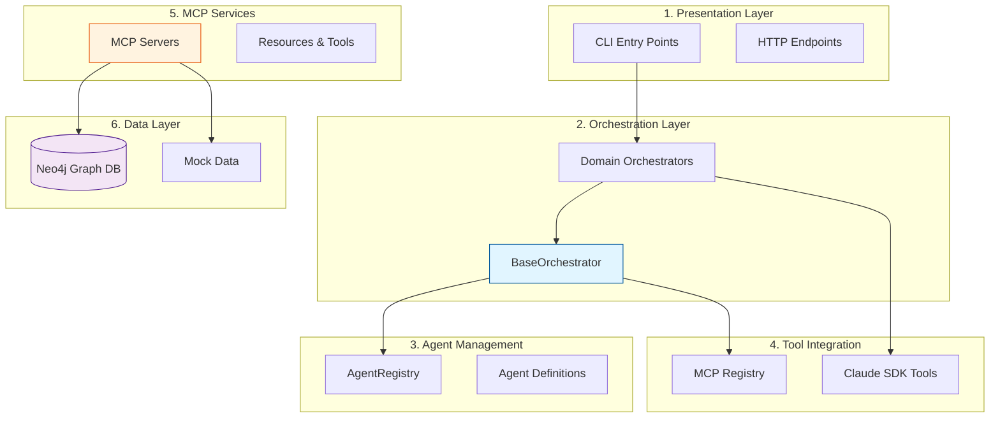
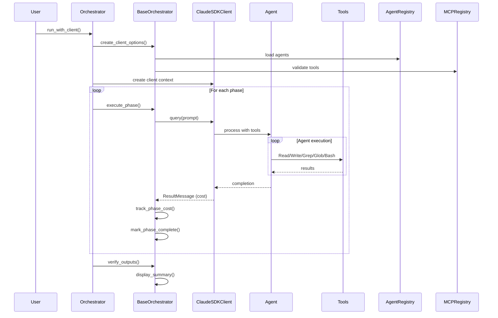
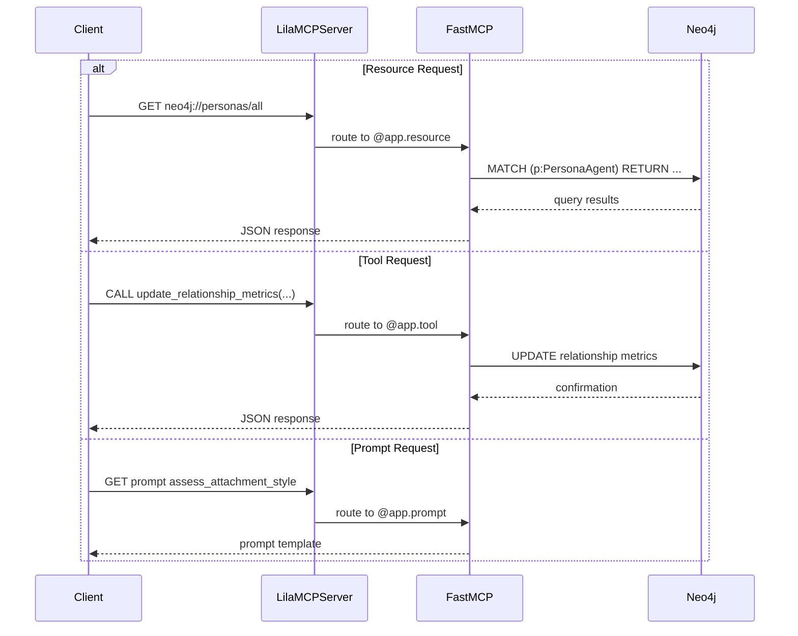

# Repository Architecture Documentation

> **Lila MCP** - Multi-domain agent orchestration system with psychological relationship modeling

This repository provides a comprehensive framework for building multi-agent orchestration systems with specialized MCP (Model Context Protocol) servers that expose psychological intelligence services. The system combines AI agent coordination with graph database storage for modeling complex relationship dynamics.

**Last Updated**: 2025-10-03
**Documentation Version**: 1.0.0

---

## Overview

### What is Lila MCP?

Lila MCP is a sophisticated multi-domain orchestration platform that combines:

1. **MCP Servers**: FastMCP-based servers providing psychological relationship data and tools with Neo4j backend integration
2. **Agent Orchestration Framework**: Extensible base framework for coordinating multi-phase AI workflows across different domains
3. **Psychological Intelligence**: Graph-based modeling of personas, relationships, attachment styles, and emotional dynamics
4. **Tool Integration**: Unified registry system for MCP servers and external design tools (Figma, v0)

### Core Capabilities

- **Relationship Modeling**: Track trust, intimacy, and attachment dynamics between personas using attachment theory
- **Multi-Domain Orchestration**: Architecture analysis, UX design workflows, and extensible framework for custom domains
- **AI Agent Coordination**: Phase-based workflows with cost tracking, progress monitoring, and output verification
- **Graph Database Integration**: Neo4j-backed storage with import/export utilities for psychological data
- **Development Flexibility**: Mock data server for testing without database dependencies

---

## Quick Start

### For New Users

**Want to understand the system?**
1. Start with [Architecture Summary](#architecture-summary) below for high-level view
2. Review [Component Overview](#component-overview) for what each piece does
3. Check [Key Concepts](#key-concepts) for important architectural patterns

**Want to use the MCP servers?**
1. See [Development Guide](#development-guide) for setup instructions
2. Review [API Quick Reference](#api-quick-reference) for available endpoints
3. Check the full [API Reference](docs/04_api_reference.md) for detailed documentation

**Want to build orchestrators?**
1. Read [Development Guide](#development-guide) section on custom orchestrators
2. Study examples in [Component Overview](#component-overview)
3. See [Data Flows](docs/03_data_flows.md) for interaction patterns

### Documentation Navigation

```
repo_analysis/
├── README.md (you are here) ─────┐
├── docs/                          │
│   ├── 01_component_inventory.md ← Complete component catalog
│   ├── 03_data_flows.md ──────── ← Sequence diagrams and flows
│   └── 04_api_reference.md ───── ← Full API documentation
└── diagrams/
    └── 02_architecture_diagrams.md ← Visual architecture
```

---

## Architecture Summary

### Layered Architecture

The system follows a clean **6-layer architecture** with clear separation of concerns:



### Key Architectural Principles

1. **Modularity**: Each layer has focused responsibilities; components can be developed independently
2. **Extensibility**: New orchestrators extend `BaseOrchestrator`; new MCP servers follow FastMCP patterns
3. **Testability**: Mock data layer (`SimpleLilaMCPServer`) allows testing without database dependencies
4. **Scalability**: Stateless orchestrators can run in parallel; Neo4j provides horizontal scaling
5. **Composability**: Agents are composed into orchestrators; tools are composed into agents

### Design Patterns in Use

The system demonstrates several proven architectural patterns:

- **Abstract Base Class**: `BaseOrchestrator` enforces consistent interface across domains
- **Template Method**: `run_with_client()` provides workflow template with customizable phases
- **Registry Pattern**: `AgentRegistry` and `MCPRegistry` centralize component discovery
- **Strategy Pattern**: Different orchestrators implement different domain strategies
- **Facade Pattern**: `SimpleLilaMCPServer` provides same interface as `LilaMCPServer` with mock data
- **Mixin Pattern**: `CrossOrchestratorCommunication` adds cross-domain capabilities

See [Architecture Diagrams](diagrams/02_architecture_diagrams.md) for detailed class hierarchies and relationships.

---

## Component Overview

### MCP Servers (Psychological Intelligence Services)

#### LilaMCPServer
**File**: `/home/donbr/lila-graph/lila-mcp/lila_mcp_server.py`

Production MCP server exposing psychological relationship data and tools with Neo4j backend.

**Resources** (read-only data endpoints):
- `neo4j://personas/all` - All personas with psychological profiles
- `neo4j://personas/{id}` - Specific persona details
- `neo4j://relationships/all` - All relationship metrics
- `neo4j://relationships/{p1}/{p2}` - Specific relationship data
- `neo4j://interactions/recent/{count}` - Recent interaction history

**Tools** (action endpoints - async):
- `update_relationship_metrics()` - Update trust/intimacy/strength (0-10 scale)
- `record_interaction()` - Record interaction with psychological analysis
- `analyze_persona_compatibility()` - Assess relationship potential based on attachment styles
- `autonomous_strategy_selection()` - AI-driven strategy selection using attachment theory
- `assess_goal_progress()` - Evaluate progress toward relationship goals
- `generate_contextual_response()` - Generate psychologically authentic responses

**Prompts** (AI templates):
- `assess_attachment_style()` - Determine attachment style from behavioral observations
- `analyze_emotional_climate()` - Evaluate conversation emotional dynamics
- `generate_secure_response()` - Create attachment-security-building responses

**Use Cases**: Production psychological intelligence services, relationship coaching applications, AI persona simulation

#### SimpleLilaMCPServer
**File**: `/home/donbr/lila-graph/lila-mcp/simple_lila_mcp_server.py`

Development MCP server with in-memory mock data. Same interface as `LilaMCPServer` but no Neo4j required.

**Additional Resources**:
- `neo4j://emotional_climate/current` - Computed emotional safety metrics
- `neo4j://attachment_styles/analysis` - Attachment compatibility analysis
- `neo4j://goals/active` - Active relationship goals
- `neo4j://psychological_insights/trends` - Psychological trends

**Use Cases**: Testing, development, CI/CD pipelines, demos without database setup

### Orchestrator Framework (Multi-Phase Workflows)

#### BaseOrchestrator
**File**: `/home/donbr/lila-graph/lila-mcp/orchestrators/base_orchestrator.py`

Abstract base class providing common orchestrator functionality:

**Core Features**:
- Phase execution and management
- Agent lifecycle management
- Output directory structure creation
- Progress tracking with visual headers
- Cost tracking per phase and total
- Output verification and checkpointing
- Error handling and recovery
- Message streaming and display

**Abstract Methods** (must implement):
- `get_agent_definitions()` - Return agent configs
- `get_allowed_tools()` - Return tool allowlist
- `run()` - Execute workflow phases

**Use Cases**: Base class for all domain-specific orchestrators

#### ArchitectureOrchestrator
**File**: `/home/donbr/lila-graph/lila-mcp/orchestrators/architecture_orchestrator.py`

Orchestrator for comprehensive repository architecture analysis.

**Workflow Phases**:
1. **Component Inventory** - Catalog all modules, classes, functions
2. **Architecture Diagrams** - Generate Mermaid visualizations
3. **Data Flows** - Document sequence diagrams and message flows
4. **API Documentation** - Generate comprehensive API reference
5. **Final Synthesis** - Create overview README

**Agents**:
- `analyzer` - Code structure analysis (Read, Grep, Glob, Write, Bash)
- `doc-writer` - Technical documentation (Read, Write, Grep, Glob)

**Use Cases**: Repository documentation, architecture analysis, onboarding new developers

#### UXOrchestrator
**File**: `/home/donbr/lila-graph/lila-mcp/orchestrators/ux_orchestrator.py`

Orchestrator for comprehensive UX/UI design workflow.

**Workflow Phases** (6-phase design process):
1. **UX Research** - User research, personas, journeys
2. **Information Architecture** - Sitemaps, navigation, content structure
3. **Visual Design** - High-fidelity mockups and design specs
4. **Interactive Prototyping** - Working prototypes and interactions
5. **API Contract Design** - Frontend-backend interface specs
6. **Design System Documentation** - Component library and style guide

**Agents**:
- `ux-researcher` - User research (Read, Write, Grep, Glob, WebSearch)
- `ia-architect` - Information architecture (Read, Write, Grep, Glob)
- `ui-designer` - Visual design (Read, Write, Grep, Glob + Figma MCP)
- `prototype-developer` - Interactive prototypes (Read, Write, Grep, Glob, Bash)

**Use Cases**: UX design workflows, product development, design system creation

### Registry Systems (Component Discovery)

#### AgentRegistry
**File**: `/home/donbr/lila-graph/lila-mcp/agents/registry.py`

Registry for discovering and loading agent definitions from JSON files.

**Key Methods**:
- `discover_agents(domain)` - Find all agent definition files
- `load_agent(name, domain)` - Load specific agent with caching
- `load_domain_agents(domain)` - Load all agents for a domain

**Directory Structure**:
```
agents/
├── ux/
│   ├── ux_researcher.json
│   ├── ia_architect.json
│   └── ui_designer.json
└── architecture/
    ├── analyzer.json
    └── doc_writer.json
```

**Use Cases**: Dynamic agent loading, domain-specific agent management, caching for performance

#### MCPRegistry
**File**: `/home/donbr/lila-graph/lila-mcp/tools/mcp_registry.py`

Registry for discovering and managing MCP server connections.

**Registered Servers**:
- `figma` - Figma MCP Server for design context (requires `FIGMA_ACCESS_TOKEN`)
- `v0` - Vercel v0 MCP Server for UI generation (requires `V0_API_KEY`)
- `sequential-thinking` - Advanced reasoning MCP tool
- `playwright` - Browser automation MCP tool

**Key Methods**:
- `is_server_available(name)` - Check server availability
- `get_server_tools(name)` - Get tool list for server
- `validate_tool_availability(tool)` - Validate specific tool
- `get_configuration_requirements(name)` - Get setup instructions
- `get_fallback_options(tool)` - Get alternatives for unavailable tools

**Use Cases**: MCP server management, tool validation, fallback handling

### Data Management (Neo4j Import/Export)

#### Neo4jDataImporter
**File**: `/home/donbr/lila-graph/lila-mcp/import_data.py`

Imports psychological intelligence data and schema into Neo4j.

**Key Methods**:
- `load_schema(path)` - Create constraints, indexes, and load persona data
- `import_seed_data(path)` - Import Cypher seed data file
- `create_default_personas()` - Create default Lila and Alex personas
- `verify_import()` - Verify data was imported successfully

**Creates**:
- Constraints on `persona_id`, `name`, `memory_id`, `goal_id`
- Indexes on `attachment_style`, `memory_type`, `goal_type`, `relationship_type`
- PersonaAgent nodes with Big Five personality traits
- RELATIONSHIP edges with trust/intimacy/strength metrics

**Use Cases**: Database initialization, schema management, default data creation

#### Neo4jDataExporter
**File**: `/home/donbr/lila-graph/lila-mcp/export_data.py`

Exports psychological intelligence data from Neo4j for seeding.

**Key Methods**:
- `export_personas()` - Export all PersonaAgent nodes
- `export_relationships()` - Export all relationship edges
- `export_memories()` - Export memory nodes
- `export_goals()` - Export goal nodes
- `generate_cypher_script()` - Generate import script from exported data

**Use Cases**: Backup, migration, seed data generation, testing data

---

## Data Flows

### Orchestrator Workflow Pattern

The standard orchestrator workflow follows a consistent pattern across all domains:



**Key Characteristics**:
- **Session Continuity**: Single `ClaudeSDKClient` instance persists across all phases
- **Incremental Output**: Each phase writes to specific files that later phases can read
- **Cost Tracking**: Every phase tracks `total_cost_usd` and aggregates at orchestrator level
- **Error Resilience**: Try-catch wraps critical sections with graceful degradation

### MCP Server Request Flow

MCP servers handle three types of requests:



**Flow Types**:
1. **Resources**: Read-only data queries returning JSON
2. **Tools**: Async operations that modify data or perform analysis
3. **Prompts**: Template generation for LLM consumption

See [Data Flow Analysis](docs/03_data_flows.md) for comprehensive sequence diagrams including:
- Interactive client session flow
- Tool permission callback flow
- Message parsing and routing
- Agent registry loading flow

---

## API Quick Reference

### MCP Server Endpoints

#### Resources (Data Access)

```python
# Get all personas
personas = await client.get_resource("neo4j://personas/all")

# Get specific persona
persona = await client.get_resource("neo4j://personas/lila")

# Get all relationships
relationships = await client.get_resource("neo4j://relationships/all")

# Get recent interactions
interactions = await client.get_resource("neo4j://interactions/recent/10")
```

#### Tools (Actions)

```python
# Update relationship metrics
result = await update_relationship_metrics(
    persona1_id="lila",
    persona2_id="don",
    trust_delta=0.5,
    intimacy_delta=0.3,
    strength_delta=0.4
)

# Record interaction
result = await record_interaction(
    sender_id="lila",
    recipient_id="don",
    content="Had a great conversation about AI ethics",
    emotional_valence=0.8,
    relationship_impact=0.3
)

# Analyze compatibility
result = await analyze_persona_compatibility(
    persona1_id="lila",
    persona2_id="don",
    relationship_type="professional"
)
```

#### Prompts (AI Templates)

```python
# Get attachment style assessment prompt
prompt = assess_attachment_style(
    persona_id="don",
    observation_period="past_month",
    behavioral_examples="Shows consistent engagement..."
)

# Get emotional climate analysis prompt
prompt = analyze_emotional_climate(
    conversation_text="[conversation content]",
    participants="lila,don"
)
```

### Orchestrator API

#### Running an Orchestrator

```python
from orchestrators.architecture_orchestrator import ArchitectureOrchestrator
import asyncio

async def main():
    orchestrator = ArchitectureOrchestrator()
    await orchestrator.run_with_client()

asyncio.run(main())
```

#### Creating a Custom Orchestrator

```python
from orchestrators.base_orchestrator import BaseOrchestrator
from claude_agent_sdk import AgentDefinition
from pathlib import Path

class CustomOrchestrator(BaseOrchestrator):
    def __init__(self):
        super().__init__(domain_name="custom")
        self.docs_dir = self.output_dir / "docs"
        self.create_output_structure()

    def get_agent_definitions(self):
        return {
            "analyzer": AgentDefinition(
                description="Custom analyzer",
                prompt="You are a custom analyzer...",
                tools=["Read", "Write", "Grep"],
                model="sonnet"
            )
        }

    def get_allowed_tools(self):
        return ["Read", "Write", "Grep", "Glob"]

    async def run(self):
        await self.execute_phase(
            phase_name="Analysis",
            agent_name="analyzer",
            prompt="Analyze the system...",
            client=self.client
        )
```

### Registry API

#### Agent Registry

```python
from agents.registry import AgentRegistry

registry = AgentRegistry()

# Discover all agents
agents = registry.discover_agents()

# Load specific agent
agent = registry.load_agent('ux_researcher', domain='ux')

# Load all agents for domain
ux_agents = registry.load_domain_agents('ux')
```

#### MCP Registry

```python
from tools.mcp_registry import MCPRegistry

mcp = MCPRegistry()

# Check server availability
if mcp.is_server_available('figma'):
    tools = mcp.get_server_tools('figma')
else:
    config = mcp.get_configuration_requirements('figma')
    fallbacks = mcp.get_fallback_options('figma_get_file')
```

For complete API documentation with all parameters, return types, and examples, see [API Reference](docs/04_api_reference.md).

---

## Key Concepts

### 1. Orchestrators and Phases

**Orchestrators** coordinate multi-phase workflows with specific agents and tools. Each phase:
- Executes with a specific agent and prompt
- Writes outputs to designated directories
- Tracks API costs
- Marks completion for progress tracking

**Example**: ArchitectureOrchestrator runs 5 phases sequentially:
1. Component Inventory → `docs/01_component_inventory.md`
2. Architecture Diagrams → `diagrams/02_architecture_diagrams.md`
3. Data Flows → `docs/03_data_flows.md`
4. API Documentation → `docs/04_api_reference.md`
5. Final Synthesis → `README.md`

### 2. Agents and Tools

**Agents** are AI workers with specific capabilities defined by:
- **Description**: What the agent does
- **Prompt**: System prompt defining behavior and expertise
- **Tools**: Allowed tool list (Read, Write, Grep, Glob, Bash, WebSearch)
- **Model**: Which Claude model to use (sonnet, opus, haiku)

**Tools** are actions agents can perform:
- **Read**: Read files from filesystem
- **Write**: Write files to filesystem
- **Grep**: Search file contents with regex
- **Glob**: Find files by pattern
- **Bash**: Execute shell commands (requires permission)
- **WebSearch**: Search the web (when available)

### 3. MCP Resources, Tools, and Prompts

MCP servers expose three types of endpoints:

**Resources** (read-only data):
- URI-based access: `neo4j://personas/all`
- Return JSON data
- No side effects

**Tools** (async actions):
- Function calls with parameters
- Can modify data
- Return JSON results
- May have side effects

**Prompts** (AI templates):
- Return formatted prompt strings
- Used by LLMs for consistent analysis
- Include instructions and examples

### 4. Psychological Intelligence Model

The system models psychological relationships using:

**Personas** (PersonaAgent nodes):
- **Big Five Personality Traits**: Openness, Conscientiousness, Extraversion, Agreeableness, Neuroticism (0-1 scale)
- **Attachment Style**: Secure, Anxious, Avoidant, Exploratory
- **Demographics**: Age, role, description
- **Communication Style**: How persona interacts

**Relationships** (RELATIONSHIP edges):
- **Trust Level**: 0-10 scale
- **Intimacy Level**: 0-10 scale
- **Relationship Strength**: 0-10 scale
- **Interaction Count**: Number of interactions
- **Emotional Valence**: Overall emotional tone

**Attachment Theory Framework**:
- **Secure**: Comfortable with intimacy and autonomy
- **Anxious**: Seeks closeness, fears abandonment
- **Avoidant**: Values independence over closeness
- **Exploratory**: Seeks authentic expression and growth

### 5. Permission Modes

Orchestrators use permission modes to control tool usage:

**"acceptEdits" (Default)**:
- Auto-approves: Read, Write, Grep, Glob (safe file operations)
- Prompts for: Bash commands (especially destructive operations)
- Best for: Production workflows with monitoring

**"ask"**:
- Requires approval for every tool use
- Best for: Debugging, learning, high-security environments

### 6. Message Types and Streaming

The Claude SDK uses three message types:

**AssistantMessage**:
- Agent thinking and tool requests
- Contains TextBlock (thoughts) and ToolUseBlock (tool requests)
- Displayed as "🤖 Agent: ..."

**UserMessage**:
- Tool execution results back to agent
- Contains ToolResultBlock with tool output
- Displayed as "✅ Result: ..."

**ResultMessage**:
- Phase completion and cost tracking
- Contains total_cost_usd and status
- Displayed as completion banner with cost

Messages stream asynchronously via `async for msg in client.receive_response()`.

### 7. Registry Pattern for Discovery

Both AgentRegistry and MCPRegistry use the **Registry Pattern**:

**Benefits**:
- Centralized component discovery
- Caching to avoid re-loading
- Dynamic configuration without code changes
- Graceful handling of missing components

**Agent Discovery**:
```
agents/
├── ux/
│   └── ux_researcher.json  ← Discovered
└── architecture/
    └── analyzer.json       ← Discovered
```

**MCP Discovery**:
- Checks environment variables for tokens
- Tests server availability
- Provides fallback options if unavailable

---

## Development Guide

### Prerequisites

- Python 3.8+
- Neo4j 4.4+ (for production MCP server)
- Node.js 16+ (for MCP CLI tools, optional)
- Claude API key (for orchestrators)

### Installation

```bash
# Clone repository
git clone <repository-url>
cd lila-mcp

# Install Python dependencies
pip install -r requirements.txt

# Set up environment variables
cp .env.example .env
# Edit .env with your credentials
```

### Environment Configuration

Create `.env` file:

```bash
# Required for MCP servers
NEO4J_URI=bolt://localhost:7687
NEO4J_USER=neo4j
NEO4J_PASSWORD=your_password

# Optional: Figma integration
FIGMA_ACCESS_TOKEN=your_token

# Optional: Vercel v0 integration
V0_API_KEY=your_key
```

### Starting Neo4j (Docker)

```bash
# Start Neo4j container
docker-compose up -d neo4j

# Import schema and default data
python import_data.py \
  --schema graphs/lila-graph-schema-v8.json \
  --create-defaults
```

### Running MCP Servers

#### Production Server (Neo4j backend)

```bash
# Run directly
python lila_mcp_server.py

# Or with FastMCP CLI
fastmcp dev lila_mcp_server.py
```

Server starts on `http://localhost:8765`

Health check: `http://localhost:8765/health`

#### Development Server (Mock data)

```bash
# Run directly
python simple_lila_mcp_server.py

# Or with FastMCP CLI
fastmcp dev simple_lila_mcp_server.py
```

No database required - uses in-memory mock data.

### Running Orchestrators

#### Architecture Analysis

```bash
# Analyze current repository
python -m orchestrators.architecture_orchestrator

# Outputs to: repo_analysis/
```

#### UX Design Workflow

```bash
# Run UX workflow for project
python -m orchestrators.ux_orchestrator "MyProject"

# Outputs to: outputs/ux/MyProject/
```

### Creating Custom Orchestrators

1. **Create orchestrator class**:

```python
# my_orchestrator.py
from orchestrators.base_orchestrator import BaseOrchestrator
from claude_agent_sdk import AgentDefinition
from pathlib import Path
from typing import Dict, List

class MyOrchestrator(BaseOrchestrator):
    def __init__(self):
        super().__init__(
            domain_name="my_domain",
            output_base_dir=Path("outputs")
        )
        self.docs_dir = self.output_dir / "docs"
        self.create_output_structure()

    def get_agent_definitions(self) -> Dict[str, AgentDefinition]:
        return {
            "worker": AgentDefinition(
                description="Worker agent",
                prompt="You are a worker agent...",
                tools=["Read", "Write"],
                model="sonnet"
            )
        }

    def get_allowed_tools(self) -> List[str]:
        return ["Read", "Write", "Grep", "Glob"]

    async def run(self):
        await self.execute_phase(
            phase_name="Phase 1",
            agent_name="worker",
            prompt="Do work...",
            client=self.client
        )
```

2. **Create agent definition** (optional - can also define inline):

```json
// agents/my_domain/worker.json
{
  "description": "Worker agent that does work",
  "prompt": "You are a worker agent specialized in...",
  "tools": ["Read", "Write", "Grep"],
  "model": "sonnet"
}
```

3. **Run orchestrator**:

```python
# main.py
import asyncio
from my_orchestrator import MyOrchestrator

async def main():
    orchestrator = MyOrchestrator()
    await orchestrator.run_with_client()

asyncio.run(main())
```

### Testing

Run validation tests without API calls:

```bash
# Test all components
python test_orchestrators.py

# Tests:
# - Import validation
# - Agent registry functionality
# - MCP registry functionality
# - Orchestrator instantiation
# - Figma integration setup
```

### Data Management

#### Import Data to Neo4j

```bash
# Import schema and create defaults
python import_data.py \
  --schema graphs/lila-graph-schema-v8.json \
  --create-defaults

# Import from Cypher file
python import_data.py \
  --seed-data seed_data.cypher \
  --schema graphs/lila-graph-schema-v8.json
```

#### Export Data from Neo4j

```bash
# Export to Cypher file
python export_data.py --output seed_data.cypher

# Exports:
# - All PersonaAgent nodes
# - All RELATIONSHIP edges
# - All Memory nodes
# - All Goal nodes
```

### Best Practices

1. **Always use try-finally for resource cleanup**:
```python
server = LilaMCPServer()
try:
    await server.run_server()
finally:
    server.close()
```

2. **Leverage registries for caching**:
```python
# Agent registry caches loaded agents
registry = AgentRegistry()
agent = registry.load_agent('analyzer')  # Cached after first load
```

3. **Use SimpleLilaMCPServer for development**:
```python
# No Neo4j required for testing
server = SimpleLilaMCPServer()
```

4. **Track costs in orchestrators**:
```python
orchestrator = ArchitectureOrchestrator()
await orchestrator.run_with_client()
print(f"Total: ${orchestrator.total_cost:.4f}")
```

5. **Verify outputs after workflow**:
```python
expected = [Path("docs/analysis.md")]
all_created = await orchestrator.verify_outputs(expected)
```

---

## References

### Detailed Documentation

| Document | Description | Location |
|----------|-------------|----------|
| **Component Inventory** | Complete catalog of all modules, classes, and functions | [docs/01_component_inventory.md](docs/01_component_inventory.md) |
| **Architecture Diagrams** | Visual diagrams of system architecture and class hierarchies | [diagrams/02_architecture_diagrams.md](diagrams/02_architecture_diagrams.md) |
| **Data Flow Analysis** | Sequence diagrams for orchestrator and MCP server flows | [docs/03_data_flows.md](docs/03_data_flows.md) |
| **API Reference** | Complete API documentation with examples | [docs/04_api_reference.md](docs/04_api_reference.md) |

### Key Files by Category

#### MCP Servers
- `lila_mcp_server.py` - Production MCP server with Neo4j
- `simple_lila_mcp_server.py` - Development MCP server with mock data

#### Orchestrators
- `orchestrators/base_orchestrator.py` - Base orchestrator framework
- `orchestrators/architecture_orchestrator.py` - Architecture analysis
- `orchestrators/ux_orchestrator.py` - UX design workflow

#### Registries
- `agents/registry.py` - Agent discovery and loading
- `tools/mcp_registry.py` - MCP server management

#### Data Management
- `import_data.py` - Neo4j data importer
- `export_data.py` - Neo4j data exporter

#### Tests
- `test_orchestrators.py` - Validation tests

### External Resources

- **FastMCP Documentation**: https://github.com/jlowin/fastmcp
- **Claude Agent SDK**: https://github.com/anthropics/anthropic-sdk-python
- **Neo4j Python Driver**: https://neo4j.com/docs/python-manual/current/
- **Model Context Protocol**: https://modelcontextprotocol.io/

---

## Appendices

### A. System Metrics

**Component Counts**:
- MCP Servers: 2 (production + development)
- Orchestrators: 2 domain-specific + 1 base + 1 mixin
- Agents: 6 (2 architecture + 4 UX)
- Registries: 2 (agents + MCP servers)
- Data Management: 2 (import + export)
- Total Python Files: 17

**Public API Surface**:
- MCP Resources: 8+ endpoints
- MCP Tools: 8+ async functions
- MCP Prompts: 3+ templates
- Orchestrator Base Methods: 15+
- Registry Methods: 10+

### B. Database Schema

**Node Labels**:
- `PersonaAgent`: Individual personas with psychological profiles
- `Memory`: Episodic memories with emotional context
- `Goal`: Relationship goals with progress tracking

**Relationship Types**:
- `RELATIONSHIP`: Connections between personas (trust, intimacy, strength)
- `HAS_MEMORY`: Links personas to memories
- `HAS_GOAL`: Links personas to goals

**Key Properties**:
- Personas: `persona_id`, `name`, `age`, `role`, `attachment_style`, Big Five traits
- Relationships: `trust_level`, `intimacy_level`, `relationship_strength`, `emotional_valence`
- Memories: `content`, `memory_type`, `importance_score`, `emotional_valence`
- Goals: `goal_type`, `description`, `progress`, `status`, `priority`

### C. Attachment Theory Reference

**Attachment Styles**:

1. **Secure Attachment**
   - Comfortable with intimacy and autonomy
   - Balanced approach to relationships
   - Effective emotional regulation
   - Strategies: emotional_bonding, vulnerable_disclosure, supportive_listening, trust_building

2. **Anxious Attachment**
   - Seeks closeness but fears abandonment
   - High sensitivity to relationship threats
   - Tends toward hyperactivation
   - Strategies: reassurance_seeking, emotional_validation, secure_bonding, safety_creation

3. **Avoidant Attachment**
   - Values independence over closeness
   - Discomfort with vulnerability
   - Tends toward deactivation
   - Strategies: autonomous_connection, thoughtful_presence, respectful_distance, gradual_opening

4. **Exploratory Attachment** (Custom)
   - Seeks authentic expression and growth
   - Values curiosity and learning
   - Balances connection with exploration
   - Strategies: growth_oriented_support, playful_engagement, curious_exploration, authentic_expression

### D. Tool Permission Reference

**Permission Modes**:

| Mode | Read | Write | Grep | Glob | Bash | WebSearch |
|------|------|-------|------|------|------|-----------|
| `acceptEdits` | ✓ Auto | ✓ Auto | ✓ Auto | ✓ Auto | ⚠ Ask | ✓ Auto |
| `ask` | ⚠ Ask | ⚠ Ask | ⚠ Ask | ⚠ Ask | ⚠ Ask | ⚠ Ask |

Legend:
- ✓ Auto = Automatically approved
- ⚠ Ask = Requires user approval

**Destructive Operations** (always prompt in `acceptEdits`):
- Bash: `rm`, `rmdir`, `del`, `mv` (overwrite), `>` (redirect)
- Write: Overwriting existing files with substantial content

### E. Environment Variables Reference

```bash
# Neo4j Configuration (Required for LilaMCPServer)
NEO4J_URI=bolt://localhost:7687          # Connection URI
NEO4J_USER=neo4j                         # Username
NEO4J_PASSWORD=your_password             # Password (required)

# Neo4j Advanced (Optional)
NEO4J_TIMEOUT=30                         # Query timeout (seconds)
NEO4J_MAX_RETRY_TIME=60                  # Max retry duration

# Figma Integration (Optional)
FIGMA_ACCESS_TOKEN=your_token            # Personal access token
FIGMA_FILE_ID=your_file_id               # Default file ID

# Vercel v0 Integration (Optional)
V0_API_KEY=your_key                      # v0 API key

# Claude Agent SDK (Required for orchestrators)
ANTHROPIC_API_KEY=your_api_key           # Set via Claude Code or env
```

### F. Common Commands Quick Reference

```bash
# Start Neo4j
docker-compose up -d neo4j

# Import data
python import_data.py --schema graphs/lila-graph-schema-v8.json --create-defaults

# Start MCP servers
python lila_mcp_server.py                # Production
python simple_lila_mcp_server.py         # Development

# Run orchestrators
python -m orchestrators.architecture_orchestrator
python -m orchestrators.ux_orchestrator "ProjectName"

# Export data
python export_data.py --output seed_data.cypher

# Run tests
python test_orchestrators.py

# Check health
curl http://localhost:8765/health
```

### G. Troubleshooting

**Neo4j Connection Issues**:
```bash
# Check if Neo4j is running
docker ps | grep neo4j

# Check logs
docker logs lila-mcp-neo4j-1

# Verify credentials
python -c "from neo4j import GraphDatabase; driver = GraphDatabase.driver('bolt://localhost:7687', auth=('neo4j', 'your_password')); driver.verify_connectivity(); print('✓ Connected')"
```

**MCP Server Not Starting**:
```bash
# Check port availability
lsof -i :8765

# Check environment variables
python -c "import os; print('NEO4J_PASSWORD:', 'SET' if os.getenv('NEO4J_PASSWORD') else 'NOT SET')"

# Use mock server for testing
python simple_lila_mcp_server.py  # No Neo4j required
```

**Orchestrator Errors**:
```bash
# Check Claude API key
python -c "import os; print('ANTHROPIC_API_KEY:', 'SET' if os.getenv('ANTHROPIC_API_KEY') else 'NOT SET')"

# Run with debug output
python -m orchestrators.architecture_orchestrator 2>&1 | tee debug.log

# Test without API calls
python test_orchestrators.py
```

---

## Contributing

This repository demonstrates multi-domain agent orchestration patterns. To contribute:

1. Create custom orchestrators following `BaseOrchestrator` pattern
2. Add agent definitions to `agents/{domain}/` directory
3. Register MCP servers in `MCPRegistry` for tool integration
4. Document changes in appropriate documentation files

---

## License

See LICENSE file for details.

---

**Documentation Generated**: 2025-10-03
**Repository**: Lila MCP - Multi-domain Agent Orchestration System
**Framework Version**: 1.0.0
