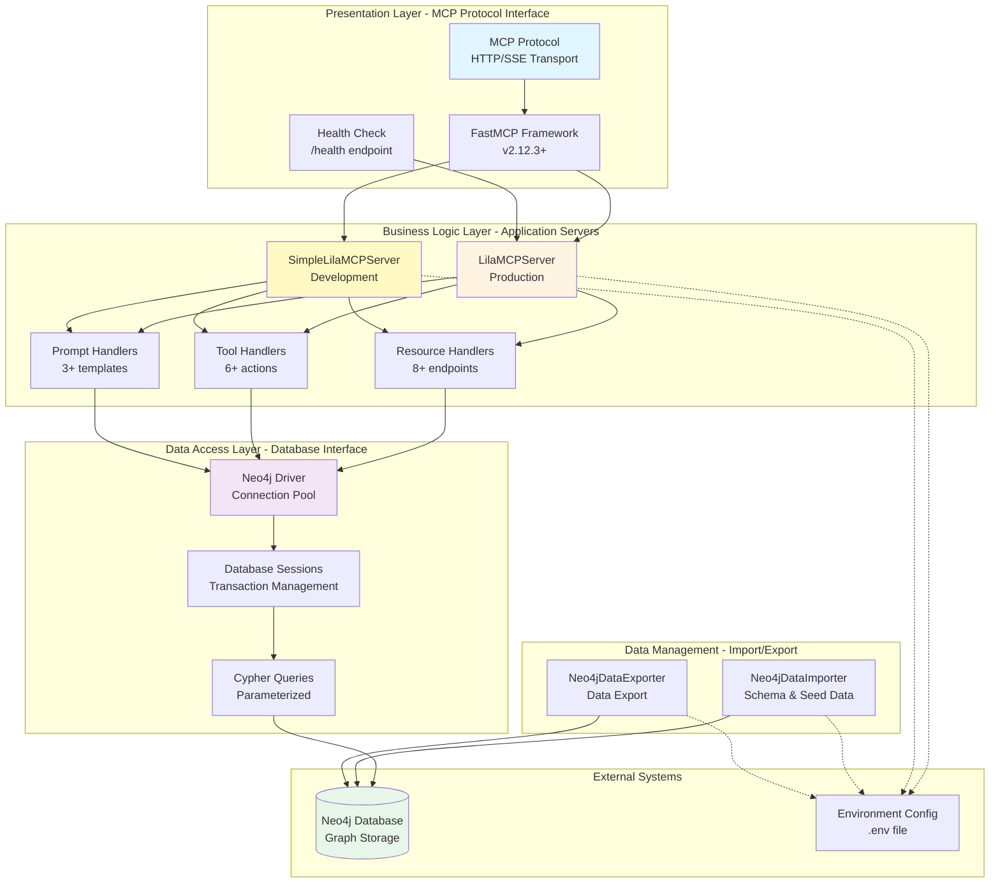
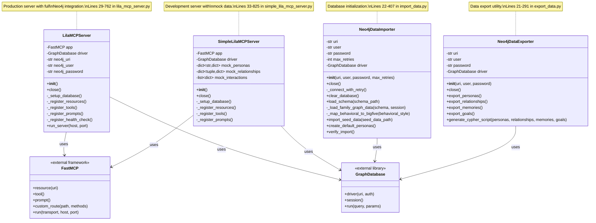

# Architecture Diagrams

## System Architecture



### System Architecture Explanation

The Lila MCP system implements a **layered architecture** with clear separation of concerns across five distinct layers:

#### Presentation Layer (MCP API)
Located at `/home/donbr/lila-graph/lila-mcp/lila_mcp_server.py:22-25` and `/home/donbr/lila-graph/lila-mcp/simple_lila_mcp_server.py:22-25`

The presentation layer handles all MCP protocol communication through the FastMCP framework. It exposes:
- **MCP Resources**: Read-only data endpoints using custom `neo4j://` URI scheme
- **MCP Tools**: Asynchronous actions that modify relationship state
- **MCP Prompts**: Templated prompts for AI-driven psychological analysis
- **Health Check**: HTTP endpoint at `/health` for container orchestration (lines 746-754 in lila_mcp_server.py)

The FastMCP framework (v2.12.3+) provides automatic endpoint registration via decorators, request routing, and protocol compliance.

#### Business Logic Layer (Application Servers)
Two server implementations share the same MCP interface:

**LilaMCPServer** (`/home/donbr/lila-graph/lila-mcp/lila_mcp_server.py:29-762`)
- Production-ready server with full Neo4j integration
- Real-time psychological relationship data
- Connection pooling and session management
- 8+ resources, 6+ tools, 3+ prompts

**SimpleLilaMCPServer** (`/home/donbr/lila-graph/lila-mcp/simple_lila_mcp_server.py:33-825`)
- Development/testing server with in-memory mock data (lines 42-92)
- No database dependency
- Same interface as LilaMCPServer for drop-in replacement
- Ideal for CI/CD pipelines and local development

Both servers orchestrate:
- Resource registration and handling
- Tool execution with psychological analysis
- Prompt template management
- Database connection lifecycle

#### Data Access Layer (Neo4j Interface)
The data access layer uses the Neo4j Python driver for graph database connectivity:

- **Connection Pooling**: Managed by Neo4j driver with automatic retry logic
- **Session Management**: Context managers ensure proper transaction handling
- **Parameterized Queries**: All Cypher queries use parameters to prevent injection (e.g., lines 124-131 in lila_mcp_server.py)
- **Bounds Checking**: CASE expressions enforce valid ranges for psychological metrics (lines 315-337)

#### Data Management (Utilities)
Two standalone CLI utilities manage database lifecycle:

**Neo4jDataImporter** (`/home/donbr/lila-graph/lila-mcp/import_data.py:22-407`)
- Database initialization with retry logic (lines 34-49)
- Schema creation: constraints and indexes (lines 77-114)
- Seed data import from Cypher scripts or JSON
- DISC to Big Five personality trait mapping (lines 239-280)

**Neo4jDataExporter** (`/home/donbr/lila-graph/lila-mcp/export_data.py:21-291`)
- Exports personas, relationships, memories, and goals
- Generates Cypher scripts for portability
- Handles data serialization with proper escaping

#### External Systems
- **Neo4j Database**: Graph storage for PersonaAgent nodes, RELATIONSHIP edges, Memory nodes, and Goal nodes
- **Environment Config**: Configuration via `.env` file with variables for `NEO4J_URI`, `NEO4J_USER`, `NEO4J_PASSWORD`

This layered architecture provides:
- Clear separation between protocol, business logic, and data access
- Easy testing via mock data layer
- Flexible deployment with environment-based configuration
- Scalability through stateless application design

## Component Relationships

```mermaid
graph TB
    subgraph "MCP Server Implementations"
        LMS[LilaMCPServer<br/>779 lines<br/>Full Neo4j]
        SLMS[SimpleLilaMCPServer<br/>843 lines<br/>Mock Data]
    end

    subgraph "FastMCP Framework Core"
        FastMCP[FastMCP App Instance]
        ResourceDec[@app.resource decorator]
        ToolDec[@app.tool decorator]
        PromptDec[@app.prompt decorator]
        RouteDec[@app.custom_route decorator]
    end

    subgraph "MCP Protocol Components"
        subgraph "Resources - Data Access"
            R1[neo4j://personas/all]
            R2[neo4j://personas/{id}]
            R3[neo4j://relationships/all]
            R4[neo4j://relationships/{id1}/{id2}]
            R5[neo4j://interactions/recent/{count}]
            R6[neo4j://emotional_climate/current]
            R7[neo4j://attachment_styles/analysis]
            R8[neo4j://goals/active]
        end

        subgraph "Tools - State Modification"
            T1[update_relationship_metrics]
            T2[record_interaction]
            T3[analyze_persona_compatibility]
            T4[autonomous_strategy_selection]
            T5[assess_goal_progress]
            T6[generate_contextual_response]
        end

        subgraph "Prompts - AI Guidance"
            P1[assess_attachment_style]
            P2[analyze_emotional_climate]
            P3[generate_secure_response]
        end
    end

    subgraph "Data Layer"
        Database[(Neo4j Database<br/>PersonaAgent<br/>RELATIONSHIP<br/>Memory<br/>Goal)]
        MockData[In-Memory Mock Data<br/>dict personas<br/>dict relationships<br/>list interactions]
    end

    subgraph "Utilities & Testing"
        Importer[Neo4jDataImporter<br/>466 lines]
        Exporter[Neo4jDataExporter<br/>295 lines]
        Validator[test_mcp_validation.py<br/>172 lines]
    end

    LMS --> FastMCP
    SLMS --> FastMCP

    FastMCP --> ResourceDec
    FastMCP --> ToolDec
    FastMCP --> PromptDec
    FastMCP --> RouteDec

    ResourceDec --> R1 & R2 & R3 & R4 & R5
    ResourceDec --> R6 & R7 & R8
    ToolDec --> T1 & T2 & T3 & T4 & T5 & T6
    PromptDec --> P1 & P2 & P3

    LMS --> Database
    SLMS --> MockData

    R1 & R2 & R3 & R4 & R5 --> Database
    T1 & T2 & T3 --> Database

    Importer --> Database
    Exporter --> Database

    Validator --> SLMS
    Validator -.->|optional| LMS

    style LMS fill:#fff4e1
    style SLMS fill:#e1f5ff
    style Database fill:#e8f5e9
    style MockData fill:#fff9c4
```

### Component Relationships Explanation

The Lila MCP system demonstrates a **dual-implementation architecture** where two servers share the same MCP interface but differ in data source:

#### Server Implementations

**LilaMCPServer** (Production - `/home/donbr/lila-graph/lila-mcp/lila_mcp_server.py`)
- Full-featured server with live Neo4j database connection
- Requires Neo4j database running (configurable via environment variables)
- Real-time psychological intelligence data queries and updates
- Health check endpoint for container orchestration (lines 746-754)
- Used in production deployments with Docker Compose

**SimpleLilaMCPServer** (Development - `/home/donbr/lila-graph/lila-mcp/simple_lila_mcp_server.py`)
- Simplified server with in-memory mock data structures
- Mock personas: Lila (secure attachment) and Don (anxious attachment) at lines 42-71
- Mock relationships with trust/intimacy metrics at lines 74-80
- Mock interactions list at lines 82-92
- No database dependency makes it ideal for:
  - Local development without Docker
  - CI/CD testing pipelines
  - FastMCP Inspector debugging
  - Unit testing

#### MCP Protocol Components

Both servers expose the **same MCP interface** through FastMCP decorators:

**Resources** (8 endpoints - read-only data access):
1. `neo4j://personas/all` - All personas with psychological profiles (lines 72-114 in lila_mcp_server.py)
2. `neo4j://personas/{persona_id}` - Specific persona by ID (lines 116-161)
3. `neo4j://relationships/all` - All relationships with metrics (lines 163-206)
4. `neo4j://relationships/{persona1_id}/{persona2_id}` - Specific relationship (lines 208-253)
5. `neo4j://interactions/recent/{count}` - Recent interactions (lines 255-295)
6. `neo4j://emotional_climate/current` - Current emotional climate (SimpleLilaMCPServer only, lines 271-289)
7. `neo4j://attachment_styles/analysis` - Attachment compatibility analysis (SimpleLilaMCPServer only, lines 291-308)
8. `neo4j://goals/active` - Active relationship goals (SimpleLilaMCPServer only, lines 310-331)

**Tools** (6 actions - state-modifying operations):
1. `update_relationship_metrics` - Modify trust/intimacy/strength with bounds checking (lines 300-360 in lila_mcp_server.py)
2. `record_interaction` - Log persona interactions with emotional valence (lines 362-399)
3. `analyze_persona_compatibility` - Attachment style compatibility analysis (lines 401-461)
4. `autonomous_strategy_selection` - AI-driven strategy selection based on attachment theory (lines 463-513)
5. `assess_goal_progress` - Track progress toward relationship goals (lines 515-552)
6. `generate_contextual_response` - Generate psychologically authentic responses (lines 554-608)

**Prompts** (3 templates - AI guidance for psychological analysis):
1. `assess_attachment_style` - Attachment theory-based assessment framework (lines 613-643 in lila_mcp_server.py)
2. `analyze_emotional_climate` - Evaluate conversation emotional dynamics and safety (lines 645-694)
3. `generate_secure_response` - Create attachment-security-building responses (lines 696-739)

#### Data Sources

**Neo4j Database** (used by LilaMCPServer):
- **PersonaAgent** nodes: Demographics, Big Five traits, attachment style
- **RELATIONSHIP** edges: Trust, intimacy, strength metrics (0-10 scale)
- **Memory** nodes: Episodic, semantic, procedural memories
- **Goal** nodes: Emotional, trust, intimacy, vulnerability goals

**Mock Data** (used by SimpleLilaMCPServer):
- In-memory Python dictionaries and lists
- Same data structure as Neo4j for interface compatibility
- Predefined test personas (Lila and Don)
- Simulated relationship metrics

#### Utilities & Testing

**Neo4jDataImporter** (`/home/donbr/lila-graph/lila-mcp/import_data.py`)
- CLI tool for database initialization
- Loads schema from JSON (constraints, indexes)
- Imports seed data from Cypher scripts
- Retry logic for container startup (30 attempts with 2-second delay)
- DISC behavioral style to Big Five trait mapping

**Neo4jDataExporter** (`/home/donbr/lila-graph/lila-mcp/export_data.py`)
- CLI tool for data extraction
- Exports to Cypher script format
- Supports personas, relationships, memories, goals
- Handles data escaping and serialization

**test_mcp_validation.py** (`/home/donbr/lila-graph/lila-mcp/test_mcp_validation.py`)
- Comprehensive validation of MCP endpoints
- Tests direct connection (in-memory with FastMCP Client)
- Tests Inspector connection (HTTP to FastMCP Inspector server)
- Validates resources, tools, and prompts

This component architecture provides:
- **Development flexibility**: Test without database
- **Production robustness**: Full Neo4j integration
- **Interface consistency**: Same MCP protocol regardless of implementation
- **Easy testing**: Mock data for unit tests, real data for integration tests

## Class Hierarchies



### Class Hierarchies Explanation

The Lila MCP codebase uses a **composition-based design** with no inheritance hierarchies. All classes are flat and independent, following the principle of **composition over inheritance**.

#### Server Classes

**LilaMCPServer** (`/home/donbr/lila-graph/lila-mcp/lila_mcp_server.py:29-762`)

*Purpose*: Production MCP server with full Neo4j integration

*Key Methods*:
- `__init__()` (lines 32-44): Initialize FastMCP app, setup database, register endpoints
- `_setup_database()` (lines 46-62): Connect to Neo4j with environment variables
- `_register_resources()` (lines 69-295): Register 5+ MCP resource endpoints
- `_register_tools()` (lines 297-608): Register 6+ MCP tool endpoints
- `_register_prompts()` (lines 610-739): Register 3+ MCP prompt templates
- `_register_health_check()` (lines 741-754): Register HTTP health endpoint
- `close()` (lines 64-67): Clean up Neo4j connection
- `run_server()` (lines 756-762): Start MCP server with SSE transport

*Dependencies*:
- FastMCP framework for MCP protocol
- Neo4j GraphDatabase for data persistence
- python-dotenv for environment configuration

*Design Pattern*: **Decorator pattern** for endpoint registration via `@self.app.resource`, `@self.app.tool`, `@self.app.prompt`

**SimpleLilaMCPServer** (`/home/donbr/lila-graph/lila-mcp/simple_lila_mcp_server.py:33-825`)

*Purpose*: Development/testing MCP server with in-memory mock data

*Key Methods*:
- `__init__()` (lines 36-100): Initialize FastMCP app, create mock data, register endpoints
- Mock data structures (lines 42-92):
  - `mock_personas`: Dict of personas (Lila, Don) with psychological profiles
  - `mock_relationships`: Dict of relationships with trust/intimacy metrics
  - `mock_interactions`: List of interaction records
- Same interface as LilaMCPServer: `_register_resources()`, `_register_tools()`, `_register_prompts()`

*Differences from LilaMCPServer*:
- Uses in-memory data structures instead of Neo4j
- Adds 3 extra resources (emotional_climate, attachment_styles, goals)
- No health check endpoint
- Optional Neo4j connection (falls back to mocks)

*Use Cases*:
- Local development without Docker
- CI/CD testing pipelines
- FastMCP Inspector debugging
- Unit testing

#### Data Management Classes

**Neo4jDataImporter** (`/home/donbr/lila-graph/lila-mcp/import_data.py:22-407`)

*Purpose*: Database initialization and seed data import

*Key Methods*:
- `__init__()` (lines 25-32): Initialize connection parameters and call retry logic
- `_connect_with_retry()` (lines 34-49): Connect to Neo4j with retry logic (30 attempts, 2-second delay)
- `load_schema()` (lines 63-120): Create constraints and indexes from JSON schema
- `_load_family_graph_data()` (lines 122-237): Load personas and relationships from JSON
- `_map_behavioral_to_bigfive()` (lines 239-280): Convert DISC behavioral style to Big Five traits
- `import_seed_data()` (lines 282-310): Import data from Cypher script
- `create_default_personas()` (lines 312-377): Create default Lila and Alex personas
- `verify_import()` (lines 379-406): Verify successful import with counts

*Features*:
- Retry logic for container startup
- DISC to Big Five personality mapping
- Constraint and index creation
- Seed data import from multiple formats

**Neo4jDataExporter** (`/home/donbr/lila-graph/lila-mcp/export_data.py:21-291`)

*Purpose*: Extract data from Neo4j for backup or migration

*Key Methods*:
- `__init__()` (lines 24-26): Initialize Neo4j driver
- `export_personas()` (lines 32-62): Export PersonaAgent nodes
- `export_relationships()` (lines 64-89): Export RELATIONSHIP edges
- `export_memories()` (lines 91-113): Export Memory nodes
- `export_goals()` (lines 115-139): Export Goal nodes
- `generate_cypher_script()` (lines 141-242): Generate Cypher import script

*Features*:
- Exports all entity types
- Generates portable Cypher scripts
- Handles data escaping and serialization

#### External Dependencies

**FastMCP** (external framework - `fastmcp>=2.12.3`)
- Provides MCP protocol implementation
- Decorator-based endpoint registration
- Automatic request routing and validation
- SSE transport for streaming

**GraphDatabase** (external library - `neo4j>=5.15.0`)
- Neo4j Python driver
- Connection pooling and session management
- Cypher query execution
- Transaction support

#### Design Principles

1. **Composition over Inheritance**: No class hierarchies, all classes are independent
2. **Dependency Injection**: Neo4j driver and FastMCP app injected via constructor
3. **Single Responsibility**: Each class has one clear purpose
4. **Decorator Pattern**: FastMCP decorators for endpoint registration
5. **Factory Pattern**: Mock data creation in SimpleLilaMCPServer
6. **Retry Pattern**: Connection retry logic in Neo4jDataImporter
7. **Template Method**: Shared registration methods across servers

This flat class structure provides:
- **Easy testing**: No complex inheritance to mock
- **Clear dependencies**: Explicit dependency injection
- **Flexible architecture**: Easy to add new implementations
- **Maintainability**: Simple, flat structure is easy to understand

## Module Dependencies

```mermaid
graph TB
    subgraph "Application Entry Points"
        LMS_MAIN[lila_mcp_server.py<br/>779 lines<br/>Production Server]
        SLMS_MAIN[simple_lila_mcp_server.py<br/>843 lines<br/>Development Server]
        IMPORT_MAIN[import_data.py<br/>466 lines<br/>Database Import]
        EXPORT_MAIN[export_data.py<br/>295 lines<br/>Database Export]
        TEST_MAIN[test_mcp_validation.py<br/>172 lines<br/>Integration Tests]
    end

    subgraph "External Dependencies - FastMCP"
        FASTMCP[fastmcp>=2.12.3]
        FASTMCP_CLIENT[fastmcp.Client]
        FASTMCP_RES[fastmcp.resources]
        FASTMCP_TOOL[fastmcp.tools]
        FASTMCP_PROMPT[fastmcp.prompts]
    end

    subgraph "External Dependencies - Neo4j"
        NEO4J[neo4j>=5.15.0]
        NEO4J_DRIVER[neo4j.GraphDatabase]
    end

    subgraph "External Dependencies - Core"
        DOTENV[python-dotenv>=1.0.0]
        PYDANTIC[pydantic>=2.6.0]
        HTTPX[httpx>=0.27.0]
        AIOHTTP[aiohttp>=3.9.0]
    end

    subgraph "Standard Library"
        ASYNCIO[asyncio]
        LOGGING[logging]
        OS[os]
        SYS[sys]
        DATETIME[datetime]
        TYPING[typing]
        PATHLIB[pathlib]
        ARGPARSE[argparse]
        JSON[json]
        TIME[time]
    end

    LMS_MAIN --> FASTMCP
    LMS_MAIN --> FASTMCP_RES
    LMS_MAIN --> FASTMCP_TOOL
    LMS_MAIN --> FASTMCP_PROMPT
    LMS_MAIN --> NEO4J_DRIVER
    LMS_MAIN --> DOTENV
    LMS_MAIN --> ASYNCIO
    LMS_MAIN --> LOGGING
    LMS_MAIN --> OS
    LMS_MAIN --> DATETIME
    LMS_MAIN --> TYPING
    LMS_MAIN --> PATHLIB

    SLMS_MAIN --> FASTMCP
    SLMS_MAIN --> FASTMCP_RES
    SLMS_MAIN --> FASTMCP_TOOL
    SLMS_MAIN --> FASTMCP_PROMPT
    SLMS_MAIN --> NEO4J_DRIVER
    SLMS_MAIN --> DOTENV
    SLMS_MAIN --> ASYNCIO
    SLMS_MAIN --> LOGGING
    SLMS_MAIN --> OS
    SLMS_MAIN --> DATETIME
    SLMS_MAIN --> TYPING
    SLMS_MAIN --> PATHLIB

    IMPORT_MAIN --> NEO4J_DRIVER
    IMPORT_MAIN --> ARGPARSE
    IMPORT_MAIN --> JSON
    IMPORT_MAIN --> OS
    IMPORT_MAIN --> SYS
    IMPORT_MAIN --> TIME
    IMPORT_MAIN --> PATHLIB
    IMPORT_MAIN --> TYPING

    EXPORT_MAIN --> NEO4J_DRIVER
    EXPORT_MAIN --> ARGPARSE
    EXPORT_MAIN --> JSON
    EXPORT_MAIN --> OS
    EXPORT_MAIN --> SYS
    EXPORT_MAIN --> PATHLIB
    EXPORT_MAIN --> TYPING

    TEST_MAIN --> SLMS_MAIN
    TEST_MAIN --> FASTMCP_CLIENT
    TEST_MAIN --> ASYNCIO
    TEST_MAIN --> LOGGING

    style LMS_MAIN fill:#fff4e1
    style SLMS_MAIN fill:#e1f5ff
    style IMPORT_MAIN fill:#e8f5e9
    style EXPORT_MAIN fill:#e8f5e9
    style TEST_MAIN fill:#f3e5f5
```



### Module Dependencies Explanation

The Lila MCP codebase has a **clean dependency graph** with no circular dependencies. Each module has a clear set of external and standard library dependencies.

#### Entry Point Modules

**lila_mcp_server.py** (Production MCP Server - 779 lines)

*Location*: `/home/donbr/lila-graph/lila-mcp/lila_mcp_server.py`

*Imports* (lines 7-25):
```python
import asyncio                           # Async/await support
import logging                           # Structured logging
import os                               # Environment variables
from datetime import datetime           # Timestamp management
from typing import Dict, List, Optional, Any, Union  # Type hints
from pathlib import Path                # File path handling

from dotenv import load_dotenv          # Environment config
from neo4j import GraphDatabase         # Neo4j driver
from fastmcp import FastMCP             # MCP framework
from fastmcp.resources import Resource  # Resource decorator
from fastmcp.tools import Tool          # Tool decorator
from fastmcp.prompts import Prompt      # Prompt decorator
```

*Module Exports*:
- `LilaMCPServer` class: Main server implementation
- `mcp`: Module-level FastMCP app instance (line 765)
- `main()`: Entry point function (lines 768-777)

*Usage*:
- Standalone: `python lila_mcp_server.py`
- FastMCP dev: `fastmcp dev lila_mcp_server.py`
- Docker: `uvx fastmcp run /app/fastmcp.json`

**simple_lila_mcp_server.py** (Development MCP Server - 843 lines)

*Location*: `/home/donbr/lila-graph/lila-mcp/simple_lila_mcp_server.py`

*Imports* (lines 7-25): Same as lila_mcp_server.py plus logging configuration (lines 27-29)

*Module Exports*:
- `SimpleLilaMCPServer` class: Mock data server
- `mcp`: Module-level FastMCP app instance (line 825)

*Differences from lila_mcp_server.py*:
- Adds mock data initialization in `__init__`
- No health check endpoint registration
- Optional Neo4j connection

*Usage*:
- Standalone: `python simple_lila_mcp_server.py`
- FastMCP dev: `fastmcp dev simple_lila_mcp_server.py`
- Testing: `python test_mcp_validation.py`

**import_data.py** (Database Import Utility - 466 lines)

*Location*: `/home/donbr/lila-graph/lila-mcp/import_data.py`

*Imports* (lines 12-19):
```python
import os                               # Environment variables
import sys                              # System exit codes
import argparse                         # CLI argument parsing
import json                             # JSON schema parsing
import time                             # Retry delay
from pathlib import Path                # File path handling
from neo4j import GraphDatabase         # Neo4j driver
from typing import Dict, Any            # Type hints
```

*Module Exports*:
- `Neo4jDataImporter` class: Database initialization
- `main()`: CLI entry point (lines 409-462)

*CLI Usage*:
```bash
python import_data.py --seed-data seed_data.cypher \
                     --schema graphs/lila-graph-schema-v8.json \
                     --uri bolt://localhost:7687 \
                     --user neo4j \
                     --password passw0rd \
                     --create-defaults
```

**export_data.py** (Database Export Utility - 295 lines)

*Location*: `/home/donbr/lila-graph/lila-mcp/export_data.py`

*Imports* (lines 11-18):
```python
import os                               # Environment variables
import sys                              # System exit codes
import argparse                         # CLI argument parsing
from pathlib import Path                # File path handling
from neo4j import GraphDatabase         # Neo4j driver
from typing import List, Dict, Any      # Type hints
import json                             # JSON serialization
```

*Module Exports*:
- `Neo4jDataExporter` class: Data extraction
- `main()`: CLI entry point (lines 245-291)

*CLI Usage*:
```bash
python export_data.py --output seed_data.cypher \
                     --uri bolt://localhost:7687 \
                     --user neo4j \
                     --password passw0rd
```

**test_mcp_validation.py** (Integration Tests - 172 lines)

*Location*: `/home/donbr/lila-graph/lila-mcp/test_mcp_validation.py`

*Imports* (lines 8-10):
```python
import asyncio                           # Async test runner
import logging                           # Test output
from fastmcp import Client               # MCP client for testing
from simple_lila_mcp_server import SimpleLilaMCPServer  # Server under test
```

*Module Exports*:
- `test_direct_connection()`: Test in-memory connection (lines 15-96)
- `test_inspector_connection()`: Test HTTP connection (lines 98-132)
- `main()`: Test orchestration (lines 134-168)

*Usage*:
```bash
python test_mcp_validation.py
```

#### External Dependencies

**FastMCP Framework** (v2.12.3+)
- Core MCP protocol implementation
- Decorator-based endpoint registration
- HTTP/SSE transport layer
- Request routing and validation
- Client library for testing

**Neo4j Driver** (v5.15.0+)
- Graph database connectivity
- Connection pooling
- Session management
- Cypher query execution
- Transaction support

**Python Dotenv** (v1.0.0+)
- Environment variable loading
- `.env` file parsing
- Configuration management

**Pydantic** (v2.6.0+)
- Data validation (declared but not actively used)
- Future-ready for model serialization

**HTTPX / AIOHTTP** (declared but not actively used)
- HTTP client libraries for future LLM integrations

#### Standard Library Usage

**Async/Await** (`asyncio`)
- Used in: lila_mcp_server.py, simple_lila_mcp_server.py, test_mcp_validation.py
- Purpose: Non-blocking I/O for MCP tools and server runtime

**Logging** (`logging`)
- Used in: All modules
- Purpose: Structured logging with levels (INFO, ERROR, DEBUG)

**Type Hints** (`typing`)
- Used in: All modules
- Purpose: Better IDE support, documentation, and maintainability

**File Paths** (`pathlib`)
- Used in: lila_mcp_server.py, simple_lila_mcp_server.py, import_data.py, export_data.py
- Purpose: Cross-platform file path handling

**Datetime** (`datetime`)
- Used in: lila_mcp_server.py, simple_lila_mcp_server.py
- Purpose: Timestamp management for interactions and updates

**JSON** (`json`)
- Used in: import_data.py, export_data.py
- Purpose: Schema parsing and data serialization

**Argparse** (`argparse`)
- Used in: import_data.py, export_data.py
- Purpose: CLI argument parsing

#### Dependency Analysis

**No Circular Dependencies**: Clean dependency graph with clear hierarchy:
1. Entry point modules → External libraries → Standard library
2. Test module → Server module → External libraries
3. Utility modules → Neo4j driver only

**Minimal Coupling**: Modules are independent and self-contained:
- Servers don't import each other
- Utilities don't import servers
- Test module imports server for validation only

**Configuration-Driven**: External behavior controlled via:
- Environment variables (`.env` file)
- FastMCP configuration (`fastmcp.json`)
- Docker Compose (`docker-compose.yml`)
- Python package config (`pyproject.toml`)

**Optional Dependencies**: Some declared dependencies not actively used:
- `openai>=1.30.0` (for future LLM integration)
- `anthropic>=0.25.0` (for future Claude integration)
- `pydantic>=2.6.0` (declared but JSON string formatting used instead)
- `httpx>=0.27.0` (for future HTTP client needs)
- `aiohttp>=3.9.0` (for future async HTTP needs)
- `logfire>=0.28.0` (for future observability)

**Version Constraints**:
- Python >=3.12 (modern async/await features)
- FastMCP >=2.12.3 (latest MCP protocol)
- Neo4j >=5.15.0 (graph database with APOC support)
- All dependencies use semantic versioning with minimum versions

This clean dependency structure provides:
- **Easy maintenance**: No complex dependency graphs
- **Testing flexibility**: Mock dependencies easily
- **Deployment simplicity**: Clear external dependency list
- **Future extensibility**: Optional dependencies ready for use

---

## Summary

This architecture analysis provides a comprehensive view of the Lila MCP system through four key perspectives:

### 1. System Architecture (Layered View)
The system implements a **5-layer architecture**:
- **Presentation Layer**: MCP protocol via FastMCP framework
- **Business Logic Layer**: Dual servers (production + development)
- **Data Access Layer**: Neo4j driver with parameterized queries
- **Data Management**: Import/export utilities
- **External Systems**: Neo4j database and environment config

**Key Insight**: Clean separation between protocol (FastMCP), business logic (servers), and data access (Neo4j) enables easy testing and deployment.

### 2. Component Relationships
The system demonstrates **dual-implementation architecture**:
- **LilaMCPServer**: Production with Neo4j (779 lines)
- **SimpleLilaMCPServer**: Development with mocks (843 lines)
- **Same MCP Interface**: 8+ resources, 6+ tools, 3+ prompts
- **Shared FastMCP Framework**: Decorator-based endpoint registration

**Key Insight**: Mock data implementation enables development and testing without database dependencies while maintaining production interface compatibility.

### 3. Class Hierarchies
The codebase uses **composition over inheritance**:
- **No class hierarchies**: All classes are flat and independent
- **4 main classes**: 2 servers + 2 utilities
- **Dependency injection**: FastMCP and Neo4j driver injected
- **Decorator pattern**: FastMCP decorators for endpoints

**Key Insight**: Simple, flat class structure with clear single responsibilities makes the codebase easy to understand and maintain.

### 4. Module Dependencies
The module graph shows **clean dependencies**:
- **5 entry point modules**: Servers, utilities, tests
- **No circular dependencies**: Clear hierarchy
- **Minimal coupling**: Independent modules
- **Configuration-driven**: External behavior via JSON/YAML/ENV

**Key Insight**: Independent modules with explicit dependencies enable easy testing, deployment, and future extension.

### Architectural Strengths
1. **Clean layered architecture** with clear separation of concerns
2. **Dual implementation** for development/production flexibility
3. **Decorator-based routing** for clean endpoint registration
4. **Parameterized queries** for security
5. **Mock data testing** without database dependencies
6. **Container-first design** with Docker Compose
7. **Health check endpoints** for orchestration
8. **Configuration externalization** for deployment flexibility

### Potential Improvements
1. **Use Pydantic models** for JSON serialization instead of string formatting
2. **Extract common server interface** to reduce duplication
3. **Implement Redis caching** for frequently accessed data
4. **Add connection pooling config** for Neo4j driver
5. **Separate mock data** into external JSON fixtures
6. **Add observability** with Logfire integration
7. **Implement rate limiting** to protect expensive queries
8. **Add database migrations** for schema versioning
9. **Enhance error handling** with custom exception classes
10. **Add API versioning** for backward compatibility

The Lila MCP system demonstrates a well-structured, production-ready architecture for psychological relationship intelligence with clear separation of concerns, flexible deployment options, and excellent testing support.
