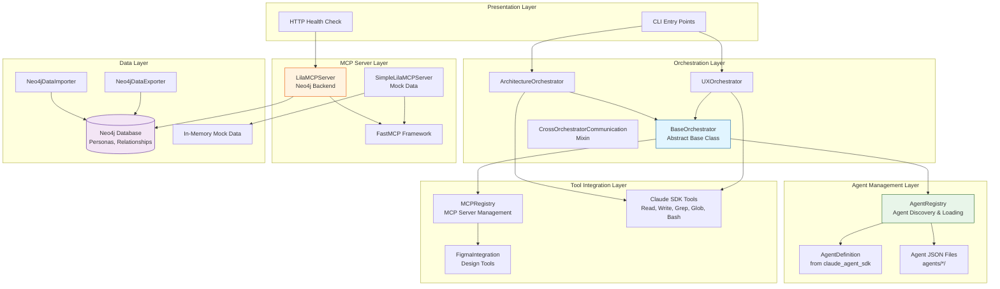
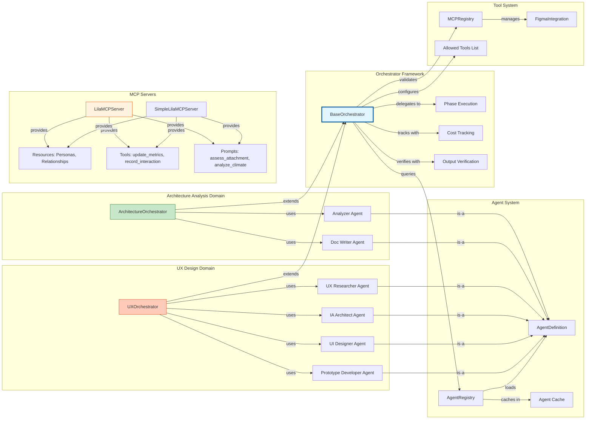
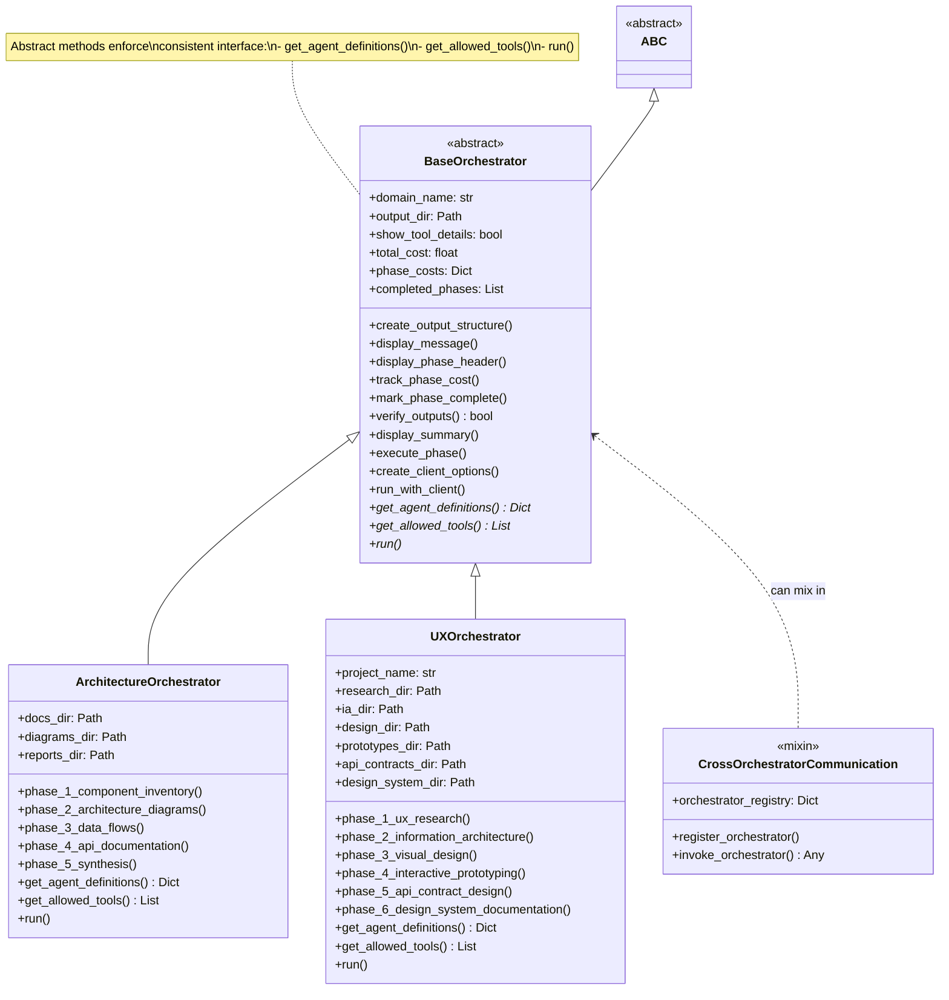
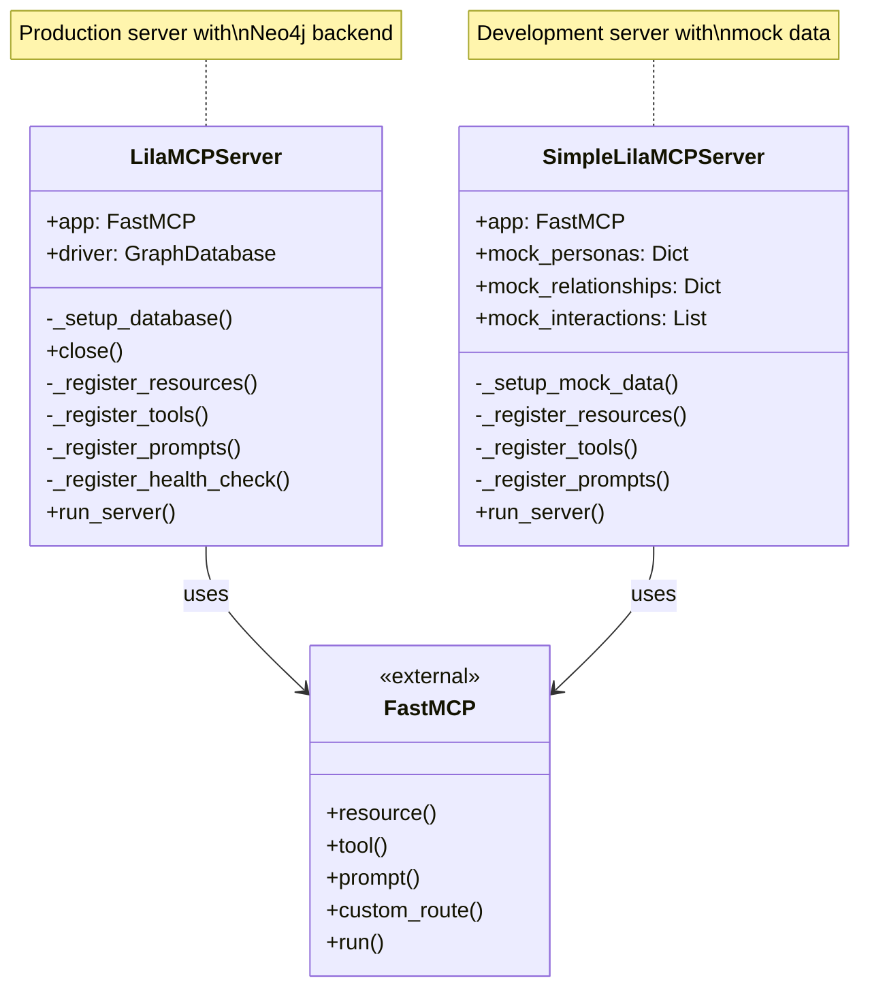
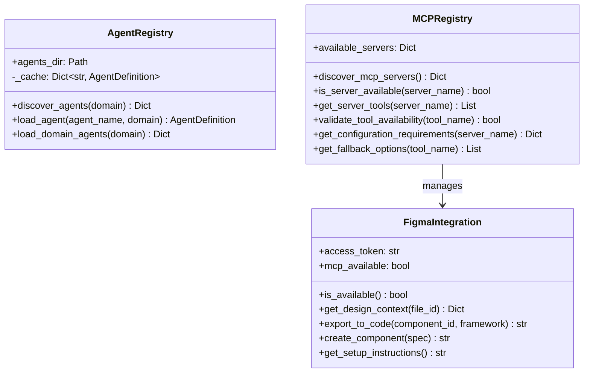
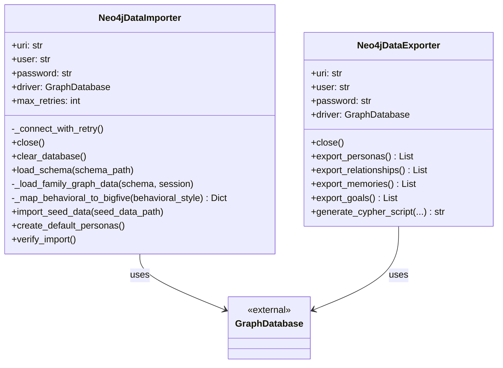
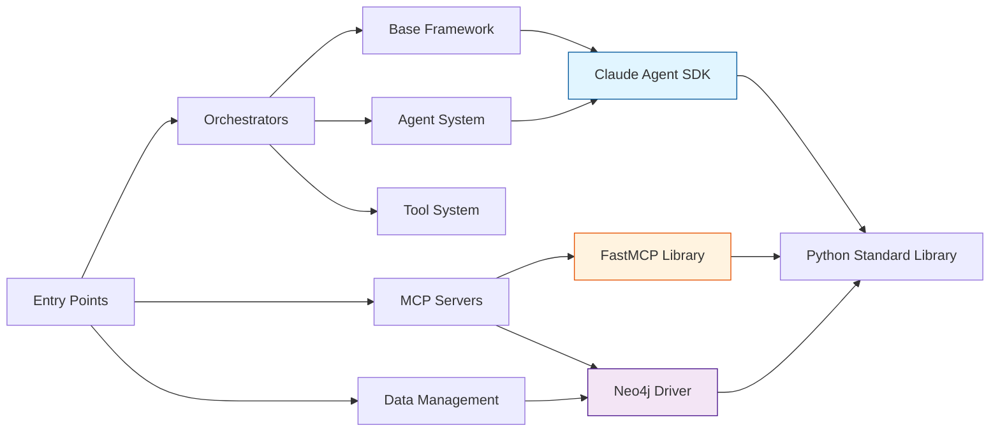
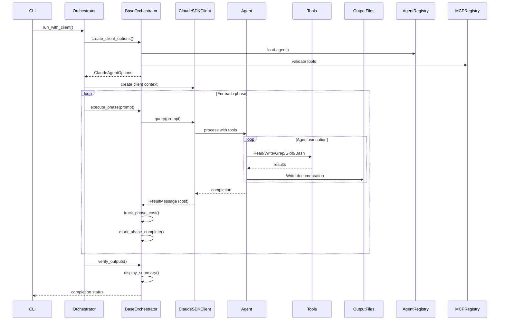
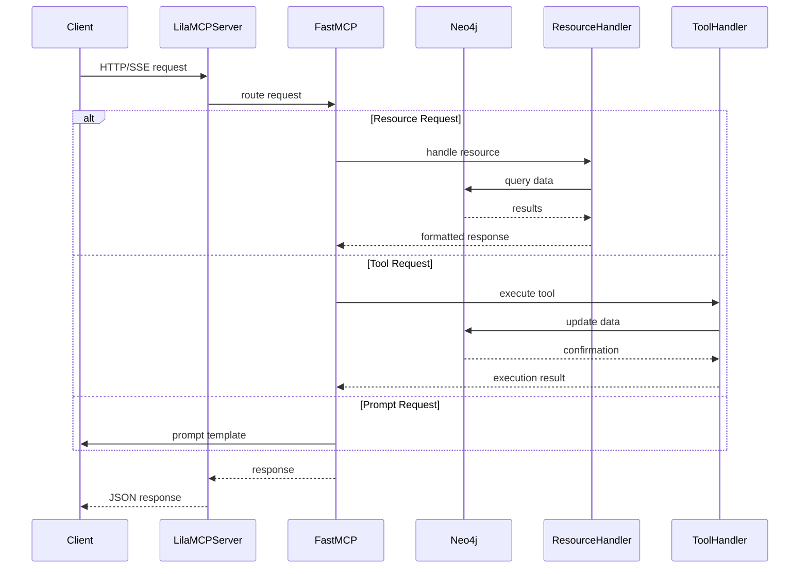

# Architecture Diagrams

## Overview

This document provides comprehensive architectural visualizations of the Lila MCP system, showing system layers, component relationships, class hierarchies, and module dependencies. These diagrams help understand the overall system structure and how different components interact.

---

## System Architecture

### Explanation

The system follows a **layered architecture** pattern with clear separation of concerns:

1. **Presentation Layer**: Entry points for CLI commands and HTTP health checks
2. **Orchestration Layer**: Domain-specific orchestrators that coordinate multi-phase workflows
3. **Agent Management Layer**: Registry system for discovering and loading agent definitions
4. **Tool Integration Layer**: Integration with MCP servers and Claude SDK tools
5. **MCP Server Layer**: FastMCP-based servers providing psychological intelligence services
6. **Data Layer**: Neo4j database for persistent storage and in-memory mock data for testing

This architecture enables:
- **Modularity**: Each layer has specific responsibilities
- **Extensibility**: New orchestrators can be added by extending BaseOrchestrator
- **Testability**: Mock data layer allows testing without database dependencies
- **Scalability**: Stateless orchestrators can run in parallel

---

## Component Relationships

### Explanation

This diagram shows the **relationships between major components**:

- **Domain Orchestrators** (ArchitectureOrchestrator, UXOrchestrator) extend BaseOrchestrator and use domain-specific agents
- **BaseOrchestrator** provides common functionality for phase execution, cost tracking, and output verification
- **AgentRegistry** manages agent discovery, loading, and caching
- **MCPRegistry** manages MCP server availability and tool integration
- **MCP Servers** expose resources (data), tools (actions), and prompts (AI templates)

Key patterns:
- **Inheritance**: Domain orchestrators extend BaseOrchestrator
- **Composition**: Orchestrators use agents, which are instances of AgentDefinition
- **Registry Pattern**: AgentRegistry and MCPRegistry centralize component discovery
- **Facade Pattern**: SimpleLilaMCPServer provides same interface as LilaMCPServer with mock data

---

## Class Hierarchies

### Orchestrator Hierarchy

### MCP Server Hierarchy

### Registry Classes

### Data Management Classes

### Explanation

The class hierarchies demonstrate several design patterns:

1. **Template Method Pattern**: BaseOrchestrator defines workflow template, subclasses implement specific steps
2. **Abstract Base Class Pattern**: BaseOrchestrator enforces interface through abstract methods
3. **Mixin Pattern**: CrossOrchestratorCommunication adds functionality without inheritance complexity
4. **Facade Pattern**: LilaMCPServer and SimpleLilaMCPServer provide unified interface to FastMCP
5. **Registry Pattern**: AgentRegistry and MCPRegistry centralize component management
6. **Strategy Pattern**: Different orchestrators implement different domain strategies

Key inheritance relationships:
- `BaseOrchestrator` extends `ABC` (Abstract Base Class)
- `ArchitectureOrchestrator` extends `BaseOrchestrator`
- `UXOrchestrator` extends `BaseOrchestrator`

Key composition relationships:
- Orchestrators use `AgentRegistry` to load agents
- Orchestrators use `MCPRegistry` to validate tools
- MCPRegistry manages `FigmaIntegration`

---

## Module Dependencies

```mermaid
graph TD
    subgraph "External Dependencies"
        ClaudeSDK[claude_agent_sdk<br/>AgentDefinition, ClaudeSDKClient]
        FastMCP[fastmcp<br/>FastMCP, Resource, Tool, Prompt]
        Neo4jDriver[neo4j<br/>GraphDatabase]
        StdLib[Standard Library<br/>asyncio, pathlib, typing, abc]
    end

    subgraph "orchestrators/"
        BaseOrch[base_orchestrator.py]
        ArchOrch[architecture_orchestrator.py]
        UXOrch[ux_orchestrator.py]
        OrchInit[__init__.py]
    end

    subgraph "agents/"
        AgentReg[registry.py]
        AgentInit[__init__.py]
        AgentJSON[JSON Files<br/>ux/, architecture/]
    end

    subgraph "tools/"
        MCPReg[mcp_registry.py]
        FigmaInt[figma_integration.py]
        ToolsInit[__init__.py]
    end

    subgraph "MCP Servers"
        LilaMCP[lila_mcp_server.py]
        SimpleMCP[simple_lila_mcp_server.py]
    end

    subgraph "Data Management"
        ImportData[import_data.py]
        ExportData[export_data.py]
    end

    subgraph "Tests"
        TestOrch[test_orchestrators.py]
        TestMCP[test_mcp_validation.py]
    end

    %% orchestrators/ dependencies
    BaseOrch --> ClaudeSDK
    BaseOrch --> StdLib
    ArchOrch --> BaseOrch
    ArchOrch --> ClaudeSDK
    UXOrch --> BaseOrch
    UXOrch --> ClaudeSDK
    OrchInit --> BaseOrch

    %% agents/ dependencies
    AgentReg --> ClaudeSDK
    AgentReg --> StdLib
    AgentReg --> AgentJSON
    AgentInit --> AgentReg

    %% tools/ dependencies
    MCPReg --> StdLib
    FigmaInt --> StdLib
    ToolsInit --> MCPReg
    ToolsInit --> FigmaInt

    %% MCP Servers dependencies
    LilaMCP --> FastMCP
    LilaMCP --> Neo4jDriver
    LilaMCP --> StdLib
    SimpleMCP --> FastMCP
    SimpleMCP --> StdLib

    %% Data Management dependencies
    ImportData --> Neo4jDriver
    ImportData --> StdLib
    ExportData --> Neo4jDriver
    ExportData --> StdLib

    %% Tests dependencies
    TestOrch --> ArchOrch
    TestOrch --> UXOrch
    TestOrch --> AgentReg
    TestOrch --> MCPReg
    TestOrch --> FigmaInt
    TestMCP --> SimpleMCP
    TestMCP --> FastMCP

    style ClaudeSDK fill:#e1f5ff,stroke:#01579b
    style FastMCP fill:#fff3e0,stroke:#e65100
    style Neo4jDriver fill:#f3e5f5,stroke:#4a148c
    style BaseOrch fill:#e8f5e9,stroke:#1b5e20
```

### Module Import Matrix

| Module | Imports From | Exports To |
|--------|-------------|------------|
| **orchestrators/base_orchestrator.py** | claude_agent_sdk, abc, asyncio, pathlib, typing | architecture_orchestrator, ux_orchestrator, orchestrators/__init__ |
| **orchestrators/architecture_orchestrator.py** | base_orchestrator, claude_agent_sdk, pathlib, typing | test_orchestrators |
| **orchestrators/ux_orchestrator.py** | base_orchestrator, claude_agent_sdk, pathlib, typing | test_orchestrators, test_orchestrator_run |
| **agents/registry.py** | claude_agent_sdk, json, pathlib, typing | agents/__init__, test_orchestrators |
| **tools/mcp_registry.py** | typing, subprocess, json | tools/__init__, test_orchestrators |
| **tools/figma_integration.py** | typing, os | tools/__init__, test_orchestrators |
| **lila_mcp_server.py** | fastmcp, neo4j, asyncio, logging, os, datetime, typing, pathlib, dotenv | test_mcp_validation |
| **simple_lila_mcp_server.py** | fastmcp, neo4j, asyncio, logging, os, datetime, typing, pathlib, dotenv | test_mcp_validation |
| **import_data.py** | neo4j, os, sys, argparse, json, time, pathlib, typing | (standalone script) |
| **export_data.py** | neo4j, os, sys, argparse, pathlib, typing, json | (standalone script) |

### Dependency Flow

### Explanation

The module dependencies show:

1. **Clean Separation**: Each package (orchestrators, agents, tools) has clear boundaries
2. **External Dependencies**:
   - `claude_agent_sdk`: Agent orchestration and SDK tools
   - `fastmcp`: FastMCP server framework
   - `neo4j`: Neo4j Python driver
   - Standard library: asyncio, pathlib, typing, abc, etc.

3. **Internal Dependencies**:
   - Domain orchestrators depend on BaseOrchestrator
   - All orchestrators depend on AgentRegistry and MCPRegistry
   - Tests depend on all components for validation

4. **No Circular Dependencies**: Dependency graph is acyclic (DAG)

5. **Package Initialization Files**:
   - `orchestrators/__init__.py`: Exports BaseOrchestrator
   - `agents/__init__.py`: Exports AgentRegistry
   - `tools/__init__.py`: Exports MCPRegistry, FigmaIntegration

This dependency structure enables:
- **Modularity**: Components can be developed independently
- **Testability**: Mock implementations can replace external dependencies
- **Maintainability**: Clear dependency boundaries reduce coupling
- **Extensibility**: New components can be added without modifying existing code

---

## Data Flow Architecture

### Orchestrator Workflow

### MCP Server Request Flow

### Explanation

These data flow diagrams illustrate:

1. **Orchestrator Workflow**: Shows how orchestrators coordinate multi-phase workflows through the Claude SDK
2. **MCP Server Flow**: Shows how MCP servers handle resources (data queries), tools (actions), and prompts (templates)

Key flow characteristics:
- **Asynchronous**: All flows use async/await patterns
- **Phase-based**: Orchestrators execute workflows in sequential phases
- **Cost-tracked**: Each phase tracks API usage costs
- **Output-verified**: Results are validated after completion
- **Error-handled**: Exceptions are caught and reported at each layer

---

## Summary

This architecture demonstrates several key principles:

1. **Layered Architecture**: Clear separation between presentation, orchestration, services, and data layers
2. **Abstract Base Classes**: BaseOrchestrator provides template for domain-specific implementations
3. **Registry Pattern**: Centralized discovery and management of agents and MCP servers
4. **Composition over Inheritance**: Agents are composed into orchestrators rather than inherited
5. **Dependency Injection**: Clients and options are injected rather than constructed internally
6. **Single Responsibility**: Each class has a focused, well-defined purpose
7. **Open/Closed Principle**: System is open for extension (new orchestrators) but closed for modification

The architecture supports:
- **Multiple domains**: Architecture analysis, UX design, and future domains
- **Flexible workflows**: Each orchestrator defines its own phases
- **Tool integration**: MCP servers can be added without modifying core code
- **Testing**: Mock implementations support testing without external dependencies
- **Scalability**: Stateless orchestrators can run in parallel

### Key Files Reference

- **Base Framework**: `/home/donbr/lila-graph/lila-mcp/orchestrators/base_orchestrator.py` (lines 26-344)
- **Architecture Orchestrator**: `/home/donbr/lila-graph/lila-mcp/orchestrators/architecture_orchestrator.py` (lines 20-313)
- **UX Orchestrator**: `/home/donbr/lila-graph/lila-mcp/orchestrators/ux_orchestrator.py` (lines 21-619)
- **Agent Registry**: `/home/donbr/lila-graph/lila-mcp/agents/registry.py` (lines 10-100)
- **MCP Registry**: `/home/donbr/lila-graph/lila-mcp/tools/mcp_registry.py` (lines 8-153)
- **Lila MCP Server**: `/home/donbr/lila-graph/lila-mcp/lila_mcp_server.py` (lines 29-779)
- **Data Importer**: `/home/donbr/lila-graph/lila-mcp/import_data.py` (lines 22-465)
- **Data Exporter**: `/home/donbr/lila-graph/lila-mcp/export_data.py` (lines 21-294)
