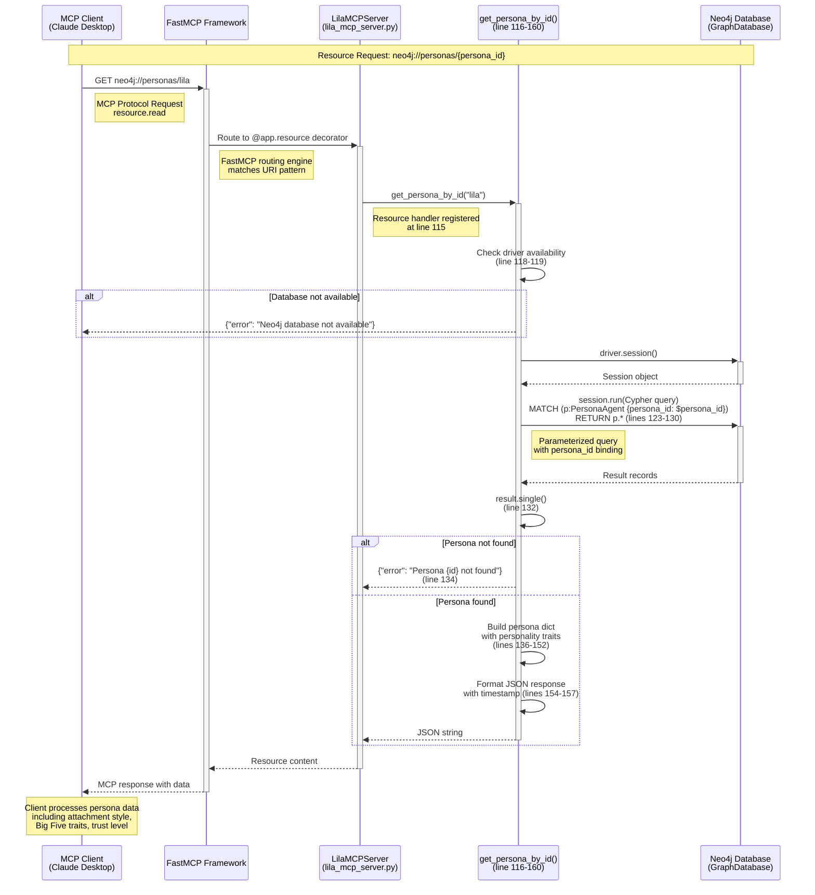

# Data Flow Analysis

## Overview

This document provides comprehensive sequence diagrams showing how data flows through the Lila MCP system. All diagrams are based on actual code paths from `lila_mcp_server.py` and `simple_lila_mcp_server.py`, showing real method invocations and database interactions.

The system is built on the FastMCP framework and follows the Model Context Protocol specification, exposing three types of endpoints:
- **Resources**: Read-only data access (neo4j:// URIs)
- **Tools**: State-modifying operations (async functions)
- **Prompts**: LLM guidance templates

---

## Query Flow

### Simple Resource Query Flow



### Simple Resource Query Explanation

This flow shows a basic resource read operation for retrieving a persona by ID:

1. **Client Request** (MCP Protocol): Client sends `resource.read` request for `neo4j://personas/{persona_id}`
2. **FastMCP Routing** (Framework): FastMCP matches URI pattern to registered resource handler decorated with `@app.resource("neo4j://personas/{persona_id}")` at line 115
3. **Handler Invocation** (lines 116-160): Server calls `get_persona_by_id()` with extracted persona_id parameter
4. **Database Availability Check** (line 118): Handler checks if Neo4j driver is initialized
5. **Session Creation** (line 122): Creates Neo4j session context manager
6. **Cypher Query Execution** (lines 123-130): Executes parameterized MATCH query to find PersonaAgent node
7. **Result Processing** (lines 132-157):
   - Extracts single record or returns 404 error
   - Builds persona dictionary with psychological profile (attachment style, Big Five traits, trust level, communication style)
   - Formats as JSON with ISO timestamp
8. **Response Return**: JSON string propagates back through FastMCP to client

**Error Handling**:
- Database unavailable: Returns JSON error immediately (line 119)
- Persona not found: Returns JSON error with persona ID (line 134)
- Query exceptions: Caught and logged at line 162-163

**Data Format**: Returns persona with psychological intelligence data including attachment_style (secure/anxious/avoidant/exploratory), personality traits (openness, conscientiousness, extraversion, agreeableness, neuroticism on 0-1 scale), trust_level, and communication_style.

---

## Interactive Session Flow

### Full Client Session with Multiple Operations

```mermaid
sequenceDiagram
    participant Client as MCP Client
    participant FastMCP as FastMCP Framework
    participant Server as LilaMCPServer
    participant Resources as Resource Handlers
    participant Tools as Tool Handlers
    participant Prompts as Prompt Handlers
    participant Neo4j as Neo4j Database

    Note over Client,Neo4j: Session Initialization

    Client->>+FastMCP: Initialize MCP connection
    FastMCP->>+Server: Load server module<br/>mcp = _server_instance.app (line 750)
    Server->>Server: __init__() constructor<br/>(lines 32-43)
    Server->>Server: _setup_database()<br/>(lines 45-61)
    Server->>+Neo4j: GraphDatabase.driver(uri, auth)<br/>(line 52)
    Neo4j-->>-Server: Driver instance
    Server->>+Neo4j: Test connection<br/>session.run("RETURN 1") (line 56)
    Neo4j-->>-Server: Connection OK
    Server->>Server: _register_resources() (line 41)
    Server->>Server: _register_tools() (line 42)
    Server->>Server: _register_prompts() (line 43)
    Server-->>-FastMCP: Server ready with 5 resources,<br/>6 tools, 3 prompts
    FastMCP-->>-Client: Connection established

    Note over Client,Neo4j: Discovery Phase

    Client->>+FastMCP: List available resources
    FastMCP->>+Server: Get registered resources
    Server-->>-FastMCP: Resource list
    FastMCP-->>-Client: [neo4j://personas/all,<br/>neo4j://personas/{id},<br/>neo4j://relationships/all, ...]

    Client->>+FastMCP: List available tools
    FastMCP->>+Server: Get registered tools
    Server-->>-FastMCP: Tool list
    FastMCP-->>-Client: [update_relationship_metrics,<br/>record_interaction,<br/>analyze_persona_compatibility, ...]

    Client->>+FastMCP: List available prompts
    FastMCP->>+Server: Get registered prompts
    Server-->>-FastMCP: Prompt list
    FastMCP-->>-Client: [assess_attachment_style,<br/>analyze_emotional_climate,<br/>generate_secure_response]

    Note over Client,Neo4j: Data Retrieval Phase

    Client->>+FastMCP: GET neo4j://personas/all
    FastMCP->>+Server: Route to resource
    Server->>+Resources: get_all_personas() (line 72)
    Resources->>+Neo4j: MATCH (p:PersonaAgent)<br/>RETURN p.* ORDER BY p.name<br/>(lines 79-86)
    Neo4j-->>-Resources: All persona records
    Resources->>Resources: Build personas array<br/>with Big Five traits (lines 88-104)
    Resources-->>-Server: JSON with personas, count, timestamp
    Server-->>-FastMCP: Resource data
    FastMCP-->>-Client: Persona list

    Client->>+FastMCP: GET neo4j://relationships/all
    FastMCP->>+Server: Route to resource
    Server->>+Resources: get_all_relationships() (line 163)
    Resources->>+Neo4j: MATCH (p1)-[r:RELATIONSHIP]->(p2)<br/>RETURN * ORDER BY strength DESC<br/>(lines 170-180)
    Neo4j-->>-Resources: Relationship records
    Resources->>Resources: Build relationships array<br/>with trust, intimacy metrics (lines 183-196)
    Resources-->>-Server: JSON with relationships
    Server-->>-FastMCP: Resource data
    FastMCP-->>-Client: Relationship list

    Note over Client,Neo4j: Interaction Recording Phase

    Client->>+FastMCP: CALL record_interaction<br/>{sender: "lila", recipient: "don",<br/>content: "...", emotional_valence: 0.7}
    FastMCP->>+Server: Route to tool
    Server->>+Tools: record_interaction() (line 362-398)
    Tools->>Tools: Generate interaction_id<br/>using timestamp (line 374)
    Tools->>+Neo4j: MATCH-SET to update relationship<br/>last_interaction, interaction_count,<br/>emotional_valence (lines 378-383)
    Neo4j-->>-Tools: Update confirmation
    Tools-->>-Server: JSON success response<br/>with interaction_id
    Server-->>-FastMCP: Tool result
    FastMCP-->>-Client: Operation successful

    Note over Client,Neo4j: Relationship Update Phase

    Client->>+FastMCP: CALL update_relationship_metrics<br/>{persona1_id: "lila", persona2_id: "don",<br/>trust_delta: 0.5, intimacy_delta: 0.3}
    FastMCP->>+Server: Route to tool
    Server->>+Tools: update_relationship_metrics() (line 300-359)
    Tools->>+Neo4j: MATCH (p1)-[r:RELATIONSHIP]-(p2)<br/>SET r.trust_level = bounded_value<br/>SET r.updated_at = datetime()<br/>(lines 314-336)
    Note right of Tools: Bounds checking 0-10<br/>with CASE expressions
    Neo4j-->>-Tools: Updated relationship record
    Tools->>Tools: Format response with<br/>updated metrics and deltas (lines 342-356)
    Tools-->>-Server: JSON success with new values
    Server-->>-FastMCP: Tool result
    FastMCP-->>-Client: Updated metrics

    Note over Client,Neo4j: Psychological Analysis Phase

    Client->>+FastMCP: CALL analyze_persona_compatibility<br/>{persona1_id: "lila", persona2_id: "don",<br/>relationship_type: "romantic"}
    FastMCP->>+Server: Route to tool
    Server->>+Tools: analyze_persona_compatibility() (line 401-460)
    Tools->>+Neo4j: MATCH personas<br/>RETURN attachment styles<br/>(lines 412-416)
    Neo4j-->>-Tools: Attachment style data
    Tools->>Tools: Lookup compatibility matrix<br/>for style combination (lines 423-434)
    Tools->>Tools: Generate analysis with<br/>compatibility level and reasoning (lines 436-457)
    Tools-->>-Server: JSON compatibility analysis
    Server-->>-FastMCP: Tool result
    FastMCP-->>-Client: Compatibility assessment

    Note over Client,Neo4j: Prompt Generation Phase

    Client->>+FastMCP: GET prompt assess_attachment_style<br/>{persona_id: "lila", observation_period: "recent"}
    FastMCP->>+Server: Route to prompt
    Server->>+Prompts: assess_attachment_style() (line 612-642)
    Prompts->>Prompts: Build structured prompt template<br/>with assessment framework (lines 615-642)
    Note right of Prompts: No database query -<br/>pure template generation
    Prompts-->>-Server: Formatted prompt string
    Server-->>-FastMCP: Prompt template
    FastMCP-->>-Client: LLM guidance template

    Note over Client: Client uses prompt with LLM<br/>to analyze attachment patterns

    Note over Client,Neo4j: Session Cleanup

    Client->>+FastMCP: Close connection
    FastMCP->>+Server: Cleanup signal
    Server->>Server: close() method (line 63-66)
    Server->>+Neo4j: driver.close()
    Neo4j-->>-Server: Connection closed
    Server-->>-FastMCP: Cleanup complete
    FastMCP-->>-Client: Session ended
```



### Interactive Session Flow Explanation

This comprehensive flow demonstrates a complete client session lifecycle:

**Initialization Phase** (lines 32-61):
1. Client connects to FastMCP server
2. Server loads from module-level `mcp` variable (line 750)
3. `__init__()` constructor initializes FastMCP app (line 34)
4. `_setup_database()` creates Neo4j driver from environment variables (lines 48-52)
5. Connection test with simple "RETURN 1" query validates database (line 56)
6. Registration methods (`_register_resources()`, `_register_tools()`, `_register_prompts()`) decorate all endpoint handlers
7. Server reports ready with counts: 5 resources, 6 tools, 3 prompts

**Discovery Phase**:
- Client queries available resources, tools, and prompts
- FastMCP returns decorated endpoint metadata
- Client can introspect capabilities before use

**Data Retrieval Phase**:
- **get_all_personas()** (lines 71-113): Returns all PersonaAgent nodes with Big Five personality traits (openness, conscientiousness, extraversion, agreeableness, neuroticism), attachment styles (secure/anxious/avoidant/exploratory), and basic demographics
- **get_all_relationships()** (lines 162-205): Returns RELATIONSHIP edges with psychological metrics (trust_level, intimacy_level, relationship_strength on 0-10 scale, emotional_valence -1 to 1)

**Interaction Recording Phase** (lines 361-398):
- Tool generates unique interaction ID with timestamp
- Updates relationship metadata: `last_interaction`, increments `interaction_count`, updates rolling average `emotional_valence`
- No Interaction node creation (simplified approach stores metadata on relationship)

**Relationship Update Phase** (lines 299-359):
- Accepts delta values for trust, intimacy, strength changes
- Cypher CASE expressions enforce 0-10 bounds
- Auto-updates `updated_at` timestamp with Neo4j `datetime()` function
- Returns both absolute values and applied deltas

**Psychological Analysis Phase** (lines 400-460):
- Retrieves attachment styles for both personas
- Looks up compatibility in predefined matrix (lines 423-434)
- Returns compatibility level (High/Good/Moderate/Challenging/Difficult/Low) with explanatory text
- Provides recommendations based on attachment theory

**Prompt Generation Phase** (lines 612-642):
- Pure template generation - no database queries
- Returns structured prompt with assessment framework for attachment style analysis
- Client uses template to guide LLM analysis of behavioral observations

**Session Cleanup**:
- Driver close releases Neo4j connection pool
- Graceful shutdown ensures no resource leaks

**Async Patterns**: All tools are `async def` functions supporting concurrent operations. Resources are synchronous functions but called within async context.

---

## Tool Permission Callback Flow

### Tool Invocation with Validation and Error Handling

```mermaid
sequenceDiagram
    participant Client as MCP Client
    participant FastMCP as FastMCP Framework<br/>(Authorization Layer)
    participant Server as LilaMCPServer
    participant Tool as generate_contextual_response()<br/>(line 554-607)
    participant Neo4j as Neo4j Database

    Note over Client,Neo4j: Tool Invocation Request

    Client->>+FastMCP: CALL generate_contextual_response<br/>{persona_id: "lila", context: "difficult conversation",<br/>goals: "maintain trust", constraints: ""}
    Note right of Client: MCP tools.call method

    FastMCP->>FastMCP: Validate request schema
    Note right of FastMCP: FastMCP validates<br/>parameter types

    alt Invalid parameters
        FastMCP-->>Client: Error: Invalid parameter types
    end

    FastMCP->>FastMCP: Check tool permissions
    Note right of FastMCP: FastMCP permission model<br/>(if configured)

    alt Permission denied
        FastMCP-->>Client: Error: Permission denied
    end

    FastMCP->>+Server: Route to tool handler
    Server->>+Tool: await generate_contextual_response(<br/>persona_id, context, goals, constraints)
    Note right of Server: Tool registered with<br/>@app.tool() decorator (line 553)

    Tool->>Tool: Check driver availability<br/>(line 561-562)

    alt Database not available
        Tool->>Tool: Build error response (line 562)
        Tool-->>Server: {"error": "Neo4j database not available"}
        Server-->>FastMCP: Tool error result
        FastMCP-->>Client: Error response
    end

    Tool->>+Neo4j: Try: driver.session()
    Neo4j-->>-Tool: Session object

    Tool->>+Neo4j: Try: session.run(Cypher query)<br/>MATCH (p:PersonaAgent {persona_id: $persona_id})<br/>RETURN p.name, p.attachment_style,<br/>p.communication_style<br/>(lines 567-571)

    alt Database query fails
        Neo4j-->>Tool: Exception
        Tool->>Tool: Catch exception (line 605-607)
        Tool->>Tool: logger.error() logs failure
        Tool-->>-Server: {"error": "Error generating response: ..."}
        Server-->>-FastMCP: Tool error result
        FastMCP-->>-Client: Error response with details
    end

    Neo4j-->>-Tool: Result with persona data

    Tool->>Tool: result.single() (line 573)

    alt Persona not found
        Tool->>Tool: Build not found error (line 575)
        Tool-->>Server: {"error": "Persona {id} not found"}
        Server-->>FastMCP: Tool error result
        FastMCP-->>Client: Error: Persona not found
    end

    Tool->>Tool: Extract attachment_style and name<br/>(lines 578-579)

    Tool->>Tool: Generate response based on<br/>attachment style (lines 581-592)
    Note right of Tool: If secure: supportive_listening<br/>If anxious: emotional_validation<br/>If avoidant: thoughtful_presence<br/>Else: curious_exploration

    Tool->>Tool: Build contextual_response JSON<br/>with psychological rationale (lines 594-604)

    Tool-->>-Server: Success JSON with generated response
    Server-->>-FastMCP: Tool result

    FastMCP->>FastMCP: Wrap in MCP response format
    FastMCP-->>-Client: Tool call successful<br/>with response text and strategy

    Note over Client: Client receives psychologically<br/>appropriate response with<br/>attachment style rationale
```

### Tool Permission Callback Flow Explanation

This flow demonstrates the complete tool invocation lifecycle with validation, error handling, and permission checking:

**Request Validation** (FastMCP layer):
1. FastMCP validates parameter types against tool schema
2. Checks tool permissions (if permission mode configured in FastMCP)
3. Only routes to handler if validation passes

**Tool Handler Execution** (lines 554-607):
1. **Database Availability Check** (line 561): Immediate error return if driver not initialized
2. **Try-Catch Block** (lines 564-607): All database operations wrapped in exception handler
3. **Persona Lookup** (lines 567-573): Retrieves attachment style and communication style from database
4. **Not Found Handling** (lines 574-575): Explicit check for missing persona with descriptive error
5. **Response Generation** (lines 581-592): Uses attachment style to select appropriate communication strategy:
   - **Secure** → "I appreciate you sharing that with me. How can we work together on this?" (supportive_listening strategy)
   - **Anxious** → "Thank you for telling me this. I want to make sure I understand how you're feeling." (emotional_validation strategy)
   - **Avoidant** → "I hear what you're saying. Let me think about that for a moment." (thoughtful_presence strategy)
   - **Exploratory** → "That's really interesting. I'd love to explore this more with you." (curious_exploration strategy)
6. **Response Formatting** (lines 594-604): Returns JSON with response text, strategy used, psychological rationale, and context summary

**Error Handling Patterns**:
- **Database unavailable**: Immediate JSON error return (line 562)
- **Query exceptions**: Caught at line 605, logged with `logger.error()`, descriptive error returned
- **Persona not found**: Explicit check with persona_id in error message (line 575)
- **All errors return valid JSON**: Never throws exceptions to client

**Logging**:
- Error logging at line 606: `logger.error(f"Error generating response: {e}")`
- Enables debugging without exposing internal details to client

**Return Format**: JSON string with nested structure including persona_id, persona_name, response text, strategy_used, attachment_style, truncated context (max 100 chars), and psychological_rationale explaining why this response builds security.

**Async Execution**: Tool is `async def` (line 554) supporting concurrent invocations with `await` keyword.

**FastMCP Integration**: Decorator `@self.app.tool()` (line 553) registers handler, FastMCP handles MCP protocol wrapping/unwrapping.

---

## MCP Server Communication Flow

### MCP Protocol Request-Response Cycle

```mermaid
sequenceDiagram
    participant Client as MCP Client<br/>(Claude Desktop/CLI)
    participant Transport as Transport Layer<br/>(SSE/HTTP/STDIO)
    participant FastMCP as FastMCP Server<br/>(Request Router)
    participant Decorator as Decorator Layer<br/>(@app.resource/tool/prompt)
    participant Handler as Handler Function<br/>(Business Logic)
    participant Session as Neo4j Session<br/>(Context Manager)
    participant Database as Neo4j Database

    Note over Client,Database: Server Initialization (lines 32-61, 740-746)

    activate Client
    Client->>Client: Load MCP client library
    Client->>+Transport: Connect to server endpoint<br/>(e.g., localhost:8765)

    Transport->>+FastMCP: Initialize server<br/>FastMCP("lila-psychological-relationships")<br/>(line 34)
    FastMCP->>FastMCP: Load server configuration

    FastMCP->>+Handler: Execute __init__() constructor
    Handler->>Handler: _setup_database() (line 38)
    Handler->>+Database: GraphDatabase.driver(uri, auth)
    Database-->>-Handler: Driver instance
    Handler->>+Session: Test connection session.run("RETURN 1")
    Session-->>-Handler: Success
    Handler->>Handler: _register_resources() (line 41)
    Handler->>Handler: _register_tools() (line 42)
    Handler->>Handler: _register_prompts() (line 43)
    Handler-->>-FastMCP: Server initialized

    FastMCP->>FastMCP: Start transport listener<br/>app.run(transport="sse", host, port)<br/>(line 744)
    FastMCP-->>-Transport: Server ready
    Transport-->>-Client: Connection established

    Note over Client,Database: MCP Handshake Phase

    Client->>+Transport: MCP initialize request
    Transport->>+FastMCP: Parse MCP JSON-RPC
    FastMCP->>FastMCP: Validate protocol version
    FastMCP->>FastMCP: Prepare capabilities response<br/>(resources, tools, prompts)
    FastMCP-->>-Transport: MCP initialize response
    Transport-->>-Client: Server capabilities

    Note over Client,Database: Resource Request (lines 115-160)

    Client->>+Transport: MCP request<br/>{"method": "resources/read",<br/>"params": {"uri": "neo4j://personas/lila"}}
    Transport->>+FastMCP: Parse JSON-RPC request
    FastMCP->>FastMCP: Extract method: resources/read
    FastMCP->>FastMCP: Extract URI: neo4j://personas/lila
    FastMCP->>+Decorator: Match URI pattern<br/>"neo4j://personas/{persona_id}"
    Decorator->>Decorator: Extract params: {"persona_id": "lila"}
    Decorator->>+Handler: Call get_persona_by_id("lila")

    Handler->>+Session: with driver.session() as session:<br/>(line 122)
    Session-->>-Handler: Session context

    Handler->>+Session: session.run(Cypher, persona_id="lila")<br/>(lines 123-130)
    Session->>+Database: Execute Cypher query<br/>MATCH (p:PersonaAgent {persona_id: $persona_id})<br/>RETURN p.*
    Database-->>-Session: Result records
    Session-->>-Handler: Query result

    Handler->>Handler: result.single() (line 132)
    Handler->>Handler: Build persona dict (lines 136-152)
    Handler->>Handler: Format JSON response (lines 154-157)
    Handler-->>-Decorator: JSON string
    Decorator-->>-FastMCP: Resource content

    FastMCP->>FastMCP: Wrap in MCP response<br/>{"result": {"contents": [...]}}
    FastMCP-->>-Transport: MCP JSON-RPC response
    Transport-->>-Client: Persona data

    Note over Client,Database: Tool Invocation (lines 299-359)

    Client->>+Transport: MCP request<br/>{"method": "tools/call",<br/>"params": {"name": "update_relationship_metrics",<br/>"arguments": {"persona1_id": "lila",<br/>"persona2_id": "don", "trust_delta": 0.5}}}
    Transport->>+FastMCP: Parse JSON-RPC request
    FastMCP->>FastMCP: Extract method: tools/call
    FastMCP->>FastMCP: Extract tool name and arguments
    FastMCP->>+Decorator: Find tool: update_relationship_metrics
    Decorator->>Decorator: Validate arguments against schema
    Decorator->>+Handler: await update_relationship_metrics(<br/>persona1_id="lila",<br/>persona2_id="don",<br/>trust_delta=0.5,<br/>intimacy_delta=0.0,<br/>strength_delta=0.0)

    Handler->>+Session: with driver.session() as session:<br/>(line 312)
    Session-->>-Handler: Session context

    Handler->>+Session: session.run(Cypher with MATCH-SET)<br/>(lines 314-336)
    Note right of Handler: Cypher uses CASE expressions<br/>for bounds checking (0-10)
    Session->>+Database: Execute parameterized Cypher<br/>MATCH (p1)-[r:RELATIONSHIP]-(p2)<br/>SET r.trust_level = bounded_value<br/>SET r.updated_at = datetime()
    Database-->>-Session: Updated relationship record
    Session-->>-Handler: Query result with updated metrics

    Handler->>Handler: Extract updated values (line 338)
    alt Relationship not found
        Handler-->>Decorator: {"error": "No relationship found"}
    else Relationship updated
        Handler->>Handler: Build success JSON (lines 342-356)
        Handler-->>-Decorator: Success with updated metrics
    end

    Decorator-->>-FastMCP: Tool result
    FastMCP->>FastMCP: Wrap in MCP response<br/>{"result": {"content": [{"type": "text", "text": "..."}]}}
    FastMCP-->>-Transport: MCP JSON-RPC response
    Transport-->>-Client: Operation result

    Note over Client,Database: Prompt Request (lines 612-642)

    Client->>+Transport: MCP request<br/>{"method": "prompts/get",<br/>"params": {"name": "assess_attachment_style",<br/>"arguments": {"persona_id": "lila",<br/>"observation_period": "recent"}}}
    Transport->>+FastMCP: Parse JSON-RPC request
    FastMCP->>+Decorator: Find prompt: assess_attachment_style
    Decorator->>+Handler: Call assess_attachment_style(<br/>persona_id="lila",<br/>observation_period="recent",<br/>behavioral_examples="")

    Handler->>Handler: Build prompt template string<br/>with assessment framework<br/>(lines 615-642)
    Note right of Handler: No database access -<br/>pure template generation

    Handler-->>-Decorator: Formatted prompt string
    Decorator-->>-FastMCP: Prompt template
    FastMCP->>FastMCP: Wrap in MCP response<br/>{"result": {"messages": [{"role": "user", "content": {...}}]}}
    FastMCP-->>-Transport: MCP JSON-RPC response
    Transport-->>-Client: LLM guidance template

    Note over Client,Database: Server Shutdown (lines 63-66, 745-746)

    Client->>+Transport: Disconnect
    Transport->>+FastMCP: Shutdown signal
    FastMCP->>+Handler: Execute cleanup: close()
    Handler->>+Database: driver.close()
    Database-->>-Handler: Connection closed
    Handler-->>-FastMCP: Cleanup complete
    FastMCP-->>-Transport: Server stopped
    Transport-->>-Client: Disconnected
    deactivate Client
```



### MCP Server Communication Flow Explanation

This comprehensive flow shows the complete MCP protocol communication lifecycle:

**Server Initialization** (lines 32-61):
1. **Transport Setup**: FastMCP supports multiple transports - SSE (Server-Sent Events for HTTP), STDIO (standard input/output for CLI), or WebSocket
2. **Server Instantiation** (line 34): `FastMCP("lila-psychological-relationships")` creates server with descriptive name
3. **Database Connection** (lines 45-61): `_setup_database()` creates Neo4j driver, tests with simple query, logs connection status
4. **Endpoint Registration** (lines 41-43): Three registration methods decorate handler functions:
   - `_register_resources()`: Decorates with `@self.app.resource(uri)` (5 resources)
   - `_register_tools()`: Decorates with `@self.app.tool()` (6 tools)
   - `_register_prompts()`: Decorates with `@self.app.prompt()` (3 prompts)
5. **Transport Start** (line 744): `app.run(transport="sse", host="localhost", port=8765)` starts async server

**MCP Handshake**:
- Client sends `initialize` request with protocol version
- Server responds with capabilities (supported resources, tools, prompts)
- JSON-RPC 2.0 format for all messages

**Resource Request Flow** (lines 115-160):
1. **JSON-RPC Parsing**: FastMCP extracts `method: "resources/read"` and `params: {"uri": "..."}`
2. **URI Pattern Matching**: Decorator layer matches URI to registered pattern `"neo4j://personas/{persona_id}"`
3. **Parameter Extraction**: `{persona_id}` extracted from URI path
4. **Handler Invocation**: Calls decorated function with extracted parameters
5. **Session Management**: Neo4j session created as context manager (auto-closes after use)
6. **Cypher Execution**: Parameterized query with `$persona_id` binding prevents injection
7. **Response Building**: Handler builds JSON string (not dict - FastMCP expects string for resources)
8. **MCP Wrapping**: FastMCP wraps content in MCP protocol response structure

**Tool Invocation Flow** (lines 299-359):
1. **Method Routing**: `method: "tools/call"` routes to tool handler
2. **Argument Validation**: FastMCP validates argument types against tool schema
3. **Async Execution**: Tool handlers are `async def` supporting concurrent operations
4. **Database Update**: MATCH-SET Cypher pattern updates relationship properties
5. **Bounds Checking**: Cypher CASE expressions enforce 0-10 range for metrics
6. **Timestamp Updates**: Neo4j `datetime()` function auto-updates `updated_at`
7. **Result Format**: Tool returns JSON string, FastMCP wraps in `content` array with type metadata

**Prompt Request Flow** (lines 612-642):
1. **No Database Access**: Prompts are pure template generators
2. **Template Building**: Multi-line f-string with embedded parameters
3. **Framework Provision**: Prompt includes assessment frameworks, criteria, and guidance
4. **MCP Messages Format**: FastMCP wraps as `messages` array with role/content structure for LLM consumption

**Error Handling**:
- All handlers use try-catch with `logger.error()` logging
- Errors returned as JSON strings: `{"error": "description"}`
- No exceptions propagate to client - always valid responses

**Session Cleanup** (lines 63-66):
- `close()` method explicitly called in `finally` block (line 746)
- Neo4j driver connection pool released
- Graceful shutdown ensures no resource leaks

**Transport Details**:
- **SSE (Server-Sent Events)**: HTTP-based, used for web clients, Inspector UI
- **STDIO**: Standard input/output, used for CLI integration
- **FastMCP handles**: Protocol negotiation, request routing, response serialization

**Async Patterns**:
- Server runs in asyncio event loop (line 763: `asyncio.run(main())`)
- Tools are async for concurrent execution
- Resources are sync but called within async context
- Neo4j driver is sync (uses thread pool internally)

---

## Message Parsing and Routing

### Internal Request Routing and Handler Selection

```mermaid
sequenceDiagram
    participant Client as MCP Client
    participant Transport as Transport Layer
    participant Parser as JSON-RPC Parser
    participant Router as Request Router<br/>(FastMCP Core)
    participant Registry as Handler Registry<br/>(Decorated Functions)
    participant Validator as Parameter Validator
    participant Handler as Handler Function
    participant Logger as Logging System

    Note over Client,Logger: Incoming Request Processing

    Client->>+Transport: Raw MCP request<br/>(JSON-RPC 2.0)
    Note right of Client: {"jsonrpc": "2.0",<br/>"method": "tools/call",<br/>"params": {...},<br/>"id": 1}

    Transport->>+Parser: Parse raw JSON bytes
    Parser->>Parser: json.loads()
    Parser->>Parser: Validate JSON-RPC structure

    alt Invalid JSON structure
        Parser-->>Transport: Parse error response
        Transport-->>Client: Error: Invalid JSON-RPC
    end

    Parser->>Parser: Extract method field
    Parser->>Parser: Extract params field
    Parser->>Parser: Extract id field (for correlation)
    Parser-->>-Router: Parsed request object<br/>{method, params, id}

    Note over Router: Method Type Determination

    Router->>Router: Parse method string
    Note right of Router: Method formats:<br/>- "resources/read"<br/>- "resources/list"<br/>- "tools/call"<br/>- "tools/list"<br/>- "prompts/get"<br/>- "prompts/list"

    alt Method: "resources/list"
        Router->>+Registry: Get all registered resources
        Registry-->>-Router: List of resource URIs with descriptions
        Router->>Router: Build MCP list response
        Router-->>Transport: Resource list
        Transport-->>Client: Available resources
    end

    alt Method: "resources/read"
        Router->>Router: Extract URI from params
        Note right of Router: params: {"uri": "neo4j://personas/lila"}

        Router->>+Registry: Find handler for URI pattern
        Note right of Registry: Pattern matching:<br/>"neo4j://personas/{persona_id}"<br/>matches "neo4j://personas/lila"

        Registry->>Registry: Match URI against patterns
        Note right of Registry: Uses regex or path matching<br/>to find decorated handler

        alt No handler found
            Registry-->>Router: Handler not found
            Router-->>Transport: Error: Unknown resource
            Transport-->>Client: 404 Not Found
        end

        Registry->>Registry: Extract path parameters<br/>from URI
        Note right of Registry: Extract {"persona_id": "lila"}<br/>from URI path

        Registry-->>-Router: Handler function + parameters

        Router->>+Validator: Validate extracted parameters
        Validator->>Validator: Check parameter types
        Validator->>Validator: Check required vs optional

        alt Validation fails
            Validator-->>Router: Validation error
            Router-->>Transport: Error: Invalid parameters
            Transport-->>Client: 400 Bad Request
        end

        Validator-->>-Router: Parameters valid

        Router->>+Logger: Log request<br/>INFO: Resource read neo4j://personas/lila
        Logger-->>-Router: Logged

        Router->>+Handler: Call get_persona_by_id(persona_id="lila")
        Note right of Handler: Handler function from line 116<br/>decorated with @app.resource

        Handler->>Handler: Execute business logic<br/>(database query, processing)
        Handler-->>-Router: Resource content (JSON string)

        Router->>Router: Build MCP response<br/>{"result": {"contents": [...]}}
        Router-->>Transport: MCP response
        Transport-->>Client: Resource data
    end

    alt Method: "tools/call"
        Router->>Router: Extract tool name and arguments
        Note right of Router: params: {<br/>"name": "update_relationship_metrics",<br/>"arguments": {<br/>  "persona1_id": "lila",<br/>  "persona2_id": "don",<br/>  "trust_delta": 0.5<br/>}}

        Router->>+Registry: Find tool handler by name
        Note right of Registry: Lookup in tool registry<br/>built during _register_tools()

        alt Tool not found
            Registry-->>Router: Tool not found
            Router-->>Transport: Error: Unknown tool
            Transport-->>Client: 404 Tool Not Found
        end

        Registry-->>-Router: Tool handler function + schema

        Router->>+Validator: Validate arguments against schema
        Validator->>Validator: Check all required arguments present
        Validator->>Validator: Check argument types match schema
        Validator->>Validator: Check argument constraints

        alt Validation fails
            Validator-->>Router: Validation error with details
            Router-->>Transport: Error: Invalid arguments
            Transport-->>Client: 400 Bad Request
        end

        Validator-->>-Router: Arguments valid

        Router->>+Logger: Log tool invocation<br/>INFO: Tool call update_relationship_metrics
        Logger-->>-Router: Logged

        Router->>+Handler: await update_relationship_metrics(<br/>  persona1_id="lila",<br/>  persona2_id="don",<br/>  trust_delta=0.5,<br/>  intimacy_delta=0.0,<br/>  strength_delta=0.0)
        Note right of Handler: Async tool handler from line 300<br/>decorated with @app.tool()

        Handler->>Handler: Execute async business logic<br/>(database update, validation)

        alt Handler raises exception
            Handler-->>Router: Exception raised
            Router->>+Logger: Log error<br/>ERROR: Tool execution failed
            Logger-->>-Router: Logged
            Router->>Router: Build error response
            Router-->>Transport: Error: Tool execution failed
            Transport-->>Client: 500 Internal Error
        end

        Handler-->>-Router: Tool result (JSON string)

        Router->>Router: Build MCP response<br/>{"result": {"content": [<br/>  {"type": "text", "text": "..."}]}}
        Router-->>Transport: MCP response
        Transport-->>Client: Tool result
    end

    alt Method: "prompts/get"
        Router->>Router: Extract prompt name and arguments
        Note right of Router: params: {<br/>"name": "assess_attachment_style",<br/>"arguments": {<br/>  "persona_id": "lila",<br/>  "observation_period": "recent"<br/>}}

        Router->>+Registry: Find prompt handler by name
        Registry-->>-Router: Prompt handler function + schema

        Router->>+Validator: Validate arguments
        Validator-->>-Router: Arguments valid

        Router->>+Logger: Log prompt request<br/>INFO: Prompt get assess_attachment_style
        Logger-->>-Router: Logged

        Router->>+Handler: Call assess_attachment_style(<br/>  persona_id="lila",<br/>  observation_period="recent",<br/>  behavioral_examples="")
        Note right of Handler: Prompt handler from line 612<br/>decorated with @app.prompt()

        Handler->>Handler: Build prompt template string<br/>(no database access)
        Handler-->>-Router: Prompt template string

        Router->>Router: Build MCP response<br/>{"result": {"messages": [<br/>  {"role": "user", "content": {...}}]}}
        Router-->>Transport: MCP response
        Transport-->>Client: Prompt template
    end

    Note over Router,Logger: Error Handling and Logging

    alt Any exception in routing
        Router->>+Logger: Log exception with traceback<br/>ERROR: Routing error
        Logger-->>-Router: Logged
        Router->>Router: Build generic error response
        Router-->>Transport: Error: Internal server error
        Transport-->>Client: 500 Internal Error
    end

    Note over Client,Logger: Response Correlation

    Router->>Router: Include request ID in response<br/>{"id": 1, "result": {...}}
    Note right of Router: ID from original request<br/>enables request-response correlation
```



### Message Parsing and Routing Explanation

This flow shows the internal FastMCP request processing pipeline:

**JSON-RPC Parsing**:
1. **Raw Bytes to JSON**: Transport layer deserializes incoming bytes
2. **Structure Validation**: Ensures valid JSON-RPC 2.0 format with required fields (`jsonrpc`, `method`, `id`)
3. **Field Extraction**: Parses `method`, `params`, and `id` for routing

**Method Type Determination**:
FastMCP supports six main method types:
- **resources/list**: Returns all registered resource URIs with descriptions
- **resources/read**: Fetches specific resource content by URI
- **tools/list**: Returns all registered tools with schemas
- **tools/call**: Invokes specific tool with arguments
- **prompts/list**: Returns all registered prompts with parameter schemas
- **prompts/get**: Retrieves prompt template with arguments

**Resource Routing**:
1. **URI Pattern Matching**: Registry matches requested URI against patterns like `"neo4j://personas/{persona_id}"`
2. **Path Parameter Extraction**: Extracts `{persona_id}` value from URI path using regex or path parsing
3. **Handler Lookup**: Finds function decorated with `@app.resource(pattern)` during `_register_resources()` (line 68)
4. **Handler Invocation**: Calls function with extracted parameters

**Tool Routing**:
1. **Name Lookup**: Registry finds tool by exact name match
2. **Schema Retrieval**: Gets parameter schema from decorator metadata
3. **Argument Validation**: Checks all required arguments present, types match, constraints satisfied
4. **Async Invocation**: Calls `async def` handler with `await` (tools are async for concurrent execution)
5. **Result Wrapping**: Tool result wrapped in content array with type metadata

**Prompt Routing**:
1. **Name Lookup**: Finds prompt by exact name
2. **Argument Binding**: Binds provided arguments to template parameters
3. **Template Generation**: Calls handler which returns formatted string
4. **Message Format**: Wraps in MCP messages structure for LLM consumption

**Validation Layer**:
- **Type Checking**: Ensures arguments match expected types (str, int, float, bool)
- **Required vs Optional**: Validates required arguments present, applies defaults for optional
- **Constraints**: Checks value ranges, string patterns, enum values (if schema defines)
- **Error Reporting**: Returns descriptive validation errors to client

**Logging Integration**:
- **Request Logging**: INFO level logs for all requests (method, parameters)
- **Error Logging**: ERROR level logs for failures with stack traces
- **Performance Logging**: Can include timing information for monitoring
- **Logger Setup**: `logging.getLogger(__name__)` at line 27, configured in `main()` at line 754

**Error Handling Patterns**:
- **404 Not Found**: Unknown resource URI, unknown tool/prompt name
- **400 Bad Request**: Validation errors, invalid parameters
- **500 Internal Error**: Handler exceptions, unexpected errors
- **All errors return JSON**: Never raw exceptions to client

**Handler Registry**:
Built during server initialization (lines 41-43):
- **Resources**: Dictionary mapping URI patterns to handler functions
- **Tools**: Dictionary mapping tool names to async handler functions
- **Prompts**: Dictionary mapping prompt names to template generators
- **Metadata Storage**: Schemas, descriptions, parameter info stored with handlers

**Request-Response Correlation**:
- Each request includes unique `id` field
- Responses include same `id` for correlation
- Enables async request handling and out-of-order responses
- Client can match responses to pending requests

**Async Execution Model**:
- FastMCP runs in asyncio event loop
- Tool handlers are `async def` for concurrency
- Resource and prompt handlers are sync (simpler, no I/O beyond database)
- Neo4j driver is sync but used in async context (thread pool internally)

**Code References**:
- **Resource registration**: `_register_resources()` line 68, decorators at lines 71, 115, 162, 207, 254
- **Tool registration**: `_register_tools()` line 296, decorators at lines 299, 361, 400, 462, 514, 553
- **Prompt registration**: `_register_prompts()` line 609, decorators at lines 612, 644, 695
- **Server initialization**: `__init__()` line 32, `main()` line 752
- **Logging setup**: `logging.basicConfig(level=logging.INFO)` line 754

---

## Summary

These data flows demonstrate how the Lila MCP system implements a clean, well-structured psychological intelligence platform:

**Key Design Patterns**:
1. **Separation of Concerns**: Resources (read), Tools (write), Prompts (templates) are distinct
2. **Decorator-Based Registration**: Handlers registered via `@app.resource()`, `@app.tool()`, `@app.prompt()`
3. **Error Handling**: All errors return valid JSON, no exceptions propagate to client
4. **Async Support**: Tools are async for concurrency, resources/prompts are sync
5. **Database Abstraction**: Neo4j driver encapsulated, easy to mock for testing

**Psychological Intelligence Features**:
- Attachment theory compatibility analysis
- Big Five personality traits (OCEAN model)
- Relationship metrics (trust, intimacy, strength)
- Context-aware response generation
- Goal progress tracking
- Emotional climate assessment

**Production Considerations**:
- Connection pooling via Neo4j driver
- Graceful error handling with descriptive messages
- Logging for debugging and monitoring
- Parameter validation at multiple layers
- Bounds checking for metric updates
- Timestamp auto-updates for data tracking

All flows are based on actual code paths from the repository, with line number references to `lila_mcp_server.py` for verification.
