# Data Flow Analysis

This document provides comprehensive sequence diagrams and explanations for the key data flows in the Lila MCP system, covering orchestrator workflows, MCP server communication, message routing, and permission handling.

**Last Updated**: 2025-10-03

---

## 1. Simple Query Flow (Basic Orchestrator Request/Response)

### Flow Details

**File References**:
- **Orchestrator Entry**: `/orchestrators/base_orchestrator.py:266-296` (`run_with_client()`)
- **Phase Execution**: `/orchestrators/base_orchestrator.py:216-240` (`execute_phase()`)
- **Client Options**: `/orchestrators/base_orchestrator.py:242-264` (`create_client_options()`)
- **Message Display**: `/orchestrators/base_orchestrator.py:74-115` (`display_message()`)

**Key Steps**:

1. **Initialization** (`base_orchestrator.py:266-275`):
   - Orchestrator creates `ClaudeAgentOptions` with agent definitions, allowed tools, permission mode
   - Opens async context with `ClaudeSDKClient`
   - Stores client reference for phase execution

2. **Query Submission** (`base_orchestrator.py:231`):
   - Orchestrator calls `client.query(prompt)` to initiate agent interaction
   - Prompt includes phase instructions and output requirements

3. **Response Streaming** (`base_orchestrator.py:234-238`):
   - Orchestrator iterates over `client.receive_response()` async generator
   - Receives messages in sequence: `AssistantMessage` → `UserMessage` → `ResultMessage`

4. **Message Parsing** (`base_orchestrator.py:81-115`):
   - **AssistantMessage** (lines 81-100): Contains `TextBlock` (agent thinking) and `ToolUseBlock` (tool requests)
   - **UserMessage** (lines 102-107): Contains `ToolResultBlock` with tool execution results
   - **ResultMessage** (lines 109-115): Contains phase completion status and cost data

5. **Cost Tracking** (`base_orchestrator.py:236-240`):
   - Extracts `total_cost_usd` from `ResultMessage`
   - Updates phase costs and total cost

6. **Error Handling** (`base_orchestrator.py:288-295`):
   - Try-catch wraps entire flow
   - Displays error message with partial results location
   - Cleans up client reference in finally block

---

## 2. Interactive Client Session Flow (Multi-Turn Conversation)

### Flow Details

**File References**:
- **Multi-Phase Execution**: `/orchestrators/architecture_orchestrator.py:283-301` (`run()`)
- **Phase Sequence**:
  - Phase 1: `architecture_orchestrator.py:111-142` (`phase_1_component_inventory()`)
  - Phase 2: `architecture_orchestrator.py:144-181` (`phase_2_architecture_diagrams()`)
  - Phase 3: `architecture_orchestrator.py:183-218` (`phase_3_data_flows()`)
  - Phase 4: `architecture_orchestrator.py:220-239` (`phase_4_api_documentation()`)
  - Phase 5: `architecture_orchestrator.py:241-281` (`phase_5_synthesis()`)

**Key Characteristics**:

1. **Session Continuity** (`base_orchestrator.py:278-281`):
   - Single `ClaudeSDKClient` instance persists across all phases
   - Client stored as `self.client` for access throughout workflow
   - Context maintained via async context manager (`async with`)

2. **Incremental Output** (`architecture_orchestrator.py:286-290`):
   - Each phase writes to specific files (e.g., `01_component_inventory.md`, `02_architecture_diagrams.md`)
   - Later phases can read earlier outputs using Read tool
   - Prompts explicitly reference previous phase outputs (see line 251-254)

3. **Agent Switching** (`architecture_orchestrator.py:56-101`):
   - Different agents used for different phases (e.g., "analyzer" vs "doc-writer")
   - Agent definitions loaded from `get_agent_definitions()`
   - Each agent has specific tools and prompts

4. **Cost Aggregation** (`base_orchestrator.py:58-60, 236-240`):
   - `phase_costs` dict tracks cost per phase
   - `total_cost` accumulates across all phases
   - Displayed in final summary (line 180)

5. **Verification** (`base_orchestrator.py:147-170`):
   - After all phases, orchestrator verifies expected files exist
   - Checks file sizes and reports missing outputs
   - Provides user with output validation

---

## 3. Tool Permission Callback Flow (User Approval for Tools)

### Flow Details

**File References**:
- **Permission Mode Setting**: `/orchestrators/base_orchestrator.py:242-264` (`create_client_options()`)
- **Default Mode**: `base_orchestrator.py:244` (`permission_mode="acceptEdits"`)
- **Tool Allowlist**:
  - Architecture: `architecture_orchestrator.py:103-109` (`get_allowed_tools()`)
  - UX: `ux_orchestrator.py:157-163` (`get_allowed_tools()`)

**Permission Modes**:

1. **"acceptEdits" (Default)** (`base_orchestrator.py:244, 262`):
   - Auto-approves: Read, Write, Grep, Glob (safe file operations)
   - Prompts user for: Bash commands (especially destructive), other tools
   - Used in production orchestrator runs
   - Balances automation with safety

2. **"ask"**:
   - Requires user approval for every tool use
   - Useful for debugging or learning what tools do
   - Maximum control, minimum automation

3. **Tool Allowlist** (`base_orchestrator.py:257, 261`):
   - Orchestrator defines `allowed_tools` via `get_allowed_tools()`
   - Examples:
     - Architecture: `["Read", "Write", "Grep", "Glob", "Bash"]`
     - UX: `["Read", "Write", "Grep", "Glob", "Bash", "WebSearch"]`
   - Tools not in allowlist are always rejected

**Error Handling**:
- If tool rejected: Agent receives error message and must adapt
- Agent can request alternative tools or proceed without tool
- No automatic retry of rejected tools

---

## 4. MCP Server Communication Flow (Client-Server Interaction)

### Flow Details

**File References**:
- **Server Initialization**: `/simple_lila_mcp_server.py:36-100`
  - FastMCP setup: line 38
  - Neo4j connection: lines 102-118 (`_setup_database()`)
  - Resource registration: lines 125-358 (`_register_resources()`)
  - Tool registration: lines 360-631 (`_register_tools()`)
  - Prompt registration: lines 633-822 (`_register_prompts()`)

**Resource Endpoints** (`simple_lila_mcp_server.py:125-358`):

1. **Static Resources** (read-only data):
   - `neo4j://personas/all` (line 128): Returns all personas with personality profiles
   - `neo4j://personas/{persona_id}` (line 172): Returns specific persona details
   - `neo4j://relationships/all` (line 219): Returns all relationship data
   - `neo4j://relationships/{p1}/{p2}` (line 237): Returns specific relationship metrics
   - `neo4j://interactions/recent/{count}` (line 258): Returns recent interactions

2. **Dynamic Resources** (computed data):
   - `neo4j://emotional_climate/current` (line 270): Computes current emotional safety metrics
   - `neo4j://attachment_styles/analysis` (line 291): Analyzes attachment compatibility
   - `neo4j://goals/active` (line 310): Returns active relationship goals
   - `neo4j://psychological_insights/trends` (line 333): Tracks psychological trends

**Tool Endpoints** (`simple_lila_mcp_server.py:360-631`):

1. **Data Modification Tools**:
   - `update_relationship_metrics()` (line 363): Updates trust/intimacy/strength (async)
   - `record_interaction()` (line 402): Records interaction with psychological analysis (async)

2. **Analysis Tools**:
   - `analyze_persona_compatibility()` (line 437): Assesses relationship potential (async)
   - `autonomous_strategy_selection()` (line 477): AI-driven strategy based on attachment theory (async)
   - `assess_goal_progress()` (line 526): Evaluates relationship goal progress (async)
   - `generate_contextual_response()` (line 569): Generates psychologically authentic responses (async)

3. **State Management Tools**:
   - `commit_relationship_state()` (line 609): Explicit state persistence (async)
   - `finalize_demo_session()` (line 621): Finalize all states (async)

**Prompt Endpoints** (`simple_lila_mcp_server.py:633-822`):

1. **Psychological Analysis Prompts**:
   - `assess_attachment_style()` (line 636): Framework for attachment style determination
   - `analyze_emotional_climate()` (line 699): Framework for emotional safety evaluation
   - `generate_secure_response()` (line 757): Framework for secure attachment responses

**Data Flow Patterns**:

1. **Neo4j Integration** (`simple_lila_mcp_server.py:102-118`):
   - Connection established at startup
   - Uses `driver.session()` context manager for queries
   - Falls back to mock data if Neo4j unavailable
   - Example query pattern (line 136-143): MATCH → RETURN → Transform → JSON

2. **Error Handling** (`simple_lila_mcp_server.py:168-170, 216-217`):
   - Try-catch wraps all database operations
   - Returns JSON error objects: `{"error": "message"}`
   - Logs errors for debugging

3. **Response Format**:
   - All responses are JSON strings
   - Include metadata: `last_updated`, `count`, status indicators
   - Consistent structure for client parsing

---

## 5. Message Parsing and Routing (Message Flow Through System)

```mermaid
sequenceDiagram
    participant Client as ClaudeSDKClient
    participant Agent as Claude Agent
    participant Orchestrator as BaseOrchestrator
    participant Display as display_message()
    participant Console as Console Output

    Note over Client,Agent: Agent Thinking Phase
    Agent->>Client: AssistantMessage([TextBlock("Analyzing code...")])
    Client->>Orchestrator: receive_response() yields message
    Orchestrator->>Display: display_message(msg, show_tools=True)
    activate Display
    Display->>Display: isinstance(msg, AssistantMessage)?
    Display->>Display: for block in msg.content
    Display->>Display: isinstance(block, TextBlock)?
    Display->>Console: print(f"🤖 Agent: {block.text}")
    deactivate Display

    Note over Client,Agent: Tool Request Phase
    Agent->>Client: AssistantMessage([<br/>  TextBlock("I'll read the file"),<br/>  ToolUseBlock(name="Read", input={...})<br/>])
    Client->>Orchestrator: receive_response() yields message
    Orchestrator->>Display: display_message(msg, show_tools=True)
    activate Display
    Display->>Display: isinstance(msg, AssistantMessage)?
    Display->>Display: for block in msg.content

    alt block is TextBlock
        Display->>Console: print(f"🤖 Agent: {block.text}")
    else block is ToolUseBlock AND show_tools
        Display->>Console: print(f"🔧 Using tool: {block.name}")

        alt block.name in ["Read", "Grep", "Glob"]
            Display->>Display: Extract file_path or pattern
            Display->>Console: print(f"   Reading: {file_path}")
        else block.name == "Write"
            Display->>Display: Extract file_path
            Display->>Console: print(f"   ✍️ Writing: {file_path}")
        else block.name == "Bash"
            Display->>Display: Extract command
            Display->>Console: print(f"   Command: {command}")
        end
    end
    deactivate Display

    Note over Client,Agent: Tool Execution Phase
    Agent->>Client: Execute tool internally
    Client->>Client: Tool returns result

    Note over Client,Agent: Tool Result Phase
    Agent->>Client: UserMessage([<br/>  ToolResultBlock(tool_use_id="...", content="...")<br/>])
    Client->>Orchestrator: receive_response() yields message
    Orchestrator->>Display: display_message(msg, show_tools=True)
    activate Display
    Display->>Display: isinstance(msg, UserMessage)?
    Display->>Display: for block in msg.content
    Display->>Display: isinstance(block, ToolResultBlock) AND show_tools?
    Display->>Display: Truncate content to 200 chars
    Display->>Console: print(f"   ✅ Result: {truncated_content}...")
    deactivate Display

    Note over Client,Agent: Completion Phase
    Agent->>Client: ResultMessage(total_cost_usd=0.0234, ...)
    Client->>Orchestrator: receive_response() yields message
    Orchestrator->>Display: display_message(msg, show_tools=True)
    activate Display
    Display->>Display: isinstance(msg, ResultMessage)?
    Display->>Console: print("=" * 70)
    Display->>Console: print("✅ Phase completed")
    Display->>Console: print(f"💰 Cost: ${msg.total_cost_usd:.4f}")
    Display->>Console: print("=" * 70)
    Display->>Orchestrator: Update self.total_cost
    deactivate Display
```

### Flow Details

**File References**:
- **Message Display Logic**: `/orchestrators/base_orchestrator.py:74-115` (`display_message()`)
- **Message Type Imports**: `base_orchestrator.py:13-23`
- **Block Type Handling**:
  - TextBlock: lines 83-84
  - ToolUseBlock: lines 85-100
  - ToolResultBlock: lines 104-107
  - ResultMessage: lines 109-115

**Message Types and Their Contents**:

1. **AssistantMessage** (`base_orchestrator.py:81-100`):
   - **Purpose**: Agent's thinking and tool requests
   - **Content Blocks**:
     - `TextBlock`: Natural language response/thinking (line 83-84)
     - `ToolUseBlock`: Tool invocation request (line 85-100)
   - **Routing Logic**:
     - Iterate through `msg.content` blocks
     - Check `isinstance(block, TextBlock)` → display agent text
     - Check `isinstance(block, ToolUseBlock)` → display tool usage
   - **Tool-Specific Display** (lines 87-100):
     - Read/Grep/Glob: Show `file_path` or `pattern`
     - Write: Show `file_path` with ✍️ emoji
     - Bash: Show `command`

2. **UserMessage** (`base_orchestrator.py:102-107`):
   - **Purpose**: Tool execution results back to agent
   - **Content Blocks**:
     - `ToolResultBlock`: Contains tool output
   - **Routing Logic**:
     - Check `isinstance(block, ToolResultBlock)`
     - Truncate content to 200 chars for display (line 106)
     - Show preview with "✅ Result:" prefix

3. **ResultMessage** (`base_orchestrator.py:109-115`):
   - **Purpose**: Phase completion and cost tracking
   - **Content**:
     - `total_cost_usd`: Cost in USD (line 112)
     - Status information
   - **Routing Logic**:
     - Display completion banner (lines 110-115)
     - Update `self.total_cost` (line 113)
     - No further iteration needed

**Control Flow**:

1. **Visibility Toggle** (`base_orchestrator.py:43, 79`):
   - `self.show_tool_details` controls tool display
   - Set at orchestrator construction (default: `True`)
   - Checked in display logic: `show_tools and self.show_tool_details` (lines 85, 104)

2. **Streaming Pattern** (`base_orchestrator.py:234`):
   - `async for msg in client.receive_response():`
   - Messages arrive in order: Assistant → User → Result
   - Each message processed immediately upon arrival
   - Provides real-time feedback to user

3. **Phase Transitions** (`base_orchestrator.py:236-240`):
   - `ResultMessage` signals phase completion
   - Triggers cost tracking: `track_phase_cost(phase_name, cost)`
   - Triggers completion marker: `mark_phase_complete(phase_name)`
   - Orchestrator proceeds to next phase

**Error Handling**:
- Message parsing errors caught at display level (no explicit error blocks in current implementation)
- Malformed messages would skip display and continue
- Tool errors returned as regular `ToolResultBlock` with error content

---

## Summary of Data Flow Patterns

### Common Patterns Across All Flows

1. **Async Context Management**:
   - All client interactions use `async with ClaudeSDKClient(options)`
   - Ensures proper connection lifecycle and cleanup
   - Automatic teardown even on errors

2. **Message Streaming**:
   - All responses stream via `async for msg in client.receive_response()`
   - Provides real-time feedback and partial results
   - Allows early termination or intervention

3. **Type-Based Routing**:
   - All message handling uses `isinstance()` checks
   - Different logic for AssistantMessage, UserMessage, ResultMessage
   - Block-level routing within messages (TextBlock, ToolUseBlock, etc.)

4. **Cost Tracking**:
   - Every phase tracks `total_cost_usd` from `ResultMessage`
   - Aggregated at orchestrator level
   - Displayed in final summary

5. **Error Resilience**:
   - Try-catch wraps critical sections
   - Fallback behaviors (e.g., mock data if Neo4j fails)
   - User-friendly error messages with partial results

### Integration Points

1. **Orchestrator ↔ Claude SDK**:
   - Orchestrator provides: Agent definitions, tool allowlist, permission mode
   - SDK provides: Message streaming, tool execution, cost tracking

2. **Orchestrator ↔ MCP Server**:
   - Not directly connected in current architecture
   - Future integration would use MCP client in agent tools
   - Agents could call MCP resources/tools via SDK tool system

3. **Agent ↔ Tools**:
   - Agent requests tools via `ToolUseBlock`
   - SDK executes and returns `ToolResultBlock`
   - Permission callbacks intercept based on mode

4. **MCP Server ↔ Neo4j**:
   - Direct database queries in resource/tool handlers
   - Session-based connection management
   - Error handling with fallback to mock data

### Performance Considerations

1. **Streaming Benefits**:
   - Early display of results (don't wait for completion)
   - Lower memory footprint (process messages as they arrive)
   - Better user experience with progress updates

2. **Caching**:
   - Agent registry caches loaded agents (`agents/registry.py:20, 56-79`)
   - Reduces file I/O for repeated agent access
   - Cache key format: `"{domain}/{agent_name}"`

3. **Database Connections**:
   - Neo4j driver reused across requests
   - Session per query pattern (not per server)
   - Connection pooling handled by driver

### Security Considerations

1. **Permission Control**:
   - `permission_mode` enforces user approval workflow
   - `allowed_tools` restricts available tools
   - Destructive operations always require approval (even in "acceptEdits" mode)

2. **Input Validation**:
   - Tool inputs validated before execution
   - Bounds checking on metrics (e.g., 0-10 scale for trust levels in `simple_lila_mcp_server.py:387-389`)
   - SQL injection prevention via parameterized queries

3. **Error Information Disclosure**:
   - Errors logged but not fully exposed to clients
   - Generic error messages in production
   - Detailed errors only in debug mode

---

## Additional Flow Diagrams

### Agent Registry Loading Flow

**File References**:
- **Agent Loading**: `/agents/registry.py:45-80` (`load_agent()`)
- **Discovery**: `/agents/registry.py:22-43` (`discover_agents()`)
- **Caching**: `/agents/registry.py:20` (cache initialization), lines 56-58 (cache check), line 79 (cache store)

**Key Points**:
- Cache prevents re-reading JSON files for same agent
- Discovery scans subdirectories for `*.json` files
- Skips directories starting with `_`
- Agent definitions loaded lazily on first request

### Cross-Orchestrator Communication Flow

**File References**:
- **Mixin Class**: `/orchestrators/base_orchestrator.py:298-343` (`CrossOrchestratorCommunication`)
- **Registration**: `base_orchestrator.py:305-312` (`register_orchestrator()`)
- **Invocation**: `base_orchestrator.py:314-343` (`invoke_orchestrator()`)

**Key Points**:
- Mixin pattern allows optional cross-orchestrator communication
- Registry maintains dict of orchestrator instances
- Context passing enables data sharing between domains
- Future extension point for complex multi-domain workflows

---

## Future Enhancements

1. **Interactive Session Management**:
   - Add session persistence for multi-turn conversations
   - Implement conversation history storage
   - Support for resuming interrupted workflows

2. **MCP Client Integration**:
   - Add MCP client tool for orchestrators
   - Enable agents to call MCP resources directly
   - Cross-server communication patterns

3. **Advanced Routing**:
   - Message queue for async processing
   - Priority-based routing for urgent requests
   - Load balancing across multiple agents

4. **Enhanced Monitoring**:
   - Detailed metrics per message type
   - Performance profiling of tool usage
   - Real-time dashboard for orchestrator status

5. **Agent Context Persistence**:
   - Save agent state between phases
   - Enable agents to remember previous interactions
   - Implement working memory for complex tasks

---

This data flow analysis provides a comprehensive view of how information moves through the Lila MCP system, from user requests through orchestrators, agents, tools, and MCP servers, with detailed sequence diagrams and code references for each major flow pattern.
