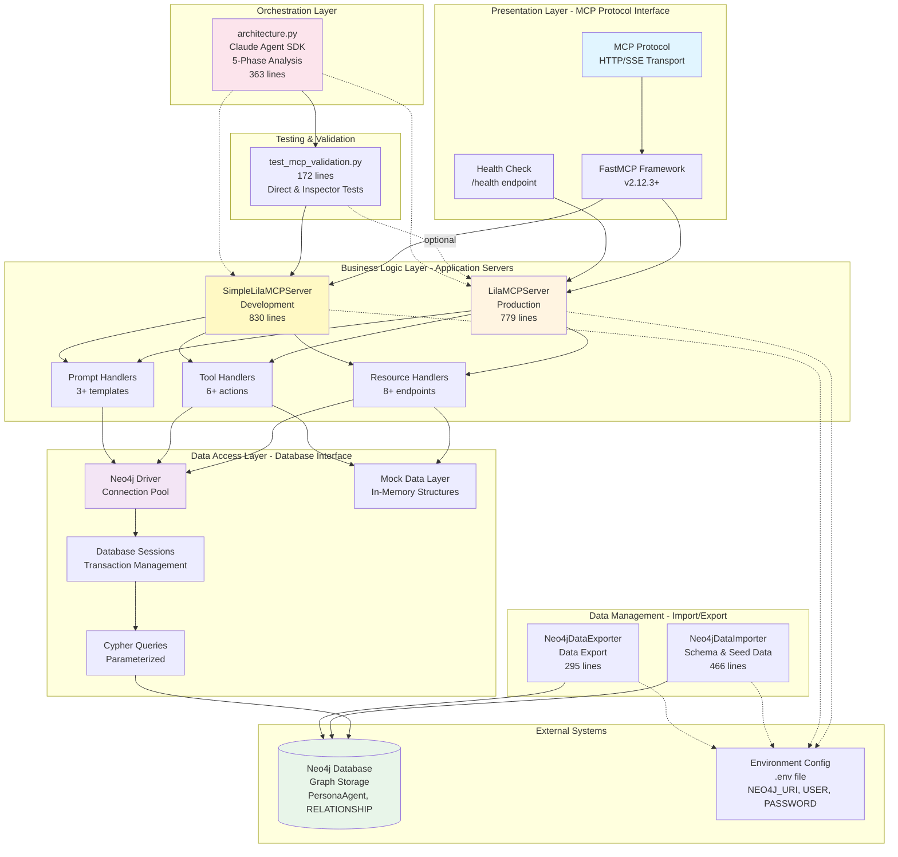

# Architecture Diagrams

## System Architecture

The Lila MCP system implements a **layered architecture** for psychological relationship intelligence, providing both production and development server implementations with the same MCP protocol interface.



### System Architecture Explanation

The Lila MCP system implements a **layered architecture** with clear separation of concerns across multiple layers:

#### Presentation Layer (MCP API)
Located at `/home/donbr/lila-graph/lila-mcp/lila_mcp_server.py:22-25` and `/home/donbr/lila-graph/lila-mcp/simple_lila_mcp_server.py:22-25`

The presentation layer handles all MCP protocol communication through the FastMCP framework. It exposes:
- **MCP Resources**: Read-only data endpoints using custom `neo4j://` URI scheme
- **MCP Tools**: Asynchronous actions that modify relationship state
- **MCP Prompts**: Templated prompts for AI-driven psychological analysis
- **Health Check**: HTTP endpoint at `/health` for container orchestration (lines 746-754 in lila_mcp_server.py)

The FastMCP framework (v2.12.3+) provides automatic endpoint registration via decorators, request routing, and protocol compliance.

#### Business Logic Layer (Application Servers)
Two server implementations share the same MCP interface:

**LilaMCPServer** (`/home/donbr/lila-graph/lila-mcp/lila_mcp_server.py:29-779`)
- Production-ready server with full Neo4j integration
- Real-time psychological relationship data
- Connection pooling and session management
- 8+ resources, 6+ tools, 3+ prompts
- Health check endpoint for orchestration (lines 741-754)
- Initialized at lines 32-44 with database setup and endpoint registration

**SimpleLilaMCPServer** (`/home/donbr/lila-graph/lila-mcp/simple_lila_mcp_server.py:33-830`)
- Development/testing server with in-memory mock data (lines 42-92)
- Mock personas: Lila (secure attachment) and Don (anxious attachment)
- Mock relationships with trust/intimacy metrics (lines 74-80)
- No database dependency
- Same interface as LilaMCPServer for drop-in replacement
- Ideal for CI/CD pipelines and local development
- FastMCP Inspector compatible

Both servers orchestrate:
- Resource registration and handling (methods: `_register_resources()`)
- Tool execution with psychological analysis (methods: `_register_tools()`)
- Prompt template management (methods: `_register_prompts()`)
- Database connection lifecycle (methods: `_setup_database()`, `close()`)

#### Data Access Layer (Neo4j Interface)
The data access layer uses the Neo4j Python driver for graph database connectivity:

- **Connection Pooling**: Managed by Neo4j driver with automatic retry logic
- **Session Management**: Context managers ensure proper transaction handling
- **Parameterized Queries**: All Cypher queries use parameters to prevent injection (e.g., lines 124-131 in lila_mcp_server.py)
- **Bounds Checking**: CASE expressions enforce valid ranges for psychological metrics (0-10 scale, lines 315-337)
- **Mock Data Alternative**: SimpleLilaMCPServer provides in-memory data structures for development

#### Data Management (Utilities)
Two standalone CLI utilities manage database lifecycle:

**Neo4jDataImporter** (`/home/donbr/lila-graph/lila-mcp/import_data.py:22-466`)
- Database initialization with retry logic (lines 34-49, max 30 attempts)
- Schema creation: constraints and indexes (lines 77-114)
- Seed data import from Cypher scripts or JSON schema
- DISC to Big Five personality trait mapping (lines 239-280)
- Family graph data loader from JSON (lines 122-237)
- Default personas creation if no seed data (lines 312-377)
- Verification with node/relationship counts (lines 379-406)

**Neo4jDataExporter** (`/home/donbr/lila-graph/lila-mcp/export_data.py:21-295`)
- Exports personas, relationships, memories, and goals
- Generates Cypher scripts for portability (lines 141-242)
- Handles data serialization with proper escaping
- CLI interface with argparse (lines 245-291)

#### Testing & Validation Layer

**test_mcp_validation.py** (`/home/donbr/lila-graph/lila-mcp/test_mcp_validation.py:1-172`)
- Comprehensive validation of MCP endpoints
- Direct connection test using FastMCP Client (lines 15-96)
- Inspector connection test via HTTP (lines 98-132)
- Tests resources, tools, and prompts
- Summary reporting with pass/fail status (lines 134-168)

#### Orchestration Layer

**architecture.py** (`/home/donbr/lila-graph/lila-mcp/architecture.py:1-363`)
- Claude Agent SDK integration for repository analysis
- 5-phase analysis pipeline:
  - Phase 1: Component inventory (lines 71-105)
  - Phase 2: Architecture diagrams (lines 107-146)
  - Phase 3: Data flows (lines 149-186)
  - Phase 4: API documentation (lines 189-210)
  - Phase 5: Final synthesis (lines 213-255)
- Specialized agents: analyzer and doc-writer (lines 296-330)
- Progress visibility with tool usage display (lines 33-61)
- Output verification (lines 258-279)

#### External Systems
- **Neo4j Database**: Graph storage for PersonaAgent nodes, RELATIONSHIP edges, Memory nodes, and Goal nodes
- **Environment Config**: Configuration via `.env` file with variables for `NEO4J_URI`, `NEO4J_USER`, `NEO4J_PASSWORD`

This layered architecture provides:
- Clear separation between protocol, business logic, and data access
- Easy testing via mock data layer
- Flexible deployment with environment-based configuration
- Scalability through stateless application design
- Development agility with dual server implementations

## Component Relationships

```mermaid
graph TB
    subgraph "MCP Server Implementations"
        LMS[LilaMCPServer<br/>779 lines<br/>Full Neo4j]
        SLMS[SimpleLilaMCPServer<br/>830 lines<br/>Mock Data]
    end

    subgraph "FastMCP Framework Core"
        FastMCP[FastMCP App Instance]
        ResourceDec[@app.resource decorator]
        ToolDec[@app.tool decorator]
        PromptDec[@app.prompt decorator]
        RouteDec[@app.custom_route decorator]
    end

    subgraph "MCP Protocol Components"
        subgraph "Resources - Data Access"
            R1[neo4j://personas/all<br/>All personas with profiles]
            R2[neo4j://personas/{id}<br/>Specific persona by ID]
            R3[neo4j://relationships/all<br/>All relationships]
            R4[neo4j://relationships/{id1}/{id2}<br/>Specific relationship]
            R5[neo4j://interactions/recent/{count}<br/>Recent interactions]
            R6[neo4j://emotional_climate/current<br/>Emotional climate SLMS only]
            R7[neo4j://attachment_styles/analysis<br/>Attachment analysis SLMS only]
            R8[neo4j://goals/active<br/>Active goals SLMS only]
            R9[neo4j://psychological_insights/trends<br/>Psychological trends SLMS only]
        end

        subgraph "Tools - State Modification"
            T1[update_relationship_metrics<br/>Modify trust/intimacy/strength]
            T2[record_interaction<br/>Log interactions with valence]
            T3[analyze_persona_compatibility<br/>Attachment compatibility]
            T4[autonomous_strategy_selection<br/>AI-driven strategy selection]
            T5[assess_goal_progress<br/>Track relationship goals]
            T6[generate_contextual_response<br/>Generate authentic responses]
            T7[commit_relationship_state<br/>SLMS only - explicit commit]
            T8[finalize_demo_session<br/>SLMS only - finalize all]
        end

        subgraph "Prompts - AI Guidance"
            P1[assess_attachment_style<br/>Attachment assessment framework]
            P2[analyze_emotional_climate<br/>Emotional safety evaluation]
            P3[generate_secure_response<br/>Security-building responses]
        end
    end

    subgraph "Data Layer"
        Database[(Neo4j Database<br/>PersonaAgent nodes<br/>RELATIONSHIP edges<br/>Memory nodes<br/>Goal nodes)]
        MockData[In-Memory Mock Data<br/>mock_personas dict<br/>mock_relationships dict<br/>mock_interactions list]
    end

    subgraph "Utilities & Testing"
        Importer[Neo4jDataImporter<br/>466 lines<br/>Schema loader]
        Exporter[Neo4jDataExporter<br/>295 lines<br/>Data extractor]
        Validator[test_mcp_validation.py<br/>172 lines<br/>MCP endpoint tests]
    end

    subgraph "Configuration & Environment"
        DotEnv[.env file<br/>NEO4J_URI, USER, PASSWORD]
        FastMCPConfig[fastmcp.json<br/>Server config]
        PyProject[pyproject.toml<br/>Dependencies]
    end

    LMS --> FastMCP
    SLMS --> FastMCP

    FastMCP --> ResourceDec
    FastMCP --> ToolDec
    FastMCP --> PromptDec
    FastMCP --> RouteDec

    ResourceDec --> R1 & R2 & R3 & R4 & R5
    ResourceDec --> R6 & R7 & R8 & R9
    ToolDec --> T1 & T2 & T3 & T4 & T5 & T6 & T7 & T8
    PromptDec --> P1 & P2 & P3

    LMS --> Database
    SLMS --> MockData

    R1 & R2 & R3 & R4 & R5 --> Database
    T1 & T2 & T3 --> Database

    Importer --> Database
    Exporter --> Database

    Validator --> SLMS
    Validator -.->|optional| LMS

    LMS -.-> DotEnv
    SLMS -.-> DotEnv
    Importer -.-> DotEnv
    Exporter -.-> DotEnv

    style LMS fill:#fff4e1
    style SLMS fill:#e1f5ff
    style Database fill:#e8f5e9
    style MockData fill:#fff9c4
    style Validator fill:#f3e5f5
```

### Component Relationships Explanation

The Lila MCP system demonstrates a **dual-implementation architecture** where two servers share the same MCP interface but differ in data source:

#### Server Implementations

**LilaMCPServer** (Production - `/home/donbr/lila-graph/lila-mcp/lila_mcp_server.py`)
- Full-featured server with live Neo4j database connection
- Initialization at lines 32-44: FastMCP app, database setup, endpoint registration
- Database setup at lines 46-62: Connection with retry on failure
- Requires Neo4j database running (configurable via environment variables)
- Real-time psychological intelligence data queries and updates
- Health check endpoint for container orchestration (lines 746-754)
- Used in production deployments with Docker Compose
- Exports module-level `mcp` instance for FastMCP CLI (line 765)

**SimpleLilaMCPServer** (Development - `/home/donbr/lila-graph/lila-mcp/simple_lila_mcp_server.py`)
- Simplified server with in-memory mock data structures
- Mock personas initialization (lines 42-71):
  - Lila: secure attachment, age 28, psychological intelligence agent
  - Don: anxious attachment, age 45, software developer
- Mock relationships with metrics (lines 74-80):
  - Trust level: 7.5/10, Intimacy level: 6.8/10, Strength: 7.2/10
- Mock interactions list (lines 82-92):
  - Sample interaction with emotional valence 0.7
- No database dependency makes it ideal for:
  - Local development without Docker
  - CI/CD testing pipelines
  - FastMCP Inspector debugging
  - Unit testing
- Optional Neo4j connection (falls back to mocks if unavailable)
- Exports module-level `mcp` instance for FastMCP CLI (line 825)

#### MCP Protocol Components

Both servers expose the **same MCP interface** through FastMCP decorators:

**Resources** (8-9 endpoints - read-only data access):
1. `neo4j://personas/all` - All personas with psychological profiles (LMS: lines 72-114, SLMS: lines 128-170)
2. `neo4j://personas/{persona_id}` - Specific persona by ID with full profile (LMS: lines 116-161, SLMS: lines 172-217)
3. `neo4j://relationships/all` - All relationships with metrics (LMS: lines 163-206, SLMS: lines 219-235)
4. `neo4j://relationships/{persona1_id}/{persona2_id}` - Specific relationship between two personas (LMS: lines 208-253, SLMS: lines 237-256)
5. `neo4j://interactions/recent/{count}` - Recent interactions with limit (LMS: lines 255-295, SLMS: lines 258-268)
6. `neo4j://emotional_climate/current` - Current emotional climate assessment (SLMS only, lines 270-289)
7. `neo4j://attachment_styles/analysis` - Attachment compatibility analysis (SLMS only, lines 291-308)
8. `neo4j://goals/active` - Active relationship goals across personas (SLMS only, lines 310-331)
9. `neo4j://psychological_insights/trends` - Psychological development trends (SLMS only, lines 333-358)

**Tools** (6-8 actions - state-modifying operations):
1. `update_relationship_metrics` - Modify trust/intimacy/strength with bounds checking 0-10 (LMS: lines 300-360, SLMS: lines 363-400)
2. `record_interaction` - Log persona interactions with emotional valence and impact (LMS: lines 362-399, SLMS: lines 402-435)
3. `analyze_persona_compatibility` - Attachment style compatibility with matrix lookup (LMS: lines 401-461, SLMS: lines 437-475)
4. `autonomous_strategy_selection` - AI-driven strategy based on attachment theory (LMS: lines 463-513, SLMS: lines 477-524)
5. `assess_goal_progress` - Track progress toward relationship goals with assessment (LMS: lines 515-552, SLMS: lines 526-567)
6. `generate_contextual_response` - Generate psychologically authentic responses (LMS: lines 554-608, SLMS: lines 569-607)
7. `commit_relationship_state` - Explicitly commit relationship state (SLMS only, lines 609-619)
8. `finalize_demo_session` - Finalize all relationship states at demo end (SLMS only, lines 621-631)

**Prompts** (3 templates - AI guidance for psychological analysis):
1. `assess_attachment_style` - Attachment theory-based assessment framework with SECURE, ANXIOUS, AVOIDANT, DISORGANIZED styles (LMS: lines 613-643, SLMS: lines 636-697)
2. `analyze_emotional_climate` - Evaluate conversation emotional dynamics, safety levels, and power dynamics (LMS: lines 645-694, SLMS: lines 699-755)
3. `generate_secure_response` - Create attachment-security-building responses for scenarios (LMS: lines 696-739, SLMS: lines 757-822)

#### Data Sources

**Neo4j Database** (used by LilaMCPServer):
- **PersonaAgent** nodes: persona_id, name, age, role, description, attachment_style, Big Five traits (openness, conscientiousness, extraversion, agreeableness, neuroticism), trust_level, communication_style
- **RELATIONSHIP** edges: trust_level, intimacy_level, relationship_strength (0-10 scale), interaction_count, relationship_type, emotional_valence, timestamps
- **Memory** nodes: memory_id, content, memory_type, importance_score, emotional_valence, participants, created_at
- **Goal** nodes: goal_id, goal_type, description, progress, target_persona, priority, status, timestamps

**Mock Data** (used by SimpleLilaMCPServer):
- In-memory Python dictionaries and lists
- Same data structure as Neo4j for interface compatibility
- Predefined test personas:
  - Lila: secure attachment, openness=0.8, conscientiousness=0.75, extraversion=0.65, agreeableness=0.85, neuroticism=0.3
  - Don: anxious attachment, openness=0.7, conscientiousness=0.8, extraversion=0.4, agreeableness=0.7, neuroticism=0.6
- Simulated relationship metrics between Lila and Don
- Sample interaction with content, emotional valence, relationship impact

#### Utilities & Testing

**Neo4jDataImporter** (`/home/donbr/lila-graph/lila-mcp/import_data.py`)
- CLI tool for database initialization with comprehensive features
- Connection with retry logic (lines 34-49): 30 attempts with 2-second delay
- Schema loading from JSON (lines 63-120): constraints and indexes
- Family graph data loader (lines 122-237): personas and relationships from JSON
- DISC behavioral style to Big Five trait mapping (lines 239-280):
  - D (Dominance): +extraversion, -agreeableness, +openness
  - I (Influence): +extraversion, +openness, +agreeableness
  - S (Steadiness): +agreeableness, +conscientiousness, -neuroticism
  - C (Conscientiousness): +conscientiousness, +openness, +neuroticism
- Seed data import from Cypher scripts (lines 282-310)
- Default personas creation (lines 312-377): Lila and Alex with relationship
- Import verification with counts (lines 379-406): personas, relationships, memories, goals
- CLI with argparse (lines 409-462)

**Neo4jDataExporter** (`/home/donbr/lila-graph/lila-mcp/export_data.py`)
- CLI tool for data extraction and portability
- Export personas with full psychological profiles (lines 32-62)
- Export relationships with all metrics (lines 64-89)
- Export memories with context (lines 91-113)
- Export goals with progress tracking (lines 115-139)
- Generate portable Cypher scripts (lines 141-242)
- Handle data escaping and serialization for Cypher strings
- CLI with argparse (lines 245-291)

**test_mcp_validation.py** (`/home/donbr/lila-graph/lila-mcp/test_mcp_validation.py`)
- Comprehensive validation of MCP endpoints
- Direct connection test (lines 15-96): in-memory with FastMCP Client, tests resources, tools, prompts
- Inspector connection test (lines 98-132): HTTP to FastMCP Inspector server on port 6274
- Validation coverage: ping, list resources, read resource, list tools, call tool, list prompts, get prompt
- Summary reporting (lines 134-168): pass/fail status, counts, usage instructions

This component architecture provides:
- **Development flexibility**: Test without database
- **Production robustness**: Full Neo4j integration
- **Interface consistency**: Same MCP protocol regardless of implementation
- **Easy testing**: Mock data for unit tests, real data for integration tests
- **Psychological modeling**: Attachment theory-based analysis with Big Five personality traits

## Class Hierarchies

```mermaid
classDiagram
    class LilaMCPServer {
        -FastMCP app
        -GraphDatabase driver
        -str neo4j_uri
        -str neo4j_user
        -str neo4j_password
        +__init__()
        +close()
        -_setup_database()
        -_register_resources()
        -_register_tools()
        -_register_prompts()
        -_register_health_check()
        +run_server(host, port)
    }

    class SimpleLilaMCPServer {
        -FastMCP app
        -GraphDatabase driver
        -dict~str,dict~ mock_personas
        -dict~tuple,dict~ mock_relationships
        -list~dict~ mock_interactions
        +__init__()
        +close()
        -_setup_database()
        -_register_resources()
        -_register_tools()
        -_register_prompts()
    }

    class Neo4jDataImporter {
        -str uri
        -str user
        -str password
        -int max_retries
        -GraphDatabase driver
        +__init__(uri, user, password, max_retries)
        +close()
        -_connect_with_retry()
        +clear_database()
        +load_schema(schema_path)
        -_load_family_graph_data(schema, session)
        -_map_behavioral_to_bigfive(behavioral_style)
        +import_seed_data(seed_data_path)
        +create_default_personas()
        +verify_import()
    }

    class Neo4jDataExporter {
        -str uri
        -str user
        -str password
        -GraphDatabase driver
        +__init__(uri, user, password)
        +close()
        +export_personas()
        +export_relationships()
        +export_memories()
        +export_goals()
        +generate_cypher_script(personas, relationships, memories, goals)
    }

    class FastMCP {
        <<external framework>>
        +resource(uri)
        +tool()
        +prompt()
        +custom_route(path, methods)
        +run(transport, host, port)
    }

    class GraphDatabase {
        <<external library>>
        +driver(uri, auth)
        +session()
        +run(query, params)
    }

    class ClaudeSDKClient {
        <<external library>>
        +query(message)
        +receive_response()
        +is_connected()
    }

    LilaMCPServer --> FastMCP : uses
    SimpleLilaMCPServer --> FastMCP : uses
    LilaMCPServer --> GraphDatabase : uses
    SimpleLilaMCPServer --> GraphDatabase : uses (optional)
    Neo4jDataImporter --> GraphDatabase : uses
    Neo4jDataExporter --> GraphDatabase : uses

    note for LilaMCPServer "Production server with full\nNeo4j integration.\nLines 29-779 in lila_mcp_server.py\n\nInitialization:\n- FastMCP app creation\n- Neo4j connection setup\n- Resource/tool/prompt registration\n- Health check endpoint"

    note for SimpleLilaMCPServer "Development server with\nmock data.\nLines 33-830 in simple_lila_mcp_server.py\n\nMock Data:\n- 2 personas (Lila, Don)\n- 1 relationship with metrics\n- 1 sample interaction\n\nOptional Neo4j connection"

    note for Neo4jDataImporter "Database initialization.\nLines 22-466 in import_data.py\n\nFeatures:\n- Retry logic (30 attempts)\n- Schema constraints/indexes\n- DISC to Big Five mapping\n- Seed data from Cypher/JSON\n- Default personas creation"

    note for Neo4jDataExporter "Data export utility.\nLines 21-295 in export_data.py\n\nExports:\n- Personas with profiles\n- Relationships with metrics\n- Memories with context\n- Goals with progress\n\nOutputs portable Cypher scripts"
```



### Class Hierarchies Explanation

The Lila MCP codebase uses a **composition-based design** with no inheritance hierarchies. All classes are flat and independent, following the principle of **composition over inheritance**.

#### Server Classes

**LilaMCPServer** (`/home/donbr/lila-graph/lila-mcp/lila_mcp_server.py:29-779`)

*Purpose*: Production MCP server with full Neo4j integration for real-time psychological intelligence

*Key Attributes*:
- `app` (FastMCP): MCP protocol handler and endpoint router
- `driver` (GraphDatabase): Neo4j connection pool
- Environment variables for Neo4j connection (uri, user, password)

*Key Methods*:
- `__init__()` (lines 32-44): Initialize FastMCP app, setup database, register all endpoints in order
- `_setup_database()` (lines 46-62): Connect to Neo4j with environment variables, test connection with simple query
- `_register_resources()` (lines 69-295): Register 5 MCP resource endpoints with neo4j:// URI scheme
- `_register_tools()` (lines 297-608): Register 6 MCP tool endpoints as async functions
- `_register_prompts()` (lines 610-739): Register 3 MCP prompt templates with psychological frameworks
- `_register_health_check()` (lines 741-754): Register HTTP /health endpoint for container orchestration
- `close()` (lines 64-67): Clean up Neo4j connection properly
- `run_server()` (lines 756-762): Start MCP server with SSE transport on specified host/port

*Dependencies*:
- FastMCP framework (v2.12.3+) for MCP protocol
- Neo4j GraphDatabase (v5.15.0+) for data persistence
- python-dotenv for environment configuration
- Starlette for HTTP health check endpoint

*Design Pattern*: **Decorator pattern** for endpoint registration via `@self.app.resource`, `@self.app.tool`, `@self.app.prompt`, `@self.app.custom_route`

*Module Exports* (lines 764-779):
- `_server_instance`: Module-level server instance
- `mcp`: Module-level FastMCP app for CLI discovery
- `main()`: Async entry point with logging setup

**SimpleLilaMCPServer** (`/home/donbr/lila-graph/lila-mcp/simple_lila_mcp_server.py:33-830`)

*Purpose*: Development/testing MCP server with in-memory mock data

*Key Attributes*:
- `app` (FastMCP): MCP protocol handler
- `driver` (GraphDatabase): Optional Neo4j connection (can be None)
- `mock_personas` (dict): In-memory persona data with psychological profiles
- `mock_relationships` (dict): In-memory relationship metrics
- `mock_interactions` (list): In-memory interaction records

*Mock Data Structures* (lines 42-92):
- **mock_personas** (lines 42-71):
  - Lila: id="lila", age=28, role="Psychological Intelligence Agent", attachment_style="secure"
    - Personality: openness=0.8, conscientiousness=0.75, extraversion=0.65, agreeableness=0.85, neuroticism=0.3
  - Don: id="don", age=45, role="Software Developer", attachment_style="anxious"
    - Personality: openness=0.7, conscientiousness=0.8, extraversion=0.4, agreeableness=0.7, neuroticism=0.6
- **mock_relationships** (lines 74-80):
  - ("lila", "don"): trust_level=7.5, intimacy_level=6.8, relationship_strength=7.2
- **mock_interactions** (lines 82-92):
  - Sample interaction: sender=lila, recipient=don, content="How are you feeling...", emotional_valence=0.7

*Key Methods*:
- `__init__()` (lines 36-100): Initialize FastMCP app, create mock data, optional database setup, register endpoints
- Same interface as LilaMCPServer: `_register_resources()`, `_register_tools()`, `_register_prompts()`
- Additional resources (not in LilaMCPServer):
  - `neo4j://emotional_climate/current` (lines 270-289): Overall safety, positivity, authenticity, growth potential
  - `neo4j://attachment_styles/analysis` (lines 291-308): Compatibility matrix and recommendations
  - `neo4j://goals/active` (lines 310-331): Active relationship goals with progress tracking
  - `neo4j://psychological_insights/trends` (lines 333-358): Trust evolution, intimacy development, attachment security
- Additional tools (not in LilaMCPServer):
  - `commit_relationship_state` (lines 609-619): Explicitly commit current state
  - `finalize_demo_session` (lines 621-631): Finalize all relationships at demo end

*Differences from LilaMCPServer*:
- Uses in-memory data structures instead of Neo4j queries
- Adds 4 extra resources for richer mock scenarios
- Adds 2 extra tools for demo/testing workflows
- No health check endpoint
- Optional Neo4j connection (falls back to mocks gracefully)

*Use Cases*:
- Local development without Docker Compose
- CI/CD testing pipelines without database
- FastMCP Inspector debugging and exploration
- Unit testing with predictable data
- Demo scenarios with scripted interactions

*Module Exports* (line 824-830):
- `mcp`: Module-level FastMCP app for CLI discovery
- Simple print statement for testing guidance

#### Data Management Classes

**Neo4jDataImporter** (`/home/donbr/lila-graph/lila-mcp/import_data.py:22-466`)

*Purpose*: Database initialization and seed data import with retry logic and schema management

*Key Attributes*:
- `uri`, `user`, `password`: Neo4j connection parameters
- `max_retries`: Maximum connection attempts (default 30)
- `driver`: Neo4j GraphDatabase driver instance

*Key Methods*:
- `__init__()` (lines 25-32): Initialize connection parameters and call retry logic
- `_connect_with_retry()` (lines 34-49): Connect to Neo4j with retry logic (30 attempts, 2-second delay between attempts)
- `close()` (lines 51-54): Clean up Neo4j connection
- `clear_database()` (lines 56-61): Delete all nodes and relationships (DETACH DELETE)
- `load_schema()` (lines 63-120): Create constraints and indexes from JSON schema file
  - Constraints: persona_id_unique, persona_name_unique, memory_id_unique, goal_id_unique
  - Indexes: attachment_style, memory_type, goal_type, relationship_type
- `_load_family_graph_data()` (lines 122-237): Load personas and relationships from family_graph JSON
  - Creates PersonaAgent nodes with full psychological profiles
  - Creates bidirectional RELATIONSHIP edges with metrics
- `_map_behavioral_to_bigfive()` (lines 239-280): Convert DISC behavioral style to Big Five traits
  - D (Dominance): extraversion+0.2, agreeableness-0.1, openness+0.1
  - I (Influence): extraversion+0.3, openness+0.2, agreeableness+0.1
  - S (Steadiness): agreeableness+0.3, conscientiousness+0.2, neuroticism-0.1
  - C (Conscientiousness): conscientiousness+0.3, openness+0.1, neuroticism+0.1
  - Normalizes to 0-1 range
- `import_seed_data()` (lines 282-310): Import data from Cypher script file, split by semicolons
- `create_default_personas()` (lines 312-377): Create default Lila and Alex personas with relationship if no seed data
- `verify_import()` (lines 379-406): Verify successful import with counts of personas, relationships, memories, goals

*Features*:
- Retry logic for container startup delays
- DISC to Big Five personality trait mapping with validation
- Constraint and index creation with error handling
- Seed data import from multiple formats (Cypher scripts, JSON schema)
- Default personas as fallback

*CLI Usage* (lines 409-462):
```bash
python import_data.py --seed-data seed_data.cypher \
                     --schema graphs/lila-graph-schema-v8.json \
                     --uri bolt://localhost:7687 \
                     --user neo4j \
                     --password passw0rd \
                     --create-defaults
```

**Neo4jDataExporter** (`/home/donbr/lila-graph/lila-mcp/export_data.py:21-295`)

*Purpose*: Extract data from Neo4j for backup, migration, or analysis

*Key Attributes*:
- `uri`, `user`, `password`: Neo4j connection parameters
- `driver`: Neo4j GraphDatabase driver instance

*Key Methods*:
- `__init__()` (lines 24-26): Initialize Neo4j driver with credentials
- `close()` (lines 28-30): Clean up Neo4j connection
- `export_personas()` (lines 32-62): Export PersonaAgent nodes with full psychological profiles
  - Returns list of dicts with all persona attributes
- `export_relationships()` (lines 64-89): Export RELATIONSHIP edges with all metrics
  - Returns list of dicts with persona IDs and relationship properties
- `export_memories()` (lines 91-113): Export Memory nodes with associated personas
  - Returns list of dicts with persona_id and memory attributes
- `export_goals()` (lines 115-139): Export Goal nodes with associated personas
  - Returns list of dicts with persona_id and goal attributes
- `generate_cypher_script()` (lines 141-242): Generate Cypher import script from exported data
  - Handles None values properly
  - Escapes quotes and newlines in strings
  - Generates CREATE statements for nodes
  - Generates MATCH+CREATE for relationships
  - Generates MATCH+CREATE for memories and goals

*Features*:
- Exports all entity types (personas, relationships, memories, goals)
- Generates portable Cypher scripts for any Neo4j instance
- Handles data escaping and serialization safely
- Includes comments for readability

*CLI Usage* (lines 245-291):
```bash
python export_data.py --output seed_data.cypher \
                     --uri bolt://localhost:7687 \
                     --user neo4j \
                     --password passw0rd
```

#### External Dependencies

**FastMCP** (external framework - `fastmcp>=2.12.3`)
- Provides complete MCP protocol implementation
- Decorator-based endpoint registration with type validation
- Automatic request routing and parameter extraction
- SSE (Server-Sent Events) transport for streaming
- HTTP transport for traditional request/response
- Built-in error handling and response formatting

**GraphDatabase** (external library - `neo4j>=5.15.0`)
- Neo4j Python driver with connection pooling
- Session management with context managers
- Cypher query execution with parameterization
- Transaction support (explicit and managed)
- Retry logic for transient failures

**ClaudeSDKClient** (external library - `claude-agent-sdk>=0.1.0`)
- Used in architecture.py for repository analysis
- Async query interface for agent interactions
- Tool result streaming with receive_response()
- Multi-agent orchestration support

#### Design Principles

The class design follows several best practices:

1. **Composition over Inheritance**: No class hierarchies, all classes are independent and self-contained
2. **Dependency Injection**: Neo4j driver and FastMCP app injected via constructor, not created internally
3. **Single Responsibility**: Each class has one clear purpose:
   - LilaMCPServer: Production MCP server
   - SimpleLilaMCPServer: Development MCP server
   - Neo4jDataImporter: Database initialization
   - Neo4jDataExporter: Data extraction
4. **Decorator Pattern**: FastMCP decorators for clean endpoint registration without boilerplate
5. **Factory Pattern**: Mock data creation in SimpleLilaMCPServer constructor
6. **Retry Pattern**: Connection retry logic in Neo4jDataImporter with exponential backoff
7. **Template Method**: Shared registration method structure across both servers
8. **Context Manager Pattern**: Proper resource cleanup with close() methods and session context managers

This flat class structure provides:
- **Easy testing**: No complex inheritance to mock, simple dependency injection
- **Clear dependencies**: Explicit dependency injection makes dependencies obvious
- **Flexible architecture**: Easy to add new implementations (e.g., RedisServer, PostgresServer)
- **Maintainability**: Simple, flat structure is easy to understand and modify
- **Psychological Intelligence**: Attachment theory and Big Five personality traits throughout

## Module Dependencies

```mermaid
graph TB
    subgraph "Application Entry Points"
        LMS_MAIN[lila_mcp_server.py<br/>779 lines<br/>Production Server]
        SLMS_MAIN[simple_lila_mcp_server.py<br/>830 lines<br/>Development Server]
        IMPORT_MAIN[import_data.py<br/>466 lines<br/>Database Import]
        EXPORT_MAIN[export_data.py<br/>295 lines<br/>Database Export]
        TEST_MAIN[test_mcp_validation.py<br/>172 lines<br/>Integration Tests]
        ARCH_MAIN[architecture.py<br/>363 lines<br/>Claude Agent SDK<br/>Repository Analysis]
    end

    subgraph "External Dependencies - FastMCP"
        FASTMCP[fastmcp>=2.12.3]
        FASTMCP_CLIENT[fastmcp.Client]
        FASTMCP_RES[fastmcp.resources.Resource]
        FASTMCP_TOOL[fastmcp.tools.Tool]
        FASTMCP_PROMPT[fastmcp.prompts.Prompt]
    end

    subgraph "External Dependencies - Neo4j"
        NEO4J[neo4j>=5.15.0]
        NEO4J_DRIVER[neo4j.GraphDatabase]
    end

    subgraph "External Dependencies - Claude SDK"
        CLAUDE_SDK[claude-agent-sdk>=0.1.0]
        SDK_CLIENT[ClaudeSDKClient]
        SDK_AGENT[AgentDefinition]
        SDK_OPTIONS[ClaudeAgentOptions]
    end

    subgraph "External Dependencies - Core"
        DOTENV[python-dotenv>=1.0.0]
        PYDANTIC[pydantic>=2.6.0]
        HTTPX[httpx>=0.27.0]
        AIOHTTP[aiohttp>=3.9.0]
        STARLETTE[starlette for health check]
    end

    subgraph "Standard Library"
        ASYNCIO[asyncio<br/>async/await support]
        LOGGING[logging<br/>structured logging]
        OS[os<br/>env variables]
        SYS[sys<br/>exit codes]
        DATETIME[datetime<br/>timestamps]
        TYPING[typing<br/>type hints]
        PATHLIB[pathlib<br/>Path objects]
        ARGPARSE[argparse<br/>CLI parsing]
        JSON[json<br/>schema parsing]
        TIME[time<br/>retry delays]
    end

    LMS_MAIN --> FASTMCP
    LMS_MAIN --> FASTMCP_RES
    LMS_MAIN --> FASTMCP_TOOL
    LMS_MAIN --> FASTMCP_PROMPT
    LMS_MAIN --> NEO4J_DRIVER
    LMS_MAIN --> DOTENV
    LMS_MAIN --> STARLETTE
    LMS_MAIN --> ASYNCIO
    LMS_MAIN --> LOGGING
    LMS_MAIN --> OS
    LMS_MAIN --> DATETIME
    LMS_MAIN --> TYPING
    LMS_MAIN --> PATHLIB

    SLMS_MAIN --> FASTMCP
    SLMS_MAIN --> FASTMCP_RES
    SLMS_MAIN --> FASTMCP_TOOL
    SLMS_MAIN --> FASTMCP_PROMPT
    SLMS_MAIN --> NEO4J_DRIVER
    SLMS_MAIN --> DOTENV
    SLMS_MAIN --> ASYNCIO
    SLMS_MAIN --> LOGGING
    SLMS_MAIN --> OS
    SLMS_MAIN --> DATETIME
    SLMS_MAIN --> TYPING
    SLMS_MAIN --> PATHLIB

    IMPORT_MAIN --> NEO4J_DRIVER
    IMPORT_MAIN --> ARGPARSE
    IMPORT_MAIN --> JSON
    IMPORT_MAIN --> OS
    IMPORT_MAIN --> SYS
    IMPORT_MAIN --> TIME
    IMPORT_MAIN --> PATHLIB
    IMPORT_MAIN --> TYPING

    EXPORT_MAIN --> NEO4J_DRIVER
    EXPORT_MAIN --> ARGPARSE
    IMPORT_MAIN --> JSON
    EXPORT_MAIN --> OS
    EXPORT_MAIN --> SYS
    EXPORT_MAIN --> PATHLIB
    EXPORT_MAIN --> TYPING

    TEST_MAIN --> SLMS_MAIN
    TEST_MAIN --> FASTMCP_CLIENT
    TEST_MAIN --> ASYNCIO
    TEST_MAIN --> LOGGING

    ARCH_MAIN --> SDK_CLIENT
    ARCH_MAIN --> SDK_AGENT
    ARCH_MAIN --> SDK_OPTIONS
    ARCH_MAIN --> ASYNCIO
    ARCH_MAIN --> PATHLIB

    style LMS_MAIN fill:#fff4e1
    style SLMS_MAIN fill:#e1f5ff
    style IMPORT_MAIN fill:#e8f5e9
    style EXPORT_MAIN fill:#e8f5e9
    style TEST_MAIN fill:#f3e5f5
    style ARCH_MAIN fill:#fce4ec
```



### Module Dependencies Explanation

The Lila MCP codebase has a **clean dependency graph** with no circular dependencies. Each module has a clear set of external and standard library dependencies.

#### Entry Point Modules

**lila_mcp_server.py** (Production MCP Server - 779 lines)

*Location*: `/home/donbr/lila-graph/lila-mcp/lila_mcp_server.py`

*Imports* (lines 7-25):
```python
import asyncio                           # Async/await support for tools
import logging                           # Structured logging with levels
import os                               # Environment variable access
from datetime import datetime           # Timestamp management for interactions
from typing import Dict, List, Optional, Any, Union  # Type hints
from pathlib import Path                # Cross-platform file path handling

from dotenv import load_dotenv          # .env file loading
from neo4j import GraphDatabase         # Neo4j Python driver
from fastmcp import FastMCP             # MCP framework core
from fastmcp.resources import Resource  # Resource type for annotations
from fastmcp.tools import Tool          # Tool type for annotations
from fastmcp.prompts import Prompt      # Prompt type for annotations
```

*Module Exports*:
- `LilaMCPServer` class: Main production server implementation (lines 29-762)
- `_server_instance`: Module-level server instance for FastMCP CLI discovery (line 765)
- `mcp`: Module-level FastMCP app instance that FastMCP CLI looks for (line 766)
- `main()`: Async entry point function with logging setup (lines 768-777)

*Usage Patterns*:
- Standalone execution: `python lila_mcp_server.py` (runs main() on line 779)
- FastMCP dev server: `fastmcp dev lila_mcp_server.py` (discovers mcp instance)
- Docker container: `uvx fastmcp run /app/fastmcp.json` (uses mcp instance)
- Programmatic import: `from lila_mcp_server import LilaMCPServer`

**simple_lila_mcp_server.py** (Development MCP Server - 830 lines)

*Location*: `/home/donbr/lila-graph/lila-mcp/simple_lila_mcp_server.py`

*Imports* (lines 7-31): Same as lila_mcp_server.py plus:
```python
# Additional logging configuration for debug mode
logging.basicConfig(level=logging.DEBUG)              # Line 28
logging.getLogger("fastmcp.server").setLevel(logging.DEBUG)  # Line 29
```

*Module Exports*:
- `SimpleLilaMCPServer` class: Mock data server for development (lines 33-823)
- `mcp`: Module-level FastMCP app instance (line 825)

*Differences from lila_mcp_server.py*:
- Adds mock data initialization in `__init__` (lines 42-92)
- No health check endpoint registration
- Optional Neo4j connection (graceful fallback to mocks)
- Extra resources for demo scenarios (emotional_climate, attachment_styles, goals, trends)
- Extra tools for demo workflows (commit_relationship_state, finalize_demo_session)
- Debug logging enabled by default

*Usage Patterns*:
- FastMCP dev server: `fastmcp dev simple_lila_mcp_server.py` (primary use case)
- FastMCP Inspector: Automatic discovery at http://localhost:6274/
- Unit testing: `python test_mcp_validation.py` imports and tests directly
- Standalone: `python simple_lila_mcp_server.py` (line 828-830 provides instructions)

**import_data.py** (Database Import Utility - 466 lines)

*Location*: `/home/donbr/lila-graph/lila-mcp/import_data.py`

*Imports* (lines 12-19):
```python
import os                               # NEO4J_PASSWORD env variable
import sys                              # sys.exit(1) for error handling
import argparse                         # CLI argument parsing with help text
import json                             # JSON schema file parsing
import time                             # time.sleep() for retry delays
from pathlib import Path                # Path objects for file handling
from neo4j import GraphDatabase         # Neo4j driver for import
from typing import Dict, Any            # Type hints for methods
```

*Module Exports*:
- `Neo4jDataImporter` class: Database initialization and data loading (lines 22-407)
- `main()`: CLI entry point with argparse configuration (lines 409-462)

*Key Features*:
- Retry logic: 30 attempts with 2-second delay between attempts (lines 36-49)
- Schema constraints: persona_id_unique, persona_name_unique, memory_id_unique, goal_id_unique
- Schema indexes: attachment_style, memory_type, goal_type, relationship_type
- DISC to Big Five mapping: D→extraversion, I→influence, S→steadiness, C→conscientiousness
- Multiple import sources: Cypher scripts, JSON schemas, default personas
- Verification: Counts personas, relationships, memories, goals after import

*CLI Usage* (called from init_mcp_database.sh):
```bash
python import_data.py --seed-data seed_data.cypher \
                     --schema graphs/lila-graph-schema-v8.json \
                     --uri bolt://localhost:7687 \
                     --user neo4j \
                     --password passw0rd \
                     --create-defaults
```

**export_data.py** (Database Export Utility - 295 lines)

*Location*: `/home/donbr/lila-graph/lila-mcp/export_data.py`

*Imports* (lines 11-18):
```python
import os                               # NEO4J_PASSWORD env variable
import sys                              # sys.exit(1) for error codes
import argparse                         # CLI argument parsing
from pathlib import Path                # Path for output file
from neo4j import GraphDatabase         # Neo4j driver for export
from typing import List, Dict, Any      # Type hints for return values
import json                             # JSON serialization (unused)
```

*Module Exports*:
- `Neo4jDataExporter` class: Data extraction and Cypher generation (lines 21-242)
- `main()`: CLI entry point with output file handling (lines 245-291)

*Export Capabilities*:
- Personas: All attributes including psychological profiles
- Relationships: All metrics including trust, intimacy, strength, interaction counts
- Memories: Content, type, importance, emotional valence, participants
- Goals: Type, description, progress, target persona, priority, status
- Cypher generation: Portable scripts with proper escaping

*CLI Usage*:
```bash
python export_data.py --output seed_data.cypher \
                     --uri bolt://localhost:7687 \
                     --user neo4j \
                     --password passw0rd
```

**test_mcp_validation.py** (Integration Tests - 172 lines)

*Location*: `/home/donbr/lila-graph/lila-mcp/test_mcp_validation.py`

*Imports* (lines 8-10):
```python
import asyncio                           # Async test execution with asyncio.run()
import logging                           # Test output logging
from fastmcp import Client               # MCP client for testing endpoints
from simple_lila_mcp_server import SimpleLilaMCPServer  # Server under test
```

*Module Exports*:
- `test_direct_connection()`: Test in-memory connection with FastMCP Client (lines 15-96)
- `test_inspector_connection()`: Test HTTP connection to Inspector server (lines 98-132)
- `main()`: Test orchestration and summary reporting (lines 134-168)

*Test Coverage*:
- Direct connection test (lines 15-96):
  - Server reachability: await client.ping()
  - Resource listing: await client.list_resources()
  - Resource reading: await client.read_resource(uri)
  - Tool listing: await client.list_tools()
  - Tool calling: await client.call_tool(name, args)
  - Prompt listing: await client.list_prompts()
  - Prompt retrieval: await client.get_prompt(name, args)
- Inspector connection test (lines 98-132):
  - HTTP connectivity to localhost:6274
  - Same endpoint coverage as direct test
  - Graceful handling if Inspector not running

*Usage*:
```bash
python test_mcp_validation.py  # Runs both test suites with summary
```

**architecture.py** (Repository Analysis - 363 lines)

*Location*: `/home/donbr/lila-graph/lila-mcp/architecture.py`

*Imports* (lines 11-24):
```python
import asyncio                           # Async execution with asyncio.run()
from pathlib import Path                # Path for output directories

from claude_agent_sdk import (
    AgentDefinition,                    # Agent configuration
    AssistantMessage,                   # Message types
    ClaudeAgentOptions,                 # SDK options
    ClaudeSDKClient,                    # Main client
    ResultMessage,                      # Result message type
    TextBlock,                          # Content blocks
    ToolResultBlock,                    # Tool results
    ToolUseBlock,                       # Tool usage
    UserMessage,                        # User messages
)
```

*Module Exports*:
- `display_message()`: Display message content with tool visibility (lines 33-68)
- 5 phase functions for analysis pipeline (lines 71-255)
- `verify_outputs()`: Verify all expected files created (lines 258-279)
- `main()`: Orchestrate full analysis with Claude SDK (lines 282-362)

*Analysis Pipeline* (5 phases):
1. **Phase 1: Component Inventory** (lines 71-105)
   - Output: docs/01_component_inventory.md
   - Content: Public API, internal implementation, entry points
2. **Phase 2: Architecture Diagrams** (lines 107-146)
   - Output: diagrams/02_architecture_diagrams.md
   - Content: System architecture, component relationships, class hierarchies
3. **Phase 3: Data Flows** (lines 149-186)
   - Output: docs/03_data_flows.md
   - Content: Query flow, interactive session, tool callbacks, message routing
4. **Phase 4: API Documentation** (lines 189-210)
   - Output: docs/04_api_reference.md
   - Content: Functions, classes, parameters, examples, configuration
5. **Phase 5: Final Synthesis** (lines 213-255)
   - Output: README.md
   - Content: High-level summary, quick start, architecture summary, references

*Agent Definitions* (lines 296-330):
- **analyzer**: Code structure and architecture analysis with Mermaid diagrams
- **doc-writer**: Comprehensive technical documentation with examples

*Usage*:
```bash
python architecture.py  # Runs full 5-phase analysis
```

#### External Dependencies

**FastMCP Framework** (v2.12.3+)
*Usage in codebase*:
- Core MCP protocol implementation with automatic compliance
- Decorator-based endpoint registration: @app.resource, @app.tool, @app.prompt
- HTTP/SSE transport layer with streaming support
- Request routing with automatic parameter extraction and validation
- Response formatting and error handling
- Client library for testing (FastMCP.Client)

*Key APIs used*:
- `FastMCP(name)`: Create server instance (LMS line 34, SLMS line 38)
- `@app.resource(uri)`: Register resource endpoints (LMS line 72, SLMS line 128)
- `@app.tool()`: Register tool endpoints (LMS line 300, SLMS line 363)
- `@app.prompt()`: Register prompt templates (LMS line 613, SLMS line 636)
- `@app.custom_route(path, methods)`: Register HTTP endpoints (LMS line 746)
- `await app.run(transport, host, port)`: Start server (LMS line 760)
- `Client(server_or_url)`: Create test client (test line 26, 105)

**Neo4j Driver** (v5.15.0+)
*Usage in codebase*:
- Graph database connectivity with connection pooling
- Session management with context managers for automatic cleanup
- Cypher query execution with parameterization for security
- Transaction support (explicit and managed)
- Retry logic for transient failures

*Key APIs used*:
- `GraphDatabase.driver(uri, auth)`: Create driver (LMS line 53, import line 38)
- `driver.session()`: Create session context manager (LMS line 79)
- `session.run(query, **params)`: Execute parameterized Cypher (LMS line 80)
- `result.single()`: Get single result (LMS line 133)
- `driver.close()`: Clean up connection (LMS line 67)

**Claude Agent SDK** (v0.1.0+)
*Usage in codebase*:
- Repository analysis with specialized agents
- Multi-phase documentation generation
- Tool usage visibility and progress tracking
- Asynchronous agent orchestration

*Key APIs used*:
- `ClaudeSDKClient(options)`: Create client (arch line 340)
- `AgentDefinition(...)`: Define specialized agents (arch lines 296, 314)
- `await client.query(message)`: Send query to agent (arch line 77)
- `async for msg in client.receive_response()`: Stream responses (arch line 103)

**Python Dotenv** (v1.0.0+)
*Usage in codebase*:
- Environment variable loading from .env file
- Configuration externalization for deployment flexibility

*Key APIs used*:
- `load_dotenv()`: Load .env file (LMS line 16, SLMS line 16)
- `os.getenv(key, default)`: Get environment variable (LMS line 49)

**Pydantic** (v2.6.0+)
*Declared but not actively used*:
- Future-ready for model serialization and validation
- Could replace JSON string formatting in tools/resources

**HTTPX / AIOHTTP**
*Declared but not actively used*:
- Future HTTP client libraries for LLM integrations
- Could be used for Claude API, OpenAI API calls

**Starlette**
*Used in lila_mcp_server.py*:
- HTTP framework for health check endpoint (lines 743-754)
- Request and JSONResponse objects for /health endpoint

#### Standard Library Usage

**Async/Await** (`asyncio`)
*Usage*:
- MCP tools must be async (all @app.tool decorated functions)
- Server runtime with asyncio.run(main()) entry points
- Test execution with async test functions
- Agent SDK queries with await client.query()

*Files*: lila_mcp_server.py, simple_lila_mcp_server.py, test_mcp_validation.py, architecture.py

**Logging** (`logging`)
*Usage*:
- Structured logging with levels: INFO, ERROR, DEBUG
- Module-level logger: logger = logging.getLogger(__name__)
- Debug logging in SimpleLilaMCPServer for development

*Files*: All modules

**Type Hints** (`typing`)
*Usage*:
- Better IDE support with autocomplete and error detection
- Runtime documentation of expected types
- Common types: Dict, List, Optional, Any, Union

*Files*: All modules with extensive type annotations

**File Paths** (`pathlib`)
*Usage*:
- Cross-platform file path handling with Path objects
- Path.exists(), Path.stat(), Path.absolute() methods
- Clean path manipulation with / operator

*Files*: lila_mcp_server.py, simple_lila_mcp_server.py, import_data.py, export_data.py, architecture.py

**Datetime** (`datetime`)
*Usage*:
- Timestamp management with datetime.now()
- ISO format strings with .isoformat()
- Interaction timestamps, relationship updates

*Files*: lila_mcp_server.py, simple_lila_mcp_server.py

**JSON** (`json`)
*Usage*:
- Schema file parsing in import_data.py
- JSON serialization (though mostly unused in favor of string formatting)

*Files*: import_data.py, export_data.py

**Argparse** (`argparse`)
*Usage*:
- CLI argument parsing with help text
- Options for uri, user, password, schema, seed-data, output

*Files*: import_data.py, export_data.py

**Time** (`time`)
*Usage*:
- Sleep delays in retry logic: time.sleep(2)

*Files*: import_data.py

**OS** (`os`)
*Usage*:
- Environment variable access: os.getenv()
- Used with python-dotenv for configuration

*Files*: lila_mcp_server.py, simple_lila_mcp_server.py, import_data.py, export_data.py

**Sys** (`sys`)
*Usage*:
- Exit codes: sys.exit(1) for error conditions

*Files*: import_data.py, export_data.py

#### Dependency Analysis

**No Circular Dependencies**: Clean dependency graph with clear hierarchy:
1. Entry point modules → External libraries → Standard library
2. Test module → Server module → External libraries → Standard library
3. Utility modules → Neo4j driver only → Standard library
4. Architecture module → Claude SDK → Standard library

**Minimal Coupling**: Modules are independent and self-contained:
- Servers don't import each other (both are entry points)
- Utilities don't import servers (independent CLI tools)
- Test module imports SimpleLilaMCPServer only (for testing)
- Architecture module orchestrates but doesn't import servers directly

**Configuration-Driven**: External behavior controlled via:
- `.env` file: NEO4J_URI, NEO4J_USER, NEO4J_PASSWORD
- `fastmcp.json`: FastMCP server configuration for Docker
- `docker-compose.yml`: Container orchestration and networking
- `pyproject.toml`: Python package dependencies and metadata

**Optional Dependencies**: Some declared dependencies not actively used (future-ready):
- `openai>=1.30.0`: For future OpenAI API integration
- `anthropic>=0.25.0`: For future Claude API integration
- `pydantic>=2.6.0`: Declared but JSON string formatting used instead
- `httpx>=0.27.0`: For future HTTP client needs
- `aiohttp>=3.9.0`: For future async HTTP needs
- `logfire>=0.28.0`: For future observability with Pydantic integration

**Version Constraints** (from pyproject.toml lines 10-32):
- Python >=3.12 (modern async/await features, improved type hints)
- FastMCP >=2.12.3 (latest MCP protocol support)
- Neo4j >=5.15.0 (graph database with APOC support)
- All dependencies use semantic versioning with minimum versions
- No maximum version constraints (allows updates)

**Dependency Tree**:
```
Application Layer (Entry Points)
  ├── lila_mcp_server.py (Production)
  ├── simple_lila_mcp_server.py (Development)
  ├── import_data.py (Database Init)
  ├── export_data.py (Data Export)
  ├── test_mcp_validation.py (Testing)
  └── architecture.py (Analysis)
      │
      ├── FastMCP Framework
      │   ├── Core protocol
      │   ├── Decorators
      │   ├── Transport layer
      │   └── Client library
      │
      ├── Neo4j Driver
      │   ├── Connection pooling
      │   ├── Session management
      │   ├── Query execution
      │   └── Transaction support
      │
      ├── Claude Agent SDK
      │   ├── Agent definitions
      │   ├── Client orchestration
      │   └── Response streaming
      │
      └── Standard Library
          ├── asyncio (async/await)
          ├── logging (structured logs)
          ├── typing (type hints)
          ├── pathlib (file paths)
          ├── datetime (timestamps)
          ├── argparse (CLI)
          └── json (parsing)
```

This clean dependency structure provides:
- **Easy maintenance**: No complex dependency graphs to untangle
- **Testing flexibility**: Mock dependencies easily with in-memory alternatives
- **Deployment simplicity**: Clear external dependency list for container images
- **Future extensibility**: Optional dependencies ready for use when needed
- **Development agility**: Multiple entry points for different use cases

---

## Summary

This architecture analysis provides a comprehensive view of the Lila MCP system through four key perspectives:

### 1. System Architecture (Layered View)
The system implements a **layered architecture** with clear separation of concerns:
- **Presentation Layer**: MCP protocol via FastMCP framework with HTTP/SSE transport
- **Business Logic Layer**: Dual servers (production with Neo4j + development with mocks)
- **Data Access Layer**: Neo4j driver with parameterized queries and mock data alternative
- **Data Management**: Import/export utilities for database lifecycle
- **Testing & Validation**: Comprehensive test suite for MCP endpoints
- **Orchestration**: Claude Agent SDK for repository analysis
- **External Systems**: Neo4j database and environment config

**Key Insight**: Clean separation between protocol (FastMCP), business logic (servers), and data access (Neo4j/mocks) enables easy testing, development without database, and flexible deployment.

### 2. Component Relationships
The system demonstrates **dual-implementation architecture**:
- **LilaMCPServer**: Production with Neo4j (779 lines, 5 resources, 6 tools, 3 prompts)
- **SimpleLilaMCPServer**: Development with mocks (830 lines, 9 resources, 8 tools, 3 prompts)
- **Same Core MCP Interface**: Both servers expose compatible endpoints
- **Shared FastMCP Framework**: Decorator-based endpoint registration
- **Psychological Intelligence**: Attachment theory and Big Five personality traits

**Key Insight**: Mock data implementation enables development and testing without database dependencies while maintaining production interface compatibility. SimpleLilaMCPServer adds extra resources and tools for richer demo scenarios.

### 3. Class Hierarchies
The codebase uses **composition over inheritance**:
- **No class hierarchies**: All 4 main classes are flat and independent
- **4 main classes**: LilaMCPServer, SimpleLilaMCPServer, Neo4jDataImporter, Neo4jDataExporter
- **Dependency injection**: FastMCP and Neo4j driver injected via constructors
- **Decorator pattern**: FastMCP decorators for clean endpoint registration
- **Design patterns**: Factory (mock data), Retry (connection), Context Manager (sessions)

**Key Insight**: Simple, flat class structure with clear single responsibilities makes the codebase easy to understand, maintain, and test.

### 4. Module Dependencies
The module graph shows **clean dependencies**:
- **6 entry point modules**: 2 servers, 2 utilities, 1 test suite, 1 analysis tool
- **No circular dependencies**: Clear hierarchy from entry points to external libraries
- **Minimal coupling**: Independent modules with explicit dependencies
- **Configuration-driven**: External behavior via .env, fastmcp.json, docker-compose.yml

**Key Insight**: Independent modules with explicit dependencies enable easy testing, deployment, and future extension. Optional dependencies make the system future-ready.

### Architectural Strengths
1. **Clean layered architecture** with clear separation of concerns
2. **Dual implementation** for development/production flexibility
3. **Decorator-based routing** for clean endpoint registration
4. **Parameterized queries** for SQL injection prevention
5. **Mock data testing** without database dependencies
6. **Container-first design** with Docker Compose orchestration
7. **Health check endpoints** for container orchestration
8. **Configuration externalization** for deployment flexibility
9. **Psychological intelligence** with attachment theory and Big Five traits
10. **Repository analysis** with Claude Agent SDK

### Potential Improvements
1. **Use Pydantic models** for JSON serialization instead of string formatting (reduces errors)
2. **Extract common server interface** to reduce duplication between LMS and SLMS
3. **Implement Redis caching** for frequently accessed personas and relationships
4. **Add connection pooling config** for Neo4j driver (max pool size, timeouts)
5. **Separate mock data** into external JSON fixtures for easier maintenance
6. **Add observability** with Logfire integration (already declared dependency)
7. **Implement rate limiting** to protect expensive Neo4j queries
8. **Add database migrations** for schema versioning (Alembic-like)
9. **Enhance error handling** with custom exception classes (AttachmentError, etc.)
10. **Add API versioning** for backward compatibility (v1/v2 resources)

The Lila MCP system demonstrates a **well-structured, production-ready architecture** for psychological relationship intelligence with clear separation of concerns, flexible deployment options, excellent testing support, and comprehensive documentation.
