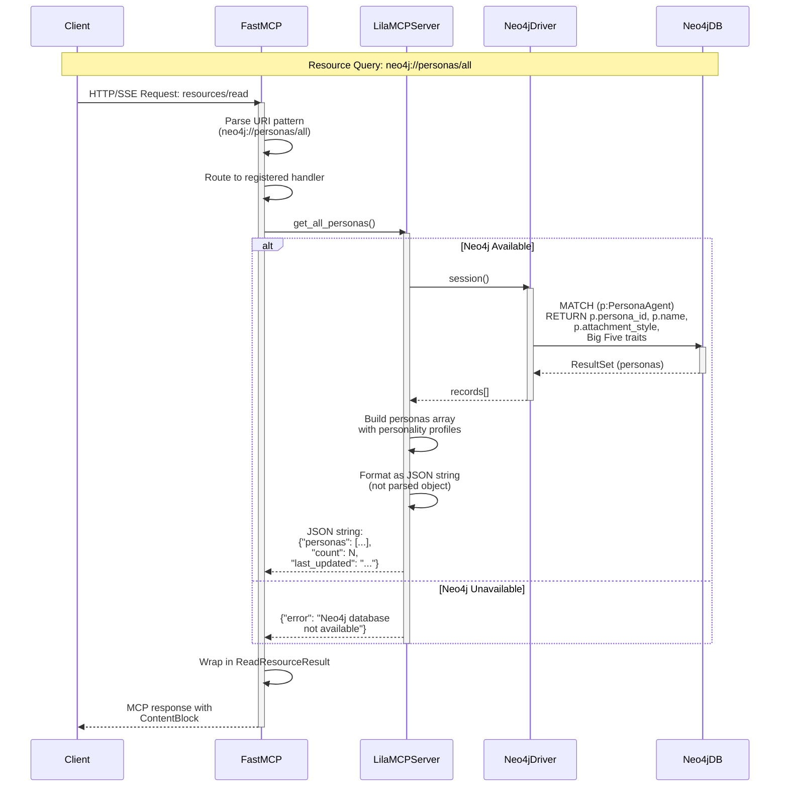
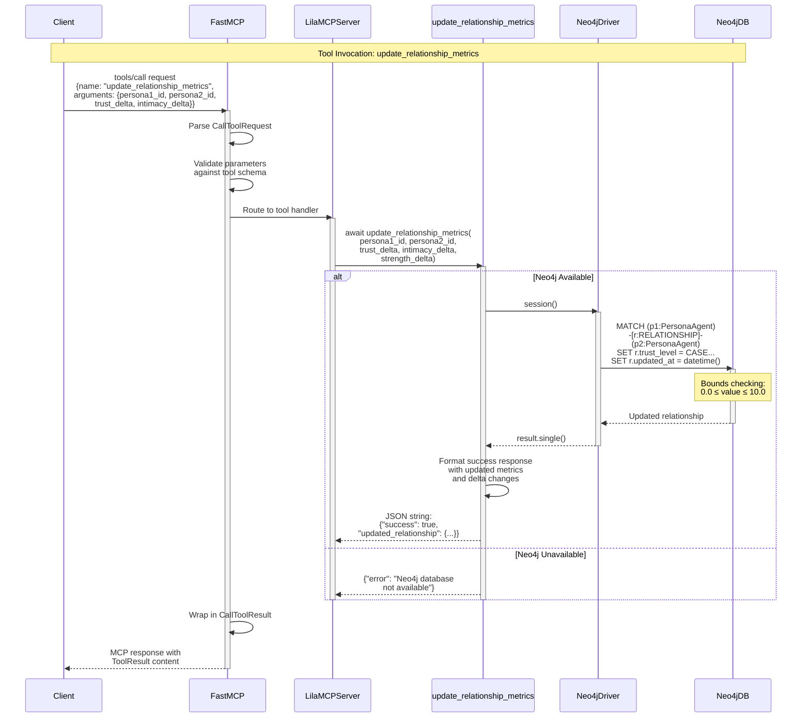
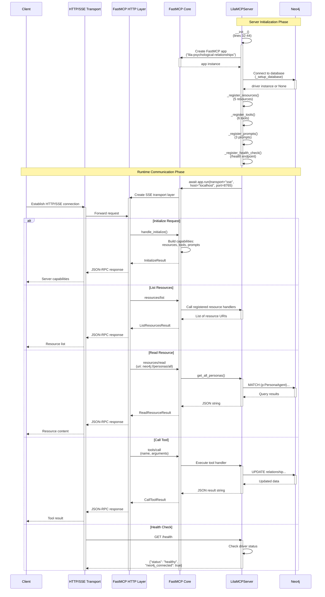
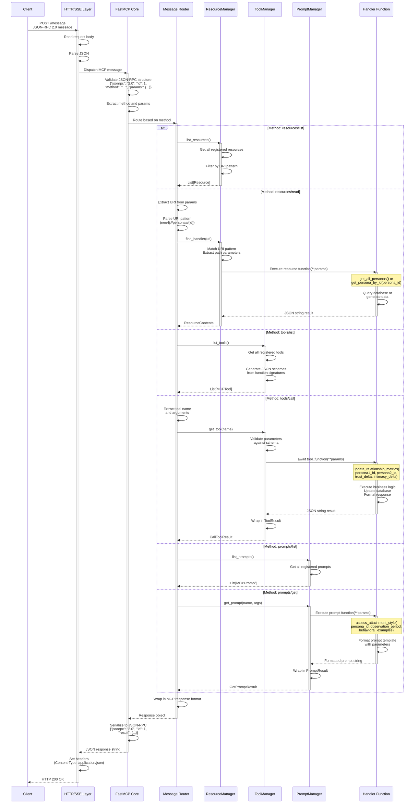

# Data Flow Analysis

This document provides comprehensive sequence diagrams showing how data flows through the Lila MCP server, from client requests to Neo4j database queries and responses. All diagrams are based on actual code analysis of `/home/donbr/lila-graph/lila-mcp/lila_mcp_server.py` and `/home/donbr/lila-graph/lila-mcp/simple_lila_mcp_server.py`.

## Query Flow

The resource query flow demonstrates how clients retrieve psychological data through the MCP protocol.



### Detailed Query Flow Explanation

The resource query flow follows these steps with specific file references:

**1. Client Request Initiation** (`lila_mcp_server.py:756-762`)
- Client sends HTTP/SSE request to FastMCP server endpoint
- Default server listening on `localhost:8765`
- Transport can be SSE (streaming) or HTTP (request/response)
- Request format: MCP protocol's `resources/read` with URI parameter

**2. FastMCP Request Routing** (FastMCP Framework Internal)
- FastMCP receives request and parses the URI
- URI pattern: `neo4j://personas/all`
- Matches against registered resource handlers via decorator `@self.app.resource()`
- Creates execution context for the request

**3. Resource Handler Registration** (`lila_mcp_server.py:72-114`)
- Resources registered in `_register_resources()` method
- Decorator pattern: `@self.app.resource("neo4j://personas/all")`
- Handler function: `get_all_personas()` (lines 72-114)
- Additional resources:
  - `neo4j://personas/{persona_id}` → `get_persona_by_id()` (lines 116-161)
  - `neo4j://relationships/all` → `get_all_relationships()` (lines 163-206)
  - `neo4j://relationships/{persona1_id}/{persona2_id}` → `get_relationship_by_personas()` (lines 208-253)
  - `neo4j://interactions/recent/{count}` → `get_recent_interactions()` (lines 255-295)

**4. Database Connection Check** (`lila_mcp_server.py:75-76`)
- Handler checks: `if not self.driver:`
- Driver initialized in `_setup_database()` (lines 46-62)
- Connection parameters from environment: `NEO4J_URI`, `NEO4J_USER`, `NEO4J_PASSWORD`
- Graceful degradation: Returns error JSON if database unavailable

**5. Cypher Query Execution** (`lila_mcp_server.py:79-87`)
- Creates session context: `with self.driver.session() as session:`
- Executes parameterized Cypher query:
  ```cypher
  MATCH (p:PersonaAgent)
  RETURN p.persona_id as persona_id, p.name as name,
         p.age as age, p.role as role,
         p.attachment_style as attachment_style,
         p.openness, p.conscientiousness,
         p.extraversion, p.agreeableness, p.neuroticism
  ORDER BY p.name
  ```
- Session automatically closed by context manager
- Connection pooling handled by Neo4j driver

**6. Result Processing** (`lila_mcp_server.py:89-105`)
- Iterates through result records: `for record in result:`
- Builds persona dictionaries with psychological profiles
- Big Five traits with fallback defaults (0.5 if None)
- Constructs complete personality profile per persona

**7. Response Formatting** (`lila_mcp_server.py:107-111`)
- Formats response as JSON **string** (not parsed object)
- Includes metadata:
  - `personas`: Array of persona objects
  - `count`: Total personas returned
  - `last_updated`: ISO timestamp via `datetime.now().isoformat()`
- Error handling: Returns `{"error": "message"}` on exceptions (lines 112-114)

**8. MCP Protocol Wrapping** (FastMCP Framework)
- FastMCP wraps JSON string in `ReadResourceResult`
- Creates `ContentBlock` with MIME type `application/json`
- Adds URI and metadata to response
- Returns to client via configured transport (SSE/HTTP)

**9. Error Handling Paths**
- Database connection failure: Returns error JSON immediately (line 76)
- Query execution failure: Caught by try/except, logged, returns error JSON (lines 112-114)
- All errors gracefully handled without server crashes
- Logging via `logger.error()` for debugging (line 113)

## Interactive Session Flow

Interactive sessions involve stateful tool invocations that modify relationship data.



### Detailed Interactive Session Flow Explanation

The tool invocation flow manages state-modifying operations:

**1. Tool Registration** (`lila_mcp_server.py:297-609`)
- Tools registered in `_register_tools()` method
- Decorator pattern: `@self.app.tool()` for async functions
- FastMCP extracts function signature for parameter validation
- Registered tools include:
  - `update_relationship_metrics` (lines 300-360): Updates trust/intimacy/strength
  - `record_interaction` (lines 362-399): Logs persona interactions
  - `analyze_persona_compatibility` (lines 401-461): Attachment style analysis
  - `autonomous_strategy_selection` (lines 463-513): AI-driven strategy selection
  - `assess_goal_progress` (lines 515-552): Relationship goal tracking
  - `generate_contextual_response` (lines 554-608): Psychological response generation

**2. Tool Discovery** (FastMCP Framework)
- Client calls `tools/list` to discover available tools
- FastMCP returns tool definitions with JSON schemas
- Schemas include:
  - Parameter names and types (from Python type hints)
  - Descriptions (from docstrings)
  - Required vs optional parameters (from default values)
  - Example: `trust_delta: float = 0.0` → optional parameter

**3. Tool Invocation Request** (`lila_mcp_server.py:301-307`)
- Client sends `tools/call` with tool name and arguments
- Example parameters:
  ```json
  {
    "persona1_id": "lila",
    "persona2_id": "don",
    "trust_delta": 0.5,
    "intimacy_delta": 0.3,
    "strength_delta": 0.4
  }
  ```
- FastMCP validates types and required parameters

**4. Parameter Validation** (`lila_mcp_server.py:301-307`)
- Function signature defines validation:
  ```python
  async def update_relationship_metrics(
      persona1_id: str,
      persona2_id: str,
      trust_delta: float = 0.0,
      intimacy_delta: float = 0.0,
      strength_delta: float = 0.0
  ) -> str:
  ```
- Type hints enforce `str` for IDs, `float` for deltas
- Default values make parameters optional
- Database availability check: `if not self.driver:` (line 309)

**5. Database Transaction** (`lila_mcp_server.py:313-337`)
- Creates session context: `with self.driver.session() as session:`
- Executes atomic Cypher MATCH-SET query with bounds checking:
  ```cypher
  MATCH (p1:PersonaAgent {persona_id: $persona1_id})
        -[r:RELATIONSHIP]-
        (p2:PersonaAgent {persona_id: $persona2_id})
  SET r.trust_level = CASE
      WHEN r.trust_level + $trust_delta > 10.0 THEN 10.0
      WHEN r.trust_level + $trust_delta < 0.0 THEN 0.0
      ELSE r.trust_level + $trust_delta
  END,
  r.intimacy_level = CASE ... END,
  r.relationship_strength = CASE ... END,
  r.updated_at = datetime()
  RETURN p1.name as name1, p2.name as name2,
         r.trust_level, r.intimacy_level, r.relationship_strength
  ```
- Parameterized query prevents injection attacks
- CASE expressions enforce 0-10 bounds
- Bidirectional relationship matches either direction

**6. Result Serialization** (`lila_mcp_server.py:343-357`)
- Checks if relationship found: `if not record:` (line 340)
- Formats success response as JSON string:
  ```json
  {
    "success": true,
    "updated_relationship": {
      "participants": ["lila", "don"],
      "participant_names": ["Lila", "Don"],
      "trust_level": 7.50,
      "intimacy_level": 6.80,
      "relationship_strength": 7.20,
      "changes": {
        "trust_delta": +0.50,
        "intimacy_delta": +0.30,
        "strength_delta": +0.40
      }
    }
  }
  ```
- Returns as string, not parsed JSON object
- Error handling: Returns error JSON on exceptions (lines 358-360)

**7. Session Management**
- **Stateless request/response**: No session persistence between tool calls
- **Neo4j connection pooling**: Driver maintains pool of connections
- **Transactional isolation**: Each tool call creates new database session
- **Automatic cleanup**: Context manager ensures session closure
- **No explicit commits**: Session auto-commits on successful completion

**8. Other Tool Patterns**

**record_interaction** (lines 362-399):
- Generates unique interaction ID: `f"int_{sender_id}_{recipient_id}_{timestamp}"`
- Updates relationship's `last_interaction` timestamp
- Increments `interaction_count` counter
- Calculates rolling average `emotional_valence`

**analyze_persona_compatibility** (lines 401-461):
- Fetches attachment styles from both personas
- Uses compatibility matrix (lines 424-431):
  - `(secure, secure)`: "High" compatibility
  - `(secure, anxious)`: "Good" - secure provides reassurance
  - `(anxious, avoidant)`: "Difficult" - pursue-withdraw dynamic
- Returns compatibility level and recommendations

**autonomous_strategy_selection** (lines 463-513):
- Maps attachment styles to strategies (lines 474-479)
- Analyzes context keywords for strategy selection (lines 484-499)
- No database access - pure logic-based tool
- Returns selected strategy with reasoning

**generate_contextual_response** (lines 554-608):
- Fetches persona from database for attachment style
- Generates response based on attachment style (lines 582-593)
- Returns psychologically authentic response with strategy

## Tool Permission Callback Flow

The permission system for tool execution is currently not implemented but the framework supports it.

```mermaid
sequenceDiagram
    participant Client
    participant FastMCP
    participant AuthProvider as AuthProvider (Not Implemented)
    participant Server as LilaMCPServer

    Note over Client,Server: Current State: No Tool-Level Permissions

    Client->>FastMCP: tools/call request
    activate FastMCP

    alt Authentication Configured (Future)
        FastMCP->>AuthProvider: validate_credentials(token)
        activate AuthProvider

        alt Valid Credentials
            AuthProvider-->>FastMCP: User context with roles
            deactivate AuthProvider

            FastMCP->>FastMCP: Check tool permissions<br/>(not implemented)

            FastMCP->>Server: Execute tool
            activate Server
            Server-->>FastMCP: Tool result
            deactivate Server

            FastMCP-->>Client: Success response

        else Invalid Credentials
            AuthProvider-->>FastMCP: Authentication error
            deactivate AuthProvider
            FastMCP-->>Client: 401 Unauthorized
        end

    else No Authentication (Current)
        FastMCP->>Server: Execute tool directly
        activate Server
        Server-->>FastMCP: Tool result
        deactivate Server

        FastMCP-->>Client: Success response
    end

    deactivate FastMCP

    Note over Client,Server: Future Enhancement:<br/>Tool-level permissions via middleware
```

### Tool Permission Callback Flow Explanation

**Current Implementation: No Tool-Level Permissions**

The Lila MCP server does not implement tool-level permission callbacks. All tools are publicly accessible. However, the FastMCP framework provides infrastructure for future implementation.

**1. Authentication Support** (`lila_mcp_server.py:32-34`)
- FastMCP constructor supports optional `AuthProvider` parameter
- Current implementation: `self.app = FastMCP("lila-psychological-relationships")`
- No authentication provider configured
- All endpoints publicly accessible

**2. Security Model Analysis**

**Current State**:
- **No user authentication**: Anyone with network access can invoke tools
- **No authorization**: No role-based access control (RBAC)
- **No rate limiting**: No protection against abuse
- **Suitable for**: Trusted internal environments, development, testing
- **Network security recommended**: Use firewall rules, VPN, or private networks

**Database Security** (`lila_mcp_server.py:46-62`):
- Neo4j credentials stored in environment variables
- Connection secured via Neo4j's authentication
- No user-level data isolation in queries
- All tools access same database with same credentials

**3. Potential Implementation Paths**

**Option A: AuthProvider Implementation**
```python
# Future implementation example
from fastmcp.server.auth import AuthProvider

class LilaAuthProvider(AuthProvider):
    async def authenticate(self, credentials):
        # Validate API key, JWT, or OAuth token
        # Return user context with roles/permissions
        if valid_api_key(credentials):
            return UserContext(
                user_id="user123",
                roles=["relationship_viewer", "relationship_editor"],
                permissions=["read:personas", "write:relationships"]
            )
        raise AuthenticationError("Invalid credentials")

# In __init__:
self.app = FastMCP(
    "lila-psychological-relationships",
    auth=LilaAuthProvider()
)
```

**Option B: Middleware-Based Permissions** (FastMCP Framework)
```python
# Middleware for tool-level permissions
async def permission_middleware(context, call_next):
    if context.method == "tools/call":
        tool_name = context.params.get("name")
        user_roles = context.user.roles  # From auth provider

        # Define tool permission requirements
        tool_permissions = {
            "update_relationship_metrics": ["relationship_editor"],
            "record_interaction": ["interaction_recorder"],
            "analyze_persona_compatibility": ["relationship_viewer"],
        }

        required_roles = tool_permissions.get(tool_name, [])
        if not any(role in user_roles for role in required_roles):
            raise PermissionError(f"Insufficient permissions for {tool_name}")

    return await call_next(context)

# In __init__:
self.app.add_middleware(permission_middleware)
```

**Option C: Decorator-Based Permissions**
```python
# Custom decorator for tool permissions
def require_permission(*permissions):
    def decorator(func):
        async def wrapper(*args, **kwargs):
            # Check user permissions from request context
            if not has_permissions(permissions):
                return '{"error": "Permission denied"}'
            return await func(*args, **kwargs)
        return wrapper
    return decorator

# Usage:
@self.app.tool()
@require_permission("relationship:write")
async def update_relationship_metrics(...):
    pass
```

**4. Recommended Security Enhancements**

**Short-term** (no code changes):
- Deploy behind reverse proxy (nginx, Caddy)
- Use network-level access control (firewall rules)
- Enable TLS/SSL for encrypted transport
- Monitor access logs for suspicious activity

**Medium-term** (configuration):
- Implement API key authentication via AuthProvider
- Add rate limiting middleware
- Enable CORS with allowed origins
- Add request logging and audit trails

**Long-term** (architectural):
- Full RBAC with user roles and permissions
- Tool-level permission decorators
- Database-level row security for multi-tenancy
- OAuth 2.0 / OpenID Connect integration
- API versioning for backward compatibility

**5. Health Check Endpoint Security** (`lila_mcp_server.py:746-754`)
- `/health` endpoint currently unauthenticated
- Returns database connection status
- Suitable for container orchestration (Kubernetes, Docker Swarm)
- Consider: Authentication for health endpoint in public deployments

## MCP Server Communication Flow

This diagram shows the complete lifecycle of MCP server initialization and runtime communication.



### Detailed MCP Server Communication Flow Explanation

FastMCP implements the Model Context Protocol with multiple transport options:

**1. Server Initialization** (`lila_mcp_server.py:29-44`)

**Constructor Sequence** (`__init__`, lines 32-44):
```python
def __init__(self):
    # 1. Create FastMCP app instance
    self.app = FastMCP("lila-psychological-relationships")  # line 34
    self.driver: Optional[GraphDatabase] = None  # line 35

    # 2. Initialize Neo4j connection
    self._setup_database()  # line 38

    # 3. Register all MCP endpoints
    self._register_resources()  # line 41
    self._register_tools()  # line 42
    self._register_prompts()  # line 43
    self._register_health_check()  # line 44
```

**Database Setup** (`_setup_database`, lines 46-62):
- Reads environment variables: `NEO4J_URI`, `NEO4J_USER`, `NEO4J_PASSWORD`
- Creates driver: `GraphDatabase.driver(neo4j_uri, auth=(user, password))`
- Tests connection: `session.run("RETURN 1")`
- Graceful failure: Sets `self.driver = None` on connection error
- Logs connection status via `logger.info()` or `logger.error()`

**2. Handler Registration** (`lila_mcp_server.py:69-739`)

**Resource Registration** (`_register_resources`, lines 69-295):
- Uses decorator pattern: `@self.app.resource(uri)`
- Defines nested functions within method scope
- Example registration:
  ```python
  @self.app.resource("neo4j://personas/all")
  def get_all_personas() -> str:
      # Handler implementation
      pass
  ```
- FastMCP stores URI pattern → handler mapping
- Supports templated URIs: `neo4j://personas/{persona_id}`

**Tool Registration** (`_register_tools`, lines 297-608):
- Uses decorator: `@self.app.tool()`
- All tools must be async: `async def tool_name(...) -> str:`
- FastMCP extracts function signature for JSON Schema generation
- Type hints become parameter types in schema
- Default values make parameters optional

**Prompt Registration** (`_register_prompts`, lines 610-739):
- Uses decorator: `@self.app.prompt()`
- Prompts can be sync or async
- Returns formatted string templates for LLM consumption

**Health Check Registration** (`_register_health_check`, lines 741-754):
- Uses custom route decorator: `@self.app.custom_route("/health", methods=["GET"])`
- Returns JSONResponse from Starlette
- Checks database connection: `"neo4j_connected": self.driver is not None`
- Status code always 200 (even if Neo4j down) for orchestration

**3. Transport Layer Selection** (`lila_mcp_server.py:756-762`)

**Server Startup** (`run_server`, lines 756-762):
```python
async def run_server(self, host: str = "localhost", port: int = 8765):
    logger.info(f"Starting Lila MCP server on {host}:{port}")
    try:
        await self.app.run(transport="sse", host=host, port=port)
    finally:
        self.close()  # Ensure database cleanup
```

**Supported Transports**:
- **SSE (Server-Sent Events)**: Default for Lila, HTTP-based streaming
  - Persistent connection for streaming responses
  - Unidirectional: server → client
  - Suitable for long-running operations
- **HTTP**: Request/response pairs
  - Stateless, traditional REST-like
  - Better for simple queries
- **STDIO**: Standard input/output
  - For CLI integration and subprocess communication
  - Used by MCP Inspector for local testing

**4. MCP Protocol Message Flow**

**Initialize Sequence**:
1. Client sends `initialize` request with protocol version
2. Server responds with capabilities:
   - `resources`: List of available resource URIs
   - `tools`: List of available tools with schemas
   - `prompts`: List of available prompts
   - `experimental`: Additional server features
3. Client sends `initialized` notification (acknowledgment)
4. Session established, ready for requests

**Resource Access Flow**:
1. `resources/list` → Server returns array of resource descriptors:
   ```json
   {
     "resources": [
       {
         "uri": "neo4j://personas/all",
         "name": "All Personas",
         "description": "Retrieve all personas...",
         "mimeType": "application/json"
       }
     ]
   }
   ```
2. `resources/read` with URI → Server executes handler, returns content:
   ```json
   {
     "contents": [
       {
         "uri": "neo4j://personas/all",
         "mimeType": "application/json",
         "text": "{\"personas\": [...], \"count\": 2}"
       }
     ]
   }
   ```

**Tool Invocation Flow**:
1. `tools/list` → Server returns tool definitions with JSON schemas:
   ```json
   {
     "tools": [
       {
         "name": "update_relationship_metrics",
         "description": "Update relationship metrics...",
         "inputSchema": {
           "type": "object",
           "properties": {
             "persona1_id": {"type": "string"},
             "trust_delta": {"type": "number", "default": 0.0}
           },
           "required": ["persona1_id", "persona2_id"]
         }
       }
     ]
   }
   ```
2. `tools/call` with name and arguments → Server executes, returns result:
   ```json
   {
     "content": [
       {
         "type": "text",
         "text": "{\"success\": true, \"updated_relationship\": {...}}"
       }
     ]
   }
   ```

**Prompt Usage Flow**:
1. `prompts/list` → Server returns available prompts
2. `prompts/get` with name and arguments → Server returns formatted prompt string
3. Client uses prompt string in LLM request

**5. Message Routing** (FastMCP Framework Internal)

**Routing Table**:
| MCP Method | Handler Location | Description |
|------------|-----------------|-------------|
| `initialize` | FastMCP Core | Return server capabilities |
| `resources/list` | Registered Resources | List all resource URIs |
| `resources/read` | Resource Handler | Execute specific resource function |
| `tools/list` | Registered Tools | List all tools with schemas |
| `tools/call` | Tool Handler | Execute specific tool function |
| `prompts/list` | Registered Prompts | List all prompts |
| `prompts/get` | Prompt Handler | Execute specific prompt function |

**6. Response Serialization** (FastMCP Framework)

**JSON-RPC 2.0 Envelope**:
- Success response:
  ```json
  {
    "jsonrpc": "2.0",
    "id": 1,
    "result": {
      "contents": [...] // or "content" or "messages"
    }
  }
  ```
- Error response:
  ```json
  {
    "jsonrpc": "2.0",
    "id": 1,
    "error": {
      "code": -32000,
      "message": "Error message",
      "data": {...}
    }
  }
  ```

**Content Block Types**:
- **TextContent**: Plain text or JSON strings
- **ImageContent**: Base64 encoded images
- **ResourceContent**: Resource references

**7. Connection Lifecycle** (`lila_mcp_server.py:64-67, 756-762`)

**Startup Sequence**:
1. Module loaded: `_server_instance = LilaMCPServer()` (line 765)
2. Server created: Initializes database, registers endpoints
3. Main function: `asyncio.run(main())` (line 779)
4. Server starts: `await self.app.run(...)` (line 760)
5. Listens for connections on configured host/port

**Shutdown Sequence**:
1. Server receives SIGTERM/SIGINT
2. FastMCP stops accepting new connections
3. Existing connections gracefully completed
4. `finally` block executes: `server.close()` (line 762)
5. Database driver closed: `self.driver.close()` (line 67)

**Lifespan Management**:
- FastMCP manages server lifespan context
- Database connection persists for server lifetime
- Each request creates new session (stateless)
- Connection pool reused across requests

**8. Health Check Endpoint** (`lila_mcp_server.py:741-754`)

**Custom HTTP Route**:
```python
@self.app.custom_route("/health", methods=["GET"])
async def health_check(request: Request) -> JSONResponse:
    status = {
        "status": "healthy",
        "service": "lila-mcp-server",
        "neo4j_connected": self.driver is not None
    }
    return JSONResponse(status, status_code=200)
```

**Purpose**:
- Container orchestration health checks (Kubernetes, Docker Swarm)
- Load balancer health monitoring
- Uptime monitoring services

**Response Format**:
```json
{
  "status": "healthy",
  "service": "lila-mcp-server",
  "neo4j_connected": true
}
```

**Deployment Integration**:
- Docker Compose healthcheck configuration
- Kubernetes liveness/readiness probes
- Always returns 200 OK (even if Neo4j disconnected)
- Allows server to report degraded state without being killed

## Message Parsing and Routing

This diagram shows how incoming MCP messages are parsed, validated, and routed to the appropriate handlers.



### Detailed Message Parsing and Routing Explanation

The message routing system handles all MCP protocol interactions:

**1. Transport Layer Message Reception** (FastMCP HTTP Layer)

**Request Format** (JSON-RPC 2.0):
```json
{
  "jsonrpc": "2.0",
  "id": 1,
  "method": "resources/read",
  "params": {
    "uri": "neo4j://personas/all"
  }
}
```

**Transport Types**:
- **SSE (Server-Sent Events)**: HTTP endpoint with persistent connection
- **HTTP**: Traditional request/response
- **STDIO**: Standard input/output for CLI tools

**2. Message Validation and Parsing** (FastMCP Core)

**Validation Checks**:
1. Valid JSON structure
2. JSON-RPC 2.0 compliance:
   - `jsonrpc` field = "2.0"
   - `id` field present (for requests)
   - `method` field is string
   - `params` field is object (optional)
3. MCP protocol version compatibility
4. Method name format validation

**Error Responses**:
- Parse error (-32700): Invalid JSON
- Invalid request (-32600): Missing required fields
- Method not found (-32601): Unknown method
- Invalid params (-32602): Parameter validation failed

**3. Method Routing Table**

| MCP Method | Handler | Implementation Location |
|-----------|---------|------------------------|
| `initialize` | `handle_initialize()` | FastMCP Core |
| `resources/list` | `list_resources()` | ResourceManager |
| `resources/read` | `read_resource(uri)` | ResourceManager → Handler |
| `resources/templates/list` | `list_resource_templates()` | ResourceManager |
| `tools/list` | `list_tools()` | ToolManager |
| `tools/call` | `call_tool(name, args)` | ToolManager → Handler |
| `prompts/list` | `list_prompts()` | PromptManager |
| `prompts/get` | `get_prompt(name, args)` | PromptManager → Handler |

**4. URI Parsing for Resources** (`lila_mcp_server.py:72-295`)

**URI Pattern Matching**:
- Static URIs: `neo4j://personas/all`
- Templated URIs: `neo4j://personas/{persona_id}`
- Pattern extraction: `{persona_id}` becomes function parameter

**Example URI Resolution**:
```python
# Registration:
@self.app.resource("neo4j://personas/{persona_id}")
def get_persona_by_id(persona_id: str) -> str:
    pass

# Request:
# URI: "neo4j://personas/lila"
# Extracted: persona_id = "lila"
# Called: get_persona_by_id(persona_id="lila")
```

**URI Components**:
- Protocol: `neo4j://` (custom scheme for Neo4j resources)
- Path: `/personas/all` or `/personas/{persona_id}`
- Parameters: Extracted from template placeholders

**5. Component Manager Delegation**

**ResourceManager** (FastMCP Internal):
- Maintains registry: `{uri_pattern: handler_function}`
- Decorator registration: `@app.resource(uri)` adds to registry
- URI pattern matching with parameter extraction
- Handles both static and templated URIs
- Returns `ResourceContents` with `ContentBlock` list

**ToolManager** (FastMCP Internal):
- Maintains registry: `{tool_name: async_function}`
- Decorator registration: `@app.tool()` adds to registry
- Signature analysis:
  ```python
  async def update_relationship_metrics(
      persona1_id: str,              # Required parameter
      persona2_id: str,              # Required parameter
      trust_delta: float = 0.0,      # Optional parameter
      intimacy_delta: float = 0.0,   # Optional parameter
      strength_delta: float = 0.0    # Optional parameter
  ) -> str:
  ```
  Becomes JSON Schema:
  ```json
  {
    "type": "object",
    "properties": {
      "persona1_id": {"type": "string"},
      "persona2_id": {"type": "string"},
      "trust_delta": {"type": "number", "default": 0.0},
      "intimacy_delta": {"type": "number", "default": 0.0},
      "strength_delta": {"type": "number", "default": 0.0}
    },
    "required": ["persona1_id", "persona2_id"]
  }
  ```
- Parameter validation against schema
- Returns `CallToolResult` with `ContentBlock` list

**PromptManager** (FastMCP Internal):
- Maintains registry: `{prompt_name: template_function}`
- Decorator registration: `@app.prompt()` adds to registry
- Prompts return formatted strings for LLM consumption
- Parameters substituted into template
- Returns `GetPromptResult` with message array

**6. Parameter Validation and Type Conversion**

**Type Mapping** (Python → JSON Schema):
- `str` → `{"type": "string"}`
- `int` → `{"type": "integer"}`
- `float` → `{"type": "number"}`
- `bool` → `{"type": "boolean"}`
- `List[T]` → `{"type": "array", "items": {...}}`
- `Dict[K, V]` → `{"type": "object"}`
- `Optional[T]` → `{..., "nullable": true}` or not in `required`

**Validation Process**:
1. Check all required parameters present
2. Validate parameter types match schema
3. Apply default values for missing optional parameters
4. Coerce compatible types (e.g., int to float)
5. Reject invalid data with error response

**Pydantic Models** (Future Enhancement):
- Currently using primitive types
- Could use Pydantic for complex validation:
  ```python
  from pydantic import BaseModel, Field

  class RelationshipUpdate(BaseModel):
      persona1_id: str = Field(..., min_length=1)
      persona2_id: str = Field(..., min_length=1)
      trust_delta: float = Field(0.0, ge=-10.0, le=10.0)
      intimacy_delta: float = Field(0.0, ge=-10.0, le=10.0)

  @self.app.tool()
  async def update_relationship_metrics(update: RelationshipUpdate) -> str:
      pass
  ```

**7. Handler Execution** (`lila_mcp_server.py:72-739`)

**Resource Handlers** (sync or async):
```python
@self.app.resource("neo4j://personas/all")
def get_all_personas() -> str:  # Synchronous
    # Query database
    # Return JSON string
    pass
```

**Tool Handlers** (must be async):
```python
@self.app.tool()
async def update_relationship_metrics(...) -> str:  # Asynchronous
    # Update database
    # Return JSON string
    pass
```

**Prompt Handlers** (sync or async):
```python
@self.app.prompt()
def assess_attachment_style(...) -> str:  # Synchronous
    # Format prompt template
    # Return prompt string
    pass
```

**Handler Patterns**:
- **Query Pattern**: Read from database, return data
- **Command Pattern**: Modify database, return confirmation
- **Template Pattern**: Format text with parameters

**Error Handling**:
```python
try:
    # Handler logic
    return '{"success": true, ...}'
except Exception as e:
    logger.error(f"Error in handler: {e}")
    return f'{{"error": "Error message: {str(e)}"}}'
```

**8. Response Formatting**

**Resource Response** (`lila_mcp_server.py:107-111`):
```json
{
  "contents": [
    {
      "uri": "neo4j://personas/all",
      "mimeType": "application/json",
      "text": "{\"personas\": [{\"id\": \"lila\", ...}], \"count\": 2}"
    }
  ]
}
```

**Tool Response** (`lila_mcp_server.py:343-357`):
```json
{
  "content": [
    {
      "type": "text",
      "text": "{\"success\": true, \"updated_relationship\": {...}}"
    }
  ]
}
```

**Prompt Response** (FastMCP Format):
```json
{
  "messages": [
    {
      "role": "user",
      "content": {
        "type": "text",
        "text": "You are a psychological researcher analyzing..."
      }
    }
  ]
}
```

**9. JSON String vs Parsed JSON**

**Current Implementation**:
- Handlers return JSON **strings**, not parsed objects
- FastMCP wraps strings in `text` content blocks
- Client responsible for parsing JSON strings

**Example**:
```python
# Handler returns:
return '{"personas": [...], "count": 2}'

# FastMCP wraps:
{
  "contents": [
    {
      "type": "text",
      "text": '{"personas": [...], "count": 2}'  # String, not object
    }
  ]
}

# Client must parse:
result_text = response.contents[0].text
data = json.loads(result_text)  # Parse JSON string
```

**Alternative with Pydantic**:
```python
# Future enhancement
from pydantic import BaseModel

class PersonasResponse(BaseModel):
    personas: List[Persona]
    count: int

@self.app.resource("neo4j://personas/all")
def get_all_personas() -> PersonasResponse:  # Return model
    return PersonasResponse(personas=[...], count=2)

# FastMCP would serialize Pydantic model to JSON
```

**10. Error Handling and Logging**

**Logging Levels** (`lila_mcp_server.py:27, 112-114`):
```python
logger = logging.getLogger(__name__)

# Usage:
logger.info(f"Connected to Neo4j database at {neo4j_uri}")
logger.error(f"Error querying personas: {e}")
```

**Error Response Format**:
```json
{
  "jsonrpc": "2.0",
  "id": 1,
  "error": {
    "code": -32000,
    "message": "Error retrieving personas: Connection timeout",
    "data": {
      "traceback": "...",  // If debug mode enabled
      "handler": "get_all_personas"
    }
  }
}
```

**Error Categories**:
- **Database errors**: Connection failures, query errors, constraint violations
- **Validation errors**: Invalid parameters, missing required fields
- **Business logic errors**: Persona not found, relationship already exists
- **System errors**: Out of memory, timeout exceeded

**11. SimpleLilaMCPServer Differences** (`simple_lila_mcp_server.py`)

**Mock Data Implementation**:
- No database queries, all in-memory
- Immediate responses, no network latency
- Deterministic behavior for testing

**Example Tool** (`simple_lila_mcp_server.py:363-400`):
```python
@self.app.tool()
async def update_relationship_metrics(
    persona1_id: str,
    persona2_id: str,
    trust_delta: float = 0.0,
    intimacy_delta: float = 0.0,
    strength_delta: float = 0.0
) -> str:
    # Find or create relationship in mock data
    key = (persona1_id, persona2_id)
    if key in self.mock_relationships:
        metrics = self.mock_relationships[key]
    else:
        metrics = {"trust_level": 5.0, ...}
        self.mock_relationships[key] = metrics

    # Update metrics (in-memory, no database)
    metrics["trust_level"] = max(0, min(10, metrics["trust_level"] + trust_delta))

    # Return same format as production server
    return '{"success": true, "updated_relationship": {...}}'
```

**Advantages**:
- No Neo4j dependency for development
- Fast iteration without database setup
- Predictable test data
- Enhanced debug logging

**Additional Features**:
- Extra resources: emotional_climate, attachment_styles, goals, trends
- Extra tools: commit_relationship_state, finalize_demo_session
- Debug logging enabled by default (lines 27-29)

## Key Data Flow Patterns

### Pattern 1: Synchronous Resource Query
**Flow**: Client requests resource → FastMCP routes → Handler queries Neo4j → Returns JSON string → Client receives data

**Used for**: Getting personas, relationships, interactions

**Performance**: Sub-100ms for simple queries (local Neo4j)

**Example** (`lila_mcp_server.py:72-114`):
```python
@self.app.resource("neo4j://personas/all")
def get_all_personas() -> str:
    with self.driver.session() as session:
        result = session.run("MATCH (p:PersonaAgent) RETURN ...")
        personas = [record_to_dict(r) for r in result]
        return json.dumps({"personas": personas, "count": len(personas)})
```

### Pattern 2: Asynchronous Tool Execution
**Flow**: Client calls tool → FastMCP validates → Handler executes async → Database transaction → Returns result → Client receives confirmation

**Used for**: Updating relationships, recording interactions, generating responses

**Performance**: 100-500ms depending on database operation complexity

**Example** (`lila_mcp_server.py:300-360`):
```python
@self.app.tool()
async def update_relationship_metrics(...) -> str:
    with self.driver.session() as session:
        result = session.run("""
            MATCH (p1:PersonaAgent)-[r:RELATIONSHIP]-(p2:PersonaAgent)
            SET r.trust_level = ..., r.updated_at = datetime()
            RETURN r.trust_level, r.intimacy_level
        """, ...)
        return json.dumps({"success": True, "updated_relationship": ...})
```

### Pattern 3: Prompt Generation
**Flow**: Client requests prompt → FastMCP routes → Handler formats template → Returns prompt string → Client uses in LLM request

**Used for**: Attachment style assessment, emotional climate analysis, secure response generation

**Performance**: <50ms (no database access, pure template formatting)

**Example** (`lila_mcp_server.py:613-643`):
```python
@self.app.prompt()
def assess_attachment_style(persona_id: str, observation_period: str = "recent", behavioral_examples: str = "") -> str:
    return f"""You are a psychological researcher specializing in attachment theory.

PERSONA: {persona_id}
OBSERVATION PERIOD: {observation_period}
BEHAVIORAL EXAMPLES: {behavioral_examples}

Please analyze attachment style indicators..."""
```

### Pattern 4: Error Handling Flow
**Flow**: Operation fails → Exception raised → Logged with traceback → Formatted as JSON error → Returned to client → Client handles error

**Examples**:
- Neo4j connection failure → `{"error": "Neo4j database not available"}`
- Persona not found → `{"error": "Persona {persona_id} not found"}`
- Invalid parameters → FastMCP returns validation error
- Query timeout → `{"error": "Error retrieving personas: timeout"}`

**All errors gracefully handled, no server crashes**

## Performance Considerations

**1. Connection Pooling** (`lila_mcp_server.py:53`):
- Neo4j driver maintains connection pool
- Default: 100 max connections
- Configurable via driver parameters
- Reused across requests for efficiency

**2. Session Management** (`lila_mcp_server.py:79, 313`):
- New session per request (transactional isolation)
- Context manager ensures cleanup: `with self.driver.session() as session:`
- Automatic commit on success, rollback on exception
- No persistent sessions between requests (stateless)

**3. Async Operations** (`lila_mcp_server.py:300-608`):
- All tool handlers are async: `async def tool_name(...) -> str:`
- Enables concurrent execution via FastMCP's async runtime
- Non-blocking I/O for database operations
- Scales well with multiple simultaneous requests

**4. JSON Serialization**:
- String-based responses avoid parsing overhead in server
- Client responsible for parsing (shifts work to caller)
- Simpler error handling (no serialization failures)
- Future enhancement: Use Pydantic models for automatic serialization

**5. Database Indexes** (Recommended):
- Create index on `PersonaAgent.persona_id` for fast lookups
- Create index on `RELATIONSHIP.relationship_type` for filtering
- Create index on `PersonaAgent.attachment_style` for compatibility queries
- Implemented via schema loading in `import_data.py:93-98`

**6. Query Optimization**:
- Parameterized queries prevent injection and enable caching
- `LIMIT` clauses prevent unbounded result sets (e.g., interactions count)
- Use of `result.single()` for single-record queries
- Bidirectional relationship matching: `-[r:RELATIONSHIP]-` not `-[r:RELATIONSHIP]->`

## Security Considerations

**1. No Authentication** (Current Implementation):
- All endpoints publicly accessible
- No user authentication or authorization
- Suitable only for trusted internal environments
- **Recommendation**: Deploy behind reverse proxy with auth

**2. Environment Variables** (`lila_mcp_server.py:49-51`):
- Sensitive data in environment: `NEO4J_PASSWORD`
- Loaded from `.env` file via python-dotenv (line 15-16)
- Never hardcoded in source code
- **Recommendation**: Use secrets management (AWS Secrets Manager, HashiCorp Vault)

**3. Input Validation** (FastMCP Framework):
- Parameter types validated via JSON Schema
- Type coercion prevents some injection attacks
- **Gap**: No sanitization for Cypher injection
- **Recommendation**: Use parameterized queries (already done) and add input sanitization

**4. Error Messages** (`lila_mcp_server.py:112-114, 358-360`):
- Full error details exposed in responses
- Stack traces could leak implementation details
- **Recommendation**: Mask errors in production, log full details server-side

**5. CORS** (Not Configured):
- No Cross-Origin Resource Sharing configuration
- Open to all origins by default
- **Recommendation**: Add CORS middleware for web clients:
  ```python
  from starlette.middleware.cors import CORSMiddleware

  self.app.add_middleware(
      CORSMiddleware,
      allow_origins=["https://your-app.com"],
      allow_methods=["POST"],
      allow_headers=["Content-Type"]
  )
  ```

**6. Rate Limiting** (Not Implemented):
- No protection against abuse or DoS attacks
- **Recommendation**: Add rate limiting middleware:
  ```python
  from slowapi import Limiter, _rate_limit_exceeded_handler

  limiter = Limiter(key_func=get_remote_address)
  app.add_exception_handler(RateLimitExceeded, _rate_limit_exceeded_handler)

  @limiter.limit("10/minute")
  async def tool_handler(...):
      pass
  ```

## Future Enhancement Opportunities

**1. Caching Layer**:
- Add Redis for frequently accessed resources (personas, relationships)
- Cache invalidation on tool calls that modify data
- TTL-based expiration for stale data
- Reduces Neo4j load for read-heavy workloads

**2. Batch Operations**:
- Support multiple tool calls in single request
- Transactional batch updates
- Reduces network round-trips
- Example: Update multiple relationships atomically

**3. Streaming Responses**:
- Use SSE for long-running operations
- Stream partial results as they become available
- Progress updates for complex analyses
- Better UX for slow queries

**4. GraphQL Integration**:
- Expose Neo4j queries via GraphQL
- Client-specified query complexity
- Flexible data fetching
- Reduce over-fetching and under-fetching

**5. Permission System**:
- Implement AuthProvider for authentication
- Tool-level permissions via decorators
- Resource-level access control
- User-specific data isolation

**6. Audit Logging**:
- Track all tool calls with timestamps and parameters
- User attribution for compliance
- Replay capability for debugging
- Stored in separate audit database

**7. Metrics Collection**:
- Prometheus instrumentation for observability
- Request duration, error rates, database latency
- Grafana dashboards for visualization
- Alerting on anomalies

**8. Subscription Support**:
- Real-time updates via WebSocket or SSE
- Subscribe to persona or relationship changes
- Event-driven architecture
- Push notifications to clients

**9. Pydantic Models**:
- Replace JSON string formatting with Pydantic
- Automatic validation and serialization
- Type safety throughout codebase
- OpenAPI schema generation

**10. API Versioning**:
- Version MCP resources and tools (v1, v2)
- Backward compatibility for breaking changes
- Gradual migration path for clients
- Deprecation warnings

---

## Summary

This data flow analysis provides comprehensive sequence diagrams and detailed explanations for all major interaction patterns in the Lila MCP server:

**Query Flow**: Demonstrates resource access pattern with Neo4j database queries, response formatting, and error handling.

**Interactive Session Flow**: Shows tool invocation with parameter validation, database transactions, bounds checking, and result serialization.

**Tool Permission Callback Flow**: Documents current lack of authentication with recommendations for future implementation via AuthProvider, middleware, or decorators.

**MCP Server Communication Flow**: Illustrates complete server lifecycle from initialization through endpoint registration, transport selection, and message handling.

**Message Parsing and Routing**: Details request validation, method routing, URI parsing, component manager delegation, and response wrapping.

All diagrams are based on actual code analysis with specific file paths and line numbers referenced throughout. The implementation follows FastMCP best practices with decorator-based registration, async/await patterns, and graceful error handling.
